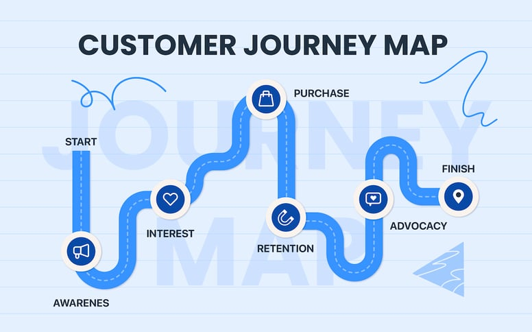

# Customer Journey Map (CJM): 6 Steps and Examples to Improve Brand Experience

I want to learn:

X

Marketing Academy | 2023/06/05

**Customer Journey Map (CJM): 6 Steps and Examples to Improve Brand Experience from the Customer’s Perspective**

Yuki Cheng

Share this article

Tags

* [Customer experience](https://blog.cresclab.com/zh-tw/tag/%E9%A1%A7%E5%AE%A2%E9%AB%94%E9%A9%97)
* [Membership marketing](https://blog.cresclab.com/zh-tw/tag/%E6%9C%83%E5%93%A1%E7%B6%93%E7%87%9F)
* [What is a Customer Journey Map (CJM)](customer-journey-map-cjm-6-steps-and-examples-to-improve-brand-experience.md#what-is-a-customer-journey-map-cjm)
* [The 5 core elements of a Customer Journey Map](customer-journey-map-cjm-6-steps-and-examples-to-improve-brand-experience.md#the-5-core-elements-of-a-customer-journey-map)
* [How to create a Customer Journey Map: 6 steps](customer-journey-map-cjm-6-steps-and-examples-to-improve-brand-experience.md#how-to-create-a-customer-journey-map-6-steps)
* [Customer Journey Map examples](customer-journey-map-cjm-6-steps-and-examples-to-improve-brand-experience.md#customer-journey-map-examples-templates)

In the previous article, [**What is a customer journey? The key to improving customer experience and loyalty**](https://blog.cresclab.com/tw/customerjourney?hsLang=zh-tw), we introduced the definition and stages of a customer journey. To apply these concepts in practice, you can create a **Customer Journey Map (CJM)**. It helps teams see the experience from the customer’s perspective and spot opportunities to improve it.

### What is a Customer Journey Map (CJM)

**Customer Journey Map (CJM)** stands for **Customer Journey Map**. It is also called a **User Journey Map**.

A CJM visualizes the journey using formats like diagrams, tables, or flow maps. It describes what customers do, feel, and need across different stages and channels. This helps brands tell the customer’s story, predict behavior, and improve the experience. Better experiences often lead to higher revenue and stronger loyalty.

There is no one-size-fits-all template for a Customer Journey Map. The format can vary by brand, context, and goal. Use the methods and examples below to get started.

### The 5 core elements of a Customer Journey Map

Most Customer Journey Maps include these five elements:

1. **Who the customer is**: demographics, needs, and preferences. Use segmentation and tags to define the target audience for this journey.
2. **Time scale**: how long the journey is. This depends heavily on your product type (one week, one month, one year, or a lifetime).
3. **Journey stages**: connect customer behaviors to stages so you know what service or content to provide at each point.
4. **Actions and emotions**: what customers do and how they feel. Include motivations, drivers to move forward, and friction points.
5. **Channels / touchpoints**: where customers interact with the brand, such as Facebook, Instagram, LINE, SMS, your website, marketplaces, physical stores, partners, or events.

### How to create a Customer Journey Map: 6 steps

Creating a CJM requires perspective shifting. Define goals from the brand side, then describe actions and emotions from the customer side. Follow these six steps to build your map.



### Define the goal and scope

Start by defining what this Customer Journey Map must achieve. Also define what data you need and how you will use it. Examples:

* **End-to-end journey mapping**: from brand discovery to purchase to loyalty.
* **Increase conversion**: focus on key steps like browsing, add-to-cart, and checkout.
* **Communication strategy**: understand how customers engage across Facebook, Instagram, LINE, Email, and SMS. Automation tools often help here.
* **Competitor analysis**: map a competitor’s journey to find differentiation opportunities.



### Collect customer data and feedback. Define the target audience.

Decide who this journey is for. Based on your scope, collect data and build **buyer personas**. Describe demographics, interests, entry points, behaviors, and goals.

 A buyer persona example designed by FreePik.



### Define your customer journey stages

You can start from the five common stages described in [**this article**](https://blog.cresclab.com/tw/customer-journey-guide/?hsLang=zh-tw). Or you can redefine stages based on your goal.

Examples:

* For news media, the journey may start at “Usage” (reading/watching) before “Awareness”.
* For community strategy, customers may purchase first and then join your Facebook or LINE community.



### List touchpoints

Touchpoints span many channels: website, social media, apps, email (EDM), SMS, stores, partners, events, and more. Listing touchpoints makes it easier to find experience and process improvements.



### Describe customer actions at each touchpoint

For each touchpoint, describe the actions customers take. Examples: clicking a Facebook ad, linking a LINE membership, using coupons, checking Google reviews, reading a menu, and so on.



### Identify pain points and “moments that matter”

Based on behaviors in each stage, infer the experience customers likely have. Then identify pain points and key moments. This is often the most valuable part of a CJM.

A simple approach is a horizontal line:

* Above the line = positive experience
* On the line = neutral
* Below the line = negative

“Moments that matter” are events that strongly shape how customers feel about your brand. They can lead to loyalty, or churn.



With these steps, you can create a Customer Journey Map and spot opportunities to improve the experience. The core value of a CJM is **visualization**. If you’re not sure how to present it, use the examples below.

### Customer Journey Map examples (templates)

#### A simple grid/table

#### A journey that expands by touchpoint

\
A journey map does not have to be a table. You can expand actions across touchpoints more freely. (Source: https://www.edrawsoft.com/8-customer-journey-map-examples-to-inspire-you.html)

#### Show the target audience and other participants

 template 03.jpg>)\
This journey map describes a day in the life of children with dyslexia. It also includes behaviors of other participants (parents and classmates). (Source: https://www.behance.net/gallery/12142829/Customer-Journey-Map)

#### A non-linear journey with interdependent steps

\
An IKEA customer journey map example. (Source: https://medium.com/@i.shubhangich/journey-map-example-ikea-bfa2b3c3b17e)

#### Use ready-made templates in design tools

\
Search “customer journey map” in Miro’s template library. You will find many templates you can reuse directly.

### Go beyond mapping: execute journeys with marketing automation

A CJM is not only for planning and analysis. With MarTech tools, you can also build an **Automated Customer Journey**. It helps you meet customer needs, improve experience, and guide customers toward desired outcomes.

Learn more: [**Customer journey tools: 10 automated journey scenarios to build continuous customer experiences**](https://blog.cresclab.com/tw/maacjourney?hsLang=zh-tw)

\
You can use Crescendo Lab MAAC to design automated customer journeys.

With the methods and examples above, you can start building your own Customer/User Journey Map. It will help you understand customer-brand interactions and the resulting experiences.

You can also proactively design automated journeys based on cross-channel behavior. Examples include automated LINE messages, SMS, and Email flows. These journeys guide customers into the next stage through communication and engagement.

Contact Crescendo Lab to build automated customer journeys. (The original article included a contact form. The form fields were removed from this page.)

***

Author

\
[**Yuki Cheng**](https://blog.cresclab.com/zh-tw/author/yuki-cheng)\
Content marketing at Crescendo Lab. Enjoys telling stories through writing and helping others solve problems.

**Related articles**

* [Zero-, second-, third-, and first-party data: which matters most after cookies?](https://blog.cresclab.com/tw/first-party-data/?hsLang=zh-tw)
* [AI marketing trends: 4 AI applications and examples to unlock growth](https://blog.cresclab.com/tw/ai-marketing/?hsLang=zh-tw)
* [LINE marketing guide: Official Account features and 6 key success metrics](https://blog.cresclab.com/tw/line-oa-marketing-guide/?hsLang=zh-tw)

Back to top
