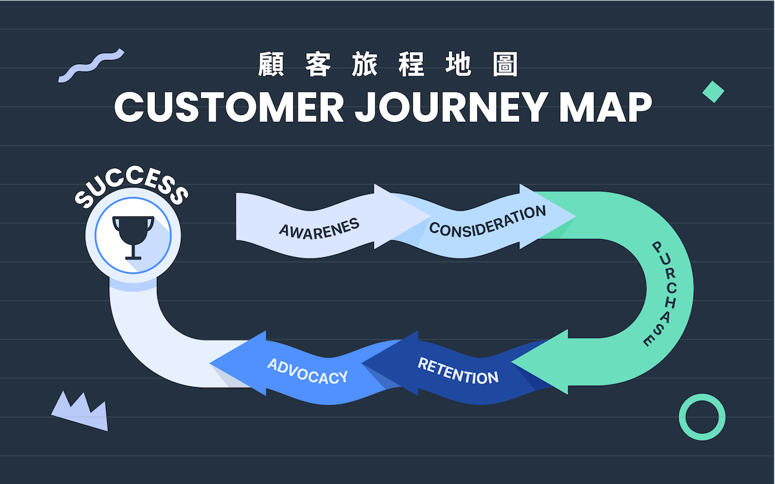
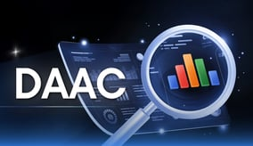

# What Is a Customer Journey? The Key to Better Customer Experience and Loyalty

## What Is a Customer Journey? The Key to Better Customer Experience and Loyalty

**Author:** Yuki Cheng\
**Category:** [Marketing Academy | 2023/06/05](https://blog.cresclab.com/zh-tw/tag/%E8%A1%8C%E9%8A%B7%E5%AD%B8%E9%99%A2)

### Quick navigation

* [Definition and why it matters](what-is-a-customer-journey-the-key-to-better-customer-experience-and-loyalty.md#definition-and-why-it-matters)
* [5 classic customer journey stages](what-is-a-customer-journey-the-key-to-better-customer-experience-and-loyalty.md#5-classic-customer-journey-stages)
* [Customer journeys are not linear](what-is-a-customer-journey-the-key-to-better-customer-experience-and-loyalty.md#customer-journeys-are-not-linear)
* [Use a Customer Journey Map (CJM)](what-is-a-customer-journey-the-key-to-better-customer-experience-and-loyalty.md#use-a-customer-journey-map-cjm)
* [Contact us](what-is-a-customer-journey-the-key-to-better-customer-experience-and-loyalty.md#contact-us)

Every interaction between a customer and a brand affects decisions and loyalty. To improve outcomes, you need to understand the **customer journey** and optimize the **touchpoints** across channels.

### Definition and why it matters

**Customer journey** (also called **user journey**) is the end-to-end process of how a customer interacts with a brand. It spans from first awareness, to purchase, to after-sales support, and eventually loyalty. Each interaction opportunity is a **touchpoint**.

Customer journey work matters because it directly affects **Customer Experience (CX)** and brand perception. For reference:

* **86%** of customers are willing to pay more for a better experience. ([Forbes](https://www.forbes.com/sites/danielnewman/2020/06/23/4-actionable-customer-experience-statistics-for-2020/))
* **1/3** of customers leave a brand after one bad experience. ([PwC](https://www.pwc.com/us/en/services/consulting/library/consumer-intelligence-series/future-of-customer-experience.html))

“Customer journey” vs “customer experience”:

* **Customer journey** = what customers do across the lifecycle.
* **Customer experience** = how customers feel across the lifecycle.

When you plan and optimize touchpoints across digital + offline channels, you can better serve different segments at different stages. This increases satisfaction, conversion, and **customer lifetime value (LTV)**.\
Related reading: [Customer lifetime value (LTV)](https://blog.cresclab.com/tw/ltv/?hsLang=zh-tw)

### 5 classic customer journey stages



### Awareness

The customer becomes aware of your company, product, or service. This can be passive (ads) or active (search). You need clear targeting and the right message at the right time and channel.



### Consideration

The customer compares brands, products, and solutions. Useful content like FAQs, product highlights, reviews, unboxings, or demos helps you stand out.



### Purchase

This is the decision stage. It may be short, but it is critical.

Your goal is to **prevent checkout abandonment**:

* keep pricing transparent (no surprise shipping/taxes)
* keep sign-up/login and checkout simple
* deliver a smooth buying experience



### Retention

This stage focuses on loyalty building. Customers may need support after purchase, or recommendations for related products. Research often shows selling to existing customers is **60–70%**, while selling to new customers is only **5–20%**.



### Advocacy

Loyal customers keep buying and also recommend your brand to others. They share positive experiences with friends and family.



### Customer journeys are not linear

These stages can look like a marketing or sales funnel. The key difference is: **modern customer journeys are not linear**.

Customers move across channels. They can enter, exit, skip, loop back, or get stuck at any stage.

 Funnel vs. non-linear customer journey. (Source: [Capturly](https://capturly.com/blog/everything-you-need-to-know-about-non-linear-customer-journeys/))

This creates practical challenges:

* Connecting touchpoints into an omnichannel strategy
* Delivering flexible and personalized experiences
* Aligning marketing + sales across stages and sharing data
* Comparing journeys across different segments

### Use a Customer Journey Map (CJM)

A **Customer Journey Map (CJM)** visualizes customer actions, emotions, and needs across stages and touchpoints. It helps you identify experience gaps and improvement opportunities.

Next reading:

* [Customer Journey Map (CJM): 6 Steps and Examples to Improve Brand Experience](customer-journey-map-cjm-6-steps-and-examples-to-improve-brand-experience.md)
* Original blog URL: https://blog.cresclab.com/zh-tw/cjm?hsLang=zh-tw

### Contact us

The original page includes an interactive contact form. Below are the fields (for reference):

* Company name\*
* Company registration number / tax ID\*
* Industry\* (examples: Automotive, B2B, Beauty & cosmetics, Logistics, Marketplace/e-commerce, Education, Sports & entertainment, Food & beverage, Apparel & accessories, Finance, FMCG, Gaming, Government & non-profit, Home, Luxury, Media, Pets, Healthcare, Real estate, Sales channels, Chain restaurants, Local services, Consumer electronics, Telecom, Travel, Other)
* Name\*
* Email\*
* Phone number\*
* Job title\*
* What do you need?\* (examples: membership marketing, marketing automation, SMS sending, store management, customer service, sales management, AI co-creation workshop, other, no specific needs)
* Brand website / store URL
* Official LINE account ID\*
* Monthly digital ads budget on FB/Google/LINE?\* (options: < 100k, 100k–300k, 300k–500k, 500k–1M, > 1M)

### More recommended reads

* [Customer journey tools: 10 automated journey scenarios to build continuous customer experiences](https://blog.cresclab.com/tw/maacjourney?hsLang=zh-tw)
* [Monetize LINE Official Account traffic: 5 strategies to build profitable customer journeys](https://blog.cresclab.com/tw/2023q1-launch-party/?hsLang=zh-tw)
* [DTC/D2C: challenges and opportunities + 4 key points and useful tools](https://blog.cresclab.com/tw/dtc-d2c/?hsLang=zh-tw)
* [3 recommended LINE marketing automation tools to improve engagement and e-commerce conversion](https://blog.cresclab.com/tw/line-marketing-automation-tool/?hsLang=zh-tw)
* [LINE marketing guide: Official Account features and 6 key success metrics](https://blog.cresclab.com/tw/line-oa-marketing-guide/?hsLang=zh-tw)

***

Chinese original (for reference)

搜尋文章

我想了解：

X

[行銷學院 | 2023/06/05](https://blog.cresclab.com/zh-tw/tag/%E8%A1%8C%E9%8A%B7%E5%AD%B8%E9%99%A2)

**顧客旅程 Customer Journey 是什麼？提升顧客體驗與忠誠度的關鍵**

Yuki Cheng

分享文章

相關標籤

* [顧客體驗](https://blog.cresclab.com/zh-tw/tag/%E9%A1%A7%E5%AE%A2%E9%AB%94%E9%A9%97)
* [顧客旅程 Customer Journey 定義及重要性](what-is-a-customer-journey-the-key-to-better-customer-experience-and-loyalty.md#i)
* [5 個經典的顧客旅程階段 Customer Journey Stages](what-is-a-customer-journey-the-key-to-better-customer-experience-and-loyalty.md#5)
* [顧客旅程階段不是線性的](what-is-a-customer-journey-the-key-to-better-customer-experience-and-loyalty.md#i-2)
* [製作顧客旅程地圖 Customer Journey Map 來了解你的顧客](what-is-a-customer-journey-the-key-to-better-customer-experience-and-loyalty.md#i-3)

顧客與品牌互動的每一次體驗，都扮演著重要角色，可能影響消費決策、忠誠度等，而為了提升不同階段的顧客體驗，品牌就得深入了解什麼是 顧客旅程 以及如何應用。本篇文章將介紹顧客旅程定義和為何重要，以及帶你認識不同顧客旅程階段，並且在下篇文章接續帶你認識如何透過 [顧客旅程地圖](https://blog.cresclab.com/zh-tw/cjm?hsLang=zh-tw)，將顧客旅程應用於實務。

**顧客旅程 Customer Journey 定義及重要性**

**顧客旅程／客戶旅程／使用者旅程（Customer Journey、User Journey）** 是指顧客與品牌互動的一整段過程，從最初認識品牌到購買商品或服務，一直到售後支援、忠誠度建立，而這過程中的互動機會被稱為接觸點（Touch Point）。

顧客旅程之所以重要，是因為它直接影響 **顧客體驗（CX，Customer Experience）** 以及對品牌的態度，而《 [富比士](https://www.forbes.com/sites/danielnewman/2020/06/23/4-actionable-customer-experience-statistics-for-2020/)》雜誌曾指出 86% 顧客願意花更多錢購買產品，以獲得更好的顧客體驗；反之，三分之一的顧客會因為一次糟糕的顧客體驗，離開他們喜愛的品牌（ [來源](https://www.pwc.com/us/en/services/consulting/library/consumer-intelligence-series/future-of-customer-experience.html)）。

「顧客旅程」和「顧客體驗」概念乍看很相似，兩者著重的點不太一樣：

* 顧客旅程 = 在客戶生命週期的每個階段 **所做的事情**（What they do）
* 顧客體驗 = 對整個客戶生命週期的 **感受**（How they feel）

不過客戶旅程與體驗息息相關，因此在英文也有人直接稱顧客體驗旅程 Customer Experience Journey。當品牌用顧客旅程的概念來全盤規劃各個接觸點（可能是數位渠道或門市），作全渠道的優化與整合，就更能針對不同客群、不同階段來滿足顧客需求，提高顧客滿意度、購買率和 [顧客終身價值（LTV）](https://blog.cresclab.com/tw/ltv/?hsLang=zh-tw)。

反過來說，品牌也能分析顧客旅程中的各種行為數據，更精準了解顧客，為他們提供最實用的產品或服務，留住客戶進而增加營收，以及降低服務顧客的成本。

 電商顧客旅程示意圖。

**5 個經典的顧客旅程階段 Customer Journey Stages**

認知 Awareness顧客開始了解你的公司、商品或服務，可能是被動接收廣告或主動搜尋。品牌必須精準了解你的顧客是誰，並在正確的時間、渠道給予最有效的內容。考慮 Consideration顧客主動研究和比較各個品牌、商品或解決方案，若品牌提供常見問答、優勢介紹、開箱文或影片等實用內容，更有機會脫穎而出。購買 Purchase購買階段也被稱為決策階段，在旅程中可能很短暫，卻很重要。品牌要 避免讓顧客中途放棄結帳，比方說費用盡可能透明（不要有隱藏的運費或稅費），還有會員註冊登入、結帳過程切勿太複雜， 打造一個順暢方便的消費體驗 變得重要。留存 Retention在這個階段，主要著重於忠誠度的建立。像是顧客購買後可能需要售後服務或更多相關商品推薦，讓他們繼續回購。根據研究，向既有客戶銷售的機會在 60～70%，但向新客戶銷售的機會只有 5～20%。擁護 Advocacy當顧客已經成為你的忠誠會員，不僅會持續購買，還會樂於分享正面經驗、推薦給更多親朋好友。

**顧客旅程階段不是線性的**

上述的顧客旅程階段看起來和行銷漏斗、銷售漏斗似乎有點雷同，但最大的不同是， **現今顧客旅程並不是線性的發展**。如今顧客會在各個渠道之間穿梭，整個購買過程變得複雜冗長， **旅程已經沒有一個明確的開始、中心或結束，顧客隨時可能進入、退出、跳躍、返回、卡住任何一個顧客旅程階段。**

 行銷／銷售漏斗與非線性顧客旅程的差異。（來源： [Capturly](https://capturly.com/blog/everything-you-need-to-know-about-non-linear-customer-journeys/)）

當今非線性的顧客旅程考驗著品牌：

* 如何打通各個接觸點，打造全渠道行銷？
* 如何在旅程中打造靈活、個人化的顧客體驗？
* 如何讓行銷與銷售團隊在不同階段吸引顧客，並整合跨團隊的數據？
* 如何比較不同客群的體驗？

你需要設計一個可視化的「**顧客旅程地圖**」（Customer Journey Map），將顧客旅程應用在實務上，以此掌握複雜的顧客行為與接觸點，優化每段體驗。

**製作顧客旅程地圖 Customer Journey Map 來了解你的顧客**

 顧客旅程地圖範例，用表格的方式呈現。（來源：Miro）

**顧客旅程地圖（Customer Journey Map）** 是把顧客旅程視覺化的一種方式，用圖形或表格繪製出顧客在不同階段、不同接觸點的互動行為、感受、需求，幫助品牌更了解顧客，找出可以優化顧客體驗的機會點，有多種呈現方式，也可以利用 MarTech 自動化行銷工具來創造顧客旅程。請繼續閱讀下一篇文章，漸強實驗室將繼續帶你認識什麼是顧客旅程地圖、如何製作以及更多顧客旅程地圖範例，幫助你從顧客的角度說故事，掌握顧客旅程！

**前往閱讀：** [**顧客旅程地圖製作 6 步驟與範例，讓你從顧客角度優化品牌體驗**](https://blog.cresclab.com/tw/cjm/?hsLang=zh-tw)

**聯繫我們，替你打造更好的顧客旅程**

以下為頁面上的聯繫表單欄位（供參考）：

* 公司名稱\*
* 公司統一編號\*
* 產業\*（選項範例：汽機車、B2B、美容化妝保養品、運輸、綜合型電商、教育、娛樂與運動、食品飲料、服飾配件、金融、快速消費品、遊戲、政府與非營利組織、居家、精品、媒體、寵物、醫藥保健、房地產、銷售通路、連鎖餐飲、生活服務、3C電器、電信、旅遊、其他）
* 姓名\*
* 電子信箱\*
* 電話號碼\*
* 職稱\*
* 您的需求為何？\*（選項範例：會員經營、行銷自動化、簡訊發送、專櫃或門市管理、客服與諮詢、業務銷售管理、AI 共創工作坊、其他、無需求）
* 品牌官網 / 賣場網址
* 官方帳號 LINE ID\*
* 目前每月在 FB/Google/LINE 是否有固定的數位廣告行銷預算？\*（選項：10萬以下、10～30萬、30～50萬、50～100萬、100萬以上）

（原頁面含互動表單，請在網站上提交以聯繫漸強實驗室。）

**更多好文推薦**

* [顧客旅程工具應用：10 種自動旅程情境，打造不間斷的顧客體驗](https://blog.cresclab.com/tw/maacjourney?hsLang=zh-tw)
* [讓 LINE 官方帳號流量變現！5 策略打造獲利的顧客旅程](https://blog.cresclab.com/tw/2023q1-launch-party/?hsLang=zh-tw)
* [解析 DTC/D2C 的挑戰與機會！品牌應該掌握的 4 大要點與好用工具](https://blog.cresclab.com/tw/dtc-d2c/?hsLang=zh-tw)
* [LINE 行銷自動化工具 3 大推薦，有效提高互動與電商轉換率](https://blog.cresclab.com/tw/line-marketing-automation-tool/?hsLang=zh-tw)
* [LINE 行銷方法與官方帳號功能全介紹！帶你掌握 6 大成功指標](https://blog.cresclab.com/tw/line-oa-marketing-guide/?hsLang=zh-tw)

>)

[**Yuki Cheng**](https://blog.cresclab.com/zh-tw/author/yuki-cheng)

漸強實驗室內容行銷。喜歡用文字傳遞故事、幫助他人解決問題。

**相關文章**

\[

LINE OA | 2026/01/13

**什麼是 LINE MINI App？詳解優缺點與品牌如何開發，及 2026 應用趨勢！**\
Wendy Fang]\(https://blog.cresclab.com/zh-tw/lineminiapp?hsLang=zh-tw)

\[

行銷學院 | 2025/12/04

**什麼是全通路 Omnichannel？三步驟掌握全通路行銷**\
Hydra Liang]\(https://blog.cresclab.com/zh-tw/omnichannel?hsLang=zh-tw)

\[

會員經營 | 2025/12/01

**2026 CRM 完全指南：功能、好處、類型、應用實例全解析**\
Liam Fang]\(https://blog.cresclab.com/zh-tw/crm-system?hsLang=zh-tw)

\[

AI 應用 | 2025/11/13

**一鍵完成雙 11 報表！DAAC AI 洞察跨渠道數據，放大潛在 ROI**\
Hydra Liang]\(https://blog.cresclab.com/zh-tw/double-11-daac-ai-agent?hsLang=zh-tw)

