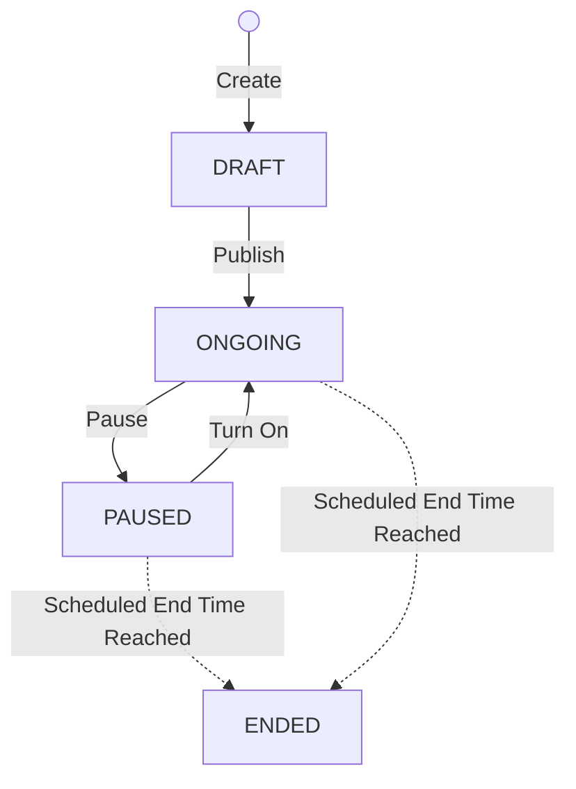
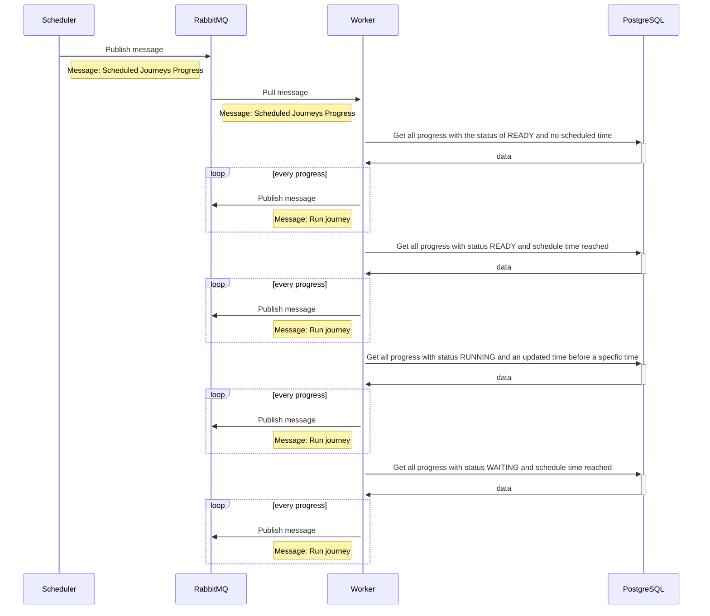
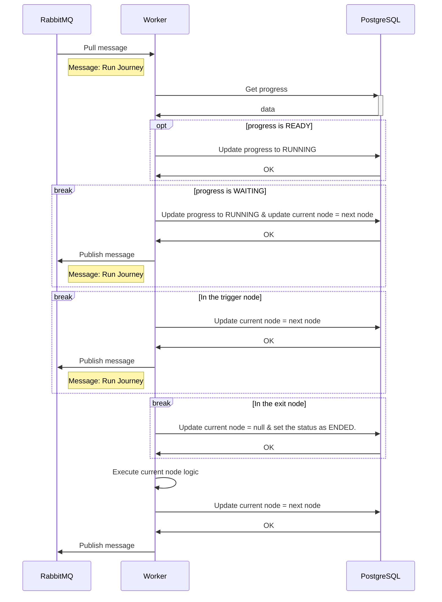

# 202302 Journey   Architecture & Design


🚧 This page is being reorganized.

* Author: @Jhenyi Jhan
* Last updated: 2023-05-10
* Status: In progress


This doc is the **system architecture design** for **MAAC Customer Journey**.

It covers the **trigger pipeline**, **journey execution flow**, **status models**, and the core **database schema**.


**Keywords**: Customer Journey architecture, trigger flow, journey flow, Rubato, RabbitMQ, Cloud Pub/Sub, LBEC, member progress, journey status, PostgreSQL schema


### Related documents

1. [Customer Journey PRD\_Phase 1](https://docs.google.com/document/d/1xzO9-7TlaObaxMfVldyIInyuATR9jjM48GSQY5KzloM/edit?usp=sharing)
2. [Customer Journey PRD\_Phase 1-1](https://docs.google.com/document/d/1J8L3YUm6v-N41B0m-YFD-sAyEM75HMwB00NZ2U6sQHY/edit?usp=sharing)
3. [Customer Journey PRD\_Phase 1-2](https://docs.google.com/document/d/1Iw_yHy6tRxUTRcJ8B8YpdsPlz_gzDLH721STlMoJfos/edit?usp=sharing)
4. [Customer Journey PRD\_Phase 1-3](https://docs.google.com/document/d/14fppjxNA_zaRS019usYJSrhktrWdFP7M3Pk6lxgaQzo/edit?usp=sharing)
5. [Customer Journey PRD\_Phase 1-4](https://docs.google.com/document/d/1Xxhdv1tFvAF7jfDJJO5ADx_XPhpjloJnWDcgSbZorLI/edit?usp=sharing)
6. [Customer Journey Dictionary / Working table](https://docs.google.com/spreadsheets/d/1KdXDWnIt6c_ad9PshokFmY6tlY6bxCWzb9mk6xhr72Q/edit?usp=sharing)

## **Overview**

This document is the system architecture design for the customer journey. There are two parts, the first part is the core design of the customer journey and the second part is how to integrate other systems or services.

## **Goals**

1. Design clear and simple system architecture and flow.
2. Design a flexible module to support future requirements and integration.

## **Definitions**

The definitions can be found in this document ([Dictionary](https://docs.google.com/spreadsheets/d/1KdXDWnIt6c_ad9PshokFmY6tlY6bxCWzb9mk6xhr72Q/edit?usp=sharing)).

## **Architecture Sharing Video**

<figure><figcaption></figcaption></figure>

## **System Architecture**

**Figure 1: Architecture Overview (**[**Source**](https://drive.google.com/file/d/1fbQedk0LcbTKAoHhn7MOWBC3GtxnhFwj/view?usp=share_link)**)**

Figure 1: Architecture Overview ([Source](https://drive.google.com/file/d/1fbQedk0LcbTKAoHhn7MOWBC3GtxnhFwj/view?usp=share_link))

In the design, we will focus on two topics:

1. How does the customer start the journey? → **Trigger Flow**
2. How does the customer progress through the journey? → **Journey Flow**

### **Trigger Flow**

>)

Figure 2: Trigger Flow ([Source](https://drive.google.com/file/d/1vrZMd5sv4tNhuTn5w_I3r2Gs6H3q20LB/view?usp=share_link))

The trigger flow will focus on how to make the customer start the journey, and two types of triggers can be defined here:

1. Event-Based Trigger
2. Time-Based Trigger

#### **Event-Based Trigger**

This trigger collects domain events from other services, which do not need to understand the design of the customer journey and are decoupled from each other.

The design of events will follow the [Log-Based Event Collection (LBEC)](https://www.notion.so/Log-Based-Event-Collection-LBEC-fd9f763f79fb443d83486c0ee34fbf13?pvs=21) and [202211 Specification - Application Logs](https://www.notion.so/202211-Specification-Application-Logs-f08316ee4bf64881be24dbc1ce20ff61?pvs=21).

The steps are described as follows:

1. Cloud Logging Sink will push the event logs supported by the customer journey to Cloud Pub/Sub
2. According to the [202211 Specification - Application Logs](https://www.notion.so/202211-Specification-Application-Logs-f08316ee4bf64881be24dbc1ce20ff61?pvs=21) , we will add a support\_journey key to the metadata of the logs supporting customer journeys, and then the log filter will be able to get all the logs supporting journeys with this key
3. Cloud Pub/Sub will push to the Rubato HTTP Server
4. The Rubato HTTP server extracts the data from the data field in the log, and sends an event with the event data attached to RabbitMQ
5. The Rubato Worker receives a task from RabbitMQ and performs the following checks based on the event data:
6. Is the event supported by the customer journey?
7. Is there an active journey setting for this bot?
8. Finally, the customer will start the journey

#### **Time-Based Trigger**

This trigger will notify the system to retrieve the data and add the customer to the journey, based on some scheduling tool or data pipeline (e.g. Airflow).

### **Journey Flow**

#### **Definition: Journey Status**

>)

Figure 3: Journey State diagram ([Source](https://drive.google.com/file/d/1YRDddDOe7fu35Yj1rwBYbrWbqZpj7rcP/view?usp=share_link))

* DRAFT: This journey is being developed and has not been published yet.
* ONGOING: This journey has already been published. Depending on the journey schedule, the journey may be ongoing or scheduled to start at a later time. To edit this journey, it needs to be paused first.
* PAUSED: The journey has been published and the journey has been paused. Customers will not start the journey and those already on the journey will not move until the journey is turned on again.
* ENDED: This journey has already been published. The journey has ended because of the scheduled end time of the journey.
* Flowchart (Mermaid)

#### **Definition: Member Progress Status**

>)

Figure 4: Customer Progress State diagram ([Source](https://drive.google.com/file/d/1QCzLfPoyCgArQb0xxNVrbBgqA8A5aLMK/view?usp=share_link))

* READY: The member progress is ready to run. If there is a scheduled time, it will run at that time.
* RUNNING: The member progress is currently running.
* WAITING: The member progress is waiting and will continue at the scheduled time.
* CANCELED: The member progress is canceled after running 有被 trigger 但走到一半沒走到終點（被迫取消）
* ENDED: The member progress has ended. 有走到終點
* ERROR: The member progress encountered an error while running.

#### **Use Case: Scheduled Journeys Progress**

>)

Crontab Schedule: Every minute


This use case periodically scans all progress (except `ENDED`) to drive execution.


* READY: This progress is ready to run.
* RUNNING: This progress is running, if the update time is before five minutes, it will be made to run again.
* WAITING: This progress is waiting, if it has reached its scheduled time, it will be made to run again.

#### **Use Case: Run Journey**

>)

### **Detail Design**

[**API Reference**](https://www.notion.so/API-Reference-76a4998148a1472bb3d27415e0e08bf8?pvs=21)

### **Database Schema**

#### **journey\_journey**

| **Name**               | **Type**    | **Description**         |
| ---------------------- | ----------- | ----------------------- |
| id                     | bigserial   | Primary Key             |
| bot\_id                | bigint      | Foreign Key (line\_bot) |
| name                   | varchar(32) |                         |
| schedule\_start\_at    | timestamptz | Nullable                |
| schedule\_end\_at      | timestamptz | Nullable                |
| repeat\_journey\_times | integer     | Nullable                |
| line\_message\_quota   | bigint      | Nullable                |
| sleep\_start\_time     | time        | Nullable                |
| sleep\_end\_time       | time        | Nullable                |
| status                 | varchar(16) | Enum                    |

* draft
* ongoing
* paused
* ended | | created\_at | timestamptz | | | updated\_at | timestamptz | |

#### **journey\_node**

| **Name**    | **Type**    | **Description**                |
| ----------- | ----------- | ------------------------------ |
| id          | bigserial   | Primary Key                    |
| journey\_id | bigint      | Foreign Key (journey\_setting) |
| name        | varchar(32) | Nullable                       |
| key         | varchar(32) | Enum                           |
| category    | varchar(16) | Enum                           |

* trigger
* rule
* action | | settings | json | | | filters | json | | | branch\_settings | json | (WIP) | | created\_at | timestamptz | | | updated\_at | timestamptz | |

#### **journey\_node\_path**

| **Name**         | **Type**  | **Description**             |
| ---------------- | --------- | --------------------------- |
| id               | bigserial | Primary Key                 |
| source\_node\_id | bigint    | Foreign Key (journey\_node) |
| target\_node\_id | bigint    | Foreign Key (journey\_node) |
| index            | smallint  |                             |

#### **journey\_member\_progress**

| **Name**     | **Type**    | **Description**                |
| ------------ | ----------- | ------------------------------ |
| id           | bigserial   | Primary Key                    |
| journey\_id  | bigint      | Foreign Key (journey\_setting) |
| node\_id     | bigint      | Foreign Key (journey\_node)    |
| Nullable     |             |                                |
| member\_id   | smallint    | Foreign Key (line\_member)     |
| schedule\_at | timestamptz | Nullable                       |
| status       | varchar(16) | Enum                           |

* ready
* running
* waiting
* ended | | created\_at | timestamptz | | | updated\_at | timestamptz | |

#### **journey\_report**

| **Name**             | **Type**  | **Description**                |
| -------------------- | --------- | ------------------------------ |
| id                   | bigserial | Primary Key                    |
| journey\_id          | bigint    | Foreign Key (journey\_setting) |
| trigger              | bigint    |                                |
| in\_progress         | bigint    |                                |
| exit                 | bigint    |                                |
| transaction\_revenue |           |                                |

#### **journey\_execution\_report**

#### **journey\_performance\_report**

#### **journey\_node\_execution\_report**

#### **journey\_node\_performance\_report**

## **Measurement**

📝 TODO

1. Plan the design for performance monitoring.

### **Product Success Metrics**

* **of clients(bot) publish at least 1 journey**
  * Data Sources
    * [journey\_journey](https://www.notion.so/e07e4a98fba140f3876c3b722469ccf3?pvs=21)
  * Conditions
    * status ≠ “draft”
    * GROUP BY bot\_id
* **of sidebar click (Awareness)**
  * Data Sources
    * GA
* **of template publish**
  * (WIP)
* **of active (Enable)**
  * Data Sources
    * [journey\_journey](https://www.notion.so/e07e4a98fba140f3876c3b722469ccf3?pvs=21)
  * Conditions
    * status = ‘active’

### **Product Performance Outcome**

* **of users being triggered**
  * Data Sources
    * [journey\_member\_progress](https://www.notion.so/e07e4a98fba140f3876c3b722469ccf3?pvs=21)
* **of users completed the journey**
  * (WIP)

### **Performance Monitoring**

## **Changelog**

### **2023-05-10**

* Turn REST API into [page](https://www.notion.so/API-Reference-76a4998148a1472bb3d27415e0e08bf8?pvs=21)

### **2023-04-13**

* Add new API [Publish a journey](https://www.notion.so/e07e4a98fba140f3876c3b722469ccf3?pvs=21)
* Update API response status code scenario

### **2023-04-09**

* Update [journey status diagram](https://www.notion.so/e07e4a98fba140f3876c3b722469ccf3?pvs=21)

### **2023-03-37**

* Add new API [Retrieve journey count](https://www.notion.so/e07e4a98fba140f3876c3b722469ccf3?pvs=21)

### **2023-03-22**

* Modify the [journey](https://www.notion.so/e07e4a98fba140f3876c3b722469ccf3?pvs=21) object in the API to include resources for nodes and node paths
* Add the object [node path](https://www.notion.so/e07e4a98fba140f3876c3b722469ccf3?pvs=21) as an API resource

### **2023-03-21**

* Rename the journey\_path schema to journey\_node\_path

### **2023-03-20**

* Rename the [journey\_member\_progress](https://www.notion.so/e07e4a98fba140f3876c3b722469ccf3?pvs=21) schema property from schedule\_time to schedule\_at

### **2023-03-19**

* Rename the journey status options from active to ongoing to align them with the product design
* Add the journey status ended
* Remove the property frequency\_seconds from the journey
* Add 2 APIs “ [Turn on a journey](https://www.notion.so/e07e4a98fba140f3876c3b722469ccf3?pvs=21)” and “ [Turn off a journey](https://www.notion.so/e07e4a98fba140f3876c3b722469ccf3?pvs=21)”
* Add the properties schedule\_start\_at and schedule\_end\_at for the journey

### **2023-03-16**

* Rename the node path properties from to source and to to target

### **2023-03-08**

* Add the first version of [REST API](https://www.notion.so/e07e4a98fba140f3876c3b722469ccf3?pvs=21)
* Add the first version of the [product success metric](https://www.notion.so/e07e4a98fba140f3876c3b722469ccf3?pvs=21)

### **2023-03-06**

* Update detailed description for log filtering

### **2023-03-05**

* Update the [architecture overview diagram](https://www.notion.so/e07e4a98fba140f3876c3b722469ccf3?pvs=21) to more clearly show the relationships between the system and internal/external services
* Remove the SLEEPING status and refine the [definition](https://www.notion.so/e07e4a98fba140f3876c3b722469ccf3?pvs=21) description
* Add definition of [journey status](https://www.notion.so/e07e4a98fba140f3876c3b722469ccf3?pvs=21)

### **2023-02-28**

* Add changelog

### **2023-02-23**

* Add missing RUNNING status logic in the “ [Scheduled Journeys Progress](https://www.notion.so/e07e4a98fba140f3876c3b722469ccf3?pvs=21)” use case
* Add more description to the use case " [Scheduled Journeys Progress](https://www.notion.so/e07e4a98fba140f3876c3b722469ccf3?pvs=21)”

### **2023-02-22**

* Initial version

## **WIP**

[API Specification Changes - Create a journey node](https://www.notion.so/API-Specification-Changes-Create-a-journey-node-6ada9280a59442feabca3d65832b49f2?pvs=21)

[Event Reference](https://www.notion.so/Event-Reference-af95e8f63f394184a22d400de44ae313?pvs=21)

[FAQ](https://www.notion.so/FAQ-83f7644506174ac49e7ca6023cd1af70?pvs=21)

[Architecture](https://www.notion.so/Architecture-b85a2b91e4f4431cb6dac248556fbf5b?pvs=21)
