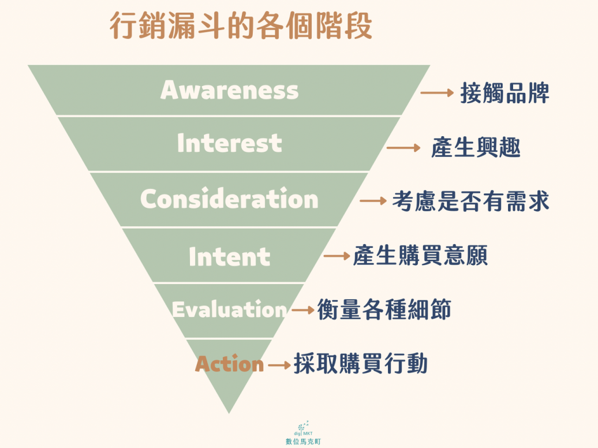

# (archieve)Template

|  # | 主題 (中文)  | Topic (EN)                            | 觸發 / 目標（中文）                                | Trigger / Objective (EN)                                                                                                                                                | 備註 / Role                           |
| -: | -------- | ------------------------------------- | ------------------------------------------ | ----------------------------------------------------------------------------------------------------------------------------------------------------------------------- | ----------------------------------- |
|  1 | 忠誠獎勵計畫   | Loyalty Program                       | 將新加入會員上標籤，7 天後發送 50 元優惠券，再 7 天發送 100 元優惠券  | When a new member is tagged, a $50 coupon will be sent after 7 days, with a $100 coupon sent after another 7 days.                                                      |                                     |
|  2 | 鼓勵門市回流   | Encouraging return in-store customers | 會員透過導流連結或 Beacon 上標籤後，每 7 天自動發送該門市優惠       | When a member is tagged by Deeplink or Beacon, the in-store offers will be sent automatically every 7 days.                                                             | customer service / Nurturing member |
|  3 | 優惠券使用提醒  | Coupon Reminder                       | 會員若點擊優惠券被上標籤，自動於 7 天後發送使用提醒                | A member who clicks on the coupon will be tagged, to whom a reminder will be sent automatically after 7 days.                                                           | marketing / Follow-up               |
|  4 | 漸進式內容    | Progressive Content                   | 每 30 天自動發送符合會員的個人化漸進內容，例如：懷孕3月、4月、5月注意事項   | Personalized messages with progressive content will be sent automatically every 30 days, e.g., precautions to follow during the 3rd, 4th, and 5th month of pregnancy.   | operation / gather insights         |
|  5 | 客服滿意度調查  | Customer Satisfaction Survey          | 替完成客服的會員上標籤後，自動發送客服滿意度調查                   | A member who has completed a customer service session will be tagged, to whom a customer satisfaction survey will be sent automatically.                                | sales / nurture relations           |
|  6 | 線下延伸互動   | Extended Offline Interactions         | 將參加線下活動的會員上標籤，自動於 1 小時後發送投票調查，3 小時後發送問卷調查  | When a member is tagged upon participating in offline activities, to whom a poll will be sent automatically after 1 hour, along with a survey after 3 hours.            | promote something                   |
|  7 | 商品回購提醒   | Repurchase Reminder                   | 當 GA 追蹤到會員購買指定商品，自動於產品使用週期後（預設 21 天）發送回購提醒 | When GA tracks that a member purchases a specific product, a repurchase reminder will be sent automatically after the product's life-cycle period (21 days by default). |                                     |
|  8 | 相似商品推薦   | Product Recommendation                | 當 GA 追蹤到會員購買指定商品，於 7 天後發送同系列或相關商品推薦清單      | When GA tracks that a member purchases a specific product, a product recommendation list of the same series or related items will be sent after 7 days.                 |                                     |
|  9 | 售後滿意度調查  | After-sales Satisfaction Survey       | 當 GA 追蹤到會員完成購買，自動於 14 天後發送滿意度調查            | When GA tracks that a member completes a purchase, a satisfaction survey will be sent automatically after 14 days.                                                      |                                     |
| 10 | 喚回老客戶優惠券 | Returning Customer Coupon             | 當 GA 追蹤到會員購買指定商品，自動於 60 天後發送優惠券喚回          | When GA tracks that a member purchases a specific product, a coupon will be sent automatically after 60 days to attract them to make a repurchase.                      |                                     |
| 11 | 鼓勵開箱提醒   | Product Unboxing Reminder             | 當 GA 追蹤到會員購買指定商品，7 天後發送產品食譜或穿搭型錄鼓勵會員開箱使用   | When GA tracks that a member purchases a specific product, a product recipe or a lookbook will be sent after 7 days to encourage them to unbox the items purchased.     |                                     |

