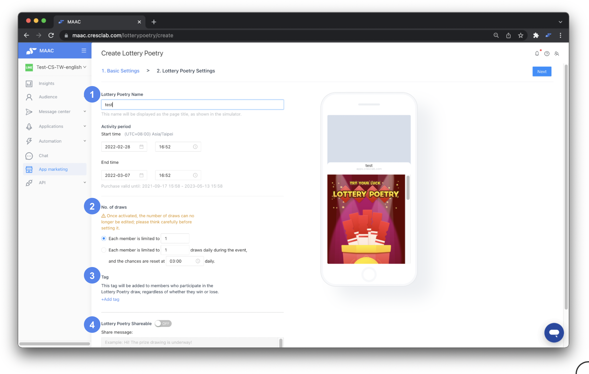
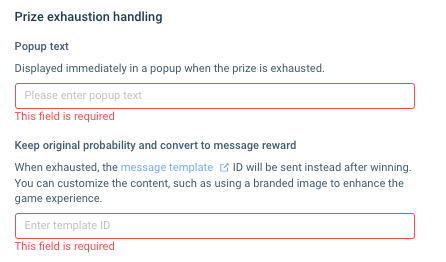
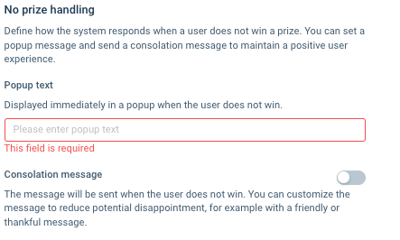
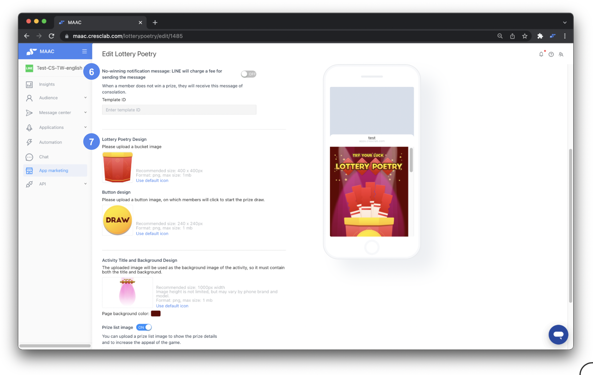
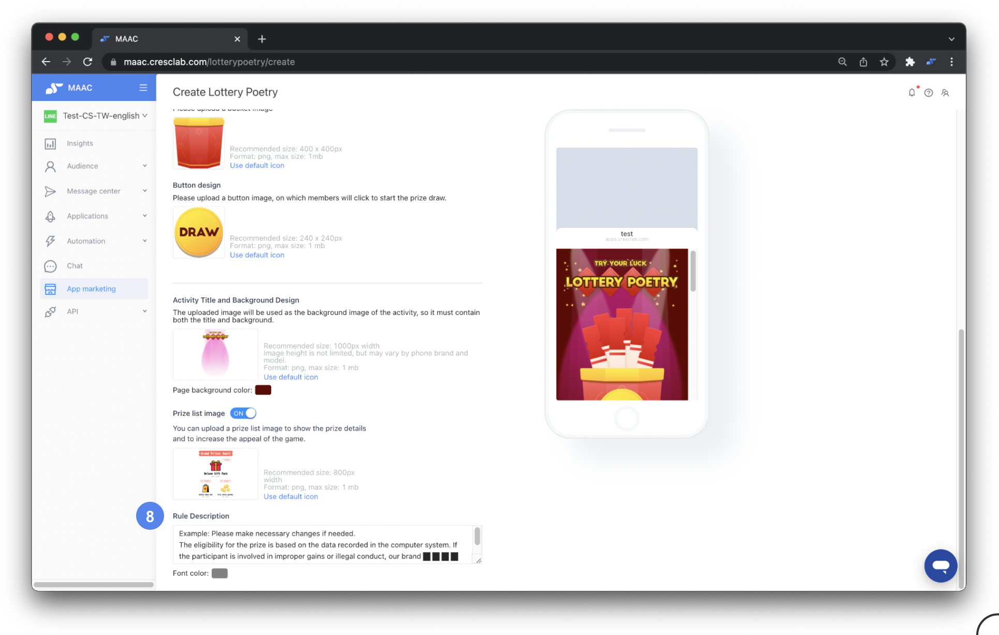
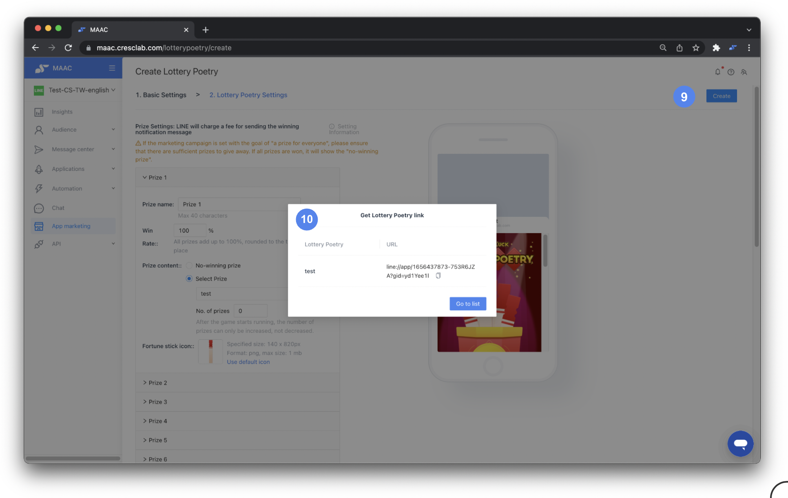
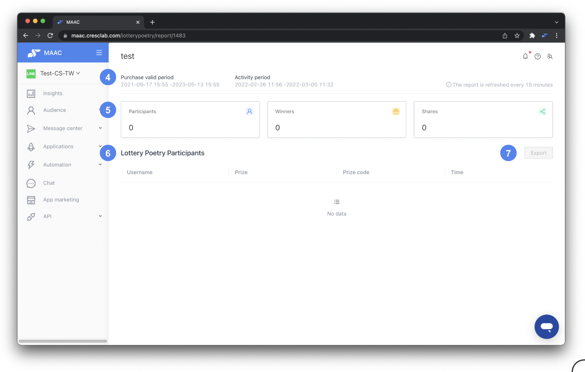

# Tutorials｜Game Interaction – Crescendo Lab Help Center

#### 💁🏻‍♀️ Advantage

* Game interaction is a great tool that can help LINE OA engagement grow and let your followers share an interesting game with their friends, increasing your followers!
* It can combine with multiple prizes and be designed the image with your creativity and brand style.

**➤ Plan Availability**

This is an advanced feature in APP marketing, needs purchase in addition, and is not included in the Basic or EC plan. If you're interested, please contact your CSM and we're happy to assist you!

#### ▶︎ Setting Steps

(There are five types of game interaction. The setting steps are the same but the interface and style will be different. We take Lottery Poetry as an example.)



### Create game basic info

* Fill in the game name and start/end time.



### Set attending times

* Set how many times followers can attend during the period. There are two types of rules:
  * Fixed rule: each follower has X times to attend for the whole period.
  * Daily reset: after resetting daily, each follower has X times to attend daily.


Attentions：

1. After the game starts running, the attending times and rules can be changed.
2. If you offer the attending times with "Game Tix", and only the contact who received the "Game Tix" can attend, then the No. of draws should be set to 0, which means that only the "Game Tix" is offering the attending times.




### Set tags

* Set tags that will be added to followers who attend the game.



### Share message

* If you open the share message, followers can see the "share" button while attending the game. You need to edit the share message after opening it. The share message is the content that followers send to their friends.


Reminder：

* If you want to check how many new followers are increased by the game, please put a deeplink in the share message. Using a Liff URL of game interaction features can track the performance, but you can still check how many times the game is shared in the list.





### Prizes

* Please set the prizes in the Prize Management feature first, and then choose the prizes in the game interaction feature setting.


Attentions：For the Lucky Wheel game, we strongly recommend that one of the six prizes be retained as a "no-winning prize", to avoid the situation where the wheel pointer has nowhere to point at after all prizes have been won, as well as to avoid customer complaints.



Reminder：

* The win rate of prizes or "no-winning prize" is the fixed probability; it won't be affected by the number of prizes left.
* After the game starts running, the number of prizes can only be increased, not decreased. If you want to add more to the number of prizes, please add the number of prizes in "Prize Management" first, and then set the number of prizes in "Game Interaction". The number set should add to the original (e.g., if there are 10 of prize 1 initially and you add 10 in Prize Management, set the number to 20).
* If the marketing campaign goal is "a prize for everyone", ensure there are sufficient prizes. If all prizes are won, the system will show the "no-winning prize".





### No-winning notification and templates

* Choose whether the no-winning notification message is open or closed (this is a paid message).


Reminder：Set the content in "Template Library" first, and copy the template ID here.


#### Available for “Lucky Roulette” Only

* Prize exhaustion handling — Popup text\
  If all prizes you have set are drawn, the system will automatically send a custom message to any subsequent participants.
* Keep original probability and convert to message reward\
  When exhausted, the message template ID will be sent instead after winning. You can customize the content, such as using a branded image to enhance the game experience.

* No prize handling — Customize “No Prize” popup message\
  Define how the system responds when a user does not win a prize. You can set a popup message and send a consolation message to maintain a positive user experience.

Advanced Option: You may also enable the Consolation Message feature to send a message to users who didn't win (Message fees apply)

Tip: Consider adding text that matches your event theme, such as “Come back and try again tomorrow 🎉” or “Missed the grand prize? More rewards are waiting for you!”




### Design

* Adjust the design in the game. You can use the system default or upload your own design materials.




### Rules description

* Set the rule description and adjust the text color.




### Create

* After setting, click "Create".



### LIFF URL and distribution

* The system will generate a game LIFF URL — copy the link and put it into entrances where followers can attend the game (rich menu, broadcast, auto-reply, etc).


Attentions：LIFF links can be shared and spread. If you only want followers with particular conditions to attend the game, we strongly recommend using the "Game Tix" in "Prize Management" to avoid the game URL being shared or abused.





***

#### ▶︎ List and Performance

* Check the purchasing period and all created games.
* Enter a game details report.
* Quick functions menu like edit, make a copy, copy game Liff URL, delete.

* Check the purchasing period and the game period.
* Check the overall performance.
* Check who wins the prizes, what prizes they win, the codes of prizes (Only coupon with code, LINE points will show.), when they attend.
* Click "Export" and check the detailed report for the game.


Report and List Display Logic

* List / Export List display rules:
  * Won Prize: Displays the prize name
  * No Win: Displays “No Win”
* In Lucky Roulette reports only, if the prize was won but has been depleted, the system will display the “Prize Exhaustion Message.”


📚 Review： [教學｜獎項管理 >> please change the link to local language version.](https://crescendolab.zendesk.com/hc/zh-tw/articles/4412897068313)

### Related articles

* [Tutorials｜Notes on Game Interaction](https://crescendolab.zendesk.com/hc/en-us/related/click?data=BAh7CjobZGVzdGluYXRpb25fYXJ0aWNsZV9pZGwrCJnzvNoDBDoYcmVmZXJyZXJfYXJ0aWNsZV9pZGwrCBlM0QcdBDoLbG9jYWxlSSIKZW4tdXMGOgZFVDoIdXJsSSJJL2hjL2VuLXVzL2FydGljbGVzLzQ0MTQ2MDEyMjkyMDktVHV0b3JpYWxzLU5vdGVzLW9uLUdhbWUtSW50ZXJhY3Rpb24GOwhUOglyYW5raQY%3D--599a7099fe2d722d6ce4f4d70fa1af568a98ac0b)
* [Tutorials｜ Prize Management：Coupon、LINE Points、Vouchers、Game tixs、Brand Coupons](https://crescendolab.zendesk.com/hc/en-us/related/click?data=BAh7CjobZGVzdGluYXRpb25fYXJ0aWNsZV9pZGwrCBmFKXUDBDoYcmVmZXJyZXJfYXJ0aWNsZV9pZGwrCBlM0QcdBDoLbG9jYWxlSSIKZW4tdXMGOgZFVDoIdXJsSSJ0L2hjL2VuLXVzL2FydGljbGVzLzQ0MTI4OTcwNjgzMTMtVHV0b3JpYWxzLVByaXplLU1hbmFnZW1lbnQtQ291cG9uLUxJTkUtUG9pbnRzLVZvdWNoZXJzLUdhbWUtdGl4cy1CcmFuZC1Db3Vwb25zBjsIVDoJcmFua2kH--c3075cbc0f8f3263652f81baba31b1bba2a621f2)
* [Tutorials｜Rapid Referral](https://crescendolab.zendesk.com/hc/en-us/related/click?data=BAh7CjobZGVzdGluYXRpb25fYXJ0aWNsZV9pZGwrCBkzBMgDBDoYcmVmZXJyZXJfYXJ0aWNsZV9pZGwrCBlM0QcdBDoLbG9jYWxlSSIKZW4tdXMGOgZFVDoIdXJsSSI%2BL2hjL2VuLXVzL2FydGljbGVzLzQ0MTQyODcxMzE0MTctVHV0b3JpYWxzLVJhcGlkLVJlZmVycmFsBjsIVDoJcmFua2kI--688cdaa0e5e5626bcfa19ae34941da0f2ef3d27e)
* [Tutorials｜ MAAC x SurveyCake Form](https://crescendolab.zendesk.com/hc/en-us/related/click?data=BAh7CjobZGVzdGluYXRpb25fYXJ0aWNsZV9pZGwrCJkr5rYDBDoYcmVmZXJyZXJfYXJ0aWNsZV9pZGwrCBlM0QcdBDoLbG9jYWxlSSIKZW4tdXMGOgZFVDoIdXJsSSJGL2hjL2VuLXVzL2FydGljbGVzLzQ0MTM5OTk5NTA3NDUtVHV0b3JpYWxzLU1BQUMteC1TdXJ2ZXlDYWtlLUZvcm0GOwhUOglyYW5raQk%3D--35cf6a52538197e02d772c350c2548044014a09d)
* [How to share LINE OA platform, LINE Developers, GA(UA) / GA4 access to Crescendo Lab?](https://crescendolab.zendesk.com/hc/en-us/related/click?data=BAh7CjobZGVzdGluYXRpb25fYXJ0aWNsZV9pZGwrCJmp1FFgBzoYcmVmZXJyZXJfYXJ0aWNsZV9pZGwrCBlM0QcdBDoLbG9jYWxlSSIKZW4tdXMGOgZFVDoIdXJsSSJ1L2hjL2VuLXVzL2FydGljbGVzLzgxMTAyNzExNDYzOTMtSG93LXRvLXNoYXJlLUxJTkUtT0EtcGxhdGZvcm0tTElORS1EZXZlbG9wZXJzLUdBLVVBLUdBNC1hY2Nlc3MtdG8tQ3Jlc2NlbmRvLUxhYgY7CFQ6CXJhbmtpCg%3D%3D--27f80d9a2c49d2122d6dc98cd2e97ece320b1986)
