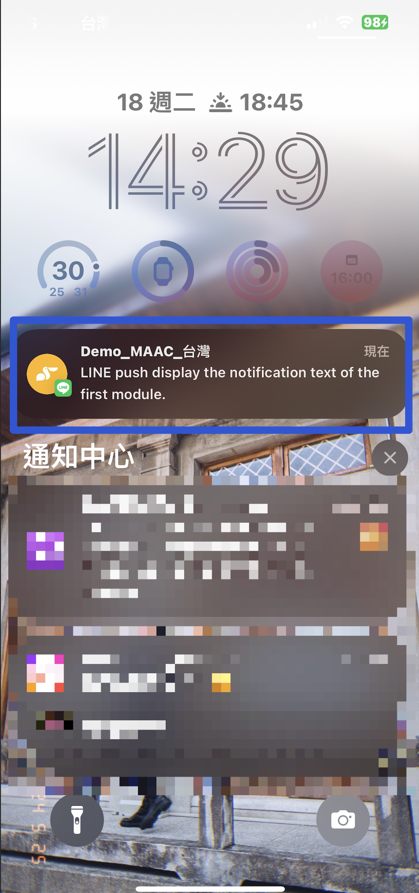
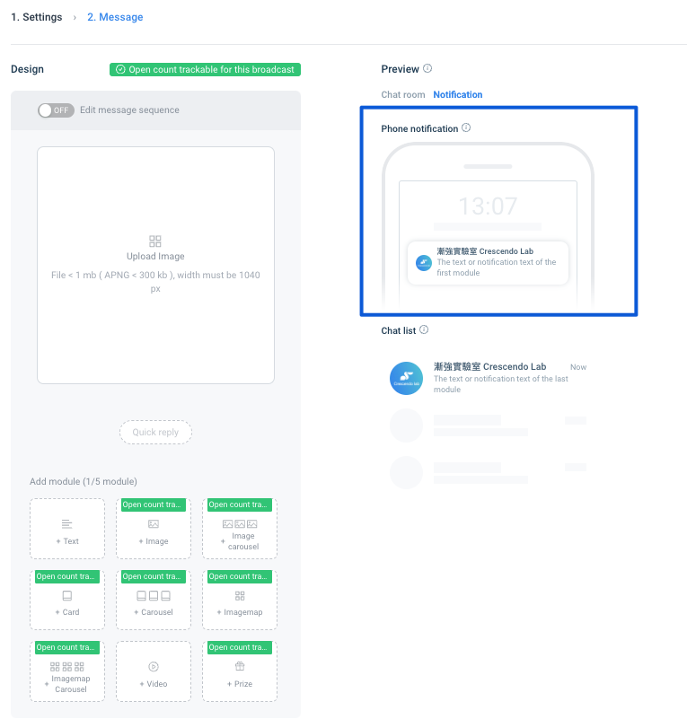
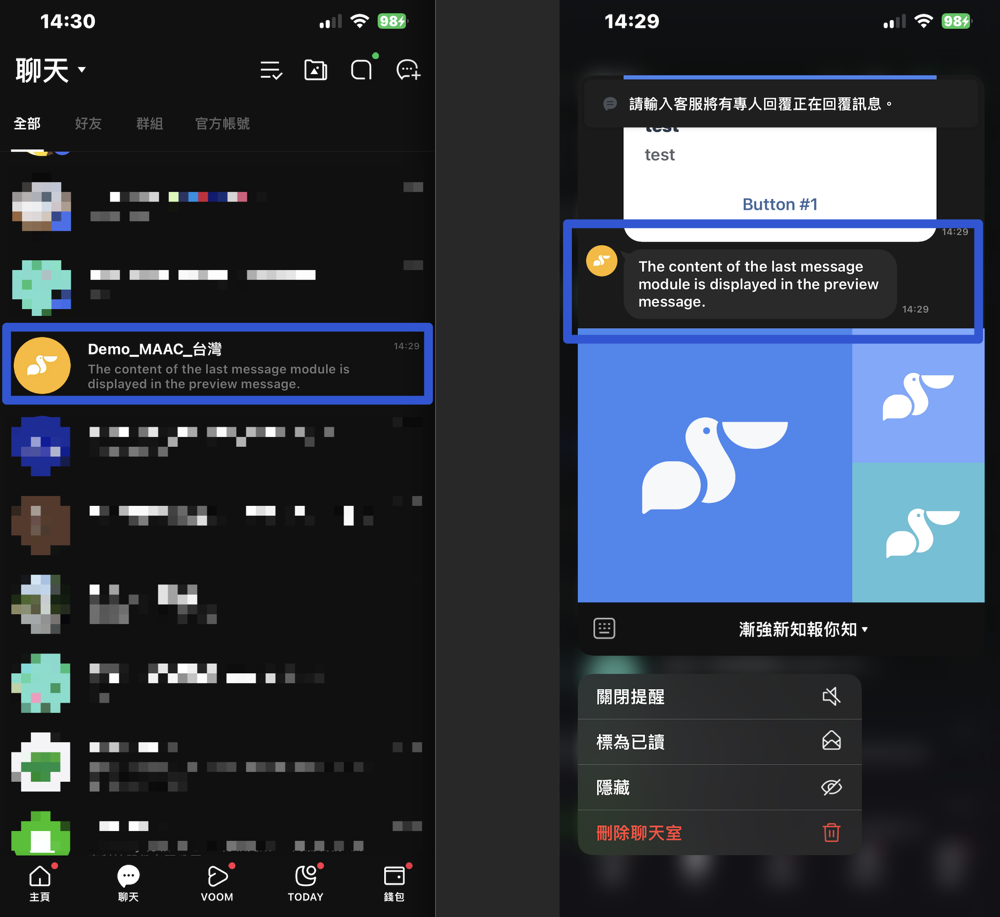
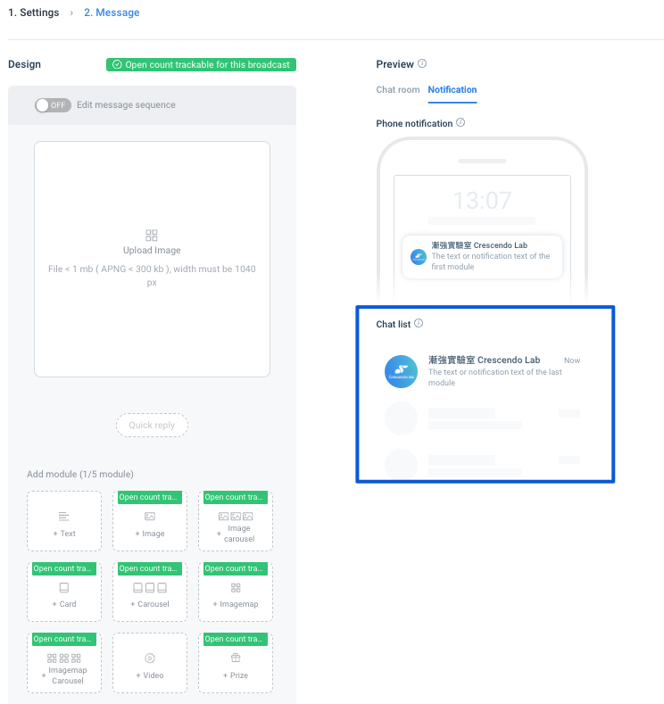
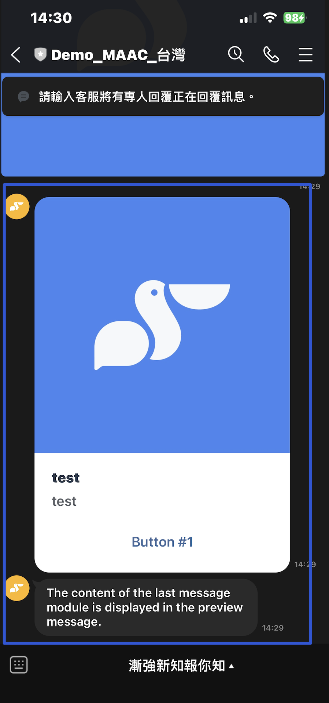
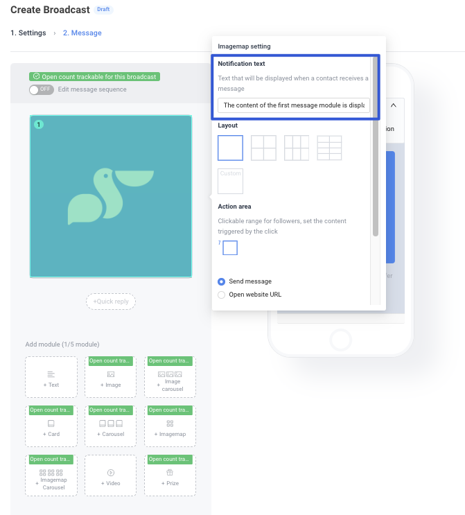
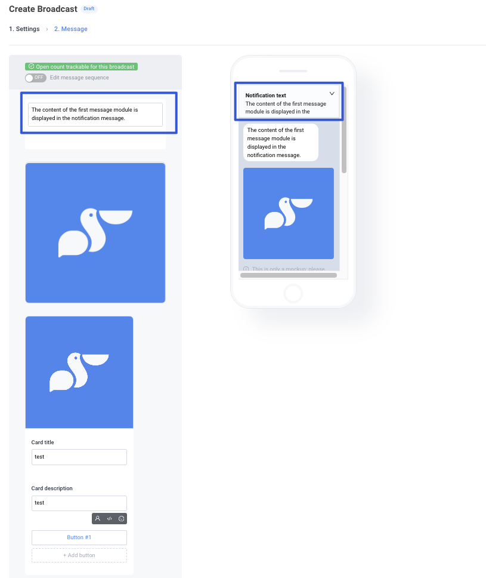
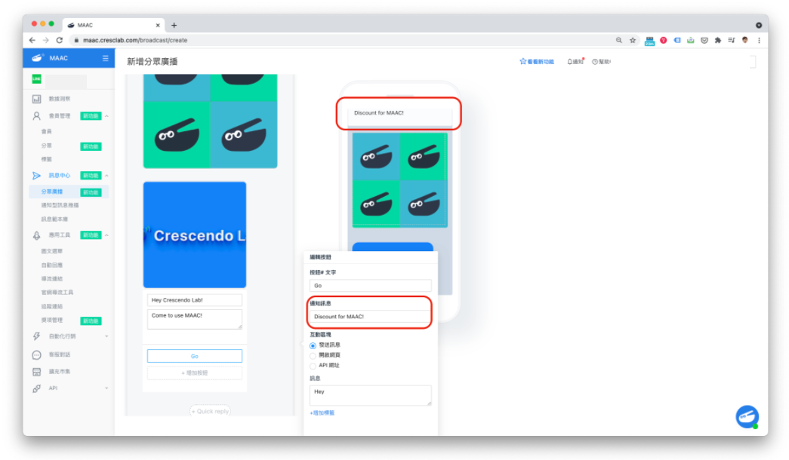
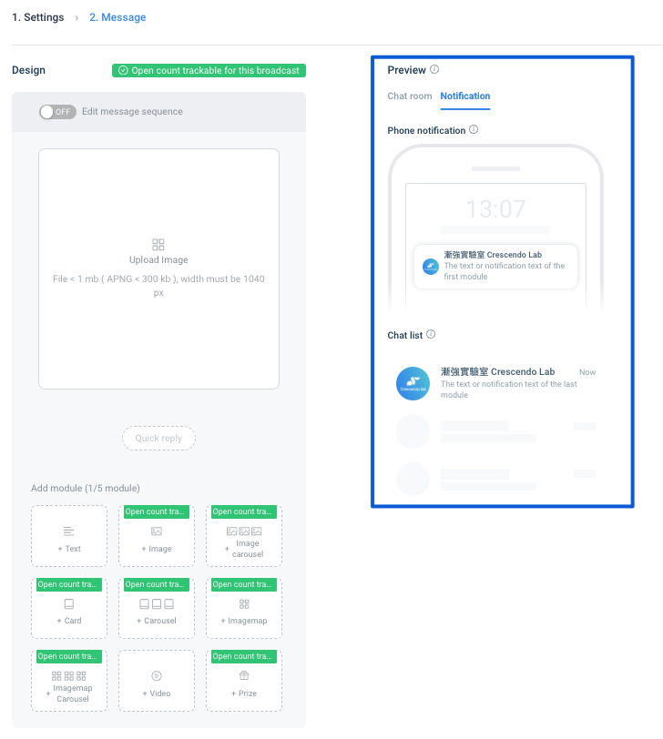

# What is the "notification text"? What is the difference between "notification text", "message preview" and "message"? – Crescendo Lab Help Center

*   **Notification Text:** Messages users receive via push notifications on the LINE app on their mobile phones. The content of the first message module is displayed in the notification message.

    

    You can check the preview on MAAC, Phone notification: 
*   **Message Previews:** The preview message contents that appear before entering the chat window. The content of the last message module is displayed in the preview message.

    

    You can check the preview on MAAC, Chat list: 
*   **Messages:** Message contents that appear only after entering the chat window or triggering the message.

    

➤ "Notification Text" Settings

*   When editing message modules in MAAC, notification messages need to be separately set for all message modules except for 'Text' and 'Image'.

    
*   If multiple message modules are used, the notification message of the first module will automatically be used as the push notification message.

    
*   When using the "Text" message module, there is no need to set the notification message separately; the text content will automatically be used as the notification message.

    
* You can check the preview illustration on MAAC: 

Related articles

* [Tutorials｜CAAC Notification](https://crescendolab.zendesk.com/hc/en-us/related/click?data=BAh7CjobZGVzdGluYXRpb25fYXJ0aWNsZV9pZGwrCJlitOxaEjoYcmVmZXJyZXJfYXJ0aWNsZV9pZGwrCBldJIkDBDoLbG9jYWxlSSIKZW4tdXMGOgZFVDoIdXJsSSJCL2hjL2VuLXVzL2FydGljbGVzLzIwMTgxNzI3NjAxMzA1LVR1dG9yaWFscy1DQUFDLU5vdGlmaWNhdGlvbgY7CFQ6CXJhbmtpBg%3D%3D--ece7f9be727007063744217562bea9e80f82c463)
* [Tutorials｜Rapid Referral](https://crescendolab.zendesk.com/hc/en-us/related/click?data=BAh7CjobZGVzdGluYXRpb25fYXJ0aWNsZV9pZGwrCBkzBMgDBDoYcmVmZXJyZXJfYXJ0aWNsZV9pZGwrCBldJIkDBDoLbG9jYWxlSSIKZW4tdXMGOgZFVDoIdXJsSSI%2BL2hjL2VuLXVzL2FydGljbGVzLzQ0MTQyODcxMzE0MTctVHV0b3JpYWxzLVJhcGlkLVJlZmVycmFsBjsIVDoJcmFua2kH--712a2c47423255fb965b2b93e9fdcd49e40c5036)
* [How to share LINE OA platform, LINE Developers, GA(UA) / GA4 access to Crescendo Lab?](https://crescendolab.zendesk.com/hc/en-us/related/click?data=BAh7CjobZGVzdGluYXRpb25fYXJ0aWNsZV9pZGwrCJmp1FFgBzoYcmVmZXJyZXJfYXJ0aWNsZV9pZGwrCBldJIkDBDoLbG9jYWxlSSIKZW4tdXMGOgZFVDoIdXJsSSJ1L2hjL2VuLXVzL2FydGljbGVzLzgxMTAyNzExNDYzOTMtSG93LXRvLXNoYXJlLUxJTkUtT0EtcGxhdGZvcm0tTElORS1EZXZlbG9wZXJzLUdBLVVBLUdBNC1hY2Nlc3MtdG8tQ3Jlc2NlbmRvLUxhYgY7CFQ6CXJhbmtpCA%3D%3D--e4861c90e48c61f6e0cb55b98124ce775647668c)
* [Tutorials｜Game Interaction](https://crescendolab.zendesk.com/hc/en-us/related/click?data=BAh7CjobZGVzdGluYXRpb25fYXJ0aWNsZV9pZGwrCBlM0QcdBDoYcmVmZXJyZXJfYXJ0aWNsZV9pZGwrCBldJIkDBDoLbG9jYWxlSSIKZW4tdXMGOgZFVDoIdXJsSSJAL2hjL2VuLXVzL2FydGljbGVzLzQ1MjI3MzE3MTk3MDUtVHV0b3JpYWxzLUdhbWUtSW50ZXJhY3Rpb24GOwhUOglyYW5raQk%3D--88e0dcfdfd76d0ba027ff401f767261a97441f0e)
* [Tutorials｜Smart Sending](https://crescendolab.zendesk.com/hc/en-us/related/click?data=BAh7CjobZGVzdGluYXRpb25fYXJ0aWNsZV9pZGwrCJmDF4kDBDoYcmVmZXJyZXJfYXJ0aWNsZV9pZGwrCBldJIkDBDoLbG9jYWxlSSIKZW4tdXMGOgZFVDoIdXJsSSI9L2hjL2VuLXVzL2FydGljbGVzLzQ0MTMyMzE0MzI2MDEtVHV0b3JpYWxzLVNtYXJ0LVNlbmRpbmcGOwhUOglyYW5raQo%3D--3d6f2fe3bf52f5cd83d43939fdd6eccce66b434b)
