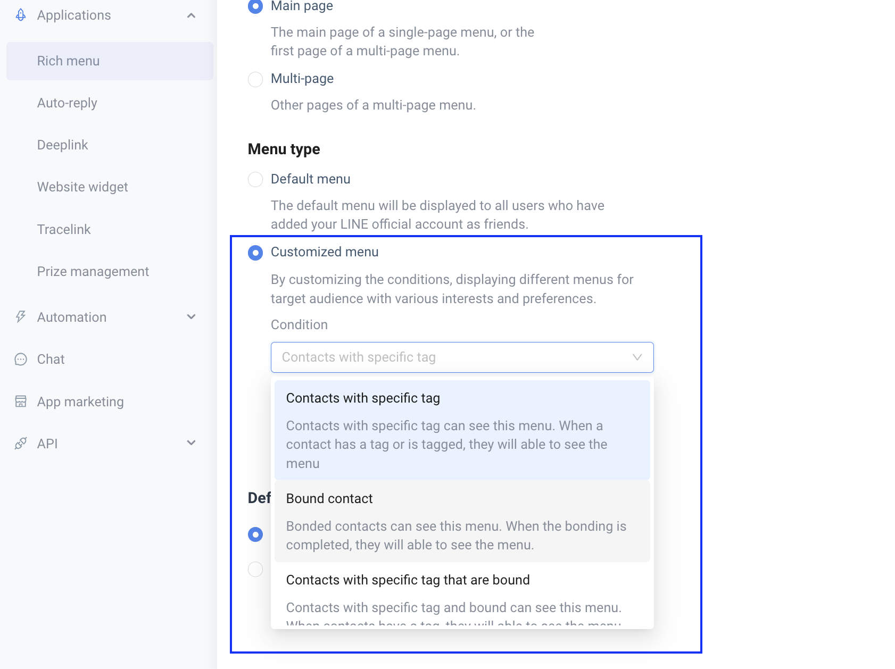
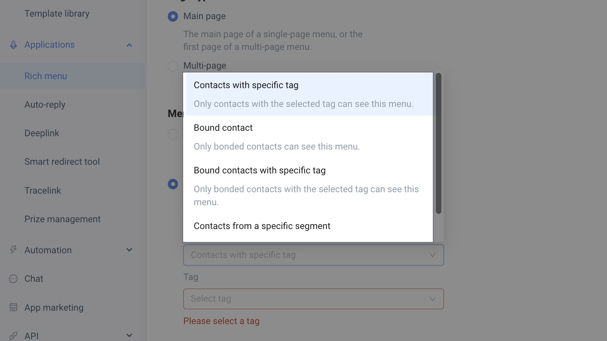

# Tutorial｜Personalized Rich Menu – Crescendo Lab Help Center

💁‍♀️ Achievable

* Provide better personalized marketing and sales services
* Brands can display different Rich Menus to specific contacts based on Tags or Segments.

Review: [Tutorial｜Basic Setup and Multi-page Guide for Rich Menu](https://crescendolab.zendesk.com/hc/en-us/articles/4413211682329)

***

### Setup Process



### Create a Rich Menu

1. Go to the Rich Menu module and click \[Add Rich Menu].
2. Enter the name of the Rich Menu.
3. Select "Custom Menu".




### Choose Personalization Conditions

Choose one personalization condition:

* Contacts with specific tags
  * If tagged with the tag, this Rich Menu will automatically be displayed
* Bound Contacts
  * Bound Contacts will automatically see this Rich Menu
* Contacts with specific tags and bound
  * If the Contact is tagged and bound, this Rich Menu will automatically be displayed
* Contacts from a specific segment
  * Contacts belonging to the selected segment will see this Rich Menu


Segment-based Rich Menu Mechanism: Non-real-time update — The contact list for segment-based menus is automatically updated once daily in the early morning (around 7:00 AM).

• If you require an "immediate menu switch triggered by a user action," please continue using the "Tag" trigger mechanism.

• If you are focusing on "long-term audience management (e.g., VIPs, inactive users)," we recommend using the "Segment" mechanism.


> ⚠️ It is recommended to use a separate tag for activity-based menus to avoid interfering with persistent menu logic



### Menu Settings

Click Next to proceed to the menu settings screen:

* Set images, text lists, and interactive blocks (Send message, open website, switch page, make a call)
* Recommended image sizes:
  * Large: 2500 x 1686 px
  * Small: 2500 x 843 px
* Image formats: JPG, JPEG, PNG (Transparent backgrounds are not supported)



### Save Settings

Options:

* Save as Draft: Can be edited later
* Schedule: Choose permanent or custom start and end times



### Check Status

After completion, check the status in the Rich Menu list:

* Paused: Can be edited or rescheduled
* Scheduled: Not yet activated
* Running: Currently active
* Ended: Menu is over, can be copied or deleted



### Error

If "Error" status appears, create a new menu and use the "Help" feature in the bottom right to contact support.



***

#### Rich Menu Priority Order

The following explains the priority based on Contact events and Brand manual updates to Rich Menus.

1. Contact Event Updates: Contact’s \[Tag / Untag] events & Contact’s \[Bind / Unbind] events
2. Brand Updates Rich Menus: Enable / Disable Tag Rich Menus & Enable / Disable Bound Rich Menus
3. Display logic for "Segments": When a user belongs to multiple segments simultaneously, and these segments are bound to different Rich Menus, the system will prioritize displaying the "Last Edited and Published" Rich Menu.


Tip: If you want a specific segment menu to be displayed with priority, re-edit and save that menu to make its update time the most recent.


***

### Contact Event: Tag / Untag

#### Tag Event (Add Tag)

When a user is tagged, MAAC will prioritize checking if the user is a Bound Contact.

* For Bound Contacts:
  * If a Tag with Bound Rich Menu exists, that menu will be shown.
  * If no Tag with Bound Rich Menu, the system checks for a Tag Rich Menu:
    * If exists, the most recently created Tag Rich Menu will be shown.
    * If not, no update will be made.

Priority:

1. If the Contact meets both “Tag” and “Bind” conditions, the system will prioritize displaying the Tag with Bound Rich Menu and select the most recently created menu.
2. When a contact has multiple tags, the system will display the Rich Menu based on the most recently added tag.

***

#### Untag Event (Remove Tag)

* Does Not Switch Menu: When the contact removes a tag, the system will not automatically switch the Rich Menu and will retain the currently displayed menu until another event (such as a Bind or Tag change) triggers a menu update.

***

#### Tag / Untag Status Table Summary

| Event | Original Contact Status (Before New Tag Event Trigger) | New Tag Event Triggered Contact Status | Final Displayed Rich Menu                                                                                                                                  |
| ----- | ------------------------------------------------------ | -------------------------------------- | ---------------------------------------------------------------------------------------------------------------------------------------------------------- |
| Tag   | Tagged and Bound                                       | Tagged and Bound                       | 
Priority Order: 1. Tag with Bound Rich Menu 2. Tag Rich Menu 3. No Update (if no corresponding tag menu is set, the menu will not be updated)
 |
| Tag   | Tagged and Unbound                                     | Tagged and Bound                       | 
Priority Order: 1. Tag Rich Menu 2. No Update (if no corresponding tag menu is set, the menu will not be updated)
                                |
| Tag   | Untagged and Bound                                     | Tagged and Bound                       | 
Priority Order: 1. Tag with Bound Rich Menu 2. Tag Rich Menu 3. No Update (if no corresponding tag menu is set, the menu will not be updated)
 |
| Tag   | Untagged and Unbound                                   | Tagged and Unbound                     | 
Priority Order: 1. Tag Rich Menu 2. No Update (if no corresponding tag menu is set, the menu will not be updated)
                                |

***

### Contact Event: Bind / Unbind

#### Bind Event Logic

* The system checks if the user is bound (Customer\_id updated with a value).
* If there is a matching Bound Contact Rich Menu, it will be shown directly.
* If there is no matching Bound Contact Rich Menu:
  * No update is made, and the original menu remains.
  * If the original menu was deleted or paused, it will revert to the default Rich Menu (LINE native mechanism).

Priority Order:

* Regardless of whether it is a Tag Rich Menu, Bound Rich Menu, or Default Menu, as long as a Bind event is triggered, the Bound Rich Menu will be prioritized.

***

#### Unbind Event (Remove Bind)

When a contact is unbound, the system checks the current Rich Menu type and determines how to handle it:

* Bound Rich Menu or Tag with Bound Rich Menu: The system will unbind and revert the user to the default Rich Menu (LINE native mechanism).
* Unbound Contact: If no other special settings are applied, the system will display the default Rich Menu.

***

#### Bind / Unbind Status Table Summary

| Event | Original User Status | Contact Update Status | Final Displayed Rich Menu |
| ----- | -------------------- | --------------------- | ------------------------- |
| Bind  | Tagged and Bound     | Tagged and Bound      | Bound Rich Menu           |
| Bind  | Tagged and Unbound   | Tagged and Bound      | Bound Rich Menu           |
| Bind  | Untagged and Bound   | Untagged and Bound    | Bound Rich Menu           |
| Bind  | Untagged and Unbound | Untagged and Bound    | Bound Rich Menu           |

***

#### Unbind Event (Remove Bind) — Additional Details

When the contact is unbound, the system checks the current Rich Menu type and determines how to handle it:

* Bound Rich Menu or Tag with Bound Rich Menu:
  * Situation 1: If the contact was bound to a Tag Rich Menu, it will retain the Tag Rich Menu.
  * Situation 2: If the contact was bound to a Bound Rich Menu, it will revert to the default Rich Menu.
* Unbound Contact: If no special settings exist, the system will display the default Rich Menu.

***

### Brand Updates Rich Menu

#### Enable Tag Rich Menu

Find all Contacts with the specific tag and update their Rich Menus. If the contact is tagged, the corresponding Tag Rich Menu will be displayed.

#### Disable Tag Rich Menu

If the contact has not left the chatroom, they will continue to see the disabled Rich Menu. If they re-enter the chatroom, the default Rich Menu will appear.

#### Enable / Disable Bound Rich Menu

Find all Bound Contacts and update their existing Rich Menus accordingly.

***

#### Enable / Disable Bound Rich Menu Status Table

| Event                  | Contact Status       | Final Displayed RM                    |
| ---------------------- | -------------------- | ------------------------------------- |
| Enable Bound Rich Menu | Tagged and Bound     | Bound Rich Menu                       |
| Enable Bound Rich Menu | Tagged and Unbound   | No Change, Display Existing Rich Menu |
| Enable Bound Rich Menu | Untagged and Bound   | Bound Rich Menu                       |
| Enable Bound Rich Menu | Untagged and Unbound | No Change, Display Existing Rich Menu |

***

#### Enable / Disable Tag with Bound Rich Menu

| Event                           | Original User Status | Final Displayed RM                    |
| ------------------------------- | -------------------- | ------------------------------------- |
| Enable Tag with Bound Rich Menu | Tagged and Bound     | Tag with Bound Rich Menu              |
| Enable Tag with Bound Rich Menu | Tagged and Unbound   | No Change, Display Existing Rich Menu |
| Enable Tag with Bound Rich Menu | Untagged and Bound   | No Change, Display Existing Rich Menu |
| Enable Tag with Bound Rich Menu | Untagged and Unbound | No Change, Display Existing Rich Menu |

***

### Automatic Rich Menu Switching Mechanism Summary

* Tag Events and Bind Events are independent events that update the Rich Menu based on the contact's tag or binding status.
* When multiple Rich Menus of the same type meet the conditions, the system will choose the most recently created menu based on creation time.
* Untag and Unbind Events do not immediately trigger menu switching, unless other conditions (such as a new tag or bind event) are triggered.
* Brands can manually enable or disable Tag Rich Menus, but after disabling, the contact must re-enter the chatroom to see the default Rich Menu.

***

#### Events That Trigger Automatic Rich Menu Switching

| Trigger Event                   | Affected Contact            | Rich Menu Type                           | Description                                                                                                                                               |
| ------------------------------- | --------------------------- | ---------------------------------------- | --------------------------------------------------------------------------------------------------------------------------------------------------------- |
| User Bind                       | Single Contact              | Bound Rich Menu                          | Forced link to Bound Rich Menu.                                                                                                                           |
| User Gains Tag                  | Single or Multiple Contacts | Tag Rich Menu / Tag with Bound Rich Menu | Choose Rich Menu based on priority: 1. Tag with Bound Rich Menu 2. Tag Rich Menu. If multiple menus of the same type, show the most recently created one. |
| Enable Bound Menu               | All Bound Contacts          | Bound Rich Menu                          | Link Bound Rich Menu (BIND RM), overwriting all per-user Rich Menus.                                                                                      |
| Enable Tag Rich Menu            | All Tagged Contacts         | Tag Rich Menu                            | Link Tag Rich Menu.                                                                                                                                       |
| Enable Tag with Bound Rich Menu | Contacts with Tag and Bound | Tag with Bound Rich Menu                 | Link Tag with Bound Rich Menu.                                                                                                                            |

***

### Related articles

* [Tutorial｜Basic Setup and Multi-page Guide for Rich Menu](https://crescendolab.zendesk.com/hc/en-us/related/click?data=BAh7CjobZGVzdGluYXRpb25fYXJ0aWNsZV9pZGwrCBkm6ocDBDoYcmVmZXJyZXJfYXJ0aWNsZV9pZGwrCBm5rw6DGDoLbG9jYWxlSSIKZW4tdXMGOgZFVDoIdXJsSSJdL2hjL2VuLXVzL2FydGljbGVzLzQ0MTMyMTE2ODIzMjktVHV0b3JpYWwtQmFzaWMtU2V0dXAtYW5kLU11bHRpLXBhZ2UtR3VpZGUtZm9yLVJpY2gtTWVudQY7CFQ6CXJhbmtpBg%3D%3D--530f23f15ed4b31a9c755e3e56c0710f5640fae1)
* [Why Are the Pre-set Auto-reply and Rich Menu Not Working?](https://crescendolab.zendesk.com/hc/en-us/related/click?data=BAh7CjobZGVzdGluYXRpb25fYXJ0aWNsZV9pZGwrCJletogDBDoYcmVmZXJyZXJfYXJ0aWNsZV9pZGwrCBm5rw6DGDoLbG9jYWxlSSIKZW4tdXMGOgZFVDoIdXJsSSJeL2hjL2VuLXVzL2FydGljbGVzLzQ0MTMyMjUwNjYxMzctV2h5LUFyZS10aGUtUHJlLXNldC1BdXRvLXJlcGx5LWFuZC1SaWNoLU1lbnUtTm90LVdvcmtpbmcGOwhUOglyYW5raQc%3D--434e506cc7776e4a12ed2d5599cccd32107aa219)
* [Tutorials｜MAAC Message Module & Template Library](https://crescendolab.zendesk.com/hc/en-us/related/click?data=BAh7CjobZGVzdGluYXRpb25fYXJ0aWNsZV9pZGwrCBkb49oDBDoYcmVmZXJyZXJfYXJ0aWNsZV9pZGwrCBm5rw6DGDoLbG9jYWxlSSIKZW4tdXMGOgZFVDoIdXJsSSJUL2hjL2VuLXVzL2FydGljbGVzLzQ0MTQ2MDM3Mjk2ODktVHV0b3JpYWxzLU1BQUMtTWVzc2FnZS1Nb2R1bGUtVGVtcGxhdGUtTGlicmFyeQY7CFQ6CXJhbmtpCA%3D%3D--4be90e2b30d0b417a6a2108c871cff48dfa89329)
* [Tutorials｜MAAC Materials Size](https://crescendolab.zendesk.com/hc/en-us/related/click?data=BAh7CjobZGVzdGluYXRpb25fYXJ0aWNsZV9pZGwrCJka8YcDBDoYcmVmZXJyZXJfYXJ0aWNsZV9pZGwrCBm5rw6DGDoLbG9jYWxlSSIKZW4tdXMGOgZFVDoIdXJsSSJDL2hjL2VuLXVzL2FydGljbGVzLzQ0MTMyMTIxMzgxMzctVHV0b3JpYWxzLU1BQUMtTWF0ZXJpYWxzLVNpemUGOwhUOglyYW5raQk%3D--e6477310612bc0d07c3731953ade4a3c86a98bed)
* [How to share LINE OA platform, LINE Developers, GA(UA) / GA4 access to Crescendo Lab?](https://crescendolab.zendesk.com/hc/en-us/related/click?data=BAh7CjobZGVzdGluYXRpb25fYXJ0aWNsZV9pZGwrCJmp1FFgBzoYcmVmZXJyZXJfYXJ0aWNsZV9pZGwrCBm5rw6DGDoLbG9jYWxlSSIKZW4tdXMGOgZFVDoIdXJsSSJ1L2hjL2VuLXVzL2FydGljbGVzLzgxMTAyNzExNDYzOTMtSG93LXRvLXNoYXJlLUxJTkUtT0EtcGxhdGZvcm0tTElORS1EZXZlbG9wZXJzLUdBLVVBLUdBNC1hY2Nlc3MtdG8tQ3Jlc2NlbmRvLUxhYgY7CFQ6CXJhbmtpCg%3D%3D--30963a2ef52e5c4f2f81ae6362e5b031654de5e3)
