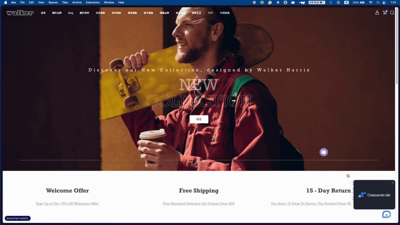
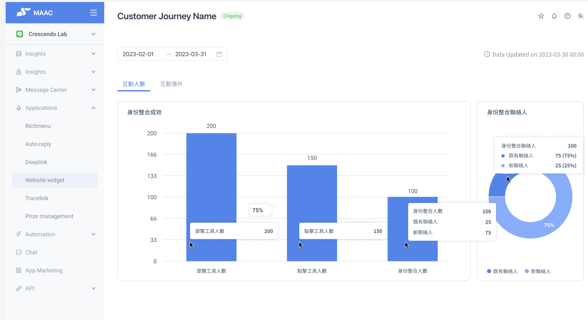
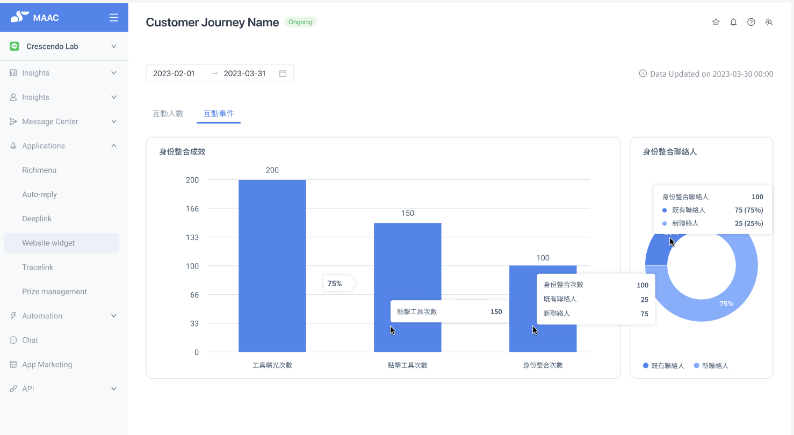

# Feature Overview｜Smart Redirect Tool - Profile Unification Link – Crescendo Lab Help Center

Product Overview

The **Smart Redirect Tool** is a self-configurable web widget that helps brands redirect anonymous visitors to their LINE Official Account and complete identity integration. Through this tool, brands can effectively **convert website traffic into identifiable and interactive LINE contacts**, achieving data unification between their official website and social media channels.

When visitors click on the Smart Redirect Tool and complete identity binding, the system automatically integrates their LINE ID with website visit records (User Unification), further establishing a **complete Full-context Profile**. This enables brands to:

* Precisely execute remarketing campaigns and audience segmentation with tags
* Connect customer service journeys to improve service efficiency
* Enhance cross-channel personalized interactions and conversion performance

The Smart Redirect Tool serves as a key bridge connecting "website traffic" and "social media management," helping brands transform "anonymous visitors" into "familiar contacts" while comprehensively improving interaction depth and operational efficiency.

Feature Highlights | Smart Redirect Tool Upgrade Advantages at a Glance

The **Smart Redirect Tool** is a comprehensive upgrade from the legacy Web Widget, integrating identity data, improving interaction efficiency, while optimizing user experience and deployment processes. Here are the five major upgrade highlights of this feature:



### Visitor Identity Integration: Connecting Website Visitors with LINE Contacts

Transform anonymous website visitors into identifiable LINE contacts, unifying their website behavior and social interaction records to build complete customer profiles.



### Enhanced Remarketing Performance: From Anonymous to Familiar Customers

After completing identity integration, comprehensively track website interaction footprints, significantly improving interaction efficiency.



### Cross-Channel Journey Integration: Improve Customer Service Efficiency

After identity unification, customer service can review user interactions across both website and LINE, helping to improve response speed and accuracy.



### Optimized Redirect Process, Reduced Bounce Rate

The new version completes integration through web redirect, making the process smoother with higher conversion rates.



### Precise Performance Tracking: Support Complete Behavior and Identity Integration Statistics

Track widget impressions, clicks, successful integrations, and contact attributes (new/existing friends), helping brands quantify redirect and integration effectiveness.



Smart Redirect Tool vs. Web Widget Comparison

| Item                 | Smart Redirect Tool                                                            | Web Widget (Legacy)                                                       |
| -------------------- | ------------------------------------------------------------------------------ | ------------------------------------------------------------------------- |
| Installation Method  | Integrated into single Web SDK, simpler deployment                             | Web SDK and plugin tools installed separately, requiring individual setup |
| Core Function        | Redirect + Identity Integration, building complete customer data               | Primarily redirect to LINE, no website-LINE identity integration          |
| Redirect Experience  | Seamless web-to-LINE OA connection, reducing bounce rate                       | Redirect process requires multiple jumps, prone to user drop-off          |
| Performance Tracking | Track impressions, clicks, integrations, and new/existing contact distribution | Only track widget clicks and LINE friend additions                        |
| Notes                | Launched June 2025                                                             | Officially discontinued Q4 2025                                           |


⚠️ Web Widget Sunset Notice - Upgrade Recommended

To ensure brands continue receiving optimal interaction benefits and technical support, **we plan to fully discontinue the legacy Web Widget service in Q4 2025**.

We recommend that you:

* Complete the Web SDK upgrade and implement the new Smart Redirect Tool as soon as possible
* Convert existing Web Widget settings to the Smart Redirect Tool:
  * https://crescendolab.zendesk.com/hc/en-us/articles/48048484309785-How-to-Upgrade-from-Legacy-Web-Widget-to-Smart-Redirect-Tool

Avoid impacting redirect functionality and the accuracy and completeness of identity integration.


How Does the Smart Redirect Tool Work?


When you install the Smart Redirect Tool Web SDK code on your brand website, visitors will see a redirect widget on the page. When visitors click the widget and scan the QR code, the system will guide them through the following two steps (below).




### Redirect to LINE Official Account (LINE OA)

* After scanning the QR code, visitors will automatically open the brand's LINE OA and be guided to add them as friends
* After adding them as friends, they become interactive contacts in MAAC, allowing you to:
  * Send broadcast messages
  * Trigger automated journeys
  * Set audience segmentation tags and other interactive behaviors



### Complete Website and LINE Identity Integration

* After visitors send identity integration messages in LINE OA, the system automatically integrates their LINE identity with website behavior records
* After contacts complete integration, the system automatically connects user data across MAAC, CAAC, and Web Chat, achieving **three-way identity integration** across products

This integration mechanism allows brands to convert anonymous visitors into identifiable, interactive LINE contacts and establish cross-channel user footprints for precise marketing and efficient customer service support.

> ❗️ Important Note: The "Identity Integration" feature must be enabled for the system to successfully integrate website visitors with LINE accounts. If this feature is disabled, even if users successfully add as friends, website identity and LINE contact integration cannot be completed.



Contact Redirect to LINE OA Screen Examples

* Desktop Version
  1. 
  2. 
* Mobile Version
  * 

Identity Integration Link Explanation

When users click the redirect widget, they will be redirected to the brand's LINE Official Account and automatically send a verification message (integration code).

After completing the message sending, the system will integrate their website identity with their LINE identity.

After successful identity integration, when users revisit the website within 30 days, their website footprints can still be continuously tracked, further strengthening the foundation for remarketing and interaction analysis.

Performance Metrics

The new Smart Redirect Tool helps brands **clearly understand user identity integration performance at each stage**, providing a stronger foundation for data-driven marketing decisions.

* Supports complete conversion process visualization, from impressions and clicks to completed identity integration, **with corresponding metrics and performance tracking for each step**
* Provides both " **Unique Identity Integration Users**" and " **Repeated Event Counts**" analysis dimensions, helping brands evaluate interaction effectiveness and user engagement from multiple angles
* Makes identity integration no longer a vague conversion process, but a **concrete, quantifiable remarketing foundation**

Report Update Frequency: Every hour



### Interaction Users - Unique Identity Integration Users (Based on LINE Contacts)

Tracking Goal: Count how many LINE contacts completed identity integration as potential targets for subsequent remarketing.

* Note: If the “Identity Unification” feature is not enabled, the system will not be able to distinguish between new and existing contacts. As a result, it will not be able to track the number of new vs. existing contacts accurately. We recommend enabling identity unification to gain a complete understanding of acquisition performance and contact conversion.

Identity Integration Performance (Funnel Chart)

| Funnel Metric              | User Behavior                                                            | Description                                                                                       |
| -------------------------- | ------------------------------------------------------------------------ | ------------------------------------------------------------------------------------------------- |
| Unique Impressions         | Display widget with integration link                                     | Unique conversation ID impression count                                                           |
| Unique Clicks              | Click the widget with the integration link                               | Unique conversation ID click count                                                                |
| Identity Integration Users | Redirect to LINE and send a verification message to complete the binding | New friends who completed integration + Existing friends who completed identity integration again |

Identity Integration Contacts (Pie Chart)

| Metric                                        | Description                                              |
| --------------------------------------------- | -------------------------------------------------------- |
| Total Identity Integration Contacts           | Total identity integration contacts brought by this tool |
| New Friend Identity Integration Contacts      | Proportion of newly added friends                        |
| Existing Friend Identity Integration Contacts | Proportion of existing friends                           |




### Interaction Events - Repeated Identity Integration Users (Based on LINE Contacts)

Tracking Goal: Count the total number of times the same user completed identity integration to evaluate interaction frequency and widget engagement.

* Note: If the “Identity Unification” feature is not enabled, the system will not be able to distinguish between new and existing contacts. As a result, it will not be able to track the number of new vs. existing contacts accurately. We recommend enabling identity unification to gain a complete understanding of acquisition performance and contact conversion.

Identity Integration Performance (Funnel Chart)

| Funnel Metric              | User Behavior                                                            | Description                                                                                      |
| -------------------------- | ------------------------------------------------------------------------ | ------------------------------------------------------------------------------------------------ |
| Repeated Impressions       | Display widget with integration link                                     | All impression counts (including repeated counts from the same conversation ID)                  |
| Repeated Clicks            | Click the widget with the integration link                               | All click counts (including repeated counts from the same conversation ID)                       |
| Identity Integration Users | Redirect to LINE and send a verification message to complete the binding | Repeated integration counts for new contacts + Repeated integration counts for existing contacts |

Identity Integration Contacts (Pie Chart)

| Metric                                  | Description                                              |
| --------------------------------------- | -------------------------------------------------------- |
| Total Identity Integration Events       | Total identity integration events completed by this tool |
| New Friend Integration Event Count      | Proportion of integration events from new contacts       |
| Existing Friend Integration Event Count | Proportion of integration events from existing contacts  |




Related Links

* For setup tutorials, please refer to: https://crescendolab.zendesk.com/hc/en-us/articles/47925134609305-Tutorials-Smart-Redirect-Tool-Profile-Unification-Link
* For frequently asked questions, please refer to: https://crescendolab.zendesk.com/hc/en-us/articles/47925205689625-FAQs%EF%BD%9CSmart-Redirect-Tool%20%E2%80%93%20Website%20Redirect%20and%20Identity%20Integration

FAQs

* FAQs｜Smart Redirect Tool – Website Redirect and Identity Integration: https://crescendolab.zendesk.com/hc/en-us/articles/47925205689625

Additional Related Articles

* Tutorials｜Smart Redirect Tool - Profile Unification Link: https://crescendolab.zendesk.com/hc/en-us/related/click?data=BAh7CjobZGVzdGluYXRpb25fYXJ0aWNsZV9pZGwrCJnLn3CWKzoYcmVmZXJyZXJfYXJ0aWNsZV9pZGwrCBkNOwV6KzoLbG9jYWxlSSIKZW4tdXMGOgZFVDoIdXJsSSJdL2hjL2VuLXVzL2FydGljbGVzLzQ3OTI1MTM0NjA5MzA1LVR1dG9yaWFscy1TbWFydC1SZWRpcmVjdC1Ub29sLVByb2ZpbGUtVW5pZmljYXRpb24tTGluawY7CFQ6CXJhbmtpBg%3D%3D--4ed0e45753358d59951981045ec27940cdb4e969
* Tutorial | SDK Web Behavior Tracking Tool: https://crescendolab.zendesk.com/hc/en-us/related/click?data=BAh7CjobZGVzdGluYXRpb25fYXJ0aWNsZV9pZGwrCJk0ii%2BuJToYcmVmZXJyZXJfYXJ0aWNsZV9pZGwrCBkNOwV6KzoLbG9jYWxlSSIKZW4tdXMGOgZFVDoIdXJsSSJOL2hjL2VuLXVzL2FydGljbGVzLzQxNDMwMDUyMTIzODAxLVR1dG9yaWFsLVNESy1XZWItQmVoYXZpb3ItVHJhY2tpbmctVG9vbAY7CFQ6CXJhbmtpBw%3D%3D--8048d7385e81cb58db5b12d907d7a4d33743aaa4
* How to Upgrade from Legacy Web Widget to Smart Redirect Tool: https://crescendolab.zendesk.com/hc/en-us/related/click?data=BAh7CjobZGVzdGluYXRpb25fYXJ0aWNsZV9pZGwrCBnb1iizKzoYcmVmZXJyZXJfYXJ0aWNsZV9pZGwrCBkNOwV6KzoLbG9jYWxlSSIKZW4tdXMGOgZFVDoIdXJsSSJjL2hjL2VuLXVzL2FydGljbGVzLzQ4MDQ4NDg0MzA5Nzg1LUhvdy10by1VcGdyYWRlLWZyb20tTGVnYWN5LVdlYi1XaWRnZXQtdG8tU21hcnQtUmVkaXJlY3QtVG9vbAY7CFQ6CXJhbmtpCQ%3D%3D--f23bf028f87a1e27522a8a98e1c49a668c575f15
