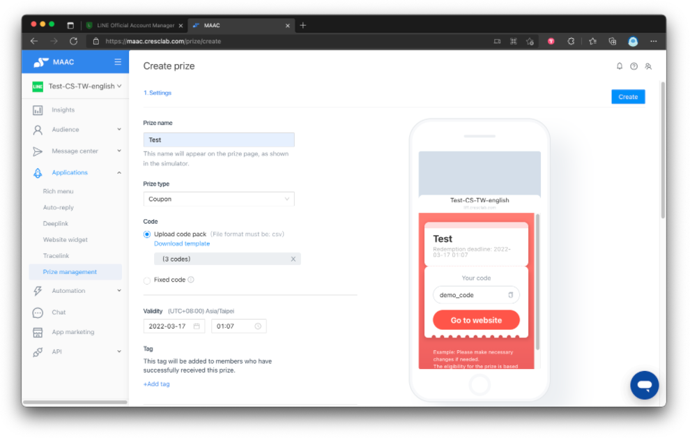
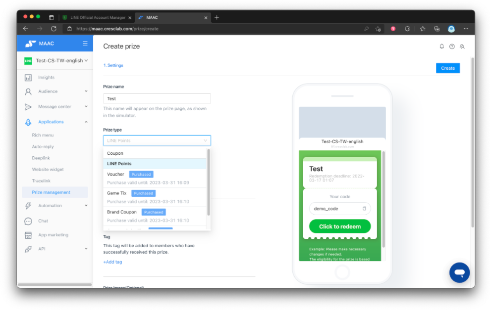
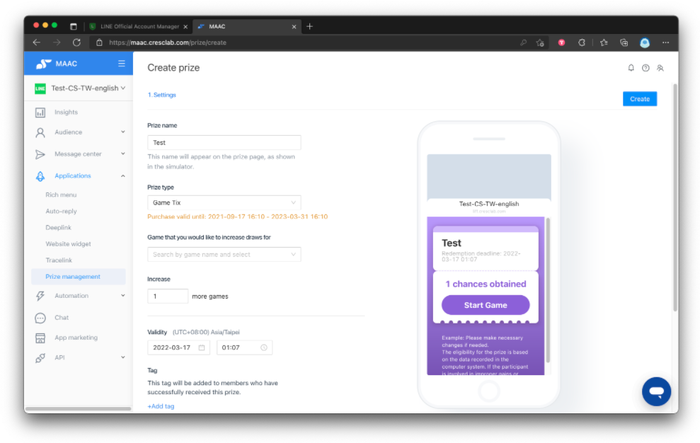
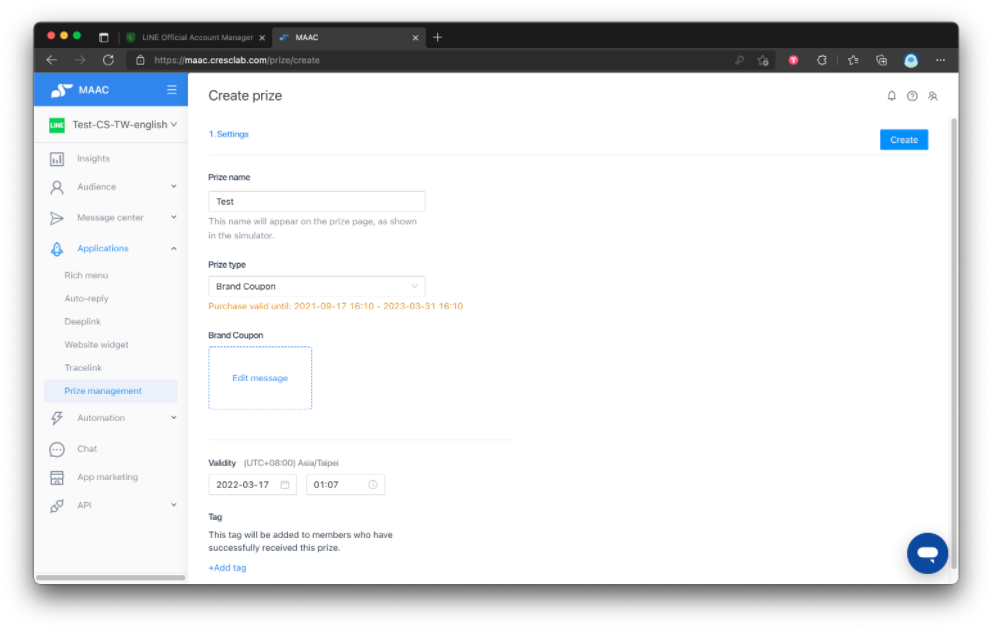
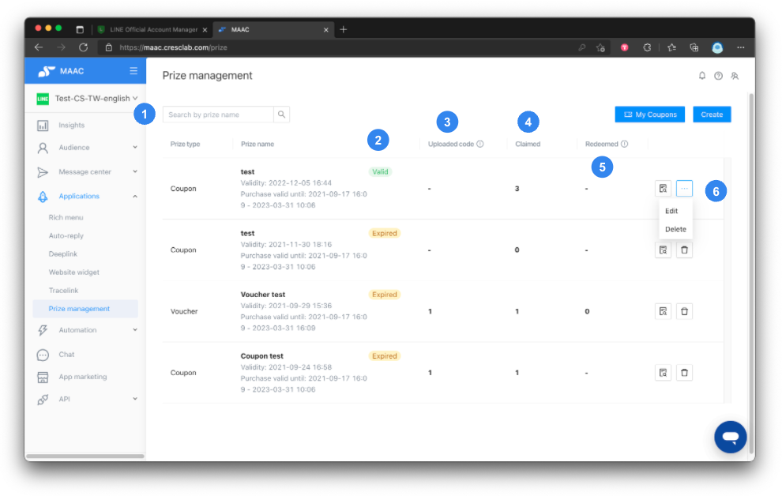
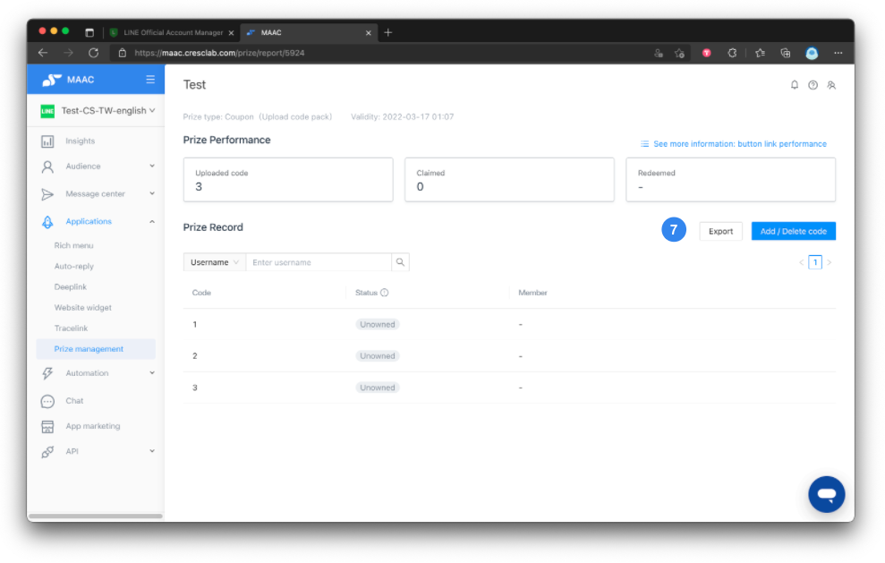
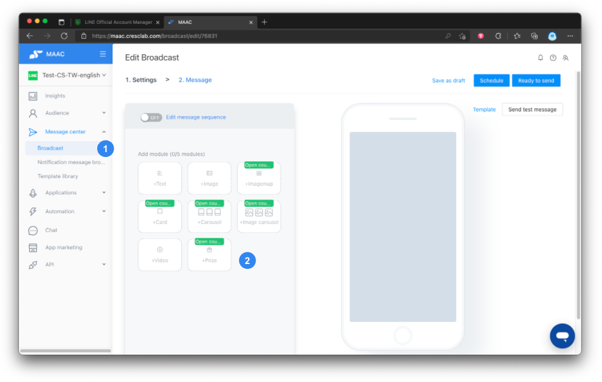

# Tutorials｜ Prize Management：Coupon、LINE Points、Vouchers、Game tixs、Brand Coupons – Crescendo Lab Help Center

* On MAAC, Prizes can be used to increase friends’ willingness towards interaction, enhance effective interaction between brands and consumers, and reduce the block rate.
* Customize the prize content (image, date, etc.), serial number, tag, and coupon button.
* With the MAAC editor, functions including broadcast, auto-reply, and customer journey can be used to distribute Prizes under various scenarios.

Review: [Tutorials｜My Coupons](https://crescendolab.zendesk.com/hc/en-us/articles/4414607323929)


If the Prize management is used with the “Rapid referral”, please separate the prize with the official and tested version of the “Rapid referral” to avoid inconsistencies in prize counts. You can set up to 10 claim/redeem tags for each prize.


## Plan Availability

MAAC Users to whom the new price structure applies from October 2021 can use coupons, LINE Points, vouchers, game tix, and brand coupons; if MAAC users are still under the old price structure, only coupons and LINE Points are applicable—other coupon types must be purchased separately.

## Types of Prize Management

* Coupon: Coupons can be used with most e-commerce brands. Coupon name, button name, and button image are customizable. You can tag friends who have claimed prizes.
* LINE Points: LINE Points can be used with all brands that have purchased points. Clicking on “redeem” will lead directly to the redemption page.
* Voucher: Vouchers can be used with offline physical stores and are similar to native LINE Vouchers. You will need store staff to click “redeem”; you can choose whether to generate a bar code to be scanned at the store.
* Game tixs: Requires an additional APP marketing module. You can select specific target audience groups to distribute Game tixs.
* Brand coupon: Brand coupon allows customizing text, images, etc. using the editor to create various custom contents.

## Setting

### Coupon



### Create and upload

You can view existing prizes on the prize management page. Click on the upper right corner to create a prize and upload new prize content.



### Code options

Selecting “coupon” as the prize allows you to upload a code pack or set a fixed code. If you opt for a code pack, codes will be assigned in sequence to each LINE friend.



### Validity and tagging

Set the prize validity date and tag; friends who have successfully claimed prizes will be automatically tagged.



### Customize appearance and rules

Set the button name, prize image, rule, etc.



### Button link and tracking

Set the button link (official website or e-commerce store). If you have the MAAC EC plan, you can set up UTM to track conversion performance.



### LINE Points



### Create prize

As with Coupons, create a prize and set prize name, validity, prize image, successful claim tag, and rule.



### Upload codes

You must upload the LINE Points codes. Clicking “click here to redeem” will jump straight to the LINE Points claim page.




Please purchase the text code format from LINE or an agent. Do not use the same code for promotions during different time periods to avoid repeat distributions and customer complaints.


### Vouchers



### Create prize

As with Coupons, create a prize and set prize name, validity, prize image, successful claim tag, and rule.



### Code options

You can upload a code pack or set a fixed code. If using a code pack, codes are assigned in sequence to each LINE friend.



### Barcode option

If you need to scan a barcode to redeem a prize, check “Display redeem button”. If no scan is required, do not check the box.



### Redeem verification

When redeeming, a manual verification button will appear. Communicate with store staff and be sure to click the redemption verification button.




Voucher formats currently supported by barcode — confirm POS scanner compatibility. Default is Code128. Supported formats:

* Code 39
* Code 128
* PZN
* EAN-13
* EAN-8
* JAN
* ISBN-13
* ISBN-10
* ISSN
* UPC-A

Character limit is 32 characters (use URL-safe characters). The MAAC system will not check for a check digit; it will work as long as POS scanners can read it.


### Game tixs

If you choose Game tixs as the prize, you can promote games after certain conditions are met via specific target audience promotion, filling out forms to play games, and completing member binding to play games.



### Create game interaction

Go to APP marketing > Game Interaction Features to create the game you want to connect.



### Create prize

As with Coupons, create a prize and set prize name, validity, prize image, successful claim tag, and rule.



### Combined play counts

If used with Game Interaction Features, total plays per friend = plays from Game tixs + plays from game interaction features. For example, if Game tixs allow 1 play and game interaction features allow 1 play, the user can play 2 times. To limit to 1 total play, set one of them to 0.




It is recommended not to use game coupons together with the game mechanism “draws daily”, to avoid friends starting the game from the game coupon after the game reset time and losing their originally gained number of plays. (MAAC does not provide a list of failed attempts.)


### Brand Coupons



### Create prize

As with Coupons, create a prize and set prize name, validity, prize image, successful claim tag, and rule.



### Edit message

Open “edit message” to set the prize as a string of text or images (e.g., distribute wallpapers and text as prizes or request users to reply with personal data).




This message is sent after followers click "Click to redeem" and will cost the money of one message.


## List and Performance



### Prize list overview

On the Prize management list, view status of different prizes: uploaded code, claimed number, and number of prizes redeemed. Use the search box to find prizes by name.



### Status display

To the right of the prize name shows the status of each prize (e.g., valid, expired).



### Uploaded codes

Uploaded code shows your prize code numbers. For a code pack, it shows how many codes you have; for a fixed code, a dash “-” is shown.



### Claimed numbers

The number of claimed numbers is how many prizes have been claimed by friends.



### Redeemed numbers

The number of redeemed numbers is how many prizes have been redeemed by friends.



### Actions and reports

Click the right edge of a prize to see two icons: click the right one to check the detailed report and export the list of the prize; click the left one to edit or delete the prize.



### Export and manage codes

Click the upper right “Export” button to export detailed information. If you used a code pack, you will see “Add / Delete code” to add new codes or delete existing codes.



 

### What is the “attributed” status?

The “attributed” status appears if prizes were distributed through “rapid referral” or “game interaction (5 types)” features. It means a follower has won a prize and the system has attributed the prize to that user, but the follower has not yet clicked the button to collect the prize. Prizes with “attributed” status are already assigned to a particular follower and it is not advisable to reuse them.

In reports:

* Claimed = Number of prizes claimed + Number of prizes redeemed
* Redeemed = Number of prizes redeemed


- Prize management list and overall performance data are updated every hour. Individual prize claim data is updated in real-time.
- If you opt for fixed codes, it is not possible to limit the number of codes. You can upload the same codes repeatedly via a CSV file when using an upload code pack.
  * Example: To upload 500 identical codes, list 500 entries in a CSV and upload.
- The system does not block duplicate prize codes on upload—confirm codes have not already been uploaded before uploading.
- Ensure sufficient number of prizes to avoid customer complaints. If there are no prizes left, the message “All prizes already have been claimed” will be shown.


## Setting - How to combine prizes and other features?



### Choose editor feature

In MAAC, select broadcast, auto-reply, customer journey, or other features with content editing functions.



### Insert prizes

Select “Prizes” under the message module of the editor. You can select a created prize from the list. Clicking “create a prize” will lead you to the Prize management page to create it.



## Related articles

* [Tutorials｜Game Interaction](https://crescendolab.zendesk.com/hc/en-us/related/click?data=BAh7CjobZGVzdGluYXRpb25fYXJ0aWNsZV9pZGwrCBlM0QcdBDoYcmVmZXJyZXJfYXJ0aWNsZV9pZGwrCBmFKXUDBDoLbG9jYWxlSSIKZW4tdXMGOgZFVDoIdXJsSSJAL2hjL2VuLXVzL2FydGljbGVzLzQ1MjI3MzE3MTk3MDUtVHV0b3JpYWxzLUdhbWUtSW50ZXJhY3Rpb24GOwhUOglyYW5raQY%3D--06848513bdd23b4c469849eaba00cbe976ddfae9)
* [Tutorials｜My Coupons](https://crescendolab.zendesk.com/hc/en-us/related/click?data=BAh7CjobZGVzdGluYXRpb25fYXJ0aWNsZV9pZGwrCBnzGdsDBDoYcmVmZXJyZXJfYXJ0aWNsZV9pZGwrCBmFKXUDBDoLbG9jYWxlSSIKZW4tdXMGOgZFVDoIdXJsSSI6L2hjL2VuLXVzL2FydGljbGVzLzQ0MTQ2MDczMjM5MjktVHV0b3JpYWxzLU15LUNvdXBvbnMGOwhUOglyYW5raQc%3D--f829c75b46277eca1db95efaee1d7c5490dc901d)
* [Tutorials｜MAAC x SurveyCake Form](https://crescendolab.zendesk.com/hc/en-us/related/click?data=BAh7CjobZGVzdGluYXRpb25fYXJ0aWNsZV9pZGwrCJkr5rYDBDoYcmVmZXJyZXJfYXJ0aWNsZV9pZGwrCBmFKXUDBDoLbG9jYWxlSSIKZW4tdXMGOgZFVDoIdXJsSSJGL2hjL2VuLXVzL2FydGljbGVzLzQ0MTM5OTk5NTA3NDUtVHV0b3JpYWxzLU1BQUMteC1TdXJ2ZXlDYWtlLUZvcm0GOwhUOglyYW5raQg%3D--759e20f1baca41b6573c35beb929d9766a5cb997)
* [Tutorials｜Reward Points](https://crescendolab.zendesk.com/hc/en-us/related/click?data=BAh7CjobZGVzdGluYXRpb25fYXJ0aWNsZV9pZGwrCBk8iZSxBToYcmVmZXJyZXJfYXJ0aWNsZV9pZGwrCBmFKXUDBDoLbG9jYWxlSSIKZW4tdXMGOgZFVDoIdXJsSSI9L2hjL2VuLXVzL2FydGljbGVzLzYyNjAyNTkzNzIwNTctVHV0b3JpYWxzLVJld2FyZC1Qb2ludHMGOwhUOglyYW5raQk%3D--1aeea6272d4f00d1f11ccb82a438a95fcb611f0e)
* [Tutorials｜CAAC Users](https://crescendolab.zendesk.com/hc/en-us/related/click?data=BAh7CjobZGVzdGluYXRpb25fYXJ0aWNsZV9pZGwrCJnaVfz6BjoYcmVmZXJyZXJfYXJ0aWNsZV9pZGwrCBmFKXUDBDoLbG9jYWxlSSIKZW4tdXMGOgZFVDoIdXJsSSI6L2hjL2VuLXVzL2FydGljbGVzLzc2NzUwNDUwNzU2MDktVHV0b3JpYWxzLUNBQUMtVXNlcnMGOwhUOglyYW5raQo%3D--041bce97b9b3655c0f806af51da1f76597e5f59d)
