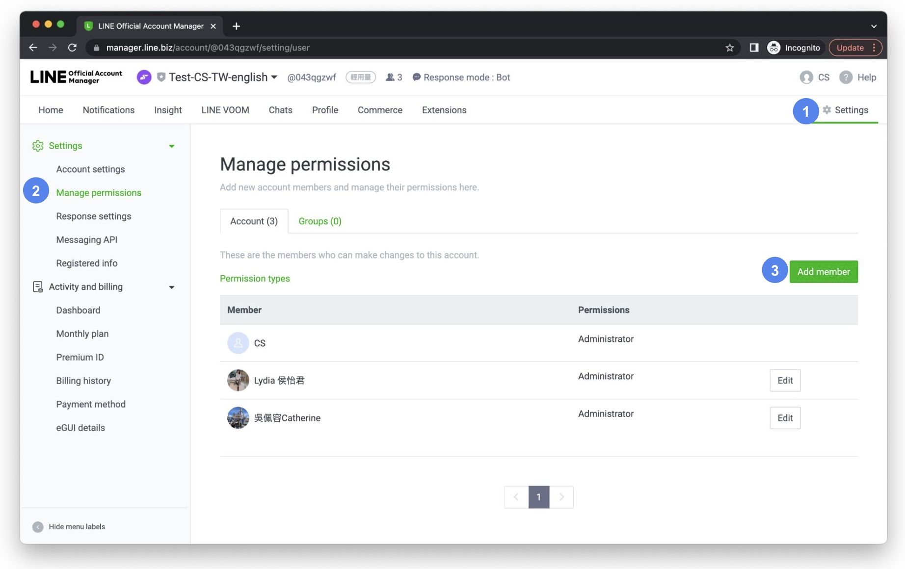
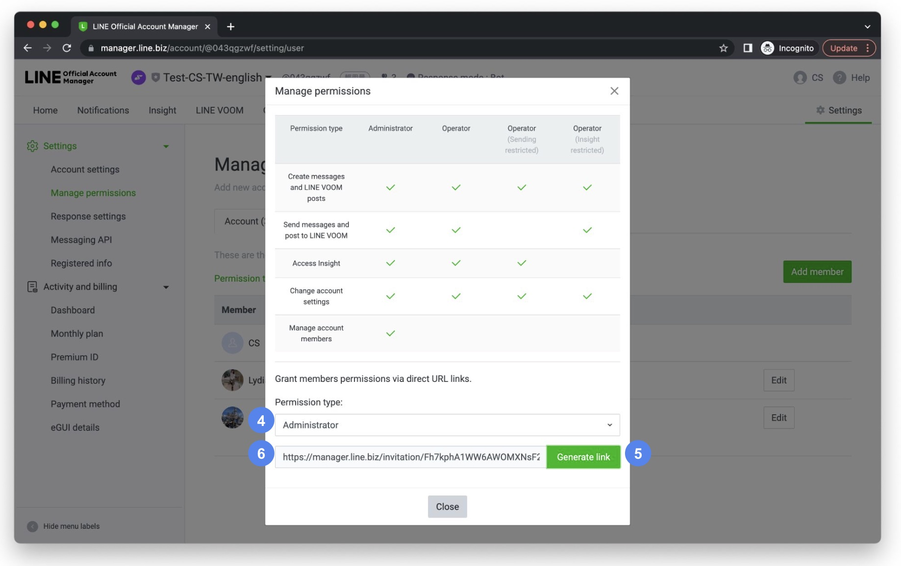
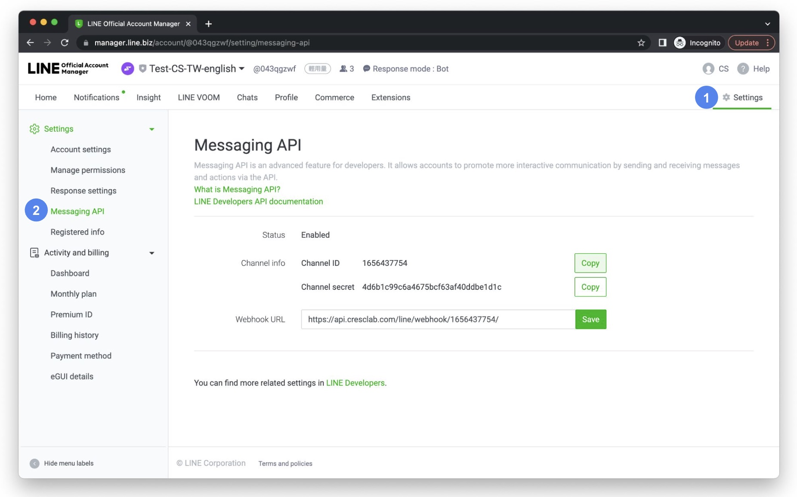
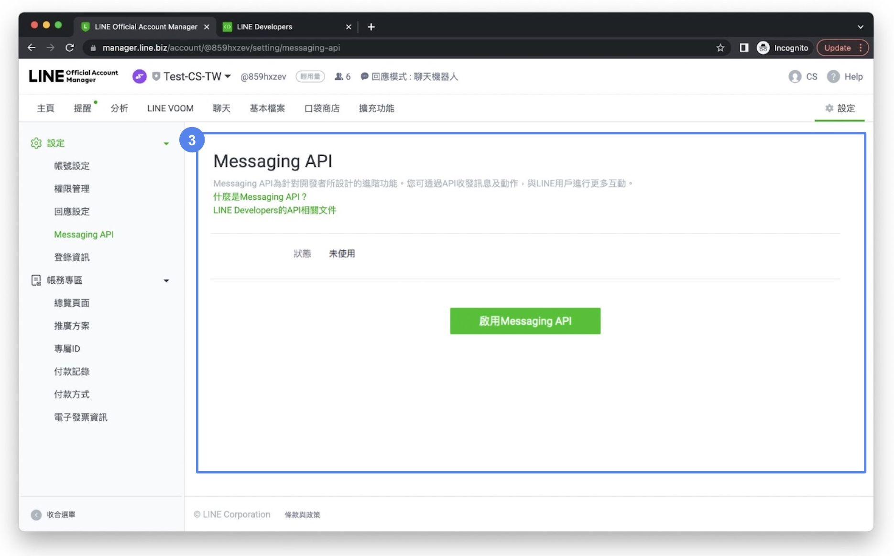
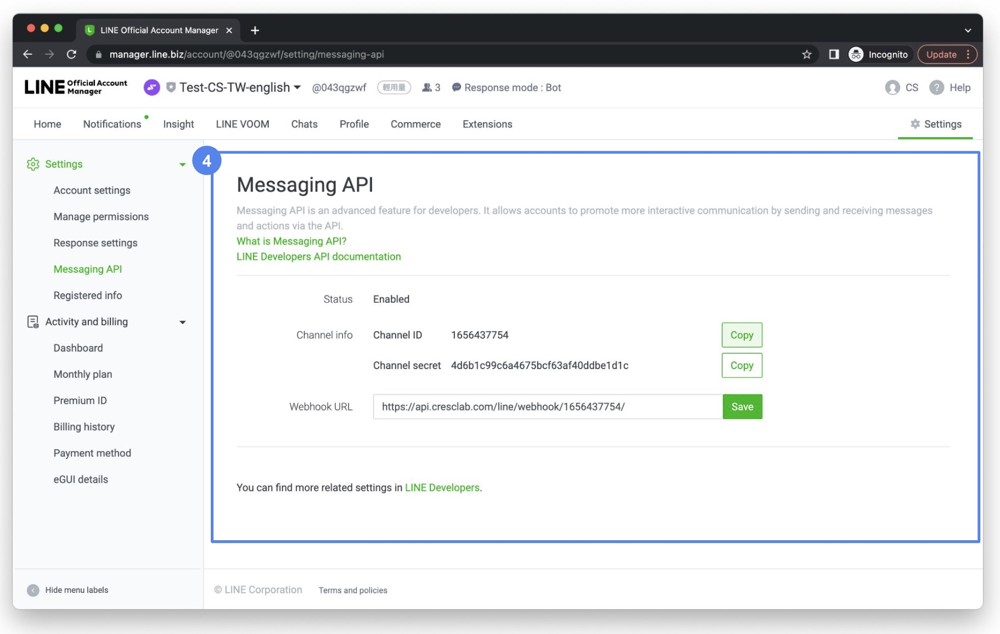
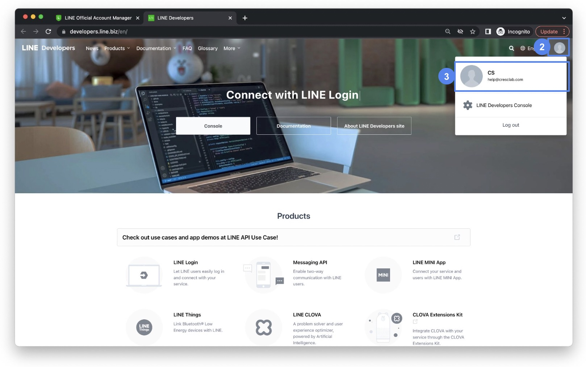
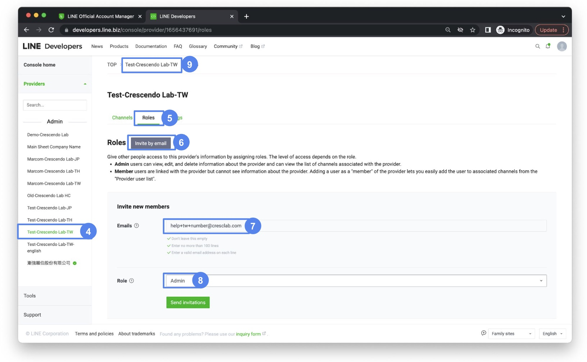
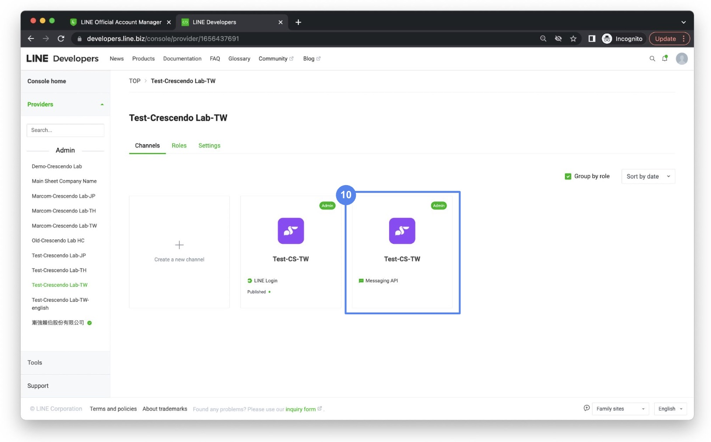
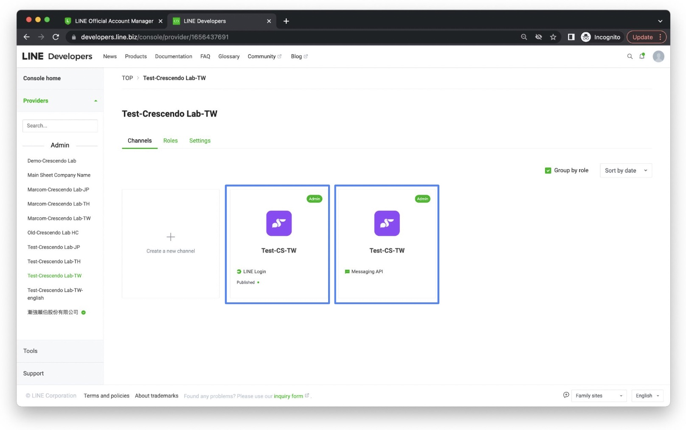
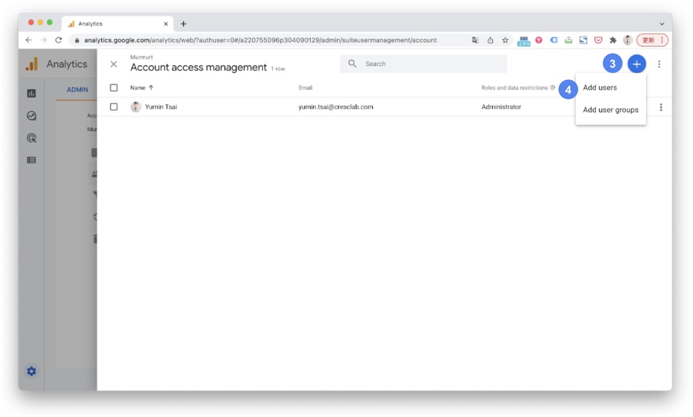

# How to share LINE OA platform, LINE Developers, GA(UA) / GA4 access to Crescendo Lab? – Crescendo Lab Help Center

#### Share LINE OA Platform Admin's permission - Setting steps

Login in [LINE CMS platform](https://manager.line.biz/)



### Step

Click “Setting”



### Step

Click “Manage permissions”



### Step

Click “Add member”




### Step

Permission type choose “Administrator”



### Step

Click “Generate link”



### Step

Copy the link and provide it to your CSM




***

#### Share LINE Developers Admin role

**What is LINE Developers and Providers?**

* LINE Developers:
  * LINE Developers is a technical console for managing LINE OA, which allows companies to set up various development resources related to LINE OA, such as settings for auto-push messages or authentication information required for new friends. LINE Developers is different from LINE OA platform (Official Account Manager), which is where companies can manage communication with friends directly.
* Provider:
  * Provider refers to an individual person or company that provides the service, such as their personal name or their company name. All providers are subject to LINE's terms of use and policies, so one provider should represent one company only (one taxID number).
* In the LINE Developers platform, a Provider cannot have multiple LINE OA that belongs to multiple companies (which belongs to different taxID number).
* In MAAC system, each friend has their own unique LINE User ID (UID). LINE UID are the same if under the same provider, brands can integrate those UID internally. On the contrary, LINE UID are different if under different provider, and the data cannot be used for internal integration.
* Example: If conglomerate A has 3 subsidiaries B, C, and D, which operate three restaurant brands X, Y, and Z. If conglomerate A wants to operate several LINE OA, conglomerate A can create many providers (Provider B, Provider C, and Provider D). Each provider manages their own restaurant brands (Provider B manages brand X's LINE OA; Provider C manages brand Y's LINE OA; Provider D manages brand Z's LINE OA). Gift Chumsong, a female friend, has different LINE UIDs in each LINE OA X, Y, and Z.

🚨 Attention

* Please make sure whether if you had set up a LINE Developers before. If your LINE OA has previously used a 3rd party API vendors' services, or if you have set up LINE login on your official website before, or if your company's other brand (LINE OA) have used the LINE API vendor services before, it means that your LINE Developers has been set up.
* If your LINE Developers already been set up, please refer to the "Setting steps" below to share the "Admin" roles to Crescendo Lab.
* If other brands under the same company already set up LINE Developers, but did not provide provider's admin role to Crescendo Lab, and given Crescendo Lab permission to create a new provider, the LINE UID that belongs to different provider will not able be integrated. (the action of creating new provider is irreversible)

***

#### How to check if LINE OA already set up LINE Developers before?

Login in [LINE CMS platform](https://manager.line.biz/)



### Step

Click “Setting”



### Step

Click “Messaging API”




### If you see the "Enable Messaging API" button

It means you have not yet enabled the Messaging API and did not created provider before. Please share your LINE OA platform's admin role to Crescendo Lab, your CSM will help to create Messaging API, provider, and other settings.




### If there is no "Enable Messaging API" button

It means your company has already enabled the Messaging API. In this case, there are only two ways to retrieve your provider's admin role:

* If you have previously used 3rd party API vendor for LINE OA marketing campaigns, you can contact the vendor to ask if they have LINE Developers's provider admin role, and share the admin role with Crescendo Lab.
* You need to find out the original creator who enabled the Messaging API, ask the original creator to provide the email address and password that they initially used to create Messaging API, and use the email address and password to login LINE OA platform, then enter LINE Developers and share the admin role with Crescendo Lab.




***

#### Share LINE Developers Admin role - Setting steps



### Step

Click “LINE Developers”




### Step

Click your personal user icon



### Step

Enter your account




### Step

Choose the provider that linked to the LINE OA



### Step

Click “Roles”



### Step

Click “Invite by email”



### Step

Enter the email address provided by CSM (e.g. help+tw+@cresclab.com, please refer to the email address that your CSM provided)



### Step

“Role” choose “Admin” → Send invitations to the above email address



### Step

Go back to the provider




### Step

Click “Messaging API Channel”




### Step

Share admin role (repeat step 5–8)

💡 Reminders: If LINE Developers already have **Messaging API channel** and a **LINE Login channel**, you need to share both channel's admin role to Crescendo Lab in order to complete MAAC integration smoothly.




***

#### Share Google Analytics view access - Setting Steps



### Step

Go to your [Google Analytics](https://analytics.google.com/analytics/) account, and click the “Admin” button



### Step

Click “Account Access Management”




### Step

Click the “+” button



### Step

Click “Add users”




### Step

Fill in the email that your CSM provided (e.g. [ga.auth4@cresclab.com](mailto:ga.auth@cresclab.com), please check with your CSM) and check “Notify new users by email.” Choose the standard role “Viewer” and click “Add.”




🚨 Attention (General)

1. If you only want to share data and performance from a specific Source for LINE, please refer to:
   * [Add a new view](https://support.google.com/analytics/answer/1009714?hl=th#zippy)
   * [Create and manage view filters](https://support.google.com/analytics/answer/1034823?hl=th#zippy=%2C%E6%9C%AC%E6%96%87%E5%85%A7%E5%AE%B9%2Cin-this-article%2C%E0%B8%9A%E0%B8%97%E0%B8%84%E0%B8%A7%E0%B8%B2%E0%B8%A1%E0%B8%99%E0%B8%9B%E0%B8%A3%E0%B8%B0%E0%B8%81%E0%B8%AD%E0%B8%9A%E0%B8%94%E0%B8%A7%E0%B8%A2)
2. If your plan includes E-commerce features, please make sure if you already install Enhanced Ecommerce in your Google analytics. Enhanced Ecommerce will be used for the feature "Retargeting" in the E-commerce Plan. For installation instructions, please refer to [Google's official guide](https://developers.google.com/analytics/devguides/collection/ua/gtm/enhanced-ecommerce).
3. Do not remove GA permissions for sharing to Crescendo Lab.

After you share the GA "View" permission, MAAC needs permission to successfully collect data and show the performance. Therefore, if permission of viewing GA is removed, which affects the report, Crescendo Lab will not assist in retrieving data.

🚨 Attention (UA / GA4 specifics)

1. Universal GA(UA) / GA4
   * Do not remove GA(UA) / GA4 permissions for sharing to Crescendo Lab. After you share the GA(UA) / GA4 "View" permission, MAAC needs permission to successfully collect data and show the performance. Therefore, if permission of viewing GA(UA) / GA4 is removed, which affects the report, Crescendo Lab will not assist in retrieving data.
2. Universal GA(UA)
   * If you only want to share data and performance from a specific Source for LINE, please refer to:
     * [Add a new view](https://support.google.com/analytics/answer/1009714?hl=th#zippy)
     * [Create and manage view filters](https://support.google.com/analytics/answer/1034823?hl=th#zippy=%2C%E6%9C%AC%E6%96%87%E5%85%A7%E5%AE%B9%2Cin-this-article%2C%E0%B8%9A%E0%B8%97%E0%B8%84%E0%B8%A7%E0%B8%B2%E0%B8%A1%E0%B8%99%E0%B8%9B%E0%B8%A3%E0%B8%B0%E0%B8%81%E0%B8%AD%E0%B8%9A%E0%B8%94%E0%B8%A7%E0%B8%A2)
   * If your plan includes E-commerce features, ensure Enhanced Ecommerce is installed. See [Google's official guide](https://developers.google.com/analytics/devguides/collection/ua/gtm/enhanced-ecommerce).
3. GA4
   * If your plan includes E-commerce features, ensure GA4 can track E-commerce related data. "Customer Journey - Buy products" data comes from the "Checkout" event; "Retargeting" data comes from "addToCarts".
   * GA4 is fully supported through MAAC starting from 2022 Q4, addressing the issue that Universal GA(UA) will no longer process new data from July 1, 2023. If you need to switch from Universal GA(UA) to GA4, please contact Customer Support or your CSM for setting.

***

### Related articles

* [Why Are the Pre-set Auto-reply and Rich Menu Not Working?](https://crescendolab.zendesk.com/hc/en-us/related/click?data=BAh7CjobZGVzdGluYXRpb25fYXJ0aWNsZV9pZGwrCJletogDBDoYcmVmZXJyZXJfYXJ0aWNsZV9pZGwrCJmp1FFgBzoLbG9jYWxlSSIKZW4tdXMGOgZFVDoIdXJsSSJeL2hjL2VuLXVzL2FydGljbGVzLzQ0MTMyMjUwNjYxMzctV2h5LUFyZS10aGUtUHJlLXNldC1BdXRvLXJlcGx5LWFuZC1SaWNoLU1lbnUtTm90LVdvcmtpbmcGOwhUOglyYW5raQY%3D--958b79472dfc34e2898e8eed84d01e0d1d3c413c)
* [What is an Access Token and What to Do When It Expires?](https://crescendolab.zendesk.com/hc/en-us/related/click?data=BAh7CjobZGVzdGluYXRpb25fYXJ0aWNsZV9pZGwrCBljCasDBDoYcmVmZXJyZXJfYXJ0aWNsZV9pZGwrCJmp1FFgBzoLbG9jYWxlSSIKZW4tdXMGOgZFVDoIdXJsSSJcL2hjL2VuLXVzL2FydGljbGVzLzQ0MTM4MDA5MzIxMjEtV2hhdC1pcy1hbi1BY2Nlc3MtVG9rZW4tYW5kLVdoYXQtdG8tRG8tV2hlbi1JdC1FeHBpcmVzBjsIVDoJcmFua2kH--46efdfdaa5bda54e4554383d2afaf8236df519b6)
* [Tutorials｜ MAAC x SurveyCake Form](https://crescendolab.zendesk.com/hc/en-us/related/click?data=BAh7CjobZGVzdGluYXRpb25fYXJ0aWNsZV9pZGwrCJkr5rYDBDoYcmVmZXJyZXJfYXJ0aWNsZV9pZGwrCJmp1FFgBzoLbG9jYWxlSSIKZW4tdXMGOgZFVDoIdXJsSSJGL2hjL2VuLXVzL2FydGljbGVzLzQ0MTM5OTk5NTA3NDUtVHV0b3JpYWxzLU1BQUMteC1TdXJ2ZXlDYWtlLUZvcm0GOwhUOglyYW5raQg%3D--3e98897312dc7a25bf8487dc3cda62f7bd2163e1)
* [Tutorials｜CAAC Users](https://crescendolab.zendesk.com/hc/en-us/related/click?data=BAh7CjobZGVzdGluYXRpb25fYXJ0aWNsZV9pZGwrCJnaVfz6BjoYcmVmZXJyZXJfYXJ0aWNsZV9pZGwrCJmp1FFgBzoLbG9jYWxlSSIKZW4tdXMGOgZFVDoIdXJsSSI6L2hjL2VuLXVzL2FydGljbGVzLzc2NzUwNDUwNzU2MDktVHV0b3JpYWxzLUNBQUMtVXNlcnMGOwhUOglyYW5raQk%3D--7a49eec92cddfd738e351daabe54163295e369a9)
* [Tutorials｜Game Interaction](https://crescendolab.zendesk.com/hc/en-us/related/click?data=BAh7CjobZGVzdGluYXRpb25fYXJ0aWNsZV9pZGwrCBlM0QcdBDoYcmVmZXJyZXJfYXJ0aWNsZV9pZGwrCJmp1FFgBzoLbG9jYWxlSSIKZW4tdXMGOgZFVDoIdXJsSSJAL2hjL2VuLXVzL2FydGljbGVzLzQ1MjI3MzE3MTk3MDUtVHV0b3JpYWxzLUdhbWUtSW50ZXJhY3Rpb24GOwhUOglyYW5raQo%3D--0fbcc7aea417e9cca45550f4903f79855e37926e)
