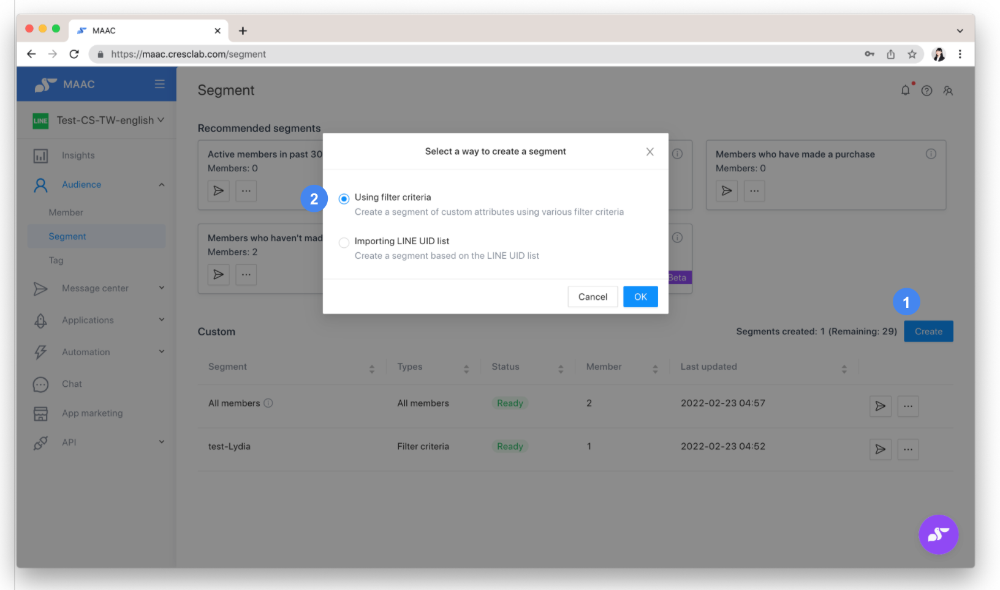
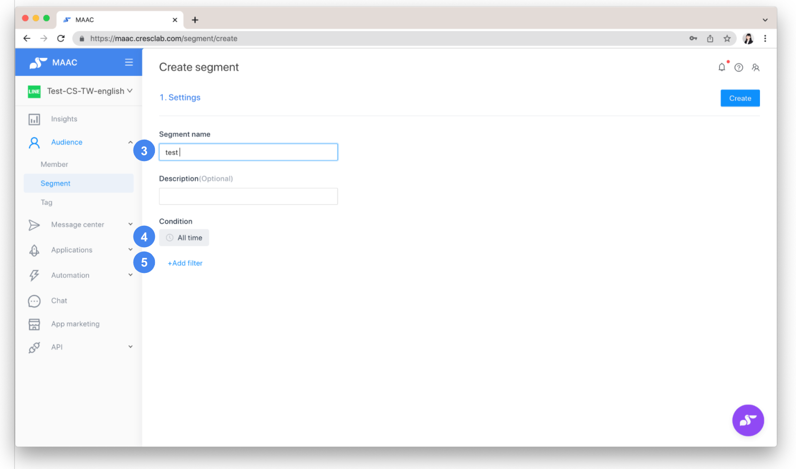
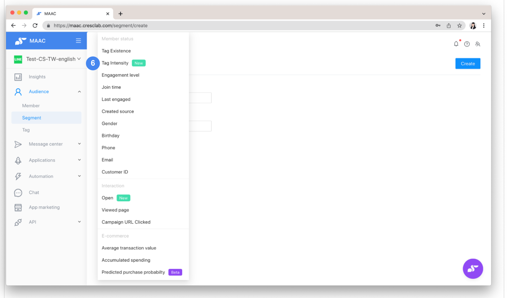
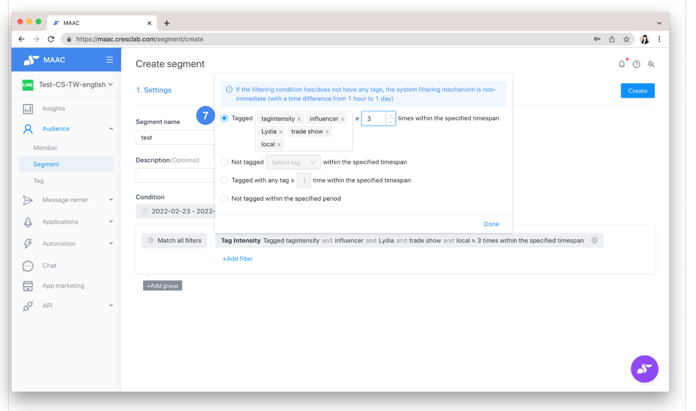

# Tutorials｜New Tag System : Tag Intensity and Timespans – Crescendo Lab Help Center

* Asides from whether or not to have specific "Tag Existence", you can now obtain "Tag Intensity" and a specified timespan from friends as well. By filtering Tag Intensity in a custom timespan, you can better understand friends' preferences and increase the accuracy of Audience Segments.
* Can filter by "Times" of friends with specific tags / any tag.
* Compatible with "Match all filters" (AND) and "Match any filter" (OR).

**▶︎ Setting Steps**


Attentions： Tag Intensity data in a specified timespan started rolling out and accumulating on MAAC from Feb. 22, 2022. Tag data collected before Feb 22 would not be applied with intensity in filter results. (Because tags are real-time logs on MAAC, past data cannot be backfilled.)




### Create a Segment

Click "Create" on the upper right side of the Segment.



### Choose method

Choose "Using filter criteria" if you want to create a Segment by Tag Intensity.




### Name the Segment

Enter Segment name and Description (Optional).



### Specify timespan

Please specify your "Custom timespan" if you want to filter within a specific time period instead of "All time".


Reminder： Maximum "Custom timespan" is 1 year (365 days).

Example: from 2022.02.22 - 2023.02.21




### Add filter

Click "Add filter".




### Select Tag Intensity

Click "Tag Intensity".




### Configure Tag Intensity filter

Filter by whether or not friends have specific tags / any tag, and the times you want.


Attention： You can only filter up to 10 Intensity Tags in one group.

Times you want should be a natural number.





**Notes and reminders**


* The difference between "Tag Existence" and "Tag Intensity" is that the former does not offer a filter by timespan and intensity, while the latter does.
* When you use Member > Import Member Data, as long as there is data in the friend tag field in the import file, a new Tag Intensity record will be added when the import completes.
* When a tag is removed manually or automatically removed from a friend due to the tag’s "Duration" setting, it will not affect the "Tag Intensity" filter. Past records can still be filtered by “Tag Intensity”. The removal action only affects the filtering of "Tag".


Examples of typical questions

Q: Why is the number of tagged and untagged friends within 90 days of using "Tag Intensity" less than the total number of friends?

A: Friends who have been tagged within a specified period will be counted. The group of friends who have not been tagged for 90 days may still have tags on them, but those tags have not been triggered within this period, so they won't be counted.

**Review**

* How to set "Tag"? Please refer to " [Tutorials｜Tag](https://crescendolab.zendesk.com/hc/zh-tw/articles/4413224246937-%E6%95%99%E5%AD%B8-%E6%A8%99%E7%B1%A4)"
* How to create a Segment by using filter criteria? Please refer to "[Tutorials｜Segment](https://crescendolab.zendesk.com/hc/zh-tw/articles/4413222974233-%E6%95%99%E5%AD%B8-%E5%88%86%E7%9C%BE)"

**Related articles**

* [Tutorial | Tag Management (Create, Delete, Export)](https://crescendolab.zendesk.com/hc/en-us/related/click?data=BAh7CjobZGVzdGluYXRpb25fYXJ0aWNsZV9pZGwrCJneqYgDBDoYcmVmZXJyZXJfYXJ0aWNsZV9pZGwrCBk01%2F8FBDoLbG9jYWxlSSIKZW4tdXMGOgZFVDoIdXJsSSJSL2hjL2VuLXVzL2FydGljbGVzLzQ0MTMyMjQyNDY5MzctVHV0b3JpYWwtVGFnLU1hbmFnZW1lbnQtQ3JlYXRlLURlbGV0ZS1FeHBvcnQGOwhUOglyYW5raQY%3D--3ab6d470f72cbf5ff7389be12f5d146a11805772)
* [Tutorials｜ MAAC x SurveyCake Form](https://crescendolab.zendesk.com/hc/en-us/related/click?data=BAh7CjobZGVzdGluYXRpb25fYXJ0aWNsZV9pZGwrCJkr5rYDBDoYcmVmZXJyZXJfYXJ0aWNsZV9pZGwrCBk01%2F8FBDoLbG9jYWxlSSIKZW4tdXMGOgZFVDoIdXJsSSJGL2hjL2VuLXVzL2FydGljbGVzLzQ0MTM5OTk5NTA3NDUtVHV0b3JpYWxzLU1BQUMteC1TdXJ2ZXlDYWtlLUZvcm0GOwhUOglyYW5raQc%3D--b0962c07955cb03320aa8967b25a6f7eb6d55db8)
* [Tutorials｜MAAC Contacts](https://crescendolab.zendesk.com/hc/en-us/related/click?data=BAh7CjobZGVzdGluYXRpb25fYXJ0aWNsZV9pZGwrCJmIGIkDBDoYcmVmZXJyZXJfYXJ0aWNsZV9pZGwrCBk01%2F8FBDoLbG9jYWxlSSIKZW4tdXMGOgZFVDoIdXJsSSI9L2hjL2VuLXVzL2FydGljbGVzLzQ0MTMyMzE0OTk0MTctVHV0b3JpYWxzLU1BQUMtQ29udGFjdHMGOwhUOglyYW5raQg%3D--e6c44c4b1642872db836088fccd04e1114ac2b19)
* [Tutorials | Deeplink](https://crescendolab.zendesk.com/hc/en-us/related/click?data=BAh7CjobZGVzdGluYXRpb25fYXJ0aWNsZV9pZGwrCJnloYgDBDoYcmVmZXJyZXJfYXJ0aWNsZV9pZGwrCBk01%2F8FBDoLbG9jYWxlSSIKZW4tdXMGOgZFVDoIdXJsSSI4L2hjL2VuLXVzL2FydGljbGVzLzQ0MTMyMjM3MjQ0NDEtVHV0b3JpYWxzLURlZXBsaW5rBjsIVDoJcmFua2kJ--16acc51b25a74a514c6aa4e73278535b525f3bce)
* [How to share LINE OA platform, LINE Developers, GA(UA) / GA4 access to Crescendo Lab?](https://crescendolab.zendesk.com/hc/en-us/related/click?data=BAh7CjobZGVzdGluYXRpb25fYXJ0aWNsZV9pZGwrCJmp1FFgBzoYcmVmZXJyZXJfYXJ0aWNsZV9pZGwrCBk01%2F8FBDoLbG9jYWxlSSIKZW4tdXMGOgZFVDoIdXJsSSJ1L2hjL2VuLXVzL2FydGljbGVzLzgxMTAyNzExNDYzOTMtSG93LXRvLXNoYXJlLUxJTkUtT0EtcGxhdGZvcm0tTElORS1EZXZlbG9wZXJzLUdBLVVBLUdBNC1hY2Nlc3MtdG8tQ3Jlc2NlbmRvLUxhYgY7CFQ6CXJhbmtpCg%3D%3D--25c01f92c36aa0a768ae446287348bca28a7cfed)
