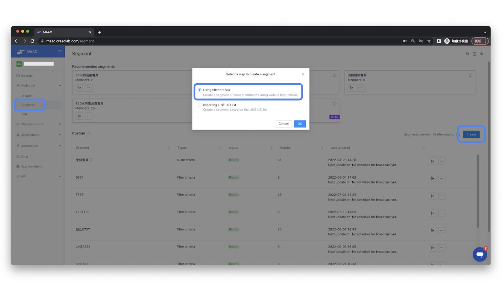
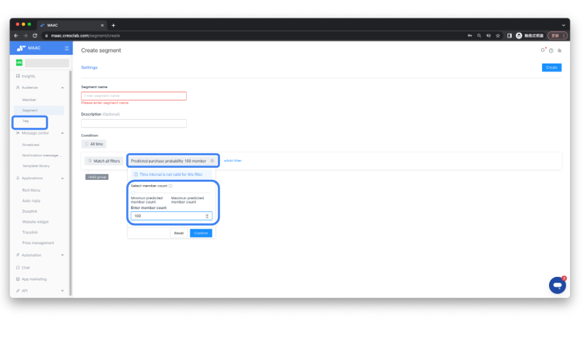
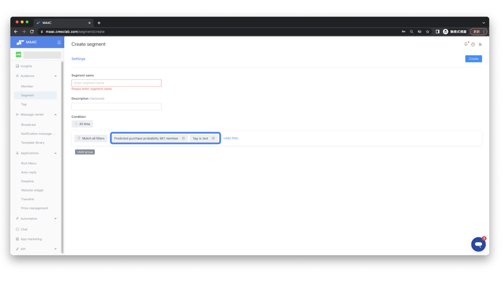
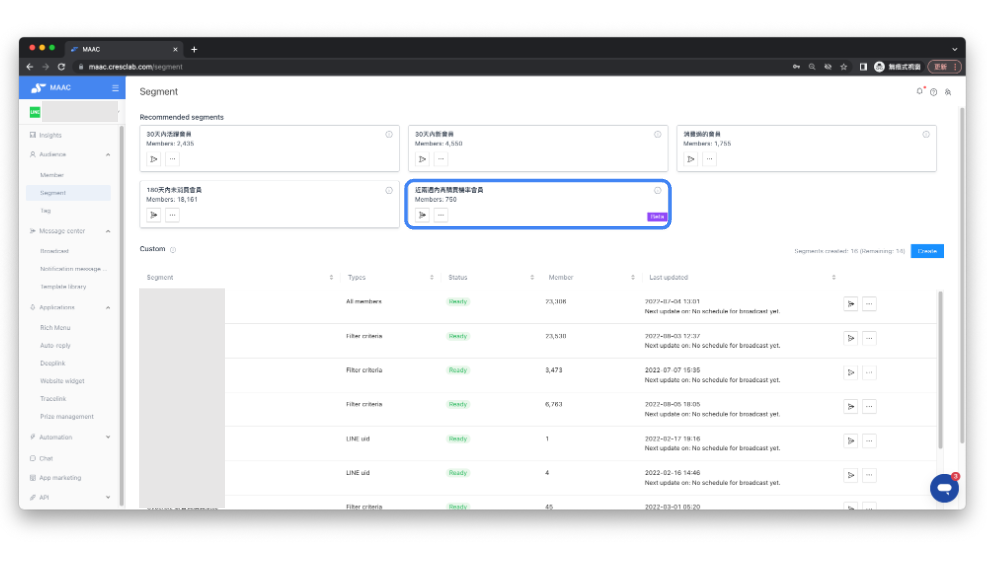

# Tutorials｜Predicted purchase probability – Crescendo Lab Help Center

#### ▶︎ What is "Predicted purchase probability"?

Based on users' historical behavior data, we predict the top N potential users in the next two weeks to build a new segment of high potential users and increase the brand's e-commerce ROI.

#### ▶︎ Value of "Predicted purchase probability"

* Painless Smart Marketing: Use AI technical analysis to analyze friend history data. By combining the characteristics of all spending behaviors in LINE accounts, we can directly predict the most likely spending segments.
* Digital Transformation Assistance: In the case of using Predicted purchase probability, brands can directly use diversified data, which not only saves time but also the manpower to analyze the data by themselves.
* Highly Flexible Cumulative: Brands can filter their friends more freely by directly assigning the top N number of friends and selecting the most potential buyers to keep track of the number of people reached.

#### ▶︎ "Predicted purchase probability" Forecasting Model

* Based on historical data, the top N users with > 50% purchase rate in the next two weeks.
* The user behaviors be included in the analysis



### Analysis targets

* GA Add to cart (default)
* GA Checking Revenue



### Data of GA(UA) / GA4

* page\_views
* views\_per\_session
* entrances
* avg\_time\_on\_page
* adds\_to\_cart
* item\_revenue
* checkouts
* list\_clicks
* list\_views

🚨 Attention： GA4 will not include entrance values



### Data of MAAC

* open count

🚨 Attention： If there is no "Add to Cart" or "Checking Revenue" indicator for GA(UA) / GA4, or if the GA(UA) / GA4 data volume is less than 14 days or less than 1,000 unduplicated visits, the calculated number of predicted purchasers will be 0.



#### ▶︎ MAAC system settings

You can choose the number of people you want to create, or create a new segment with different filters (e.g. tag, open, etc.)



### Create a segment

Go to Audience > Segment > Create a segment




### Choose Predicted purchase probability

You can choose "Predicted purchase probability" after clicking "Using filter criteria".



### Select predicted members

You can use the mouse to move the slider to choose the predicted member, which will directly display the corresponding number of people.



### Enter number directly

You can also fill in the box directly with the number of the predicted member that you want to send.




### Recommended: use tags

It is also recommended to use with "tag" to filter out those who are interested in specific products and have the potential to buy them.





* The lower the number of selections, the segment will be concentrated on more "high potential purchase" friends.
* The higher the number of selections, the "lower potential purchase" friends will be counted as part of the segment.
* When the slider is moved to the far right, although the number of friends is the largest, it also contains some "users with less than 30% purchase potential", so it is recommended to reduce the number of people.
* Adjustment of the time interval is not valid for the Predicted purchase probability condition.


**➤ Automatic generation of “Recommended segments”**

The MAAC system automatically generates a segment of "high potential purchaser in the last two weeks”. Brands can send product purchase information to friends with high purchase rates within two weeks as predicted by the AI. Brands also can select this segment when setting up the broadcast.

This segment is a filtered list of those with >50% purchase probability in the Predicted purchase probability

#### ▶︎ What is the difference between “Predicted purchase probability” and the "Engagement Level" in the MAAC?

* Engagement Level:

Based on historical data, we analyzed the level of interaction between users and LINE's official account, official website, and shopping level into 5 levels (or 3 levels). It is recommended to send broadcasts with different management strategies according to different levels of interaction and activity.

🔑Reference： What is the "Engagement level" in Insights? (TH article) https://crescendolab.zendesk.com/hc/th/articles/4413225115545-%E0%B8%A7%E0%B8%B4%E0%B9%80%E0%B8%84%E0%B8%A3%E0%B8%B2%E0%B8%B0%E0%B8%AB-%E0%B8%81%E0%B8%B2%E0%B8%A3%E0%B8%A1%E0%B8%B5%E0%B8%9B%E0%B8%8F%E0%B8%B4%E0%B8%AA%E0%B8%B1%E0%B8%A1%E0%B8%9E%E0%B8%B1%E0%B8%99%E0%B8%98-%E0%B8%81%E0%B8%B1%E0%B8%9A%E0%B9%80%E0%B8%9E%E0%B8%B7-%E0%B8%AD%E0%B8%99%E0%B9%83%E0%B8%99%E0%B8%82-%E0%B8%AD%E0%B8%A1%E0%B8%B9%E0%B8%A5%E0%B9%80%E0%B8%8A%E0%B8%B4%E0%B8%87%E0%B8%A5%E0%B8%B6%E0%B8%81%E0%B8%AB%E0%B8%A1%E0%B8%B2%E0%B8%A2%E0%B8%96%E0%B8%B6%E0%B8%87%E0%B8%AD%E0%B8%B0%E0%B9%84%E0%B8%A3-

* Predicted purchase probability:

Based on historical data, analyze and predict the top N users with >50% purchase rate in the next two weeks. It is recommended to target this segment with the latest promotion/product purchase information to encourage friends to shop and checkout.

### Related articles

* FAQ｜How Are Contact Engagement Metrics Defined in Data Insight? https://crescendolab.zendesk.com/hc/en-us/related/click?data=BAh7CjobZGVzdGluYXRpb25fYXJ0aWNsZV9pZGwrCJkft4gDBDoYcmVmZXJyZXJfYXJ0aWNsZV9pZGwrCBngutoDBDoLbG9jYWxlSSIKZW4tdXMGOgZFVDoIdXJsSSJkL2hjL2VuLXVzL2FydGljbGVzLzQ0MTMyMjUxMTU1NDUtRkFRLUhvdy1BcmUtQ29udGFjdC1FbmdhZ2VtZW50LU1ldHJpY3MtRGVmaW5lZC1pbi1EYXRhLUluc2lnaHQGOwhUOglyYW5raQY%3D--114a17f05b35c4b1082c2cf9c4d9f998a112d6c7
* Tutorial｜Segment https://crescendolab.zendesk.com/hc/en-us/related/click?data=BAh7CjobZGVzdGluYXRpb25fYXJ0aWNsZV9pZGwrCBlzlogDBDoYcmVmZXJyZXJfYXJ0aWNsZV9pZGwrCBngutoDBDoLbG9jYWxlSSIKZW4tdXMGOgZFVDoIdXJsSSI2L2hjL2VuLXVzL2FydGljbGVzLzQ0MTMyMjI5NzQyMzMtVHV0b3JpYWwtU2VnbWVudAY7CFQ6CXJhbmtpBw%3D%3D--6f12b073cf09d5f0897ae065a913cadae1b0968c
* Tutorials｜LINE Broadcast https://crescendolab.zendesk.com/hc/en-us/related/click?data=BAh7CjobZGVzdGluYXRpb25fYXJ0aWNsZV9pZGwrCBmdF4kDBDoYcmVmZXJyZXJfYXJ0aWNsZV9pZGwrCBngutoDBDoLbG9jYWxlSSIKZW4tdXMGOgZFVDoIdXJsSSI%2BL2hjL2VuLXVzL2FydGljbGVzLzQ0MTMyMzE0MzkxMjktVHV0b3JpYWxzLUxJTkUtQnJvYWRjYXN0BjsIVDoJcmFua2kI--a5504ef774829237c9a7db7c674f1a5438913d2b
* Tutorials｜DPM（ EC plan ） https://crescendolab.zendesk.com/hc/en-us/related/click?data=BAh7CjobZGVzdGluYXRpb25fYXJ0aWNsZV9pZGwrCBkKqYgDBDoYcmVmZXJyZXJfYXJ0aWNsZV9pZGwrCBngutoDBDoLbG9jYWxlSSIKZW4tdXMGOgZFVDoIdXJsSSI7L2hjL2VuLXVzL2FydGljbGVzLzQ0MTMyMjQxOTI1MzctVHV0b3JpYWxzLURQTS1FQy1wbGFuBjsIVDoJcmFua2kJ--0dbecacf91d9181be77d067288ed188cf5cf11ad
* Tutorials｜New Tag System : Tag Intensity and Timespans https://crescendolab.zendesk.com/hc/en-us/related/click?data=BAh7CjobZGVzdGluYXRpb25fYXJ0aWNsZV9pZGwrCBk01%2F8FBDoYcmVmZXJyZXJfYXJ0aWNsZV9pZGwrCBngutoDBDoLbG9jYWxlSSIKZW4tdXMGOgZFVDoIdXJsSSJaL2hjL2VuLXVzL2FydGljbGVzLzQ0MjM4MTM2NDEyNDEtVHV0b3JpYWxzLU5ldy1UYWctU3lzdGVtLVRhZy1JbnRlbnNpdHktYW5kLVRpbWVzcGFucwY7CFQ6CXJhbmtpCg%3D%3D--a401cba43adedf0e709a5a6035e4b2b2c7b09fb4
