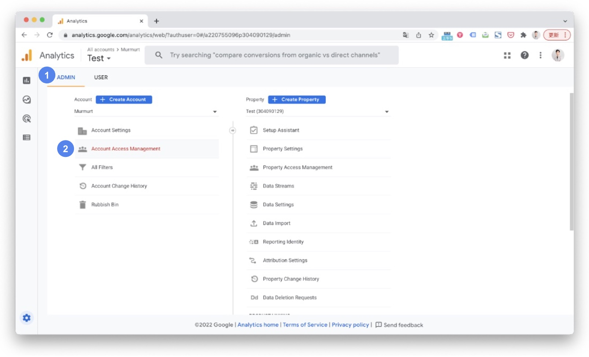
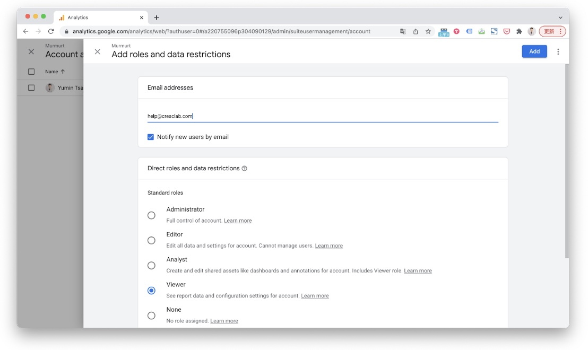

# How to share GA4 access and Product feed with Crescendo Lab to enable EC plan? – Crescendo Lab Help Center

### We need what access to enable EC plan?

* GA4's view access
* Product feed's file or URL

#### Share Google Analytics view access - Setting Steps



### Go to Google Analytics Admin

Go to your [Google Analytics](https://analytics.google.com/analytics/) account, and click the “Admin” button.



### Account Access Management

Click “Account Access Management”.




### Add users

Click the “+” button, then click “Add users”.




### Enter Crescendo Lab email

Fill in the email that your CSM provided (e.g. [ga.auth4@cresclab.com](mailto:ga.auth@cresclab.com), please check with your CSM) and check “Notify new users by email.” Choose the standard role “Viewer” and click “Add.”





Attention:

* GA4
  * Do not remove GA4 permissions shared with Crescendo Lab. After you share the GA4 "View" permission, MAAC needs permission to successfully collect data and show the performance. If viewing permission is removed, it affects the report and Crescendo Lab will not assist in retrieving data.
  * If your plan includes E-commerce features, ensure GA4 can track e-commerce related data. "Customer Journey - Buy products" data comes from the "checkout" event; "Retargeting" data comes from "addToCarts".
* GA4 is fully supported through MAAC starting from 2022 Q4, addressing the end of Universal GA (UA) processing new data as of July 1, 2023. If you need to switch from Universal GA(UA) to GA4, contact Customer Support or your CSM for assistance.


#### Product feed

Please refer to the article '[Tutorials | How to Upload Product Feed Data?](https://crescendolab.zendesk.com/hc/en-us/articles/53225683292057-Tutorials-How-to-Upload-Product-Feed-Data)' for more information about product feed setup.

### Related articles

* [Tutorials｜DPM（ EC plan ）](https://crescendolab.zendesk.com/hc/en-us/related/click?data=BAh7CjobZGVzdGluYXRpb25fYXJ0aWNsZV9pZGwrCBkKqYgDBDoYcmVmZXJyZXJfYXJ0aWNsZV9pZGwrCBlDGXN0FDoLbG9jYWxlSSIKZW4tdXMGOgZFVDoIdXJsSSI7L2hjL2VuLXVzL2FydGljbGVzLzQ0MTMyMjQxOTI1MzctVHV0b3JpYWxzLURQTS1FQy1wbGFuBjsIVDoJcmFua2kG--e738e97bae8c0b10760d1b92ef847362b803719f)
* \[How to share LINE OA platform, LINE Developers, GA(UA) / GA4 access to Crescendo Lab?]\(https://crescendolab.zendesk.com/hc/en-us/related/click?data=BAh7CjobZGVzdGluYXRpb25fYXJ0aWNsZV9pZGwrCJmp1FFgBzoYcmVmZXJyZXJfYXJ0aWNsZV9pZGwrCBlDGXN0FDoLbG9jYWxlSSIKZW4tdXMGOgZFVDoIdXJsSSJ1L2hjL2VuLXVzL2FydGljbGVzLzgxMTAyNzExNDYzOTMtSG93LXRvLXNoYXJlLUxJTkUtT0EtcGxhdGZvcm0tTElORS1EZXZlbG9wZXJzLUdBLVVBLUdBNC1hY2Nlc3MtdG8tQ3Jl c2NlbmRvLUxhYgY7CFQ6CXJhbmtpBw%3D%3D--1b3b3ca45a19435817c84b1b7b8bf7afd8c95881)
* [Tutorials｜Game Interaction](https://crescendolab.zendesk.com/hc/en-us/related/click?data=BAh7CjobZGVzdGluYXRpb25fYXJ0aWNsZV9pZGwrCBlM0QcdBDoYcmVmZXJyZXJfYXJ0aWNsZV9pZGwrCBlDGXN0FDoLbG9jYWxlSSIKZW4tdXMGOgZFVDoIdXJsSSJAL2hjL2VuLXVzL2FydGljbGVzLzQ1MjI3MzE3MTk3MDUtVHV0b3JpYWxzLUVhbWUtSW50ZXJhY3Rpb24GOwhUOglyYW5raQg%3D--2567f634d330ea171a7f4f654e8d9c3d40ac54eb)
* [Feature Description｜MAAC Contact Import and Update](https://crescendolab.zendesk.com/hc/en-us/related/click?data=BAh7CjobZGVzdGluYXRpb25fYXJ0aWNsZV9pZGwrCBnqhYkDBDoYcmVmZXJyZXJfYXJ0aWNsZV9pZGwrCBlDGXN0FDoLbG9jYWxlSSIKZW4tdXMGOgZFVDoIdXJsSSJYL2hjL2VuLXVzL2FydGljbGVzLzQ0MTMyMzg2Njc4MDEtRmVhdHVyZS1EZXNjcmlwdGlvbi1NQUFDLUNvbnRhY3QtSW1wb3J0LWFuZC1VcGRhdGUGOwhUOglyYW5raQk%3D--f370d08c460f9cd8c76c11bd469c4307a76034a4)
* [Tutorials｜CAAC Users](https://crescendolab.zendesk.com/hc/en-us/related/click?data=BAh7CjobZGVzdGluYXRpb25fYXJ0aWNsZV9pZGwrCJnaVfz6BjoYcmVmZXJyZXJfYXJ0aWNsZV9pZGwrCBlDGXN0FDoLbG9jYWxlSSIKZW4tdXMGOgZFVDoIdXJsSSI6L2hjL2VuLXVzL2FydGljbGVzLzc2NzUwNDUwNzU2MDktVHV0b3JpYWxzLUNBQUMtVXNlcnMGOwhUOglyYW5raQo%3D--51537c12a2aa5782c12a2a464f45b16f6d328923)
