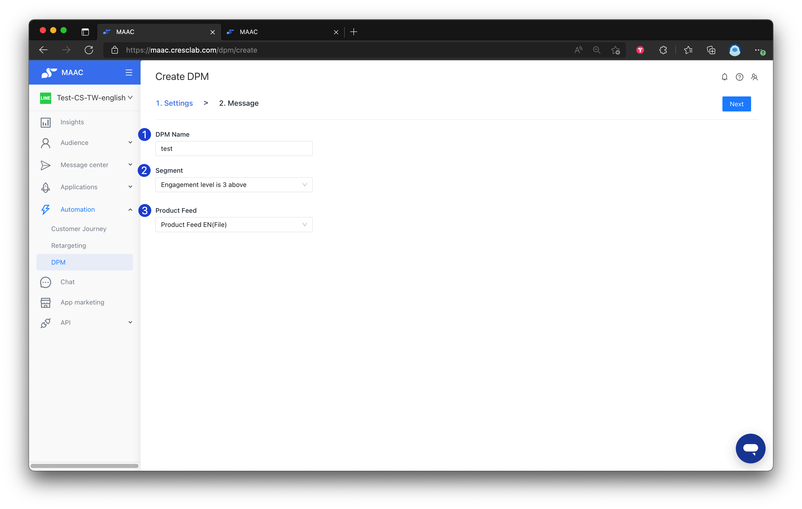
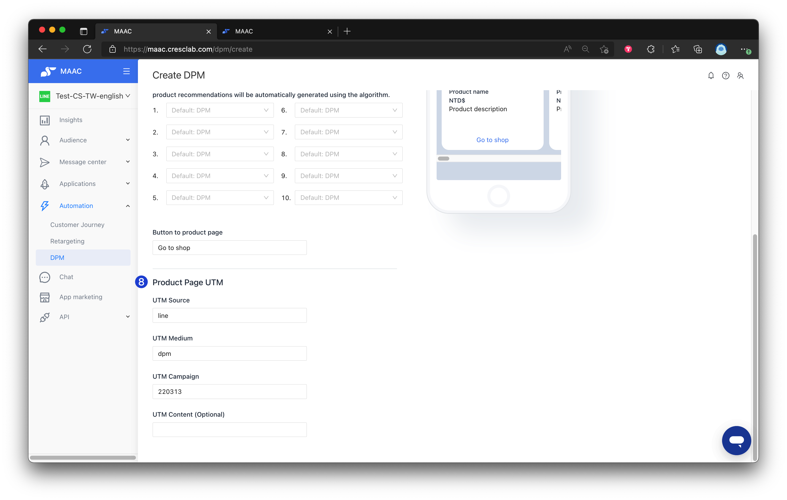
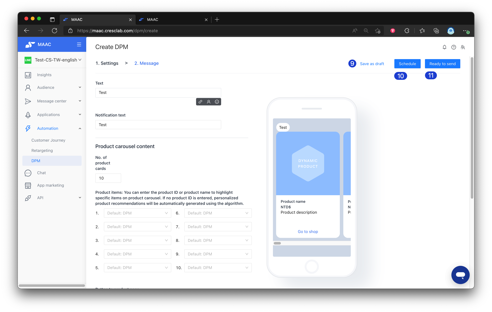
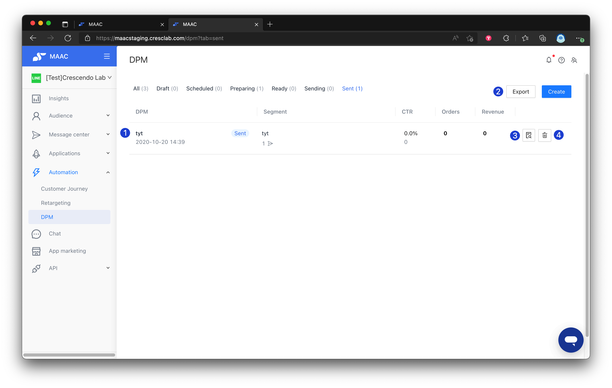
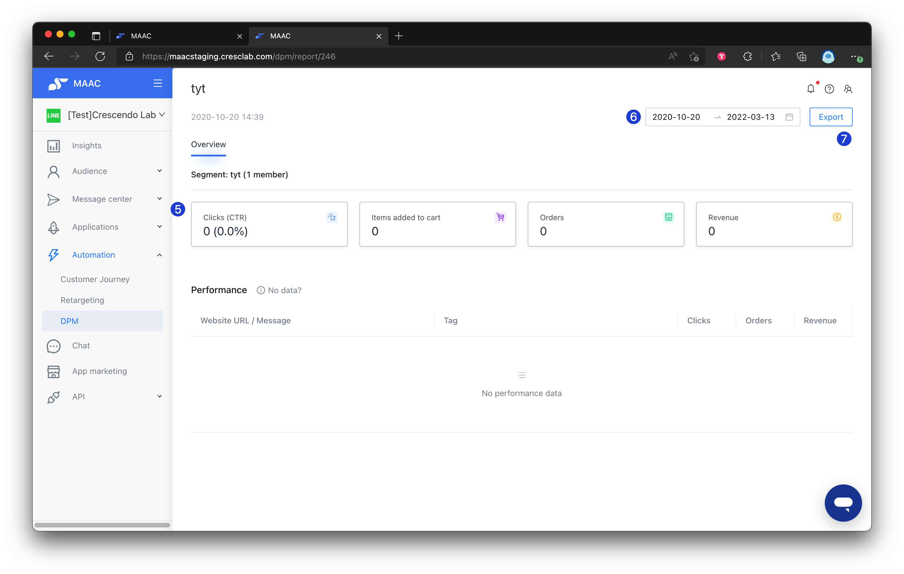

# Tutorials｜DPM（ EC plan ） – Crescendo Lab Help Center

DPM message is automatically calculated by the MAAC system. Each friend’s behaviors—browsing, adding to cart, purchasing, etc.—are analyzed. The system uses large-scale data and machine learning to predict the most relevant products for each friend, increasing click-through and purchase intent.

#### 💁🏻‍♀️ Advantage

* Send personalized, AI data-computed product recommendation messages.

#### ➤ Plan Availability

This is an automation feature available in the EC plan. If you're interested, please contact your CSM and we're happy to assist you!

#### ▶︎ Setting Steps



### Set the name

Give the DPM configuration a descriptive name.



### Select the segment to be sent

Choose which user segment will receive the DPM.



### Select the product feed to be used

Choose the product feed you want to use for recommendations.


Please ask us to help you upload your product feed before you can select a product feed. Supported formats:

* URL (XML)
* CSV files
* FTP capture of specified location


Required fields in the feed: id, title, description, link, image\_link, price, availability.

You must choose at least one of: brand, MPN, gtin.

You must choose at least one of: google\_product\_category or product\_type. These are compatible with Google or Facebook DPA dynamic ads formats.



### Set the text message on the top of product carousel content

Enter the header text that appears above the carousel of recommended products.



### Set the notification message

Configure the notification message the recipient will receive.



### Set the number of recommended products

Choose how many recommended products to include in the carousel.



### Push a specified product (optional)

You can input a product ID or product name to push a specific product. If no product ID is entered, the system will automatically recommend personalized products.




### Set the UTM parameters

Set UTM parameters to track performance.




### Save as draft (optional)

If necessary, save as a draft and come back later to finish editing.



### Schedule the push

If editing is completed, choose to schedule and set a specific time for pushing.



### Send immediately (optional)

You can also choose to send immediately; when the system is ready, it will push out the DPM.


DPM messages are personalized per recipient, so there is no action to send a test message. If you need to verify DPM content before sending broadly, create a tester-only segment and send to that segment to confirm the content.





#### ▶︎ List and Performance



### View list performance

After sending, view the performance of each DPM in the list. Metrics shown include click rate, orders, and revenue.



### Export DPM summary data

Use the export button to export summary data for DPMs by selecting a time period.



### Open detailed report

Click the report icon for a specific DPM to see more detailed data.



### Delete a DPM

Click the trash icon to delete a DPM.




### View add-to-cart counts

In the detailed report, you can view the number of products added to cart.



### Filter by time period

Set a specific time period in the detailed report; the data will reflect that time range.



### Export detailed report

Use the export button to export the detailed data of a DPM.




***

### Related articles

* [How to share LINE OA platform, LINE Developers, GA(UA) / GA4 access to Crescendo Lab?](https://crescendolab.zendesk.com/hc/en-us/related/click?data=BAh7CjobZGVzdGluYXRpb25fYXJ0aWNsZV9pZGwrCJmp1FFgBzoYcmVmZXJyZXJfYXJ0aWNsZV9pZGwrCBkKqYgDBDoLbG9jYWxlSSIKZW4tdXMGOgZFVDoIdXJsSSJ1L2hjL2VuLXVzL2FydGljbGVzLzgxMTAyNzExNDYzOTMtSG93LXRvLXNoYXJlLUxJTkUtT0EtcGxhdGZvcm0tTElORS1EZXZlbG9wZXJzLUdBLVVBLUdBNC1hY2Nlc3MtdG8tQ3Jlc2NlbmRvLUxhYgY7CFQ6CXJhbmtpBg%3D%3D--09284da91d1bb5345d894b1e285f34c584f35689)
* [Tutorials｜MAAC Message Module & Template Library](https://crescendolab.zendesk.com/hc/en-us/related/click?data=BAh7CjobZGVzdGluYXRpb25fYXJ0aWNsZV9pZGwrCBkb49oDBDoYcmVmZXJyZXJfYXJ0aWNsZV9pZGwrCBkKqYgDBDoLbG9jYWxlSSIKZW4tdXMGOgZFVDoIdXJsSSJUL2hjL2VuLXVzL2FydGljbGVzLzQ0MTQ2MDM3Mjk2ODktVHV0b3JpYWxzLU1BQUMtTWVzc2FnZS1Nb2R1bGUtVGVtcGxhdGUtTGlicmFyeQY7CFQ6CXJhbmtpBw%3D%3D--f70223dd41573c346571c1586ef9daf01a02ca31)
* [Tutorials｜Rapid Referral](https://crescendolab.zendesk.com/hc/en-us/related/click?data=BAh7CjobZGVzdGluYXRpb25fYXJ0aWNsZV9pZGwrCBkzBMgDBDoYcmVmZXJyZXJfYXJ0aWNsZV9pZGwrCBkKqYgDBDoLbG9jYWxlSSIKZW4tdXMGOgZFVDoIdXJsSSI%2BL2hjL2VuLXVzL2FydGljbGVzLzQ0MTQyODcxMzE0MTctVHV0b3JpYWxzLVJhcGlkLVJlZmVycmFsBjsIVDoJcmFua2kI--1ef71de581ca3096552f5e988414671fdb3c8b77)
* [CAAC | Interface Optimization](https://crescendolab.zendesk.com/hc/en-us/related/click?data=BAh7CjobZGVzdGluYXRpb25fYXJ0aWNsZV9pZGwrCBkQADgvHToYcmVmZXJyZXJfYXJ0aWNsZV9pZGwrCBkKqYgDBDoLbG9jYWxlSSIKZW4tdXMGOgZFVDoIdXJsSSJCL2hjL2VuLXVzL2FydGljbGVzLzMyMDg4NjQwMTk2NjMzLUNBQUMtSW50ZXJmYWNlLU9wdGltaXphdGlvbgY7CFQ6CXJhbmtpCQ%3D%3D--778acfda219fd5df8b3856f6277dc2e53d0b1015)
* [Tutorial｜CAAC x CDH - Profile Unification](https://crescendolab.zendesk.com/hc/en-us/related/click?data=BAh7CjobZGVzdGluYXRpb25fYXJ0aWNsZV9pZGwrCJl%2FlyruHDoYcmVmZXJyZXJfYXJ0aWNsZV9pZGwrCBkKqYgDBDoLbG9jYWxlSSIKZW4tdXMGOgZFVDoIdXJsSSJOL2hjL2VuLXVzL2FydGljbGVzLzMxODA5MjQyMzY1ODQ5LVR1dG9yaWFsLUNBQUMteC1DREgtUHJvZmlsZS1VbmlmaWNhdGlvbgY7CFQ6CXJhbmtpCg%3D%3D--b2e3dc44d7825fd137965355346c875771ddfb6a)
