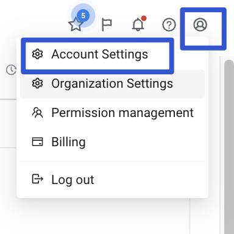
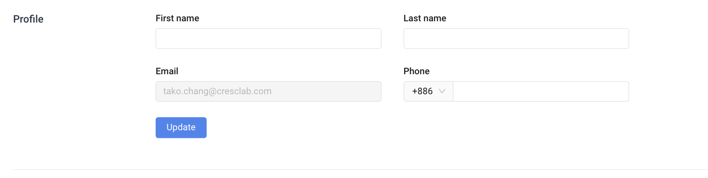
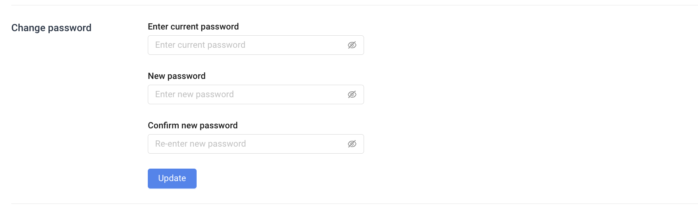
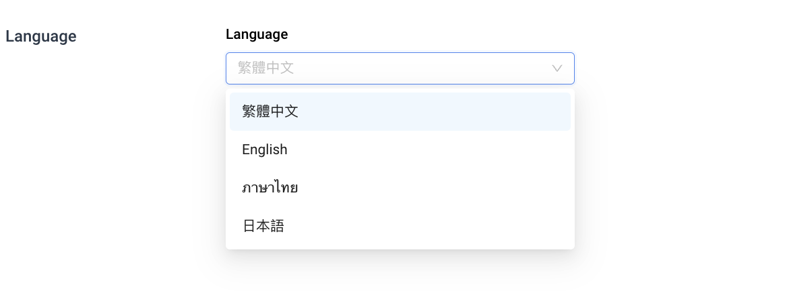
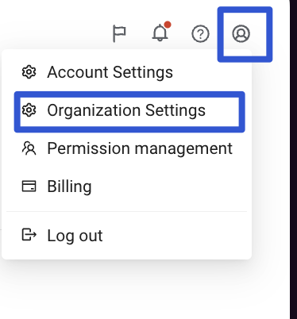
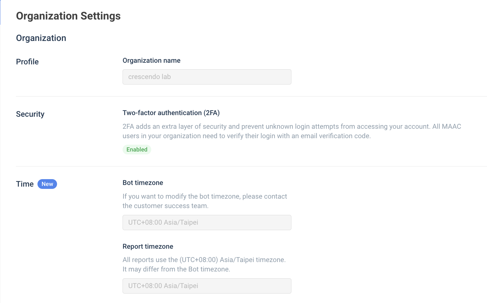
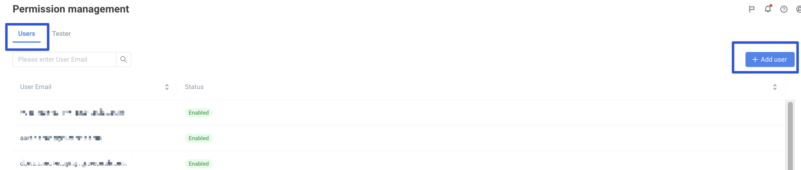
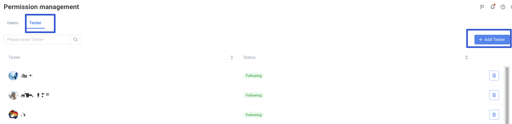

# Tutorial | Backend Interface, Account Settings, and Permission Management – Crescendo Lab Help Center


Reminder: It is recommended to use the Chrome browser to operate the MAAC backend.




### Welcome to MAAC, let's check how to use this wonderful platform!


Reminder: It is recommended to use the Chrome browser to operate the MAAC backend.




### Click on menu icon can close the menu bar




### Click to switch between different functions in the left side menu




### Display the settings and operation interface after switching functions.




### Click the "bell" icon to view data import and segmentation update results.




### Click the "question mark" icon to access the Help Center for basic operation instructions and common questions.




### Click Account settings, where you can update user profile, change password, and language.




### Can update user profile




### Can change password




### Can change language




### Click Organization Settings, where you can check the organization, Security (2FA), and Time.




### Can check the organization, Security (2FA), and Time.




### Click on Permission management where you can add the MAAC user and manage the list of testers.




### Can add user

Check the details: [Tutorials｜How to add MAAC users ?](https://crescendolab.zendesk.com/hc/en-us/articles/36359736768281-Tutorials-How-to-add-MAAC-users)




### Can add tester

Check the details: [How to add Tester and send test message](https://crescendolab.zendesk.com/hc/en-us/articles/4413238874649-How-to-add-Tester-and-send-test-message)


Reminder: Users must have joined the LINE official account and become followers in order to be added as testers.




### Click the chat icon in the bottom right corner to have a one-on-one conversation with the online customer support team.




### Related articles

* [Tutorial｜Basic Setup and Multi-page Guide for Rich Menu](https://crescendolab.zendesk.com/hc/en-us/related/click?data=BAh7CjobZGVzdGluYXRpb25fYXJ0aWNsZV9pZGwrCBkm6ocDBDoYcmVmZXJyZXJfYXJ0aWNsZV9pZGwrCJkuF4kDBDoLbG9jYWxlSSIKZW4tdXMGOgZFVDoIdXJsSSJdL2hjL2VuLXVzL2FydGljbGVzLzQ0MTMyMTE2ODIzMjktVHV0b3JpYWwtQmFzaWMtU2V0dXAtYW5kLU11bHRpLXBhZ2UtR3VpZGUtZm9yLVJpY2gtTWVudQY7CFQ6CXJhbmtpBg%3D%3D--5a35950a1f99c6f9aef448415c9fefddf1a29e0c)
* [How to share LINE OA platform, LINE Developers, GA(UA) / GA4 access to Crescendo Lab?](https://crescendolab.zendesk.com/hc/en-us/related/click?data=BAh7CjobZGVzdGluYXRpb25fYXJ0aWNsZV9pZGwrCJmp1FFgBzoYcmVmZXJyZXJfYXJ0aWNsZV9pZGwrCJkuF4kDBDoLbG9jYWxlSSIKZW4tdXMGOgZFVDoIdXJsSSJ1L2hjL2VuLXVzL2FydGljbGVzLzgxMTAyNzExNDYzOTMtSG93LXRvLXNoYXJlLUxJTkUtT0EtcGxhdGZvcm0tTElORS1EZXZlbG9wZXJzLUdBLVVBLUdBNC1hY2Nlc3MtdG8tQ3Jlc2NlbmRvLUxhYgY7CFQ6CXJhbmtpBw%3D%3D--caae2ffa860c717f89427f03959059d18b0bb52b)
* [Tutorials | Deeplink](https://crescendolab.zendesk.com/hc/en-us/related/click?data=BAh7CjobZGVzdGluYXRpb25fYXJ0aWNsZV9pZGwrCJnloYgDBDoYcmVmZXJyZXJfYXJ0aWNsZV9pZGwrCJkuF4kDBDoLbG9jYWxlSSIKZW4tdXMGOgZFVDoIdXJsSSI4L2hjL2VuLXVzL2FydGljbGVzLzQ0MTMyMjM3MjQ0NDEtVHV0b3JpYWxzLURlZXBsaW5rBjsIVDoJcmFua2kI--e0529b5f50b67acef4a56c3f94ad642d1798ea69)
* [Tutorials｜CAAC Notification](https://crescendolab.zendesk.com/hc/en-us/related/click?data=BAh7CjobZGVzdGluYXRpb25fYXJ0aWNsZV9pZGwrCJlitOxaEjoYcmVmZXJyZXJfYXJ0aWNsZV9pZGwrCJkuF4kDBDoLbG9jYWxlSSIKZW4tdXMGOgZFVDoIdXJsSSJCL2hjL2VuLXVzL2FydGljbGVzLzIwMTgxNzI3NjAxMzA1LVR1dG9yaWFscy1DQUFDLU5vdGlmaWNhdGlvbgY7CFQ6CXJhbmtpCQ%3D%3D--d8482be0256bc95c79652fcf655af5327733432a)
* [Tutorials｜Game Interaction](https://crescendolab.zendesk.com/hc/en-us/related/click?data=BAh7CjobZGVzdGluYXRpb25fYXJ0aWNsZV9pZGwrCBlM0QcdBDoYcmVmZXJyZXJfYXJ0aWNsZV9pZGwrCJkuF4kDBDoLbG9jYWxlSSIKZW4tdXMGOgZFVDoIdXJsSSJAL2hjL2VuLXVzL2FydGljbGVzLzQ1MjI3MzE3MTk3MDUtVHV0b3JpYWxzLUdhbWUtSW50ZXJhY3Rpb24GOwhUOglyYW5raQo%3D--9f39f409f4fd77ff4ab4cc9355c7f68be7d729e5)
