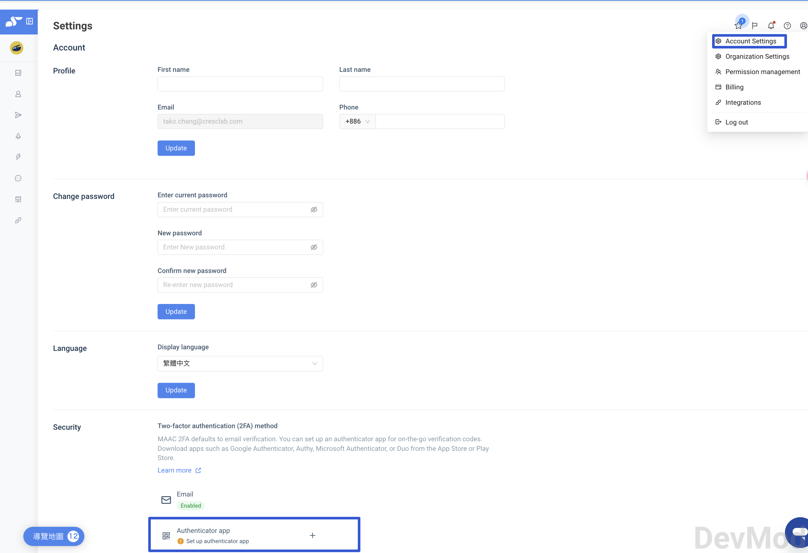
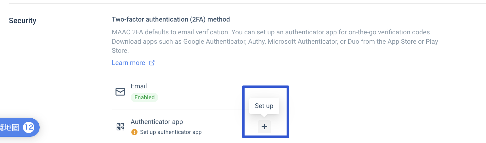
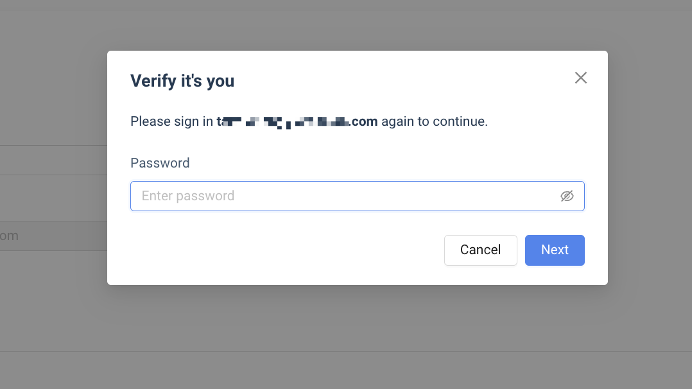
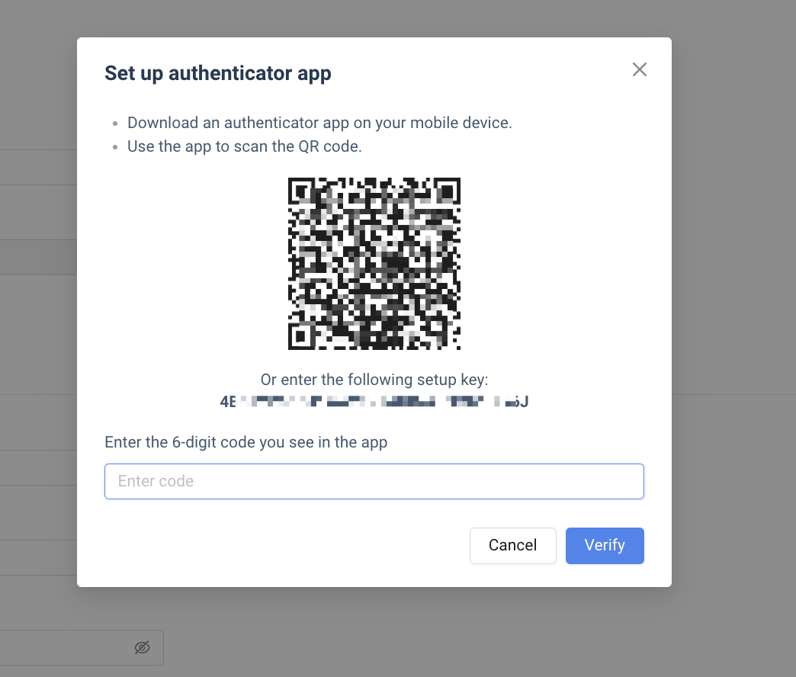
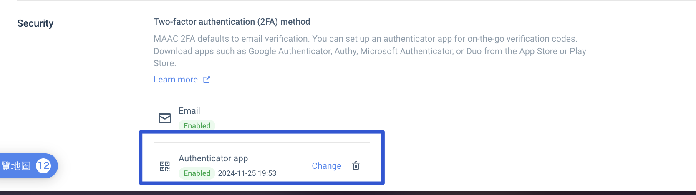
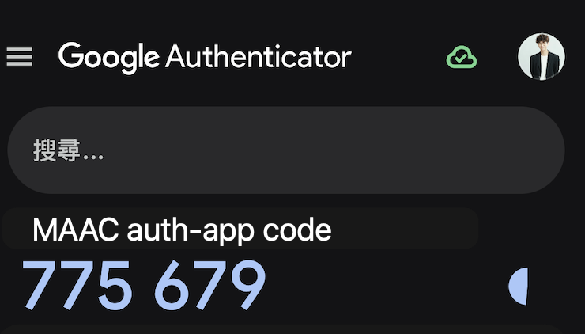
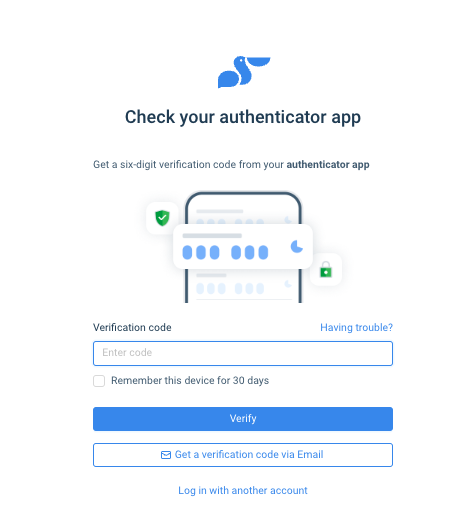
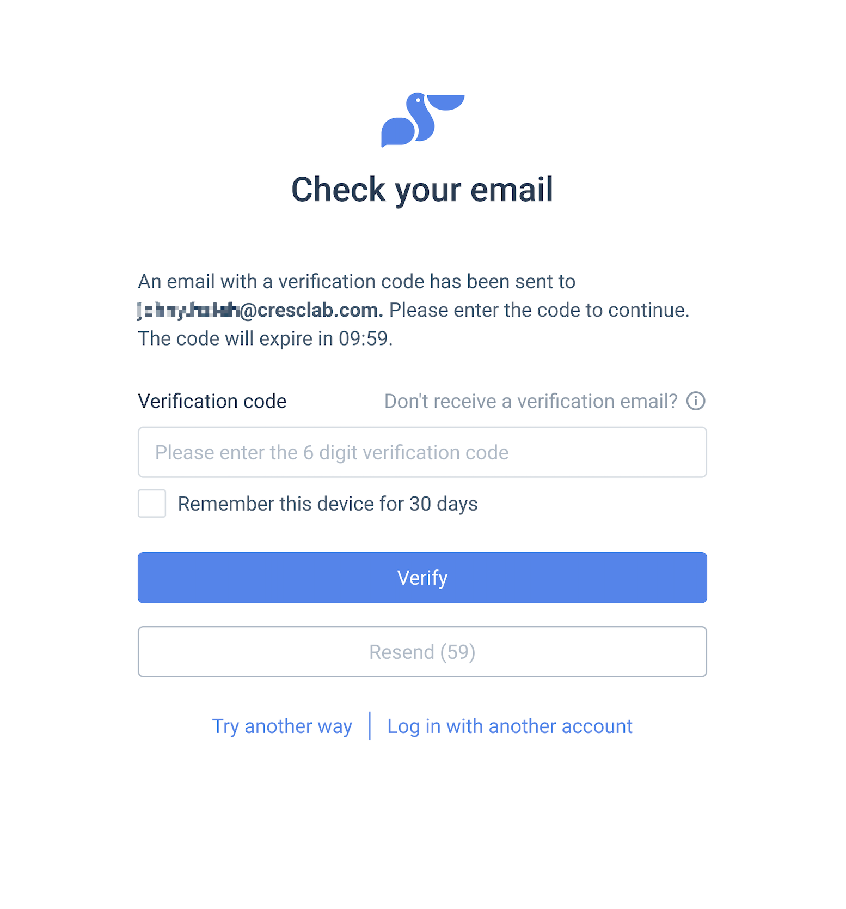
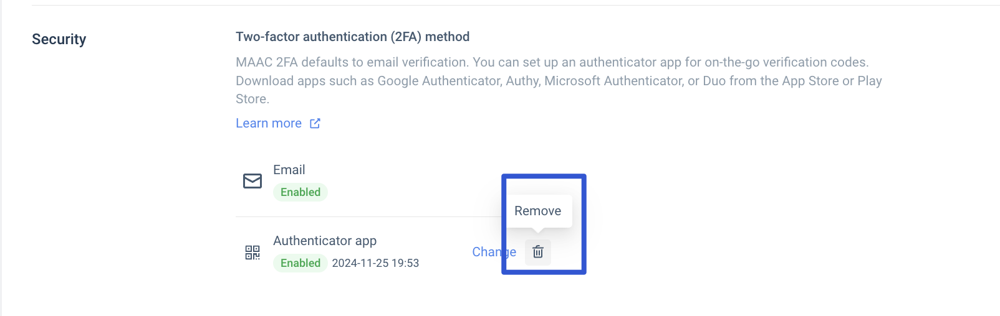

# Two-Factor Authentication for accounts – Crescendo Lab Help Center

For more details, you can refer to this announcement: [LINK Here](https://announcekit.app/maac/announcements/crescendo-lab-important-announcement-maac-platform-to-enable-two-factor-authentication-2fa-soon---please-review-your-access-list-regularly-3CVbDG)

MAAC's two-step verification supports both Email and the Authenticator app. If you have enabled the Authenticator app, the verification code it generates will be used by default for verification.

## Why Do You Need to Set Up Two-Factor Authentication

Enabling two-factor authentication adds an extra layer of security to prevent unauthorized individuals from attempting to access your account.


Please ensure that your account is associated with a valid email address that can receive messages.


## How to Obtain a Verification Code Using the Authenticator App

* What is an Authenticator App?\
  An authenticator app is a tool that generates two-factor authentication (2FA) codes. After enabling 2FA and linking your Authenticator app, you can use the generated codes to authenticate your identity whenever logging into your MAAC account. You can download popular apps such as Google Authenticator, Authy, Microsoft Authenticator, or Duo from the App Store or Play Store.
* Setting Up the Authenticator App\
  This guide uses Google Authenticator as an example.



### Steps to Set Up

1. Ensure the App is Installed:\
   Download and register an authenticator app on your phone (refer to the detailed guide: [How to Obtain Verification Codes Using Google Authenticator](https://support.google.com/accounts/answer/1066447?hl=en\&co=GENIE.Platform%3DiOS\&sjid=9192348242274536618-AP)).
2.  Access MAAC Security Settings:\
    Go to MAAC > Account Settings > Security > Two-Factor Authentication (2FA).

    
3.  Initiate Setup:\
    Click Set Up and enter your MAAC account password.

    

    
4.  Link the App:\
    Open your authenticator app, scan the QR code displayed, and retrieve the verification code.

    

    Enter the code into the MAAC interface and click Verify.
5.  Completion:\
    Once verified, the setup is complete.

    



### Logging in Using a Verification Code

1.  Log in to MAAC with Your Email:\
    Use your registered email to sign in.

    
2.  Retrieve Verification Code:\
    Open the authenticator app on your phone to generate the code.

    
3.  Complete the Login:\
    Return to the MAAC login page, enter the verification code, and click Verify.

    

    You will then be logged into MAAC.



## After enabling, you will need to receive a verification code via email to log in



MAAC — After enabling, you will need to receive a verification code via email to log in again.




Check your email for the verification code.




MAAC — Enter the verification code on login page

You can choose to remember this device for 30 days, so you won’t need to verify again within this period.





* You can select Remember This Device for 30 Days to skip verification on that device for the next 30 days.
* MAAC will automatically log users out after 24 hours.
* If the user logs out manually from MAAC, they will still need to authenticate on their next login.


## FAQ

Which Authenticator Apps Are Supported?

MAAC supports most major authenticator apps, including Google Authenticator, Microsoft Authenticator, and Authy.

What If the Authenticator Code Fails?

If the verification code from your authenticator app is not working, try the following troubleshooting steps:

* Check Time Synchronization:
  * Ensure the system time on your phone is correctly synced with the authenticator app.
  * For iOS: Go to Settings > General > Date & Time, and enable Set Automatically.
  * For Android: Go to Settings > System > Date & Time, and enable Automatic Date & Time.
* Reset the Authenticator App:
  * Delete the existing account in the app and scan the QR code again to reset the 2FA settings. Note: You may need the previous QR code for reconfiguration.
* Switch to Email Verification:
  * If issues persist, use email-based 2FA or contact support for assistance.

Disabling Authenticator Verification

To disable verification via an authenticator app:

* Log into MAAC > Account Settings.
* Navigate to Security > Two-Factor Authentication and select Remove.

## What to do if you do not receive the verification email?

1. Ensure that your email is valid and capable of receiving emails.
2. Try resending the verification email.
3. Check if the verification email has been sent to your spam folder.

If you have checked all of the above and still cannot receive the verification email, please send an email from your company email address with the following information. Our support team will generate the code for you as soon as we receive your request.

Send the following information to: help@cresclab.com

Email subject: Brand Name\_MAAC 2FA Verification Code Request

Required information:

* Brand Name:
* Applicant’s Name:
* Email Address Unable to Receive Verification Code:
* Please provide a screenshot of the current MAAC verification screen

In the future, you can continue using this verification method to log in to MAAC.

Please first download Google Authenticator on your mobile device. We will then generate a QR code for you to obtain the verification code.

* Android： https://cresclab\_cs.pse.is/6m4rwv
* IOS： https://cresclab\_cs.pse.is/6m4s5x

(How to use Google Authenticator please refer to Get verification codes with Google Authenticator: https://support.google.com/accounts/answer/1066447?hl=en\&co=GENIE.Platform%3DAndroid\&sjid=4293965476054201748-AP)

If you are unable to use Google Authenticator, an alternative verification code can be provided. Please note that this code will only be valid for 10 minutes.

***

## Related articles

* [Tutorials｜How to add MAAC users ?](https://crescendolab.zendesk.com/hc/en-us/related/click?data=BAh7CjobZGVzdGluYXRpb25fYXJ0aWNsZV9pZGwrCBm3MakRIToYcmVmZXJyZXJfYXJ0aWNsZV9pZGwrCJm8WK8GIToLbG9jYWxlSSIKZW4tdXMGOgZFVDoIdXJsSSJGL2hjL2VuLXVzL2FydGljbGVzLzM2MzU5NzM2NzY4MjgxLVR1dG9yaWFscy1Ib3ctdG8tYWRkLU1BQUMtdXNlcnMGOwhUOglyYW5raQY%3D--066aca307c3c11876e681e7e9d6bf95c61601e05)
* [Tutorials｜MAAC Message Module & Template Library](https://crescendolab.zendesk.com/hc/en-us/related/click?data=BAh7CjobZGVzdGluYXRpb25fYXJ0aWNsZV9pZGwrCBkb49oDBDoYcmVmZXJyZXJfYXJ0aWNsZV9pZGwrCJm8WK8GIToLbG9jYWxlSSIKZW4tdXMGOgZFVDoIdXJsSSJUL2hjL2VuLXVzL2FydGljbGVzLzQ0MTQ2MDM3Mjk2ODktVHV0b3JpYWxzLU1BQUMtTWVzc2FnZS1Nb2R1bGUtVGVtcGxhdGUtTGlicmFyeQY7CFQ6CXJhbmtpBw%3D%3D--c0b860c94fda3ec579eb6435553e632442fd0d34)
* [FAQ｜How Are Contact Engagement Metrics Defined in Data Insight?](https://crescendolab.zendesk.com/hc/en-us/related/click?data=BAh7CjobZGVzdGluYXRpb25fYXJ0aWNsZV9pZGwrCJkft4gDBDoYcmVmZXJyZXJfYXJ0aWNsZV9pZGwrCJm8WK8GIToLbG9jYWxlSSIKZW4tdXMGOgZFVDoIdXJsSSJkL2hjL2VuLXVzL2FydGljbGVzLzQ0MTMyMjUxMTU1NDUtRkFRLUhvdy1BcmUtQ29udGFjdC1FbmdhZ2VtZW50LU1ldHJpY3MtRGVmaW5lZC1pbi1EYXRhLUluc2lnaHQGOwhUOglyYW5raQg%3D--538a51f271d52b21a18484a6c2a419693ac06928)
* [Tutorials｜Customer Journey ✨ New ✨](https://crescendolab.zendesk.com/hc/en-us/related/click?data=BAh7CjobZGVzdGluYXRpb25fYXJ0aWNsZV9pZGwrCJkQ8ocDBDoYcmVmZXJyZXJfYXJ0aWNsZV9pZGwrCJm8WK8GIToLbG9jYWxlSSIKZW4tdXMGOgZFVDoIdXJsSSJEL2hjL2VuLXVzL2FydGljbGVzLzQ0MTMyMTIyMDExMTMtVHV0b3JpYWxzLUN1c3RvbWVyLUpvdXJuZXktTmV3BjsIVDoJcmFua2kJ--47ebb4d5e12f8f0bcbc82830279948dc90da2f64)
* [Tutorials｜Game Interaction](https://crescendolab.zendesk.com/hc/en-us/related/click?data=BAh7CjobZGVzdGluYXRpb25fYXJ0aWNsZV9pZGwrCBlM0QcdBDoYcmVmZXJyZXJfYXJ0aWNsZV9pZGwrCJm8WK8GIToLbG9jYWxlSSIKZW4tdXMGOgZFVDoIdXJsSSJAL2hjL2VuLXVzL2FydGljbGVzLzQ1MjI3MzE3MTk3MDUtVHV0b3JpYWxzLUdhbWUtSW50ZXJhY3Rpb24GOwhUOglyYW5raQo%3D--0247e559e8075d99133bde4b801573461e7604fb)
