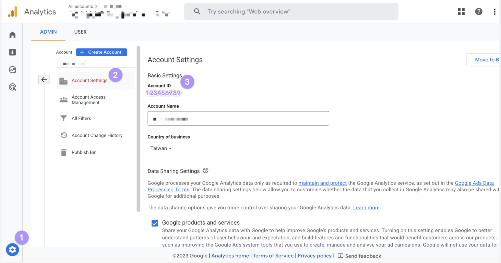
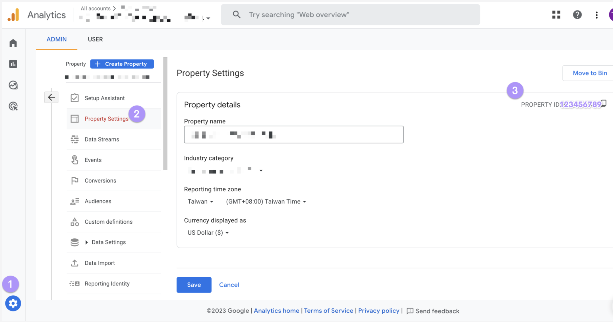
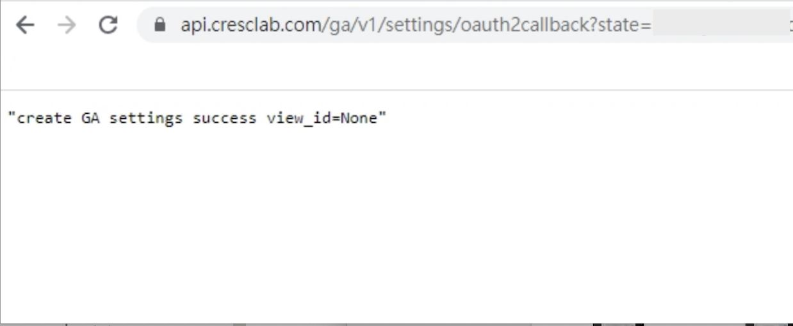

# How to Migrate Universal GA to GA4? – Crescendo Lab Help Center

💡 Starting from July 1, 2023, Google Analytics (Universal GA) will no longer process new data in standard properties.

#### Applicable Users

* Existing customers who have purchased the e-commerce solution, currently integrated with Universal GA, and are planning to migrate to GA4.
* New customers who have purchased the e-commerce solution and will directly integrate with GA4.

#### Preparation

If your brand is using the MAAC solution, specifically the MAAC e-commerce solution, please ensure that you have completed the necessary settings and switched to Google Analytics 4 properties. Also, confirm whether e-commerce-related data can be tracked.

* "Customer Journey - Purchase" data comes from "Checkout" behavior.
* "Cart Retargeting" data comes from "addToCarts."

After completing the setup and confirming that e-commerce-related data can be tracked, please contact the support team via the bottom-right corner or your designated CSM.

#### Steps to Migrate from Universal GA to GA4

**Method 1: Grant GA4 Authorization to Cresclab**

➤ Share Google Analytics Access



### Grant access via GA Admin

Go to the GA dashboard > Click on Admin. Then click on "User Management."





### Add new users

Click on "+" and select "Add new users." 



### Enter Cresclab email

Enter the email provided by your CSM (e.g., ga.auth4@cresclab.com — please refer to the email from your CSM).



### Notify & set permissions

Check "Notify" > Select Permissions > Click "Add." 



### Provide Property ID

Provide the Property ID to Cresclab for setup.



### Cresclab completes setup

Crescendo lab will complete the setup 🎉



***

**Method 2: Brand to Call Crescendo lab API for GA4 Integration**



### Verify GA4 Account ID & Property ID

Follow these steps to check Account ID & Property ID.

Account ID:

1. Go to the brand’s GA dashboard, click on "Admin" at the bottom left.
2. Click on "Account Settings."
3. Confirm the "Account ID."



Property ID:

1. Go to the brand’s GA dashboard, click on "Admin" at the bottom left.
2. Click on "Property Settings."
3. Confirm the "Property ID."





### Obtain MAAC login user token

Use the API call format below to retrieve the MAAC login user token.


```bash
# request
curl --request POST \
--url 'https://api.cresclab.com/accounts/v1/user/login/' \
--header 'Content-Type: application/json' \
--data-raw '{
"username": "<MAAC user name>",
"password": "<MAAC user password>" }'

# response
{
"token": "<MAAC login user token>"
}
```



* is your MAAC login username.
* is your MAAC login password.




### Obtain MAAC OTP

You need to provide 1) GA4 account id, 2) GA4 property id, and 3) the URL of the tracked website (brand’s domain). Use the API call format below to retrieve MAAC OTP. After successful retrieval, save the OTP parameter and proceed to the next step for verification.


```bash
# request
curl --request POST \
  --url 'https://api.cresclab.com/ga/v1/settings/otp' \
  --header 'Authorization: Bearer <MAAC login user token>' \
  --header 'Content-Type: application/json' \
  --data '{
  "account_id": "<GA4 account_id>",
  "property_id": "<GA4 property_id>",
  "website_url": "<Your GA website Url>"
}'

# response
{
"otp": "<otp>"
}
```



The OTP is valid for only 240 seconds (4 minutes). Complete the next verification step as quickly as possible.




### Verify Authorization

1. Log in to the brand's GA4 dashboard.
2. Prepare the OTP from the previous step.
3. Open a new window, copy the URL below, replace with the OTP, and paste it into the new window:

https://api.cresclab.com/ga/v1/settings/authorize?otp=

4. After verification, a confirmation screen will appear.\
   
5. Once the process is completed, notify Crescendo lab to proceed with the setup (email help@cresclab.com or contact your Customer Success Manager).



***

### Related articles

* [How to share GA4 access and Product feed with Crescendo Lab to enable EC plan?](https://crescendolab.zendesk.com/hc/en-us/related/click?data=BAh7CjobZGVzdGluYXRpb25fYXJ0aWNsZV9pZGwrCBlDGXN0FDoYcmVmZXJyZXJfYXJ0aWNsZV9pZGwrCBmRB6b7EToLbG9jYWxlSSIKZW4tdXMGOgZFVDoIdXJsSSJ0L2hjL2VuLXVzL2FydGljbGVzLzIyNDkwMzc5Nzk3MjczLUhvdy10by1zaGFyZS1HQTQtYWNjZXNzLWFuZC1Qcm9kdWN0LWZlZWQtd2l0aC1DcmVzY2VuZG8tTGFiLXRvLWVuYWJsZS1FQy1wbGFuBjsIVDoJcmFua2kG--279c55ab7afd5af59ef064d4514124c8af4dad93)
* [Tutorials｜Insights](https://crescendolab.zendesk.com/hc/en-us/related/click?data=BAh7CjobZGVzdGluYXRpb25fYXJ0aWNsZV9pZGwrCJmh8YcDBDoYcmVmZXJyZXJfYXJ0aWNsZV9pZGwrCBmRB6b7EToLbG9jYWxlSSIKZW4tdXMGOgZFVDoIdXJsSSI4L2hjL2VuLXVzL2FydGljbGVzLzQ0MTMyMTIxNzI2OTctVHV0b3JpYWxzLUluc2lnaHRzBjsIVDoJcmFua2kH--d6d42e3903290a531ca7dd9dc9da7dc70e9520d5)
* [Tutorials｜ MAAC x SurveyCake Form](https://crescendolab.zendesk.com/hc/en-us/related/click?data=BAh7CjobZGVzdGluYXRpb25fYXJ0aWNsZV9pZGwrCJkr5rYDBDoYcmVmZXJyZXJfYXJ0aWNsZV9pZGwrCBmRB6b7EToLbG9jYWxlSSIKZW4tdXMGOgZFVDoIdXJsSSJGL2hjL2VuLXVzL2FydGljbGVzLzQ0MTM5OTk5NTA3NDUtVHV0b3JpYWxzLU1BQUMteC1TdXJ2ZXlDYWtlLUZvcm0GOwhUOglyYW5raQg%3D--e0f4cb74b53649b68ea7127b6ee1083ac5b1e4cb)
* [How to share LINE OA platform, LINE Developers, GA(UA) / GA4 access to Crescendo Lab?](https://crescendolab.zendesk.com/hc/en-us/related/click?data=BAh7CjobZGVzdGluYXRpb25fYXJ0aWNsZV9pZGwrCJmp1FFgBzoYcmVmZXJyZXJfYXJ0aWNsZV9pZGwrCBmRB6b7EToLbG9jYWxlSSIKZW4tdXMGOgZFVDoIdXJsSSJ1L2hjL2VuLXVzL2FydGljbGVzLzgxMTAyNzExNDYzOTMtSG93LXRvLXNoYXJlLUxJTkUtT0EtcGxhdGZvcm0tTElORS1EZXZlbG9wZXJzLUdBLVVBLUdBNC1hY2Nlc3MtdG8tQ3Jlc2NlbmRvLUxhYgY7CFQ6CXJhbmtpCQ%3D%3D--5cffdb2f6d17adce326ef01f9166e9f5e17f639b)
* [Tutorials | Integration of MAAC and CAAC Customer(Contact) Data - Customer data hub](https://crescendolab.zendesk.com/hc/en-us/related/click?data=BAh7CjobZGVzdGluYXRpb25fYXJ0aWNsZV9pZGwrCJk12ZpvEjoYcmVmZXJyZXJfYXJ0aWNsZV9pZGwrCBmRB6b7EToLbG9jYWxlSSIKZW4tdXMGOgZFVDoIdXJsSSJ1L2hjL2VuLXVzL2FydGljbGVzLzIwMjcwNTQ4NTk2MTIxLVR1dG9yaWFscy1JbnRlZ3JhdGlvbi1vZi1NQUFDLWFuZC1DQUFDLUN1c3RvbWVyLUNvbnRhY3QtRGF0YS1DdXN0b21lci1kYXRhLWh1YgY7CFQ6CXJhbmtpCg%3D%3D--fc9aca43379754a7978b10c1c02caf3487452358)
