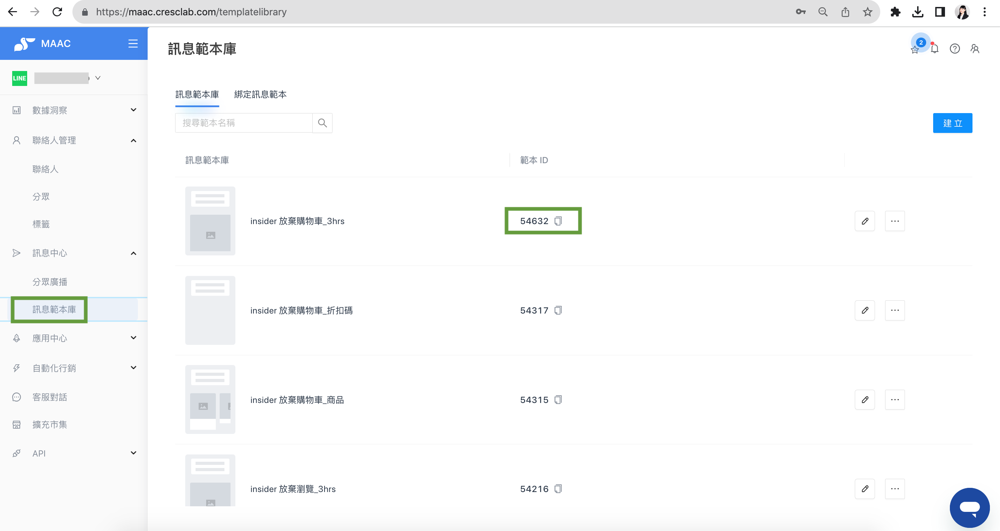
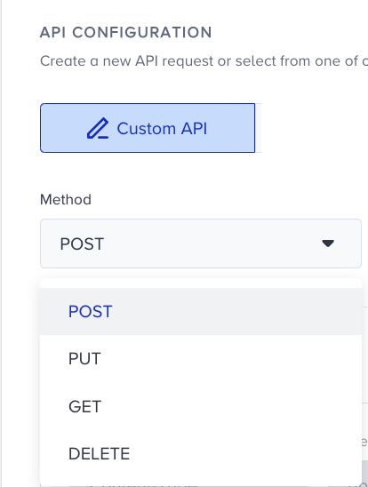

# Tutorial｜MAAC Open API sends message push notifications – Crescendo Lab Help Center

* Stage 1: Enable the automation marketing tool to call the MAAC for LINE push message notifications, such as "Shopping Cart Reminder," "Abandoned Browsing Reminder," "Repurchase Reminder," and "Birthday Gift Reminder," and more.
* Stage 2: Send back information regarding whether specific messages were opened or clicked and the behavior labels from LINE to the database of the automation marketing tool. This allows for interaction with members who are not reached through LINE by other communication methods via automation marketing tools (e.g., SMS, Email, website, app push, web push, etc.). The behavior labels from LINE can be used as user segments for the automation marketing tool.

***

## To integrate the required information



### Enable MAAC Open API and generate Access Token

When activating platform services, the Crescendo Lab Customer Success Manager (CSM) will assist you in enabling the MAAC Open API functionality within your solution.

To generate an Access Token via the MAAC backend:

* Access the MAAC backend.
* Navigate to API > API token.
* Click the "Get token" button.



### Set up message templates (Template ID)

* Create and configure message templates in the MAAC backend.
* Brands can independently create templates.

Reference: Tutorials｜Template library (link in Related articles)



### Configure the automation marketing platform

* Configure the relevant settings according to the automation marketing platform used by your brand.
* Ensure the parameter names and mapping required by your automation platform are configured (example: mapping Template ID and dynamic parameters in Insider).




Please confirm with your dedicated Crescendo Lab Customer Success Manager (CSM) that Open API Zone 3 has been activated to support dynamic parameter APIs for single push and broadcast push notifications.

Be attentive to the integration requirements of each automation marketing tool and configure the platform accordingly based on the data required for integration. If you need assistance, reach out to the Crescendo Lab team for support.


***

## Example

### MAAC Backend Message Templates and MAAC OPEN API — \[Single Message Push]

* Taking Insider as an example, after obtaining the message template (Template ID), enter the Insider backend to configure various parameter names.

***

## Related integration and connection documentation

* Emarsys Integration：Custom node - LINE messenger
* Insider Integration：教學｜ Insider x MAAC 整合串接

***

## Related articles

* Tutorials｜Insider x MAAC Integration\
  https://crescendolab.zendesk.com/hc/en-us/related/click?data=BAh7CjobZGVzdGluYXRpb25fYXJ0aWNsZV9pZGwrCJk%2B%2FqL%2BFToYcmVmZXJyZXJfYXJ0aWNsZV9pZGwrCBnOgwW%2FFjoLbG9jYWxlSSIKZW4tdXMGOgZFVDoIdXJsSSJLL2hjL2VuLXVzL2FydGljbGVzLzI0MTgzNDAwNDQ3NjQxLVR1dG9yaWFscy1JbnNpZGVyLXgtTUFBQy1JbnRlZ3JhdGlvbgY7CFQ6CXJhbmtpBg%3D%3D--bbec27725614aea32077802d772f68f604ec676b
* Tutorials｜BigQuery Connector\
  https://crescendolab.zendesk.com/hc/en-us/related/click?data=BAh7CjobZGVzdGluYXRpb25fYXJ0aWNsZV9pZGwrCBlyQwxwFjoYcmVmZXJyZXJfYXJ0aWNsZV9pZGwrCBnOgwW%2FFjoLbG9jYWxlSSIKZW4tdXMGOgZFVDoIdXJsSSJDL2hjL2VuLXVzL2FydGljbGVzLzI0NjcwNDk3ODk0OTM3LVR1dG9yaWFscy1CaWdRdWVyeS1Db25uZWN0b3IGOwhUOglyYW5raQc%3D--be845add384514b551e880460d5c7d267d267b48
* Tutorials｜Template library\
  https://crescendolab.zendesk.com/hc/en-us/related/click?data=BAh7CjobZGVzdGluYXRpb25fYXJ0aWNsZV9pZGwrCBkD84cDBDoYcmVmZXJyZXJfYXJ0aWNsZV9pZGwrCBnOgwW%2FFjoLbG9jYWxlSSIKZW4tdXMGOgZFVDoIdXJsSSJAL2hjL2VuLXVzL2FydGljbGVzLzQ0MTMyMTIyNjMxOTMtVHV0b3JpYWxzLVRlbXBsYXRlLWxpYnJhcnkGOwhUOglyYW5raQg%3D--fff14dff9c879587d8f87ab75b8fc1d657c11ba5
* Tutorials｜Webhook\
  https://crescendolab.zendesk.com/hc/en-us/related/click?data=BAh7CjobZGVzdGluYXRpb25fYXJ0aWNsZV9pZGwrCJnyT08EBDoYcmVmZXJyZXJfYXJ0aWNsZV9pZGwrCBnOgwW%2FFjoLbG9jYWxlSSIKZW4tdXMGOgZFVDoIdXJsSSI3L2hjL2VuLXVzL2FydGljbGVzLzQ0MTY1NTcwMTk4MDEtVHV0b3JpYWxzLVdlYmhvb2sGOwhUOglyYW5raQk%3D--6fde9508b92cddc617951a9521e3df822f11604c
* How to share LINE OA platform, LINE Developers, GA(UA) / GA4 access to Crescendo Lab?\
  https://crescendolab.zendesk.com/hc/en-us/related/click?data=BAh7CjobZGVzdGluYXRpb25fYXJ0aWNsZV9pZGwrCJmp1FFgBzoYcmVmZXJyZXJfYXJ0aWNsZV9pZGwrCBnOgwW%2FFjoLbG9jYWxlSSIKZW4tdXMGOgZFVDoIdXJsSSJ1L2hjL2VuLXVzL2FydGljbGVzLzgxMTAyNzExNDYzOTMtSG93LXRvLXNoYXJlLUxJTkUtT0EtcGxhdGZvcm0tTElORS1EZXZlbG9wZXJzLUdBLVVBLUdBNC1hY2Nlc3MtdG8tQ3Jlc2NlbmRvLUxhYgY7CFQ6CXJhbmtpCg%3D%3D--d15b87a188d6a6d8fbaadc1b45c629c2c2d267be
