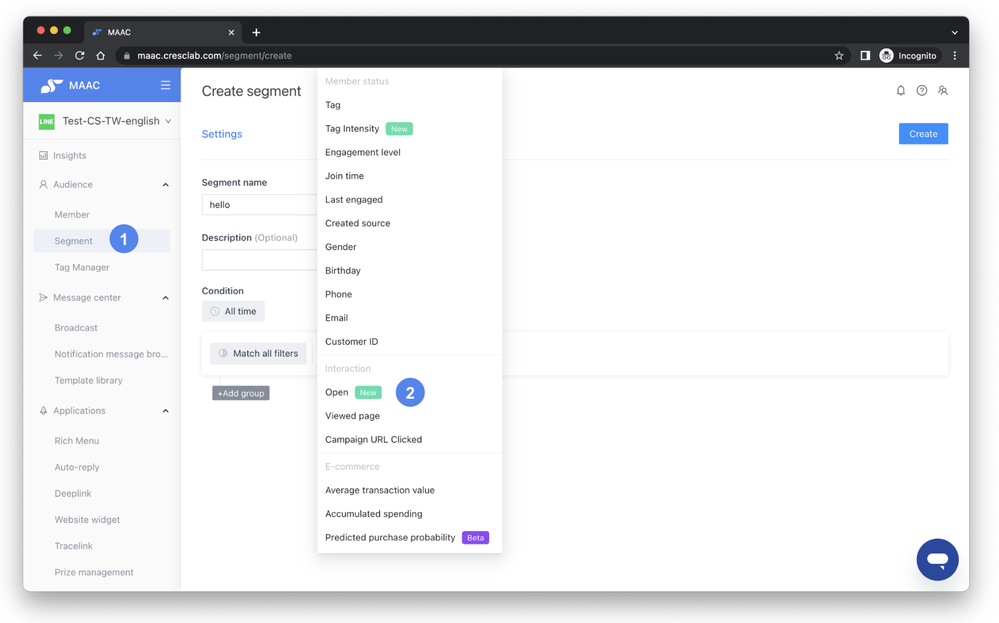
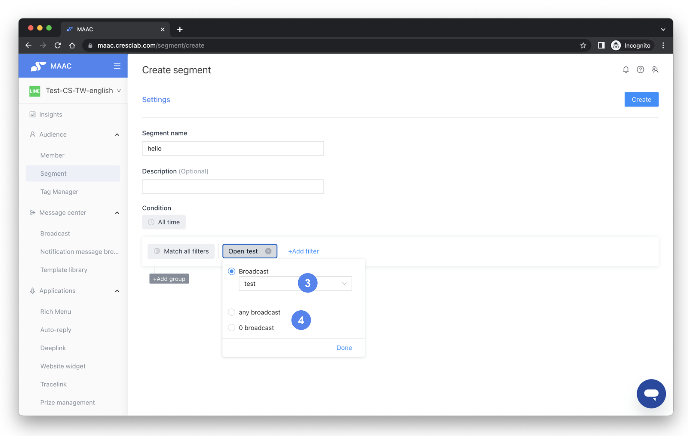

# Tutorials｜Broadcast - Open counts, Segment - Retargeting – Crescendo Lab Help Center

#### 💁🏻‍♀️ Advantage

* Track whether users have opened messages, the behavior data of browsing push messages (Open), and performance of message exposure
* Retarget the opened / unopened audience, which is an extended application in Segment
* Form a more accurate and diversified target audience, combined with MAAC's powerful segment filtering and EC conditions


Exposure, opens, and clicks are the basic data for evaluating the performance of marketing activities. To enhance the value and accuracy of the data, performance data was redefined and aligned closer to real brand behavior.

* Open count
  * Before optimization: "Number of repeated opens"
  * After optimization (2022/08/29): adjusted to "number of unique opens"
* CTR
  * Before optimization: CTR = clicks / repeated opens × 100%
  * After 2022/08/29: CTR = clicks / unique opens × 100%
  * After 2022/10/05: CTR is broken down into:
    * Repeat CTR = repeated clicks / unique opens × 100%
    * Unique CTR = unique clicks / unique opens × 100%


***

### ▶︎ Setting - Number of Opens



### Create broadcast

* In the upper right corner of the list, click Create Broadcast, enter the name of the broadcast and select the list of target group.



### Choose template

* Before entering the editor, the system will pop up the template window to ask you to select a basic blank or previously created template. It is recommended to use the template function to speed up editing abundant repetitive content.



### Select message module

* There are currently 8 types of message modules. If you use the message module marked with "Open count trackable", you can view the unopened number data in the Broadcast list after pushing the message.



### Edit and send

* After selecting the module, edit the design materials, tags, and action areas of different modules. When the message content is completed, schedule the push message or send it directly by clicking "Ready to send."



***

### ▶︎ Setting - Retargeting

Exposures, opens and clicks are the basic data for evaluating the performance of marketing activities. To enhance the value and accuracy of the data, performance data was redefined and aligned closer to the actual situation of the brand.



### Create a segment

* Enter Segment in Audience on the left list, and click Create at the top right.



### Configure audience filters

* Enter the name of the audience you want to create, adjust specific conditions, such as tags, gender, etc., and select "Open" in "Add filter".\
  



### Use open counts to refine segment

* If you choose a segment with data on the number of opens, you can use the number of opens to match different conditions to filter out users with overlapping conditions, and then push the broadcast and make retargeting.



### Examples of retarget filters

* It can also be used to filter "Open any broadcast" or "Open 0 broadcast", remarket to users who have seen each push message or have never opened a push message, and set up different marketing strategies.\
  



***

### ▶︎ List and Performance - Number of Opens



### Manage broadcasts

* You can manage all push broadcasts in the broadcast list, and can query specific broadcasts in the search box and specified time interval.



### View open metrics

* You can view the number of opens and open rate of each broadcast in the list.



### Calculation formulas

* Move your mouse to the question mark next to the words "Open", "Clicks" and "Unique Clicks" to view the calculation formula of the data.




* The calculation is similar to the GA Session, and one session per hour.
* Messages sent from 2022/08/29 will be adjusted to "Number of Unique Opens" and "Unique Open Rate".
* The update frequency of data in the list is one hour.
* Open rate = (number of opens / number of messages sent) × 100%\
  From 2022/08/29: Open rate = (number of unique opens / number of messages sent) × 100%.
* Open will only be counted within 2 months after sending the broadcast and will not be updated after 2 months.


***

### ▶︎ Results List - CTR

#### ➤ Applicable to MAAC Basic plan

|                   |          |          |                                  |                                                |
| ----------------- | -------- | -------- | -------------------------------- | ---------------------------------------------- |
| **Not EC-Plan**   | Clicks   | Opens    | CTR                              | Conclusion                                     |
| Before 2022/08/29 | Repeated | Repeated | Repeated Clicks / Repeated Opens | CTR might be higher after 2022/08/29           |
| After 2022/08/29  | Repeated | Unique   | Repeated Clicks / Unique Opens   |                                                |
| After 2022/10/05  | Repeated | Unique   | Repeated Clicks / Unique Opens   | Not EC-Plan, no change with calculation of CTR |

Example:

* Background: After the broadcast, there were 10 people in the audience
  * Opened by 6 people and 15 repeated opens
  * Clicked by 4 people and 8 repeated clicks
* Examples of results:
  * Before 2022/08/29: CTR is 8/15 = 53%
  * 2022/08/29 - 10/5: Repeated CTR 8/6 = 133%
  * After 2022/10/05: Repeated CTR 133%, Unique CTR = no data

#### ➤ Applicable to MAAC EC-Plan (need to be connected in series with UA/GA4)

|                   |                            |          |                                                                                                     |                                                                              |
| ----------------- | -------------------------- | -------- | --------------------------------------------------------------------------------------------------- | ---------------------------------------------------------------------------- |
| **EC-Plan**       | 
Clicks (UTM set)
 | Opens    | CTR                                                                                                 | Conclusion                                                                   |
| Before 2022/08/29 | Unique                     | Repeated | Unique Clicks / Repeated Opens                                                                      | CTR might be higher after 2022/08/29                                         |
| After 2022/08/29  | Unique                     | Unique   | Unique Clicks / Unique Opens                                                                        |                                                                              |
| After 2022/10/05  | 
Unique Repeated
  | Unique   | 
- Unique CTR: Unique Clicks / Unique Opens - Repeated CTR: Repeated Clicks / Unique Opens
 | In addition to the original "unique click rate", added "repeated click rate" |

Example:

* Background: After the broadcast, there were 10 people in the audience
  * Opened by 6 people and 15 repeated opens
  * Clicked by 4 people and 8 repeated clicks
* Examples of results:
  * Before 2022/08/29: CTR is 4/15 = 27%
  * 2022/08/29 - 10/5: Unique CTR is 4/6 = 67%
  * After 2022/10/05: Unique CTR is 4/6 = 67%, Repeated CTR 8/6 = 133%


What is the difference between repeated and unique clicks?

* Number of repeated clicks: No matter whether it is the same person or not, as long as there is a click, the number of repeated clicks will continue to increase.
* Number of unique clicks: Only when different people click, will the number of unique clicks increase.

Note: After 2022/10/05, the UI and exported reports include a "Unique Clicks" column in:

* Message Center - Broadcast
* Applications - Tracelink
* Open API - message tracking, Tracelink (except MAAC "API broadcast" list)
* Insights


Reference: [What is the CTR in Broadcast? Why there is no data?](https://crescendolab.zendesk.com/hc/en-us/articles/4413225107993)

***

Related articles

* Tutorials｜LINE Broadcast: https://crescendolab.zendesk.com/hc/en-us/related/click?data=BAh7CjobZGVzdGluYXRpb25fYXJ0aWNsZV9pZGwrCBmdF4kDBDoYcmVmZXJyZXJfYXJ0aWNsZV9pZGwrCBlw7ocDBDoLbG9jYWxlSSIKZW4tdXMGOgZFVDoIdXJsSSI%2BL2hjL2VuLXVzL2FydGljbGVzLzQ0MTMyMzE0MzkxMjktVHV0b3JpYWxzLUxJTkUtQnJvYWRjYXN0BjsIVDoJcmFua2kG--a8a9727ebb9703f16fe9f56365d0935ae3d16cb6
* Tutorials｜MAAC Message Module & Template Library: https://crescendolab.zendesk.com/hc/en-us/related/click?data=BAh7CjobZGVzdGluYXRpb25fYXJ0aWNsZV9pZGwrCBkb49oDBDoYcmVmZXJyZXJfYXJ0aWNsZV9pZGwrCBlw7ocDBDoLbG9jYWxlSSIKZW4tdXMGOgZFVDoIdXJsSSJUL2hjL2VuLXVzL2FydGljbGVzLzQ0MTQ2MDM3Mjk2ODktVHV0b3JpYWxzLU1BQUMtTWVzc2FnZS1Nb2R1bGUtVGVtcGxhdGUtTGlicmFyeQY7CFQ6CXJhbmtpBw%3D%3D--592875fc1b30e481398126a15fd0f50e1b9a127f
* Tutorials｜Smart Sending: https://crescendolab.zendesk.com/hc/en-us/related/click?data=BAh7CjobZGVzdGluYXRpb25fYXJ0aWNsZV9pZGwrCJmDF4kDBDoYcmVmZXJyZXJfYXJ0aWNsZV9pZGwrCBlw7ocDBDoLbG9jYWxlSSIKZW4tdXMGOgZFVDoIdXJsSSI9L2hjL2VuLXVzL2FydGljbGVzLzQ0MTMyMzE0MzI2MDEtVHV0b3JpYWxzLVNtYXJ0LVNlbmRpbmcGOwhUOglyYW5raQg%3D--d188d5ebdf742d8d96208cd35718fb125656ea6b
* Tutorials｜Game Interaction: https://crescendolab.zendesk.com/hc/en-us/related/click?data=BAh7CjobZGVzdGluYXRpb25fYXJ0aWNsZV9pZGwrCBlM0QcdBDoYcmVmZXJyZXJfYXJ0aWNsZV9pZGwrCBlw7ocDBDoLbG9jYWxlSSIKZW4tdXMGOgZFVDoIdXJsSSJAL2hjL2VuLXVzL2FydGljbGVzLzQ1MjI3MzE3MTk3MDUtVHV0b3JpYWxzLUdhbWUtSW50ZXJhY3Rpb24GOwhUOglyYW5raQk%3D--1d6f0ad57b0de4de7debd1a9510b4d0907a5041c
* Tutorials｜Deeplink: https://crescendolab.zendesk.com/hc/en-us/related/click?data=BAh7CjobZGVzdGluYXRpb25fYXJ0aWNsZV9pZGwrCJnloYgDBDoYcmVmZXJyZXJfYXJ0aWNsZV9pZGwrCBlw7ocDBDoLbG9jYWxlSSIKZW4tdXMGOgZFVDoIdXJsSSI4L2hjL2VuLXVzL2FydGljbGVzLzQ0MTMyMjM3MjQ0NDEtVHV0b3JpYWxzLURlZXBsaW5rBjsIVDoJcmFua2kK--dec3eaaea456acdaba47c9dfd60815b205ed1ec9
