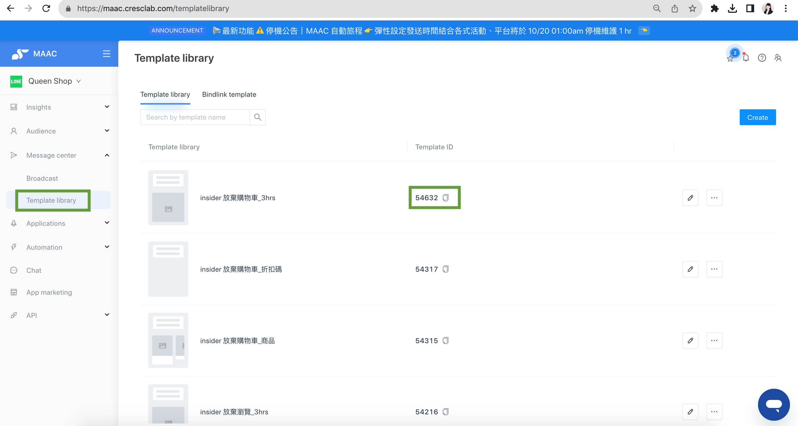
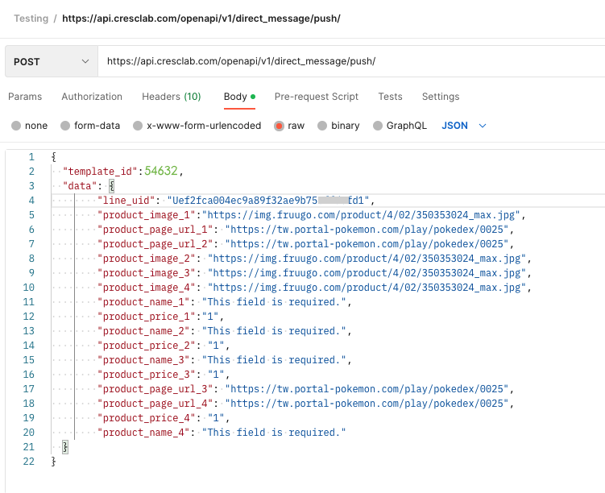
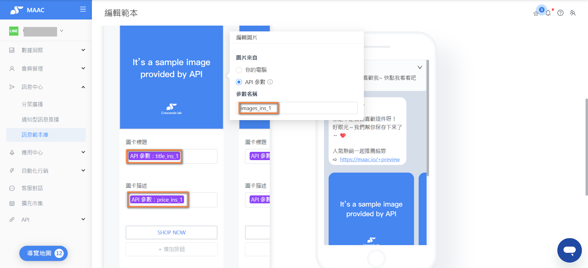
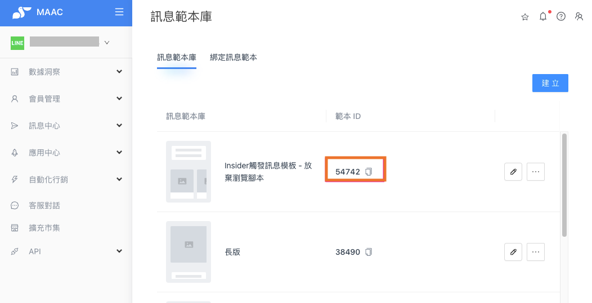
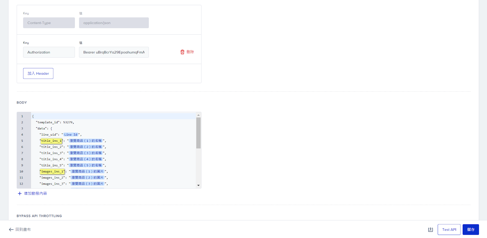
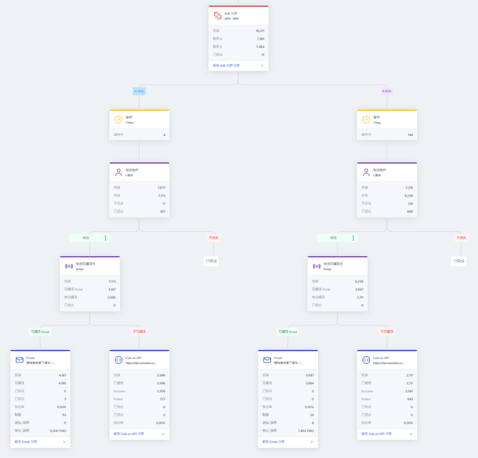

# Tutorials｜Insider x MAAC Integration – Crescendo Lab Help Center

#### 💁🏻‍♀️ Insider\_Architect x Crescendo Lab\_MAAC Integration purpose

* Phase 1：Allow Insider’s Cross Channel Journey builder tool Architect can trigger the crescendo LINE push message. Journey Example：Cart Abandonment, Browse Abandonment, Replenishment, etc.
* Phase 2：Return message performance data including opened/clicked, and LINE's attribute to the Insider UCD (Unified Customer Database). Allow members who are not reachable to LINE can interact through other Insider communication channels (ex: SMS, Email, website, APP Push, Web Push, etc.), and allow LINE's attributes to be used as the User segment in Insider Journey Builder Tool (Architect).

#### ▶︎ Necessary information for Integration

* MAAC Template ID settings
* MAAC OPEN API - \[ Single Push ] & token
* MAAC platform message layout design
* Related dynamic attribute settings
* LINE uid integration (IO/API)

#### ▶︎ MAAC template & MAAC OPEN API- \[ Single Push ] Example

#### ▶︎ Detailed Instruction for Integration



### Required information and preparations before integration

1. Crescendo Lab CSM activate Open API (for clid/ MAAC Open API), and then give the token to Insider
2. LINE uid

* a. (IO Approach) Brand Partner IT provides line\_uid IO via Insider IO
* b. (clid Approach) Insider develops to obtain Line uuid and decrypts who is the user entering the Brand Partner’s website.

3. Insider CSM creates a message template on the MAAC platform (it needs to be created by the partner itself later)


Reminder：Brand Partner needs to notify Crescendo Lab CSM to activate the MAAC platform access administrator rights to the Insider CSM. After the Insider CSM gets the rights, it will create a template for testing and a template id.


4. Insider TAM (Technical Account Manager) creates Call an API template in Insider’s Journey Builder Tool (Architect)
5. Insider TAM (Technical Account Manager) conducted tests and confirmed that the Insider Journey Builder Tool (Architect) can successfully automatically trigger push LINE message via MAAC



### Formal use case setting

1. Insider CSM and Customer Alignment Use Case Scenario
2. Brand Partner create templates on the MAAC platform and Insider Inone Panel.

* a. MAAC Platform - Template parameter writing（Review：you can refer to the Crescendo Help Center | Message Template Library, review how to edit templates）

* b. MAAC Platform - after saving template, note the template ID

* c. Insider Inone Panel - Set parameter (Body)

 

3. After completing the remaining settings in the Insider's Panel journey, all the settings have been finished.

🔑 Reference：Fashion Brand Partner Journey Use Case：Browse abandonment (EDM + LINE Push)




### Related articles

* [Tutorials｜MAAC Message Module & Template Library](https://crescendolab.zendesk.com/hc/en-us/related/click?data=BAh7CjobZGVzdGluYXRpb25fYXJ0aWNsZV9pZGwrCBkb49oDBDoYcmVmZXJyZXJfYXJ0aWNsZV9pZGwrCJk%2B%2FqL%2BFToLbG9jYWxlSSIKZW4tdXMGOgZFVDoIdXJsSSJUL2hjL2VuLXVzL2FydGljbGVzLzQ0MTQ2MDM3Mjk2ODktVHV0b3JpYWxzLU1BQUMtTWVzc2FnZS1Nb2R1bGUtVGVtcGxhdGUtTGlicmFyeQY7CFQ6CXJhbmtpBg%3D%3D--5b5d0591d6ae049eaa3cbbf48923d9816bdf8af7)
* \[How to share LINE OA platform, LINE Developers, GA(UA) / GA4 access to Crescendo Lab?]\(https://crescendolab.zendesk.com/hc/en-us/related/click?data=BAh7CjobZGVzdGluYXRpb25fYXJ0aWNsZV9pZGwrCJmp1FFgBzoYcmVmZXJyZXJfYXJ0aWNsZV9pZGwrCJk%2B%2FqL%2BFToLbG9jYWxlSSIKZW4tdXMGOgZFVDoIdXJsSSJ1L2hjL2VuLXVzL2FydGljbGVzLzgxMTAyNzExNDYzOTMtSG93LXRvLXNoYXJlLUxJTkUtT0EtcGxhdGZvcm0tTElORS1EZXZlbG9wZXJzLUdBLVVBLUdBNC1hY2Nlc3MtdG8tQ3Jl c2NlbmRvLUxhYgY7CFQ6CXJhbmtpBw%3D%3D--3cbb523ae3f133b2d6266bd88b7211a135d0c9cf)
* [Tutorials｜ MAAC x SurveyCake Form](https://crescendolab.zendesk.com/hc/en-us/related/click?data=BAh7CjobZGVzdGluYXRpb25fYXJ0aWNsZV9pZGwrCJkr5rYDBDoYcmVmZXJyZXJfYXJ0aWNsZV9pZGwrCJk%2B%2FqL%2BFToLbG9jYWxlSSIKZW4tdXMGOgZFVDoIdXJsSSJGL2hjL2VuLXVzL2FydGljbGVzLzQ0MTM5OTk5NTA3NDUtVHV0b3JpYWxzLU1BQUMteC1TdXJ2ZXlDYWtlLUZvcm0GOwhUOglyYW5raQg%3D--c96673aebe9aae8400376704aff6bade0cef4f02)
* [Tutorials｜DPM（ EC plan ）](https://crescendolab.zendesk.com/hc/en-us/related/click?data=BAh7CjobZGVzdGluYXRpb25fYXJ0aWNsZV9pZGwrCBkKqYgDBDoYcmVmZXJyZXJfYXJ0aWNsZV9pZGwrCJk%2B%2FqL%2BFToLbG9jYWxlSSIKZW4tdXMGOgZFVDoIdXJsSSI7L2hjL2VuLXVzL2FydGljbGVzLzQ0MTMyMjQxOTI1MzctVHV0b3JpYWxzLURQTS1FQy1wbGFuBjsIVDoJcmFua2kJ--a573e53e10eecf003fc0270318c51154efa1c8b0)
* [Profile API - Full Experience of Customer 360º](https://crescendolab.zendesk.com/hc/en-us/related/click?data=BAh7CjobZGVzdGluYXRpb25fYXJ0aWNsZV9pZGwrCBk5414xHToYcmVmZXJyZXJfYXJ0aWNsZV9pZGwrCJk%2B%2FqL%2BFToLbG9jYWxlSSIKZW4tdXMGOgZFVDoIdXJsSSJYL2hjL2VuLXVzL2FydGljbGVzLzMyMDk3ODgyNTUyNjAxLVByb2ZpbGUtQVBJLUZ1bGwtRXhwZXJpZW5jZS1vZi1DdXN0b21lci0zNjAlQzIlQkEGOwhUOglyYW5raQo%3D--3508515ac2dcee850110a2ca932f450b2af8b93c)
