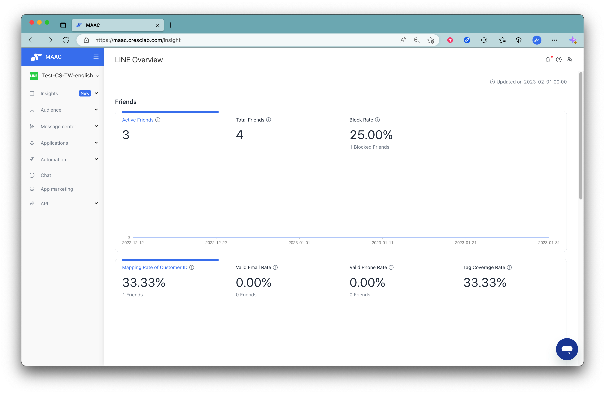
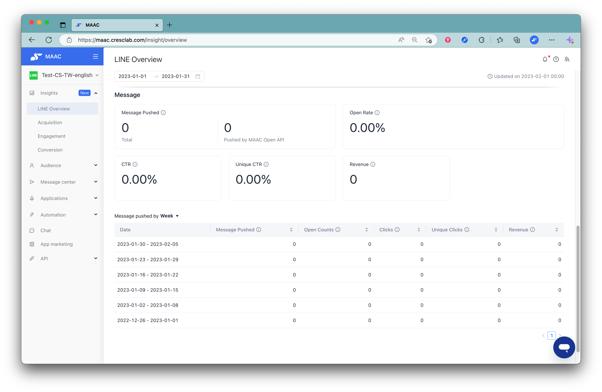
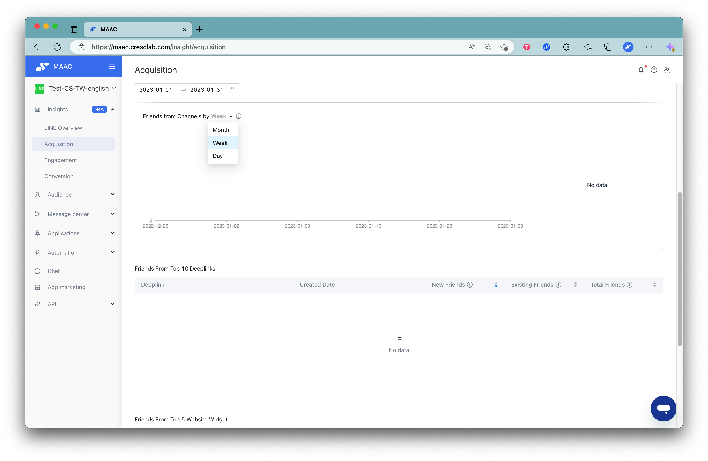
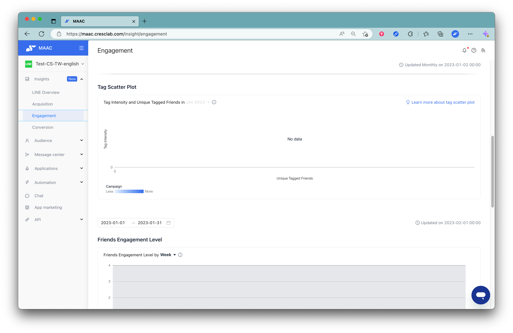
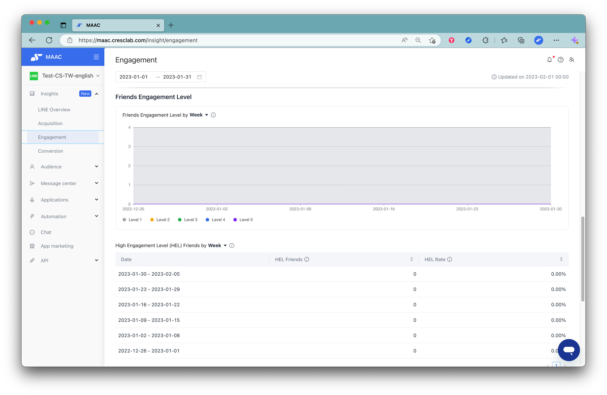
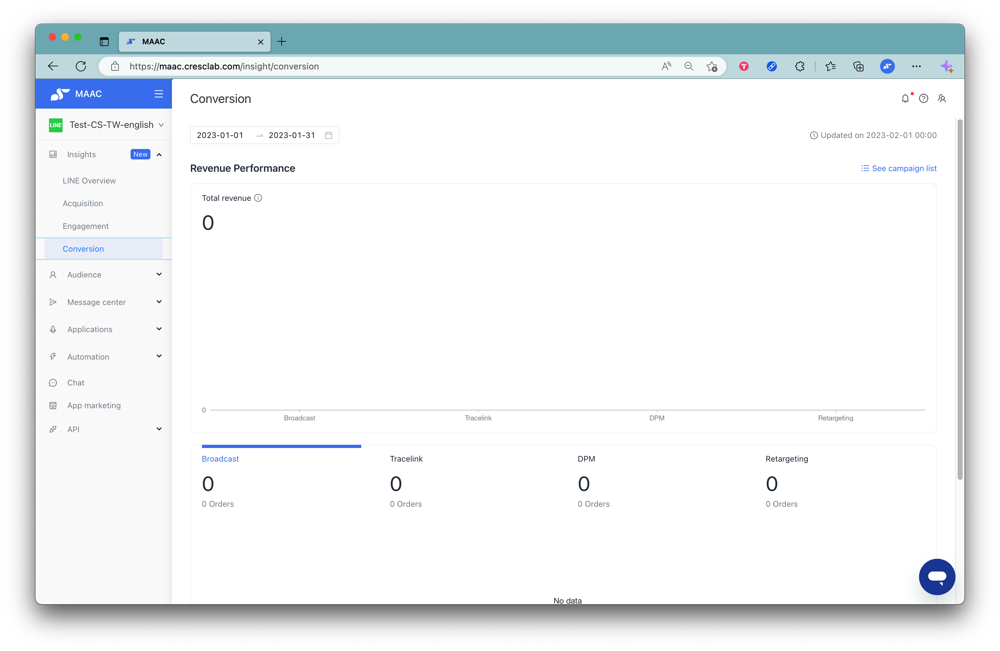

# Tutorials｜Insights – Crescendo Lab Help Center

💁🏻‍♀️ Advantage

With the whole new MAAC dashboard report, you can easily review LINE OA friend numbers, broadcast performance, acquisition performance, and engagement trend data.

➤ Plan Availability

All MAAC plans, including basic and enterprise plan


Reminder： The data record shows the performance since you activate MAAC platform.


▶︎ LINE Overview

Review the overall LINE OA performance, including friend numbers, valid email rate, valid phone rate, open rate, click rate, and revenue (revenue numbers need to purchase EC plan and complete integration with GA).

Friends: Current LINE OA friend total numbers, can check the changes past 12 months via the below chart.

Review more analyzed data of LINE OA friends, including mapping Rate of Customer ID, valid email rate, valid phone rate, and tag coverage rate.

Message: The message pushed by MAAC, and open rate, CTR, unique CTR, and revenue (revenue numbers need to purchase EC plan and complete integration with GA).


* The calculated features range:
  * Message Pushed: All MAAC features but excludes CAAC.
  * Open rate, CTR, Unique CTR, Revenue, and the message pushed below by different time periods: MAAC broadcast only
* Time period picker: Select a specific time period from 1 to 365 days from the current date.
* Message
  * Total: This is the total amount of push messages calculated by MAAC, including push messages from MAAC broadcast, retargeting, deeplink messages to original friends, game interaction prize messages, customer journey, using MAAC Open API push, and reply messages from auto reply, deeplink messages to new friends, etc.
    * MAAC and LINE OA platform calculations have different definitions and tracking systems for pushed messages. Therefore, when it comes to paid message usage, please refer to LINE OA platform numbers.
* Growth rate %: Next to the data overview, you can see the growth rate % performance. The growth rate is automatically compared to the previous period of the same length for the selected date range. For example, if 2022/11/1-2022/11/10 is selected, it will automatically be compared to 2022/10/22-2022/10/31.
* Open Rate: Only calculate the open rate of the broadcast after 2022/09/01 (MAAC adjusted the open rate calculation from repeated to unique on 2022/08/29).
* CTR, Unique CTR: The performance can’t be calculated if the broadcast is using a message module that does not support tracking open behavior.
* Revenue: For users who have EC plan and integration of GA, if using the same UTM parameters setting in different action areas of broadcasts, the revenue numbers will be repeatedly summed.
* Message pushed by Day/Week/Month: The calculation is depending on the message sending time.


▶︎ Acquisition

You can get an overview of the acquisition performance from different channels, including the trend chart of new friends, blocked friends, and the percentage of new friends from different channels.

Growth: The total number of active friends, friends added, and blocked friends in the selected date range. For example, if you select 2022/11/1-2022/11/30, and a friend joins this OA on 2022/10/30, blocks it on 2022/11/10, and adds it back on 2022/12/1, the number of friends in these three categories will increase or decrease during this date range as follows: active friends -1, friends added +0, blocked friends +1.

Friends from Channels by Day/Week/Month: Review acquisition performance from different channels.


Friends from Channels

* Notification messages: Notification messages from LINE and special binding links in forwarded messages are included.
* Others: Includes LINE organic search to join (Importing the member data by LINE API is excluded when you just activate MAAC platform), and other channels such as the Bindlink of MAAC Open API Zone 4 function.


▶︎ Engagement

Understand the status of the engagement between friends and LINE OA, including User-brand Engagement, Open/click Heatmaps, Tag Scatter Plot, Friends Engagement Level, and others.

* What kind of friend behavior is considered a valid interaction and is counted in the metrics?
  * Joining LINE OA: When a friend joins a LINE OA, the system automatically excludes new friends imported via csv files, MAAC Open API, and LINE API
  * Friends trigger auto-reply and Beacon
  * Friends click on a tracelink with tags setting
  * Friends click on any link action area with tags setting
  * Friends claim or redeem any prize
* Data calculation interval: last four weeks
* Data update time: On the second date of every month, the data is updated in the early morning

Open and Click: The numbers are calculated by repeated open and click counts so that you can know how long the interaction will last after a broadcast sending, and at what time your friends are opening and clicking messages.

* Data calculation interval: past one year
* Data update time: On the second date of every month, the data is updated in the early morning

Tag Scatter Plot: Understand the relationship between the tag intensity and unique tagged friends in different tags. It would help you to figure out and observe what is the performance of tags and what kinds of improvement can do in the next steps.

* Data calculation interval: past one year
* Data update time: On the second date of every month, the data is updated in the early morning
* Unique tagged friends: the number of non-repeated friends tagged by the tag
* Tag intensity: # of tag events / # of tagged friends. The higher the intensity, means more tag events are concentrated on a specific group of friends
* Campaign: The darker the color, the more campaigns the tag is used for, and the lighter the color, the less campaigns the tag is used for. Below are the features to be analyzed in the campaign.



### Auto-reply



### Deeplink



### Tracelink



### Bindlink



### Prize management



### Referral



### Game interaction



Friends Engagement Level: You can select a time period to view the trend chart of the percentage change in friend engagement level, and move the mouse cursor over a specific date to see the number of people with each level.


Reminder: Friends Engagement Level is calculated based on the total number of friends, so it will include the number of blocked friends.


▶︎ Conversion

You can view MAAC total revenue results and the results of several main e-commerce features including broadcast, tracelink, DPM, and re-targeting.


* Friends Engagement Level is calculated based on the total number of friends, so it will include the number of blocked friends.
* This is only for those who purchase the EC plan and complete integration MAAC with GA
* This page remains the original insight chart in the e-commerce report, the product development team is preparing more optimization about the e-commerce report, please look forward to it!


Related articles

FAQ｜How Are Contact Engagement Metrics Defined in Data Insight?

\- https://crescendolab.zendesk.com/hc/en-us/related/click?data=BAh7CjobZGVzdGluYXRpb25fYXJ0aWNsZV9pZGwrCJkft4gDBDoYcmVmZXJyZXJfYXJ0aWNsZV9pZGwrCJmh8YcDBDoLbG9jYWxlSSIKZW4tdXMGOgZFVDoIdXJsSSJkL2hjL2VuLXVzL2FydGljbGVzLzQ0MTMyMjUxMTU1NDUtRkFRLUhvdy1BcmUtQ29udGFjdC1FbmdhZ2VtZW50LU1ldHJpY3MtRGVmaW5lZC1pbi1EYXRhLUluc2lnaHQGOwhUOglyYW5raQY%3D--a662001d3647473c5c16ec3d5f10558210eb3497

Tutorials｜Broadcast - Open counts, Segment - Retargeting

\- https://crescendolab.zendesk.com/hc/en-us/related/click?data=BAh7CjobZGVzdGluYXRpb25fYXJ0aWNsZV9pZGwrCBlw7ocDBDoYcmVmZXJyZXJfYXJ0aWNsZV9pZGwrCJmh8YcDBDoLbG9jYWxlSSIKZW4tdXMGOgZFVDoIdXJsSSJZL2hjL2VuLXVzL2FydGljbGVzLzQ0MTMyMTE5NjM0MTctVHV0b3JpYWxzLUJyb2FkY2FzdC1PcGVuLWNvdW50cy1TZWdtZW50LVJldGFyZ2V0aW5nBjsIVDoJcmFua2kH--f5259e36e4a004007c8d012b2f46811bc518c5e3

Tutorials｜ MAAC x SurveyCake Form

\- https://crescendolab.zendesk.com/hc/en-us/related/click?data=BAh7CjobZGVzdGluYXRpb25fYXJ0aWNsZV9pZGwrCJkr5rYDBDoYcmVmZXJyZXJfYXJ0aWNsZV9pZGwrCJmh8YcDBDoLbG9jYWxlSSIKZW4tdXMGOgZFVDoIdXJsSSJGL2hjL2VuLXVzL2FydGljbGVzLzQ0MTM5OTk5NTA3NDUtVHV0b3JpYWxzLU1BQUMteC1TdXJ2ZXlDYWtlLUZvcm0GOwhUOglyYW5raQg%3D--d2a846555be81b145117cbca13d8699b98cf18a4

Tutorials｜New Tag System : Tag Intensity and Timespans

\- https://crescendolab.zendesk.com/hc/en-us/related/click?data=BAh7CjobZGVzdGluYXRpb25fYXJ0aWNsZV9pZGwrCBk01%2F8FBDoYcmVmZXJyZXJfYXJ0aWNsZV9pZGwrCJmh8YcDBDoLbG9jYWxlSSIKZW4tdXMGOgZFVDoIdXJsSSJaL2hjL2VuLXVzL2FydGljbGVzLzQ0MjM4MTM2NDEyNDEtVHV0b3JpYWxzLU5ldy1UYWctU3lzdGVtLVRhZy1JbnRlbnNpdHktYW5kLVRpbWVzcGFucwY7CFQ6CXJhbmtpCQ%3D%3D--93d473cd4c2970e9314f436697b8f21f2f6de6a9

Tutorials｜Webhook

\- https://crescendolab.zendesk.com/hc/en-us/related/click?data=BAh7CjobZGVzdGluYXRpb25fYXJ0aWNsZV9pZGwrCJnyT08EBDoYcmVmZXJyZXJfYXJ0aWNsZV9pZGwrCJmh8YcDBDoLbG9jYWxlSSIKZW4tdXMGOgZFVDoIdXJsSSI3L2hjL2VuLXVzL2FydGljbGVzLzQ0MTY1NTcwMTk4MDEtVHV0b3JpYWxzLVdlYmhvb2sGOwhUOglyYW5raQo%3D--2fb6c7c9a89db04f4c1791b30f5db5bb08f322cc

