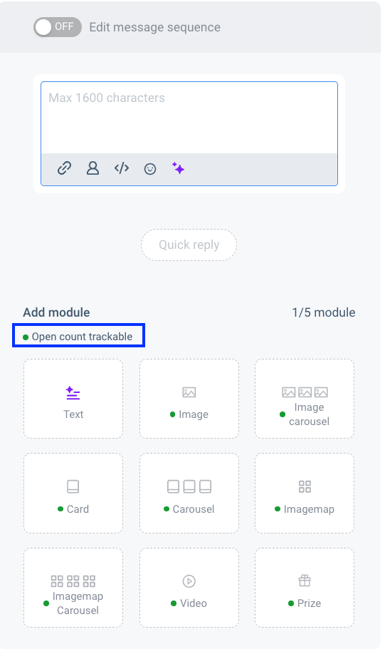
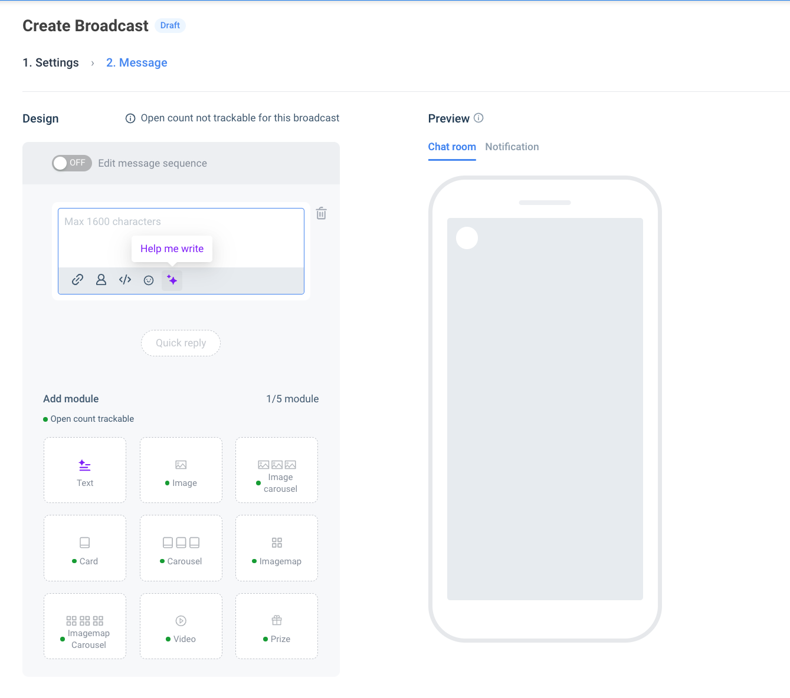
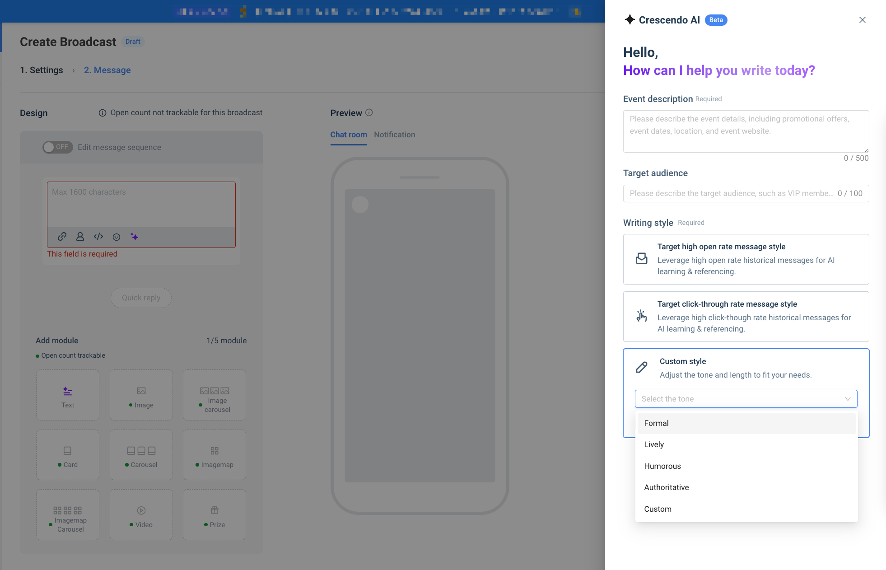
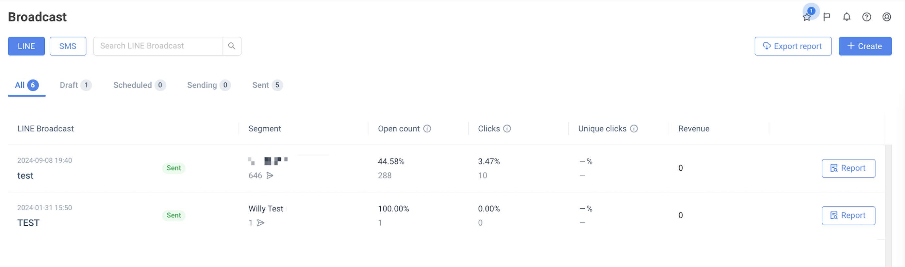

# Tutorials｜LINE Broadcast – Crescendo Lab Help Center

With MAAC’s Audience Broadcast feature, you can deliver highly targeted LINE messages based on audience conditions—boosting engagement and conversions.

Now with the new **AI Content Generator**, you can instantly generate compelling marketing copy.

You can also use **LINE Flex Message** as your broadcast content, giving you full control over the layout and branding.

***

### What is LINE Broadcast?

LINE segmented broadcast allows you to filter your audience based on specific criteria and send targeted messages to selected groups. You can set conditions based on:

* **Behavioral data** (e.g., click or purchase history)
* **Tags or custom fields**

To help brands deliver more tailored and visually rich content, **Flex Message JSON** is now supported in MAAC. You can paste your Flex Message JSON directly into the message editor and send highly customized LINE messages using a predefined design layout.

To learn how to compose and configure Flex Messages, please refer to **\[Setup Guide: Use Flex Message in Audience Broadcast]**.


🚨 Flex Message is only available for customers on the MAAC Corporate Plan.


***

### Why Use Broadcast?

By customizing the recipient of each message, you can:

* **Reduce block rates** by avoiding irrelevant messages
* **Improve click-through and conversion rates** with personalized content
* **Maximize usage efficiency** by focusing on high-value groups

Paired with the **AI Content Generator**, you can create multiple message variations for different audience segments faster and more efficiently.

***

### How to Set Up a LINE Segmented Broadcast?

Follow the steps below to set up your broadcast:



### Create a new broadcast task

Go to **Message Center** > **Broadcast** > Select **LINE**.



### Select segment

Click **Filter Audience**, then define rules based on member profiles, tags, or behavior.

You can also save the segment as a reusable audience list for future broadcasts.


🚨 Reminder: Update your segment before scheduling same-day broadcasts to ensure accurate recipient counts.




### Compose the message

Manually enter your message content, or use the new **AI Write for Me** feature to automatically generate copy (see next section).


* If you want to use Smart Sending, you can refer to this article - [Tutorials｜Smart Sending](https://crescendolab.zendesk.com/hc/en-us/articles/4413231432601)
* To track open counts, please choose modules labeled with a green tag 'Trackable Open Rate'.





***

### ✨ Help me write (New Feature)

No time to write? Let AI help you quickly generate engaging content that fits your campaign.

#### How It Works



### Launch the feature

Click **✨ Help me write** in the message editor.




### Provide campaign context

Enter your campaign topic or keywords (e.g., Anniversary Sale, Member Perks).



### Choose tone

Select your desired tone of voice (e.g., Formal, Lively).



### Review generated copy

AI will generate a message for you – feel free to review and adjust before sending.



This helps you save time while keeping your messaging aligned with brand tone and audience needs.

***

### How to Review Broadcast Performance?

After your segmented broadcast is sent, Crescendo Lab will automatically track key metrics for each task.

💡 Tips:

* Use naming conventions (e.g., “Spring Campaign - Group A”) for easy tracking
* Compare different segments to optimize future targeting strategies

***

### FAQ

Q1: Can I edit AI-generated content?

Yes. Once generated, you can freely modify the content before sending.

Q2: Is Help me write available in multiple languages?

Currently, it supports Traditional Chinese. Additional languages are coming soon.

Q3: When should I use the Help me write feature?

It's perfect for generating multiple tailored messages quickly — especially when you're targeting various audience segments.

***

### Related articles

* [Tutorials｜MAAC Message Module & Template Library](https://crescendolab.zendesk.com/hc/en-us/related/click?data=BAh7CjobZGVzdGluYXRpb25fYXJ0aWNsZV9pZGwrCBkb49oDBDoYcmVmZXJyZXJfYXJ0aWNsZV9pZGwrCBmdF4kDBDoLbG9jYWxlSSIKZW4tdXMGOgZFVDoIdXJsSSJUL2hjL2VuLXVzL2FydGljbGVzLzQ0MTQ2MDM3Mjk2ODktVHV0b3JpYWxzLU1BQUMtTWVzc2FnZS1Nb2R1bGUtVGVtcGxhdGUtTGlicmFyeQY7CFQ6CXJhbmtpBg%3D%3D--df4a0e99bb5810dfcc717ff566eb3d8076e69ecb)
* [Tutorial｜Segment](https://crescendolab.zendesk.com/hc/en-us/related/click?data=BAh7CjobZGVzdGluYXRpb25fYXJ0aWNsZV9pZGwrCBlzlogDBDoYcmVmZXJyZXJfYXJ0aWNsZV9pZGwrCBmdF4kDBDoLbG9jYWxlSSIKZW4tdXMGOgZFVDoIdXJsSSI2L2hjL2VuLXVzL2FydGljbGVzLzQ0MTMyMjI5NzQyMzMtVHV0b3JpYWwtU2VnbWVudAY7CFQ6CXJhbmtpBw%3D%3D--157c07792d2705813f8428918795bb0d7a50b33c)
* [Tutorials｜Broadcast - Open counts, Segment - Retargeting](https://crescendolab.zendesk.com/hc/en-us/related/click?data=BAh7CjobZGVzdGluYXRpb25fYXJ0aWNsZV9pZGwrCBlw7ocDBDoYcmVmZXJyZXJfYXJ0aWNsZV9pZGwrCBmdF4kDBDoLbG9jYWxlSSIKZW4tdXMGOgZFVDoIdXJsSSJZL2hjL2VuLXVzL2FydGljbGVzLzQ0MTMyMTE5NjM0MTctVHV0b3JpYWxzLUJyb2FkY2FzdC1PcGVuLWNvdW50cy1TZWdtZW50LVJldGFyZ2V0aW5nBjsIVDoJcmFua2kI--d8f808e483df920dca781b89502819c792e07d22)
* [Tutorials｜Editor/Broadcast-Share button](https://crescendolab.zendesk.com/hc/en-us/related/click?data=BAh7CjobZGVzdGluYXRpb25fYXJ0aWNsZV9pZGwrCBlZTUSSEDoYcmVmZXJyZXJfYXJ0aWNsZV9pZGwrCBmdF4kDBDoLbG9jYWxlSSIKZW4tdXMGOgZFVDoIdXJsSSJOL2hjL2VuLXVzL2FydGljbGVzLzE4MjIwMzk3MTg5NDAxLVR1dG9yaWFscy1FZGl0b3ItQnJvYWRjYXN0LVNoYXJlLWJ1dHRvbgY7CFQ6CXJhbmtpCQ%3D%3D--9456c7551c244d0c270a83d1c02a463b82d903ef)
* [How to add Tester and send test message](https://crescendolab.zendesk.com/hc/en-us/related/click?data=BAh7CjobZGVzdGluYXRpb25fYXJ0aWNsZV9pZGwrCBkSiYkDBDoYcmVmZXJyZXJfYXJ0aWNsZV9pZGwrCBmdF4kDBDoLbG9jYWxlSSIKZW4tdXMGOgZFVDoIdXJsSSJNL2hjL2VuLXVzL2FydGljbGVzLzQ0MTMyMzg4NzQ2NDktSG93LXRvLWFkZC1UZXN0ZXItYW5kLXNlbmQtdGVzdC1tZXNzYWdlBjsIVDoJcmFua2kK--b506597727de8146837c8bb4a0cd96de4fd44271)
