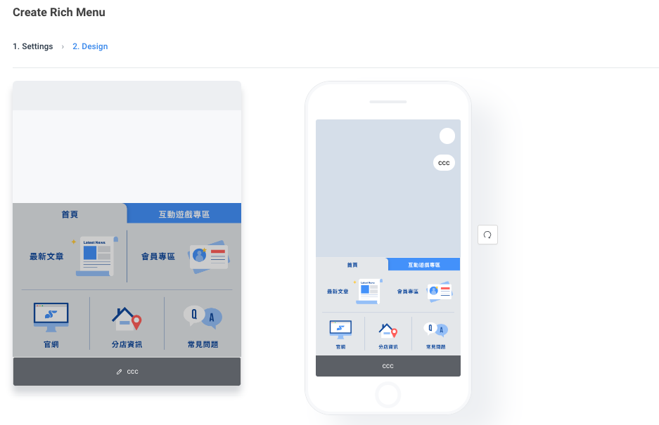
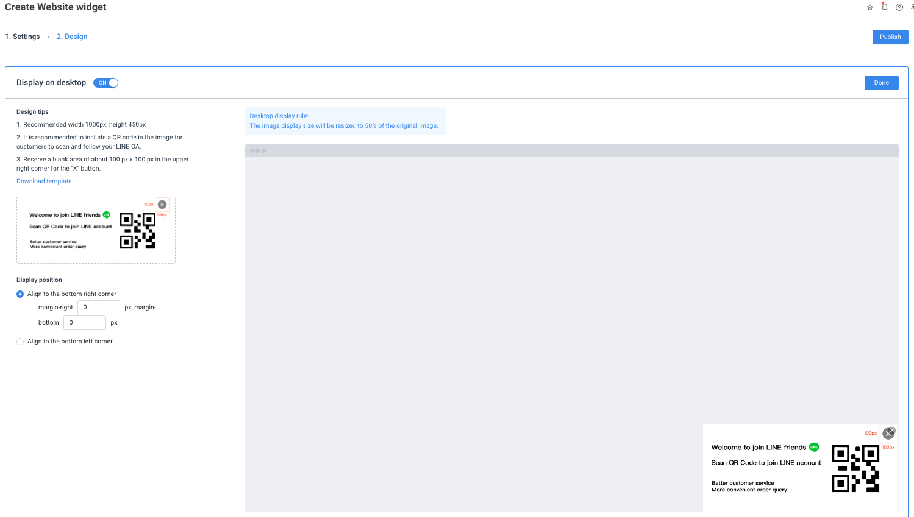
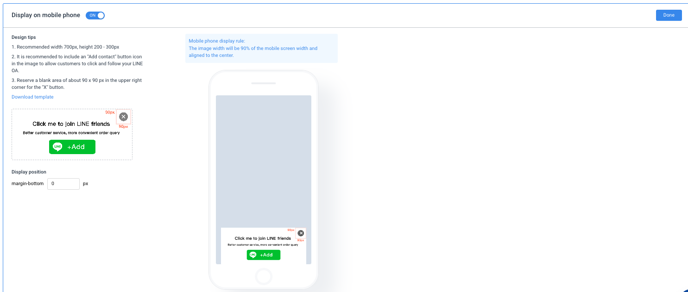
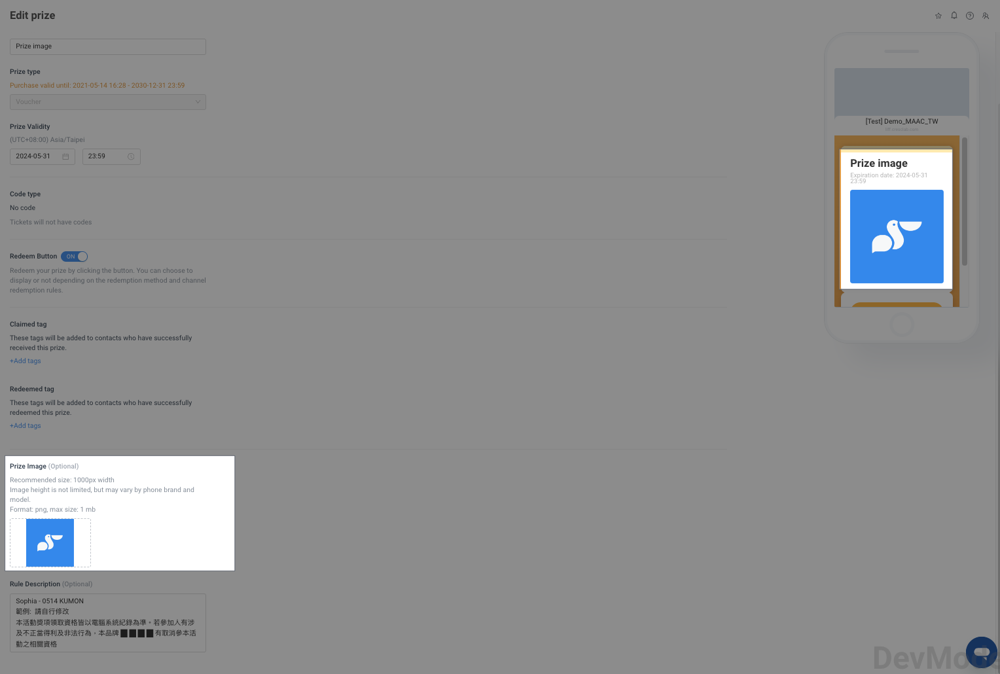

# Tutorials｜MAAC Materials Size – Crescendo Lab Help Center

No more hassle with image dimensions! Use this comprehensive guide to easily understand the specifications and tips for various MAAC materials.

#### Rich Menu Editor


For detailed instructions, refer to [Tutorials｜Editor](https://crescendolab.zendesk.com/hc/en-us/articles/4414603729689-Tutorials-Editor)


#### Rich Menu


The rich menu at the bottom of the LINE Official Account chat window plays a vital role in marketing strategy. Make the most of the clickable areas to create an optimal brand presence on LINE.


**Large Menu**

* Resolution: 2500 x 1686 pixels
* Max File Size: 1 MB
* File Types: jpg, jpeg, png (transparent png not supported)

**Small Menu**

* Resolution: 2500 x 843 pixels
* Max File Size: 1 MB
* File Types: jpg, jpeg, png (transparent png not supported)

#### Website widget


Use pop-ups on your website to attract high-value visitors and turn them into loyal LINE friends, helping to steadily increase your LINE Official Account's friend count.


Website widget - Display on desktop

* Resolution: Suggested 1000 x 450 pixels, adjustable ratio
* Aspect Ratio: No restriction
* Max File Size: 1 MB
* File Types: jpg, jpeg, png, gif
* Notes: Transparent png and gif animations are supported.
* Reserve about 100 x 100 pixels in the top right corner for the "X" close button, no need to design the "X" button yourself.
* Download template: https://cdn.maac.app/maac/widget/en/sample\_desktop.jpg

Website widget - Display on mobile phone

* Resolution: Suggested 700 x 200-300 pixels, adjustable ratio
* Aspect Ratio: No restriction
* Max File Size: 1 MB
* File Types: jpg, jpeg, png, gif
* Notes: Transparent png and gif animations are supported.
* Reserve about 90 x 90 pixels in the top right corner for the "X" close button, no need to design the "X" button yourself.
* Download template: https://cdn.maac.app/maac/widget/en/sample\_mobile.jpg

#### Prize Management

**Prize Images**


Use attractive prize images to make your members eager to redeem their rewards.


* Resolution: Suggested width 1000 pixels
* Aspect Ratio: No restriction
* Max File Size: 1 MB
* File Types: png

#### Receipt Module

**Event logo**

* Resolution: Suggested 600 x 400 pixels

Related articles

* [Tutorials｜MAAC Message Module & Template Library](https://crescendolab.zendesk.com/hc/en-us/related/click?data=BAh7CjobZGVzdGluYXRpb25fYXJ0aWNsZV9pZGwrCBkb49oDBDoYcmVmZXJyZXJfYXJ0aWNsZV9pZGwrCJka8YcDBDoLbG9jYWxlSSIKZW4tdXMGOgZFVDoIdXJsSSJUL2hjL2VuLXVzL2FydGljbGVzLzQ0MTQ2MDM3Mjk2ODktVHV0b3JpYWxzLU1BQUMtTWVzc2FnZS1Nb2R1bGUtVGVtcGxhdGUtTGlicmFyeQY7CFQ6CXJhbmtpBg%3D%3D--ddb4ed1e7bbf5b5850944d3af1f28efb2c643f20)
* [Tutorials｜ MAAC x SurveyCake Form](https://crescendolab.zendesk.com/hc/en-us/related/click?data=BAh7CjobZGVzdGluYXRpb25fYXJ0aWNsZV9pZGwrCJkr5rYDBDoYcmVmZXJyZXJfYXJ0aWNsZV9pZGwrCJka8YcDBDoLbG9jYWxlSSIKZW4tdXMGOgZFVDoIdXJsSSJGL2hjL2VuLXVzL2FydGljbGVzLzQ0MTM5OTk5NTA3NDUtVHV0b3JpYWxzLU1BQUMteC1TdXJ2ZXlDYWtlLUZvcm0GOwhUOglyYW5raQc%3D--50b664a2b7ec6fa19ff91fac5a8a38165d7d665a)
* [Tutorials｜Rapid Referral](https://crescendolab.zendesk.com/hc/en-us/related/click?data=BAh7CjobZGVzdGluYXRpb25fYXJ0aWNsZV9pZGwrCBkzBMgDBDoYcmVmZXJyZXJfYXJ0aWNsZV9pZGwrCJka8YcDBDoLbG9jYWxlSSIKZW4tdXMGOgZFVDoIdXJsSSI%2BL2hjL2VuLXVzL2FydGljbGVzLzQ0MTQyODcxMzE0MTctVHV0b3JpYWxzLVJhcGlkLVJlZmVycmFsBjsIVDoJcmFua2kI--a332d3ebd7e65eb965f5681bbc3d4b2bc0f8d1d9)
* [Tutorial｜Segment](https://crescendolab.zendesk.com/hc/en-us/related/click?data=BAh7CjobZGVzdGluYXRpb25fYXJ0aWNsZV9pZGwrCBlzlogDBDoYcmVmZXJyZXJfYXJ0aWNsZV9pZGwrCJka8YcDBDoLbG9jYWxlSSIKZW4tdXMGOgZFVDoIdXJsSSI2L2hjL2VuLXVzL2FydGljbGVzLzQ0MTMyMjI5NzQyMzMtVHV0b3JpYWwtU2VnbWVudAY7CFQ6CXJhbmtpCQ%3D%3D--94d54719b603d9795068883a1a969f6bd050b7ff)
* [How to share LINE OA platform, LINE Developers, GA(UA) / GA4 access to Crescendo Lab?](https://crescendolab.zendesk.com/hc/en-us/related/click?data=BAh7CjobZGVzdGluYXRpb25fYXJ0aWNsZV9pZGwrCJmp1FFgBzoYcmVmZXJyZXJfYXJ0aWNsZV9pZGwrCJka8YcDBDoLbG9jYWxlSSIKZW4tdXMGOgZFVDoIdXJsSSJ1L2hjL2VuLXVzL2FydGljbGVzLzgxMTAyNzExNDYzOTMtSG93LXRvLXNoYXJlLUxJTkUtT0EtcGxhdGZvcm0tTElORS1EZXZlbG9wZXJzLUdBLVVBLUdBNC1hY2Nlc3MtdG8tQ3Jlc2NlbmRvLUxhYgY7CFQ6CXJhbmtpCg%3D%3D--d5a58a9703c71cfa9a08e567da1edb1aecf0bfb0)

