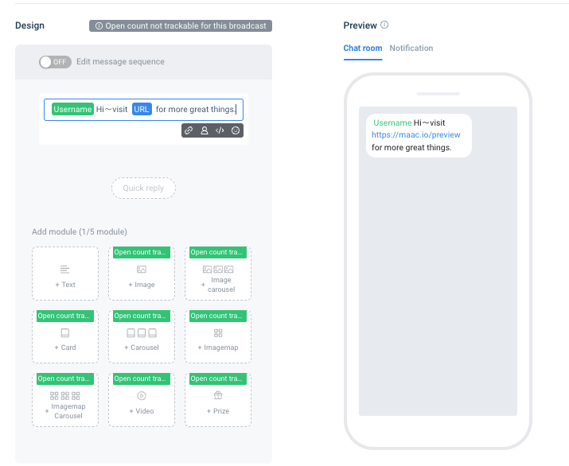
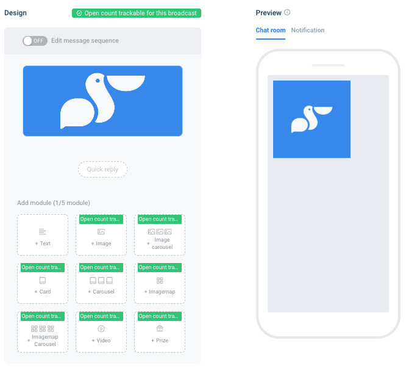
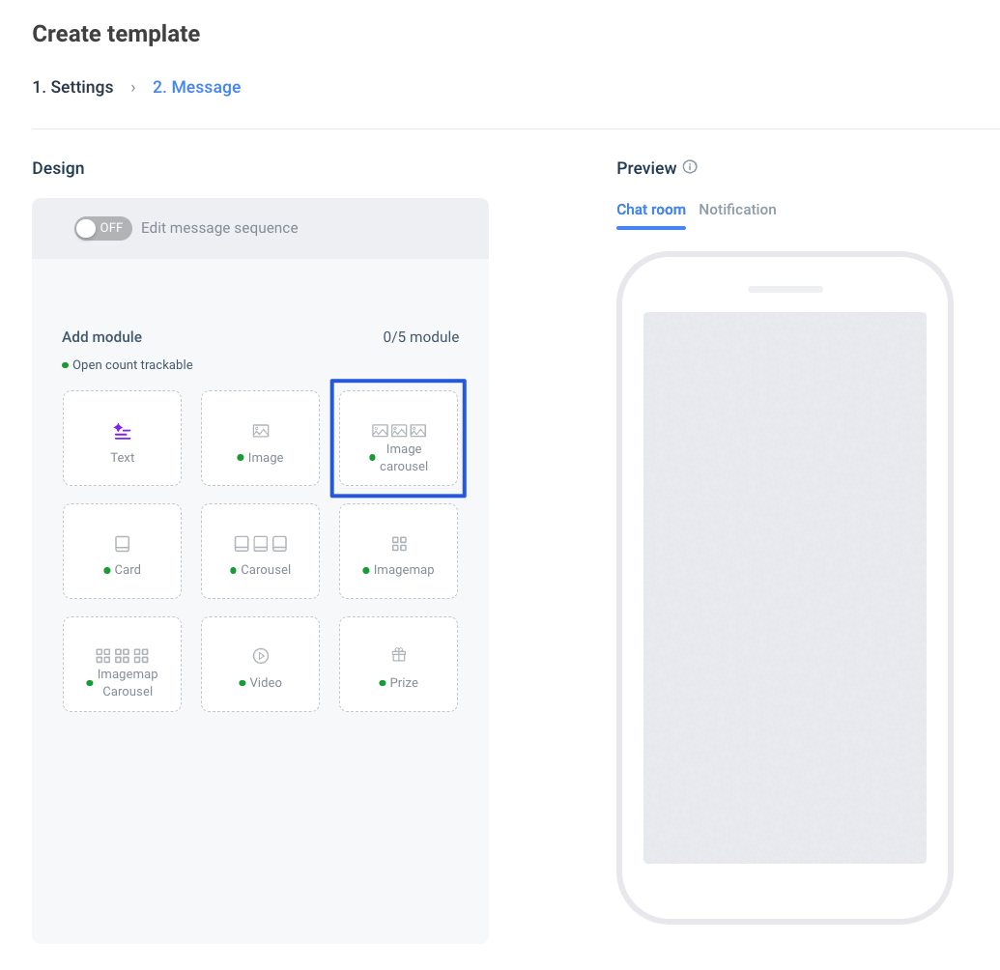
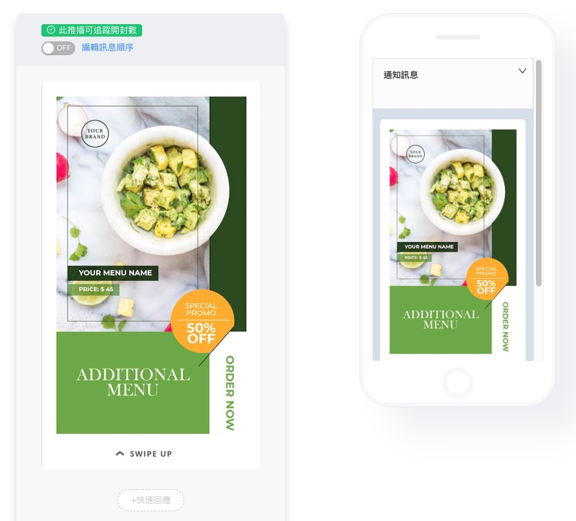
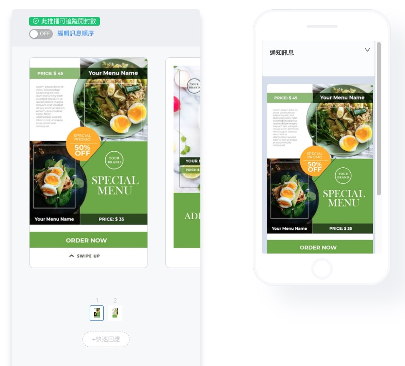
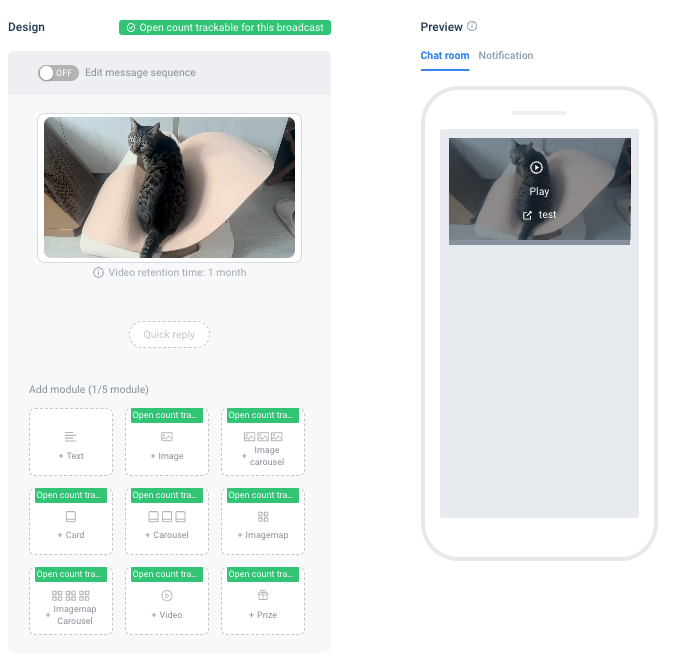
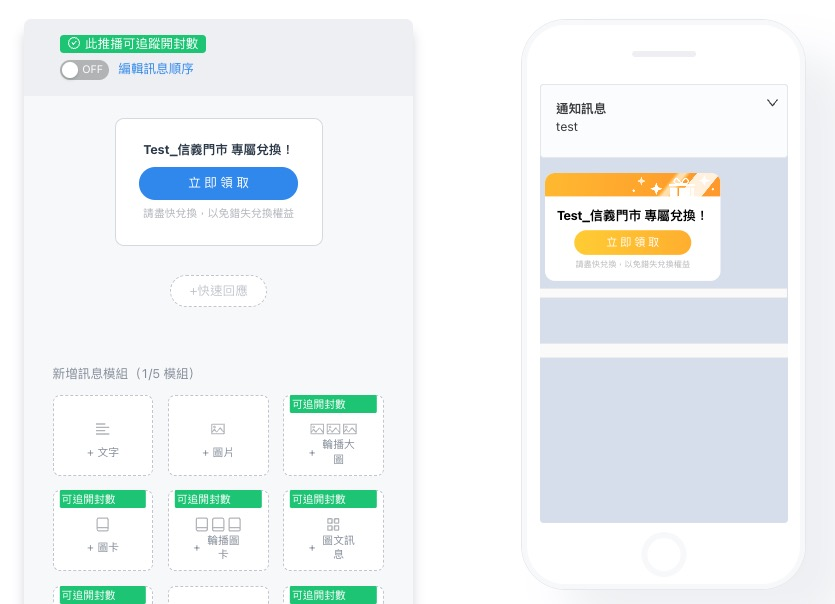
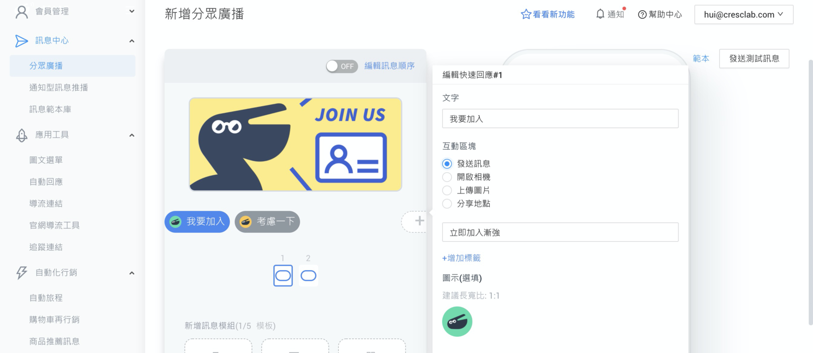
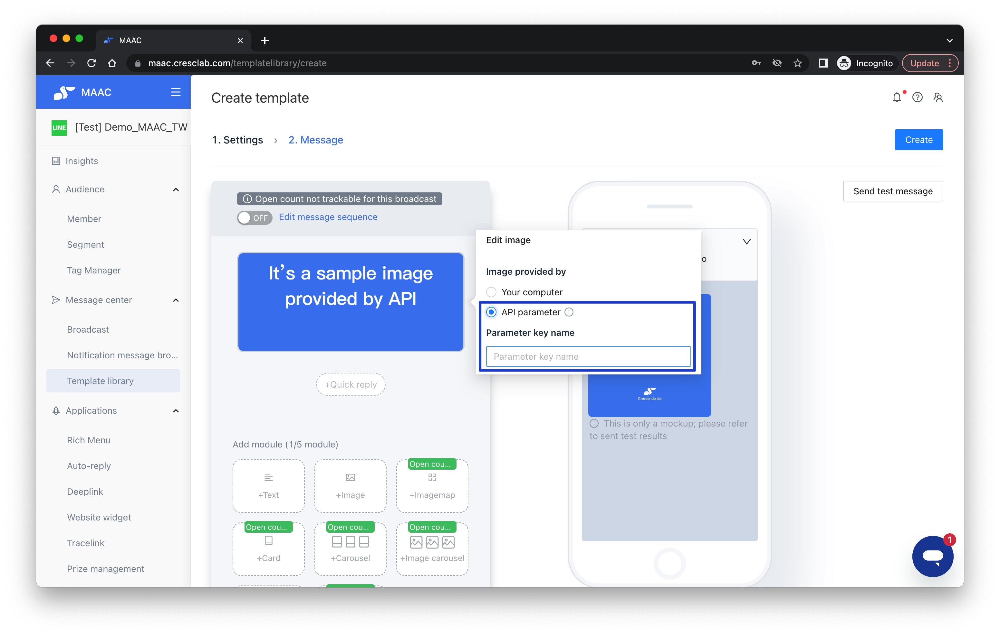

# Tutorials｜MAAC Message Module & Template Library – Crescendo Lab Help Center

MAAC offers a variety of message modules and a centralized message template library to help you efficiently manage content and deliver targeted marketing campaigns. This article provides an overview and setup guide.

### MAAC Message Modules

MAAC supports 9+1 message formats to empower your creativity and align with your brand's tone and style:

* Text
* Image
* Carousel Image
* Image Card / Carousel Cards
* Image-Text / Carousel Image-Text
* Video
* Reward
* Quick Reply
* Flex Message JSON (New)

All modules can be used in Broadcast, Auto Reply, and Journey settings, and are compatible with MAAC AI copywriting tools.

Plan Availability

* All MAAC users can use message modules
* AI writing features require a Growth plan or above

### Message Module

Reference

* The notification text is the text that appears on the mobile push notification and on the LINE app chat list (before entering the official account) when a friend receives a push notification from an official account.
* Please note whether the user has turned on "Auto-play GIFs" in "Settings > Photo. Video", otherwise the Animation will not run.

| Module              | Supports Open Tracking                                                      | Transparent Image Support | Link Support | AI Content | File Format                                                  | Max Size                                          | File Limit                             |
| ------------------- | --------------------------------------------------------------------------- | ------------------------- | ------------ | ---------- | ------------------------------------------------------------ | ------------------------------------------------- | -------------------------------------- |
| Text                | ❌                                                                           | -                         | ✅            | ✅          | -                                                            | -                                                 | -                                      |
| Image               | ✅Open may be duplicated if "Preview thumbnails" is enabled in LINE settings | ❌                         | ✅            | ✅          | jpg, jpeg, png                                               | 4096x4096, Ratio 1:3                              | <10MB                                  |
| Carousel Image      | ✅                                                                           | ❌                         | ✅            | ✅          | jpg, jpeg, png, apng                                         | the height must not exceed three times the width. | 
&#x3C;10MB, APNG &#x3C;300KB
 |
| Image Card          | ✅                                                                           | ❌                         | ✅            | ✅          | jpg, jpeg, png, apng                                         | the height must not exceed three times the width. | 
&#x3C;10MB, APNG &#x3C;300KB
 |
| Carousel Cards      | ✅                                                                           | ❌                         | ✅            | ✅          | jpg, jpeg, png, apng                                         | the height must not exceed three times the width. | 
&#x3C;10MB, APNG &#x3C;300KB
 |
| Image-Text          | ✅Open tracking not supported if height > width × 3                          | ✅                         | ✅            | ❌          | jpg, jpeg, png, apng\*\*APNG with transparency won't animate | Width: 1040, Suggested Ratio 1:3                  | 
&#x3C;10MB, APNG &#x3C;300KB
 |
| Carousel Image-Text | ✅                                                                           | ❌                         | ✅            | ❌          | Same                                                         | 4096x4096                                         | 
&#x3C;10MB, APNG &#x3C;300KB
 |
| Video               | ✅                                                                           | -                         | ✅            | ✅          | mp4 (H.264)                                                  | 1920x1920                                         | <3 mins, <200MB                        |
| Reward              | ✅                                                                           | -                         | -            | ❌          | -                                                            | -                                                 | -                                      |
| Quick Reply         | -                                                                           | -                         | -            | ❌          | jpg, jpeg, png, gif                                          | Suggested Ratio 1:1                               | <10MB                                  |

Tip: To check if an APNG has transparency, inspect its "Alpha channel" property. If set to "Yes," it is transparent.

Text

You can add friend names, links, and emojis in the text message.

Reminder: Less than 1600 words.

New Feature: The text editor now supports AI Help Me Write tools for faster copywriting.

Image

Image can be enlarged and viewed, and can also be downloaded and shared by friends. Try designing interesting images to attract your members, or provide image file information that your members may want to save for future reference.

Image carousel

Image carousel allows LINE friends to swipe multiple images left and right. Each image is a clickable area and is perfect for showcasing products, events, and fun games.

To enhance the interactivity and brand consistency of image carousel messages, we’ve added two new customization options:

* Label: Add a text label at the top of each image (e.g., “Hot”, “New”, “Limited”) to increase visibility and highlight key content.
* Display Button: Add a clear call-to-action button below each image (e.g., “Buy Now”, “Learn More”) to encourage user engagement.

Display Button features support custom colors, allowing you to align visuals with your brand identity and improve overall message performance.

Reminder: As the corners of the image are rounded, please keep a 25 x 25 pixel area at each corner to avoid important information being cropped due to the rounded corners.

Image Card & Carousel Card

Image cards are suitable for displaying organized information and products. Similar to image and text messages, you can create interactive behaviors using buttons, which can be a great tool for generating engagement, directing traffic, and increasing revenue!

Reminder:

* Up to four buttons can be set for each image card.
* As the corners of the image are rounded, please keep a 25 x 25 pixel area at each corner to avoid important information being cropped due to the rounded corners.

Imagemap

With the ability to create full-screen images and freely set multiple click areas, text and image messages have become the best tool for brands to create interactivity, traffic flow, and revenue.

Reminder:

* Since image corners are rounded, please reserve 25 × 25 pixels at each corner to avoid important content being cut off.
* If you are using non-proportional images (different width and height), please reconfigure the clickable areas to ensure accurate interaction mapping.

Imagemap Carousel (updated on 2023/03/06)

Liberate the limits of a single text and image message! Use carousel text and image messages to create more content presentation and diverse layouts, each text and image message can automatically interact with different "send messages", "open URLs", and "open URLs with API parameters", and bring in different tag data collection.

Reminder:

* Since image corners are rounded, please reserve 25 × 25 pixels at each corner to avoid important content being cut off.
* If you are using non-proportional images (different width and height), please reconfigure the clickable areas to ensure accurate interaction mapping.

Video

Dynamic videos have always been a trend in marketing campaigns. In addition to static images, try using videos to enhance effectiveness. You can add buttons to videos that guide LINE friends to click and open external websites, allowing them to explore more brand information. For example, when launching new products, you can not only showcase product videos but also include links for online shopping, preliminary interest surveys, and appointment consultations for diverse applications.

Crescendo Lab video module can now include buttons with tag settings, enabling tracking of open rates, click-through rates, and UTM data.

Reminder:

1. Opening URLs needs to be set up. If you do not want friends to jump to the webpage, you can set up an empty content deeplink in the opening URL.
2. The LINE app on iOS primarily uses Apple’s built-in video player (such as AVPlayer), which has limited support for video formats. It is recommended to use files with a Format Profile of Baseline or Main@L4.1 or lower. (You can check the file format using MediaInfoOnline: https://mediaarea.net/MediaInfoOnline.)

Reference: Video encoding format H.264, can use video format conversion tools on the Internet: https://video.online-convert.com/convert-to-mp4

Prize

Prizes established in prize management can be sent, including coupons, LINE Points, vouchers, game tix, brand coupons, etc.

Reminder: Please set up the award in the award management first, and then insert it into other function editors.

Quick Reply

Small, easy-to-answer buttons with a relaxed quiz feel, and adding icons can attract LINE friends' attention even more! The interaction methods can be text messages, opening the camera, uploading images, and sharing locations.

Reminder: Quick Reply must be set under the bubble of other message modules, and up to 13 Quick Replies can be set.

Flex Message JSON (New)

You can paste LINE Flex Message JSON into all MAAC message editors and the Template Library.

* Build visually branded, modular layouts
* Insert personalized contact fields or API data
* Combine with MAAC short links for click tracking and GA4 attribution

Flex Message JSON Setup Steps



### Compose and preview in LINE Flex Message Simulator

Go to LINE Flex Message Simulator: https://developers.line.biz/flex-simulator/?status=success\&status=success\&status=success\&status=success\&status=success



### Copy JSON into MAAC

Copy JSON into MAAC Message Module or template library.



### Enable click tracking

To enable click tracking, replace all destination URLs with MAAC short links (with GA events and tag parameters).



### Optional personalization

The Text component in Flex JSON supports inserting contact names and API parameters.



Flex Message JSON Personalization & Limitations

Flex JSON supports dynamic variables such as contact name, custom fields, and API data.

| Component Type | MAAC Short Link Support | Contact Name \{{contact.name\}} | API Param \{{api\_param.xxx\}} |
| -------------- | ----------------------: | ------------------------------: | -----------------------------: |
| Text           |                       ✅ |                               ✅ |                              ✅ |
| Image URL      |                       ❌ |                               ❌ |                              ✅ |
| Action URL     |                       ✅ |                               ❌ |                              ✅ |

Limitations & Tracking Notes

* Preview not available via MAAC preview window — use “Send Test Message” or check via the LINE Flex Message Simulator
* Certain actions are not trackable by MAAC. To track user behavior, always use MAAC short links in your action URLs

Untrackable actions:

* action.type = "message"
* datetimepicker
* postback

Others

Open API send messages with picture

* Features: When using the Open API to send pictures, parameters can be set to send customized picture files for different LINE friends
* Applicable objects: For those who purchase Open API Zone 3 - "Send Custom Parameters"
* Applicable message modules: Image, Card and Carousel
* Steps:
  * Go to Template library to set the message template
  * After uploading the image file, select "API parameter" and enter the required parameters, such as: birthday\_image
  * When using Open API Zone 3 to customize the broadcast, you can follow the parameters set in the above steps to correspond to different image files

Reference: MAAC Open API Documentation — https://cresclaben.docs.apiary.io/#reference/message/send-message/send-push-message

Reminder:

* If the image file is in URL format, the URL must end with the extension of the picture file, for example: .jpg, .png, .jpeg, etc. Otherwise, the picture will not be displayed properly on some computer versions of LINE, and the mobile version of LINE is not subject to this limit
* Imagemap cannot use the Open API to push and bring in image parameters

FAQ

What is the maximum number of cards I can upload in a carousel?

A: You can upload up to 10 cards in a carousel.

Why is my image not displaying correctly or failing to upload?

A: Please ensure the image is in JPG or PNG format without any transparent layers. Also, make sure the file size is under 10MB.

How many buttons can be configured on each card in the carousel?

A: Each card supports up to 3 buttons. We recommend using clear call-to-action (CTA) labels.

Message Template Library

The message template library allows teams to manage content centrally, reduce duplication, and speed up delivery.

Key Features

* Supports all message types, including Flex Message JSON
* Allows AI-assisted writing, parameter insertion, tagging
* Templates can be used in Segment Broadcast, Auto Reply, Journey, and Automation

Note: To use MAAC Open API for messaging, a template ID is required.

How to Access

Go to "Message Center > Template Library"

Related articles

* https://crescendolab.zendesk.com/hc/en-us/related/click?data=BAh7CjobZGVzdGluYXRpb25fYXJ0aWNsZV9pZGwrCBkD84cDBDoYcmVmZXJyZXJfYXJ0aWNsZV9pZGwrCBkb49oDBDoLbG9jYWxlSSIKZW4tdXMGOgZFVDoIdXJsSSJAL2hjL2VuLXVzL2FydGljbGVzLzQ0MTMyMTIyNjMxOTMtVHV0b3JpYWxzLVRlbXBsYXRlLWxpYnJhcnkGOwhUOglyYW5raQY%3D--c9f86f61ef2d9d7644ad4e2fa4ce5d7ca839664b
* https://crescendolab.zendesk.com/hc/en-us/related/click?data=BAh7CjobZGVzdGluYXRpb25fYXJ0aWNsZV9pZGwrCBkzBMgDBDoYcmVmZXJyZXJfYXJ0aWNsZV9pZGwrCBkb49oDBDoLbG9jYWxlSSIKZW4tdXMGOgZFVDoIdXJsSSI%2BL2hjL2VuLXVzL2FydGljbGVzLzQ0MTQyODcxMzE0MTctVHV0b3JpYWxzLVJhcGlkLVJlZmVycmFsBjsIVDoJcmFua2kH--13cf3bfbaadfc1c9815120919c236bcdae5e0e3a
* https://crescendolab.zendesk.com/hc/en-us/related/click?data=BAh7CjobZGVzdGluYXRpb25fYXJ0aWNsZV9pZGwrCJmp1FFgBzoYcmVmZXJyZXJfYXJ0aWNsZV9pZGwrCBkb49oDBDoLbG9jYWxlSSIKZW4tdXMGOgZFVDoIdXJsSSJ1L2hjL2VuLXVzL2FydGljbGVzLzgxMTAyNzExNDYzOTMtSG93LXRvLXNoYXJlLUxJTkUtT0EtcGxhdGZvcm0tTElORS1EZXZlbG9wZXJzLUdBLVVBLUdBNC1hY2Nlc3MtdG8tQ3Jlc2NlbmRvLUxhYgY7CFQ6CXJhbmtpCA%3D%3D--35594ded57d62d0f68be182a65cd97bf32b88a14
* https://crescendolab.zendesk.com/hc/en-us/related/click?data=BAh7CjobZGVzdGluYXRpb25fYXJ0aWNsZV9pZGwrCBlM0QcdBDoYcmVmZXJyZXJfYXJ0aWNsZV9pZGwrCBkb49oDBDoLbG9jYWxlSSIKZW4tdXMGOgZFVDoIdXJsSSJAL2hjL2VuLXVzL2FydGljbGVzLzQ1MjI3MzE3MTk3MDUtVHV0b3JpYWxzLUdhbWUtSW50ZXJhY3Rpb24GOwhUOglyYW5raQo%3D--8c6d70399291692cb1058d978fb5db7d617d8c02
* https://crescendolab.zendesk.com/hc/en-us/related/click?data=BAh7CjobZGVzdGluYXRpb25fYXJ0aWNsZV9pZGwrCJnaVfz6BjoYcmVmZXJyZXJfYXJ0aWNsZV9pZGwrCBkb49oDBDoLbG9jYWxlSSIKZW4tdXMGOgZFVDoIdXJsSSI6L2hjL2VuLXVzL2FydGljbGVzLzc2NzUwNDUwNzU2MDktVHV0b3JpYWxzLUNBQUMtVXNlcnMGOwhUOglyYW5raQo%3D--1af5ab2dadb66c6527f32eb520194254753ba1c4
