# Tutorials｜ MAAC x SurveyCake Form – Crescendo Lab Help Center

#### 💁🏻‍♀️ Advantage

After friends fill out the survey, they can automatically transfer their personal information, tags, and other data to MAAC via Webhook, allowing brands to integrate user data and provide a smoother user experience and better data collection.

* Collect user information and communication channels.
* Automatically send survey responses and tags back to MAAC, no more manual importing and exporting.
* Automatically send rewards or offers for completing the survey after the friend has completed it.
* All tags in the survey can trigger an automated Customer Journey, design the follow-up re-marketing messages and communication.

➤ SurveyCake form Application

* For users who have clicked and not completed the survey, you can filter with the tag of clicking survey and exclude with the tag of completing the survey, to send broadcasts or related messages to this segment to increase the survey completion rate.
* Conduct satisfaction surveys and game interactions for LINE friends, and send prizes with prize management to optimize the transaction/interaction rate.
* For users who completed surveys, trigger a follow-up customer journey with a tag to send out brand information, VIP events, coupon offers, etc.
* The survey can be linked to a message in the customer journey to guide the user to fill in the survey and then make a return purchase.

➤ Plan Availability

This is an advanced feature in APP marketing, needs purchase in addition, and is not included in the Basic or EC plan. If you're interested, please contact your CSM and we're happy to assist you!


To use the MAAC x SurveyCake form, you must be a SurveyCake Professional, Team or Enterprise Edition user. The survey can only be opened and completed on mobile devices. If you are not a friend of the LINE official account, you cannot fill out the survey, so it is not recommended to put it in an environment other than LINE.

After the survey is made public to friends, subsequent edits can still be made, but modified labels and user information are only applicable to new users after editing, and cannot be applied to friends who have already filled out the survey. After editing, please remember to click Save to save the settings. Please check the labels and user information fields again before making the survey public. Copy the form link to send the test message to the testers, fill it out internally and confirm it is correct before making it available to friends.


#### ▶︎ Setting Steps



### SurveyCake Platform - Basic survey settings

* Access the SurveyCake platform to create your survey, enter basic settings such as the name, welcome message, etc.
* The contents of the surveys can be broadly divided into "User Information Import" and "User Tag Tracking".

User Information Import setting:

* The following information can be imported into MAAC member fields: name, LINE UID, phone number, email address, member ID, birthday, and gender.
* When setting up user personal information, in order to match the MAAC member fields and forms, set the Alias and Default values (details below) to import collected user information directly into the MAAC member fields.

1. Survey questions settings > Click "Advanced" > Clicks "Alias and Default"

2. Fill in the value provided by MAAC settings steps below

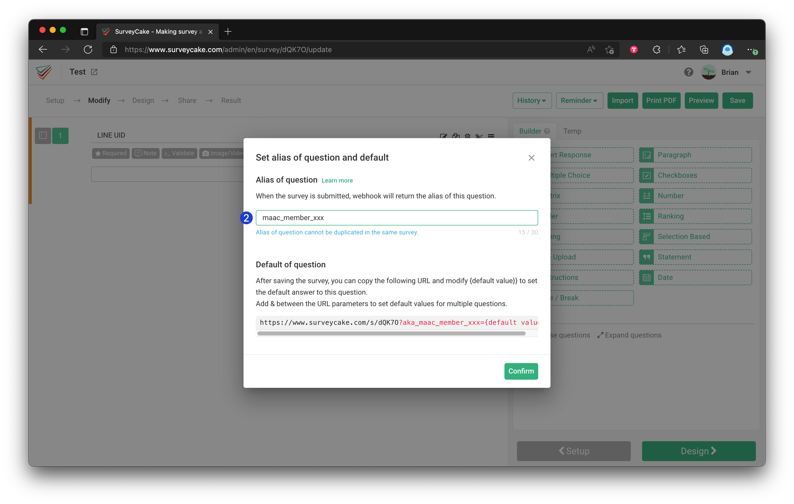



### SurveyCake Platform - User Tag Tracking

* All other questions or answers must be imported into MAAC in the form of "tags".
  * Tagging according to questions: the right of the question button "Advanced" > Tags
  * Tagging according to answers: the right of the answer button "Advanced" > Tags

Examples: 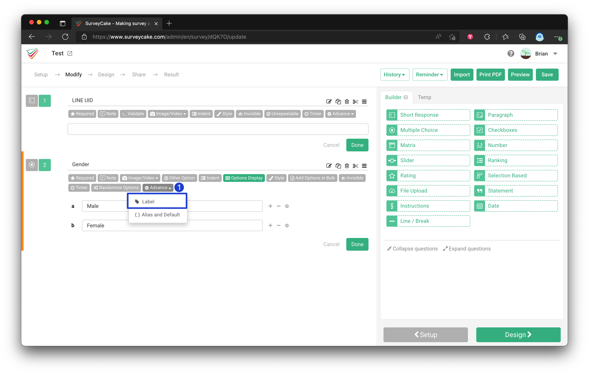  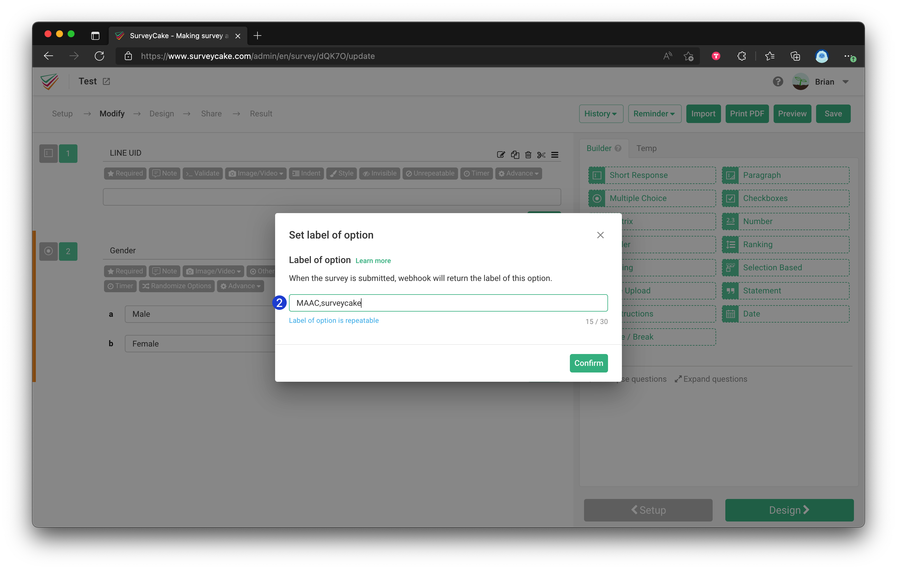

💡 Reminder: If you need more than one tag, separate them with a comma (“,”), e.g. MAAC, SurveyCake.

🚨 Attention:

* No more than 20 words in a single tag.
* The total number of words in all labels for a single topic or option must not exceed 30 words (according to SurveyCake specification).
* No more than 5 tags on the same option.



### SurveyCake Platform - User Information Import (field specifics)

LINE UID

* Must set the LINE UID field to complete binding of user identity and LINE UID.
* The system will bring in user LINE UID by default; users see their LINE UID as soon as they open the survey. Recommended to set as hidden to avoid user edits.
* Format restrictions:
  * Required: No
  * Question Type: Short Response
  * Step: Survey questions settings > Advanced > Alias and Default > Fill in "maac\_member\_line\_uid"

Reminder: Imported user information will overwrite original information in MAAC. If you want to keep original MAAC information, do not set Alias and Default for those fields.

Attention: Do not set both "Hidden" and "Required" on the same field.

Other fields and Alias/Default keys:

* Name
  * Optional to collect; imported into MAAC LINE display name (nickname) and will overwrite original LINE display name.
  * Required: No
  * Question Type: Short Response
  * Alias/Default: "maac\_member\_name"
* Phone number
  * Optional, but recommended to make required.
  * Imported to "Phone" in MAAC member field.
  * Required: Recommended
  * Question Type: Short Response
  * Alias/Default: "maac\_member\_mobile"
  * Reference: [Short Response - validate data](https://www.surveycake.com/en/help-center/survey/short-response)
  * For international numbers, users must include country code. To collect country mobile field use Alias "maac\_member\_country\_mobile".
* Mail
  * Optional, recommended to make required.
  * Imported to "Email" in MAAC member field.
  * Required: Recommended
  * Question Type: Short Response
  * Alias/Default: "maac\_member\_line\_email"
  * Reference: [Short Response - validate data](https://www.surveycake.com/en/help-center/survey/short-response)
*   Member ID (Customer ID)

    * Optional, recommended to set.
    * Imported to "Customer ID" in MAAC member field.
    * Required: Recommended
    * Question Type: Short Response
    * Alias/Default: "maac\_member\_line\_customer\_id"

    Reminder: Some brands use Mobile Phone Number as "Customer ID" binding identifier so the phone can import into both "Phone" and "Customer ID".
* Birthday
  * Optional.
  * Imported to "Birthday" in MAAC member field.
  * Required: No
  * Question Type: Date
  * Alias/Default: "maac\_member\_birthday"
*   Gender

    * Optional.
    * Imported to "Gender" in MAAC member field.
    * Required: No
    * Question Type: Date
    * Alias/Default: "maac\_member\_gender"

    Reminder: To import gender into MAAC, each gender answer must have an Alias code:

    * Male variants: set answer Alias to "male"
    * Female variants: set answer Alias to "female"
    * Non-binary/unknown/do not disclose: set answer Alias to "unknown"



### MAAC Platform - Integrate SurveyCake form with MAAC

Follow these steps to connect a SurveyCake form to MAAC:

1. In SurveyCake, go to the survey list, click the "..." button and "Share" at the bottom right of the survey you want to link to, copy the sharing link of the form, and paste it into your notes.

2. Click the "..." button and "Notifications" at the bottom right of the survey, then go to the Webhook page, copy the Hash Key and IV Key, and paste them into your notes.

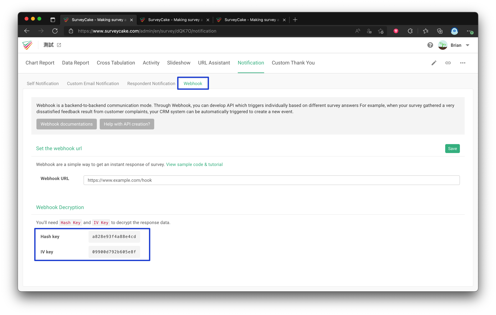

3. In the MAAC platform, go to APP marketing > SurveyCake Forms > Add Form.

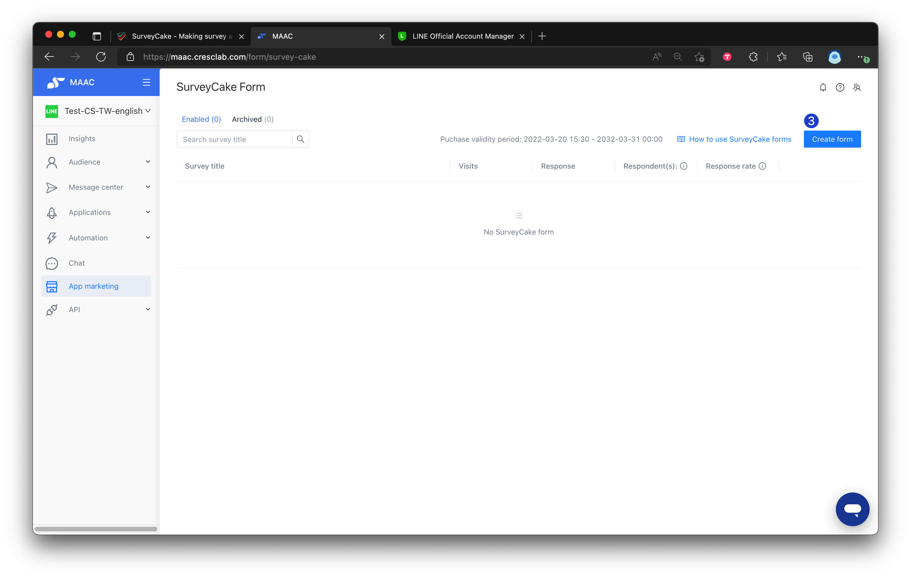

4. Fill in the survey title, link, Hash Key, and IV Key you copied from SurveyCake.

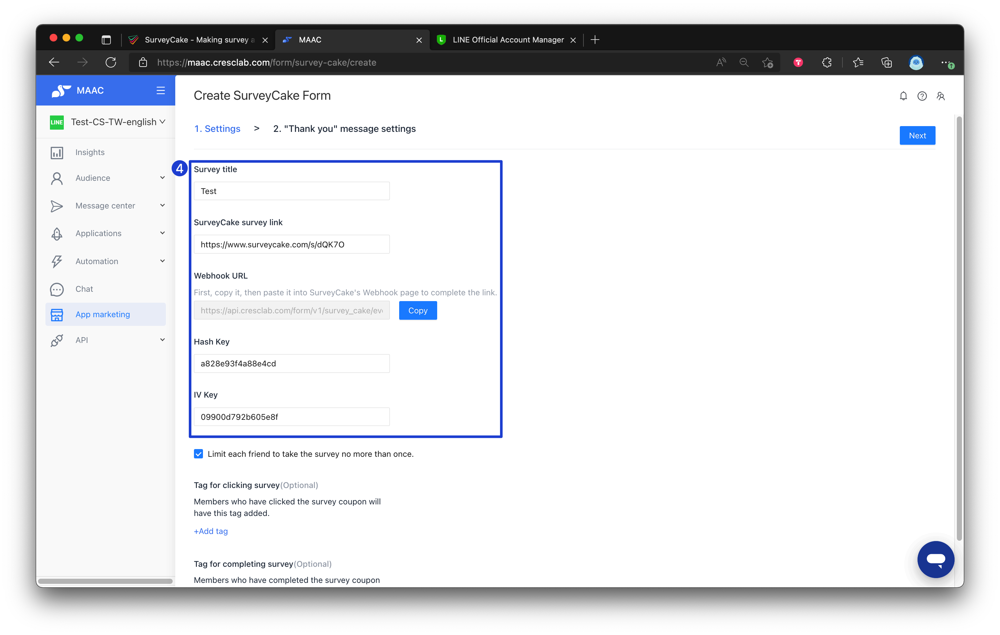

5. To avoid duplicate prizes and to tag clicks vs completions:
   *   MAAC platform: Check "Limit each friend to take the survey no more than once."

       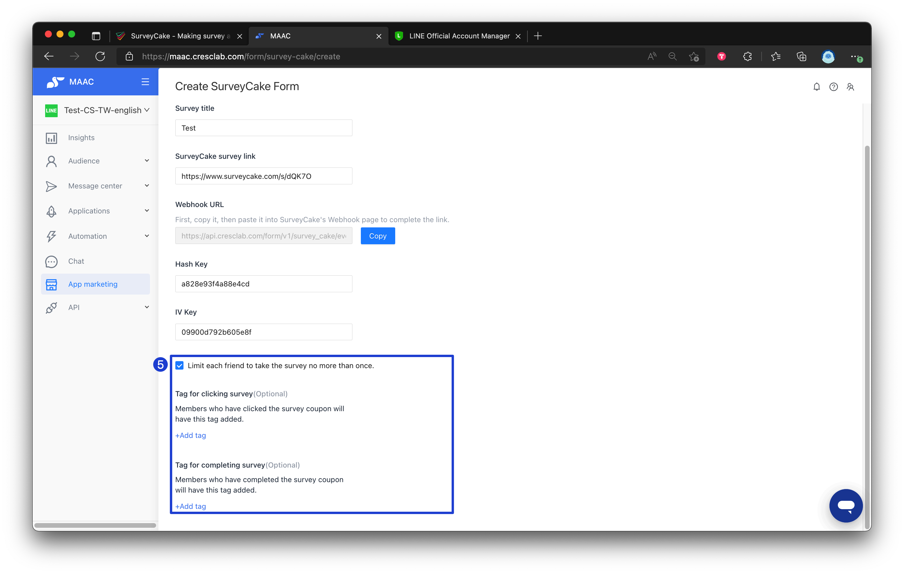
   *   SurveyCake platform: Survey Settings > Check "Isolate Multiple Responses" to avoid duplicate filling from the same browser.

       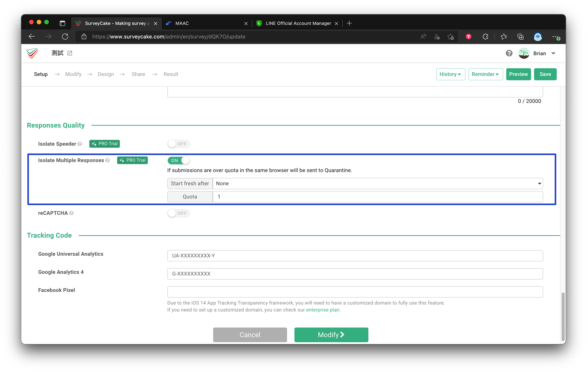
6. Copy the Webhook URL from MAAC and paste it into the Webhook URL field on the SurveyCake Webhook page, then click Save.

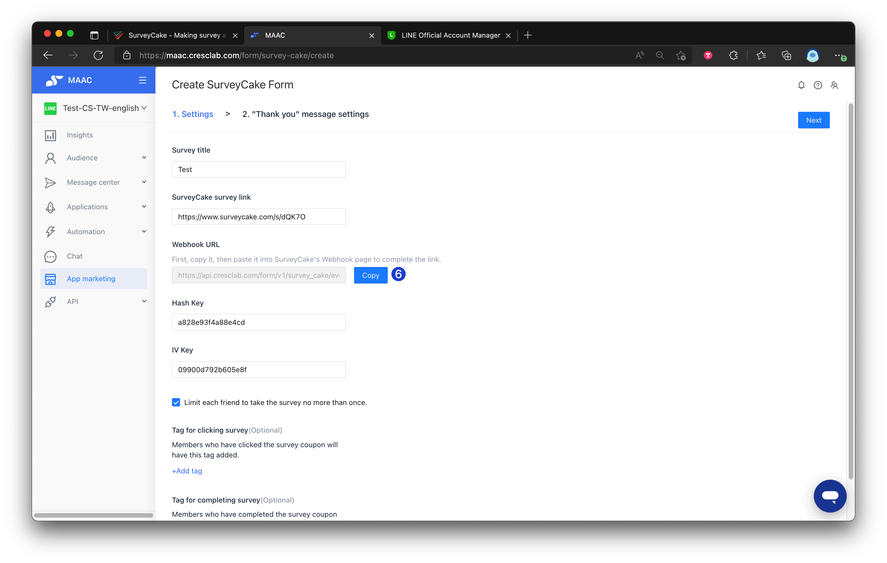 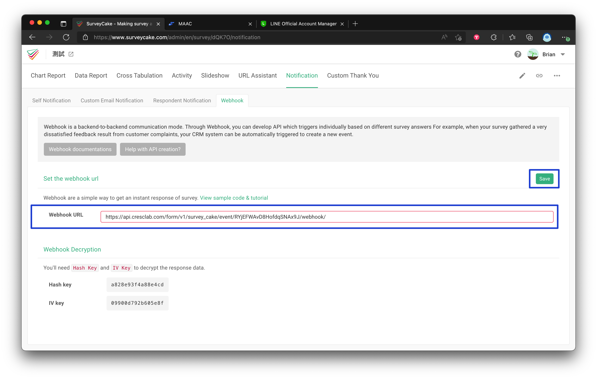

7. It is recommended to use this together with Prize Management. Click the "Create" button to complete the MAAC x SurveyCake form setup.

🚨 Attention: If the user can only play the game once, be sure to use it together with the "game tix".

Review: [Tutorials｜ Prize Management](https://crescendolab.zendesk.com/knowledge/articles/4412897068313/en-us?brand_id=1900000273608)

8. If the blue box "When a member clicks the link repeatedly, messages will also be sent repeatedly." is checked, users who repeat the form will be repeatedly sent thank you messages and rewards, and will be charged for pushing the message. If "Limit each friend to take the survey no more than once." is checked in the previous step, this item cannot be checked by default.

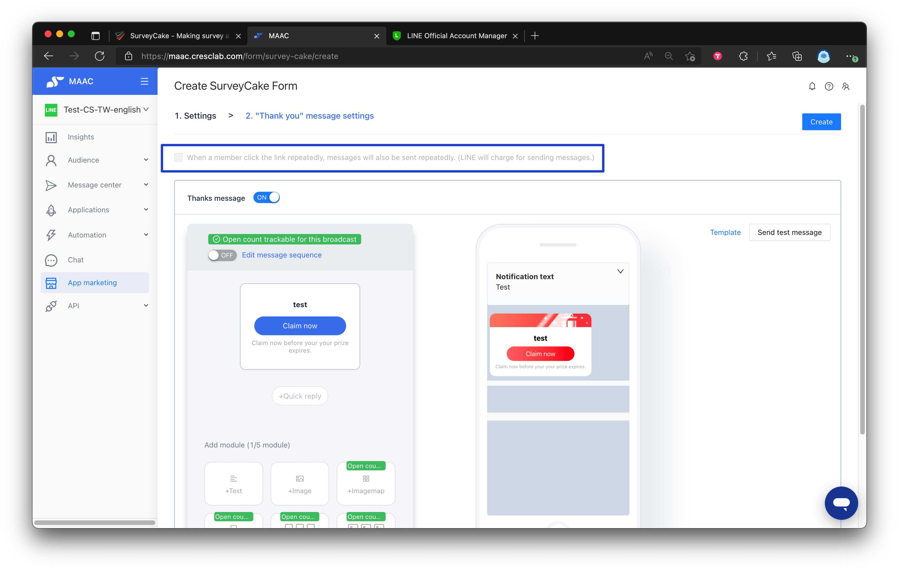

9. After completing the integration, go to the list page and copy the survey Liff URL. It can be directly put into editors of broadcast, auto-reply, rich menu, etc.

🚨 Attention: The survey link is a special Liff URL: "https://liff.line.me/\*\*\*\*\*\*\*\*\*\***/form/?webhook\_id=**\*\*\*\*\*", so it cannot be reduced to the short URL/tracelink of MAAC.

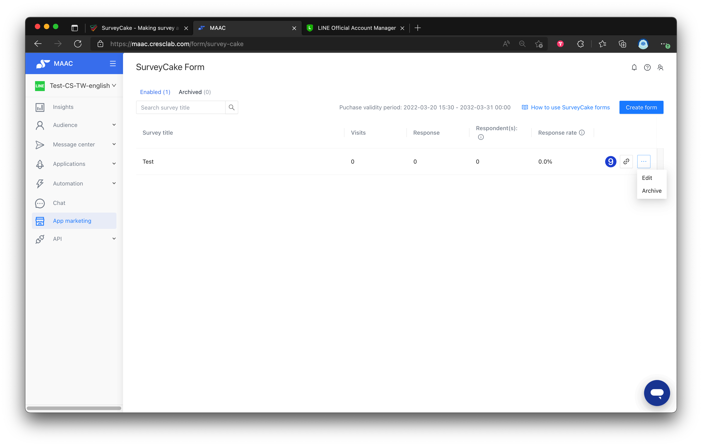

Tip: After users submit the survey, it will be automatically redirected to the official account, so users don't need to close the thank you page by themselves.

* In SurveyCake > Click survey > Custom Thank You > Set up redirect URL
* Fill in https://line.me/R/ti/p/\[bot basic id] (example: https://line.me/R/ti/p/@925kyswn), press Save.

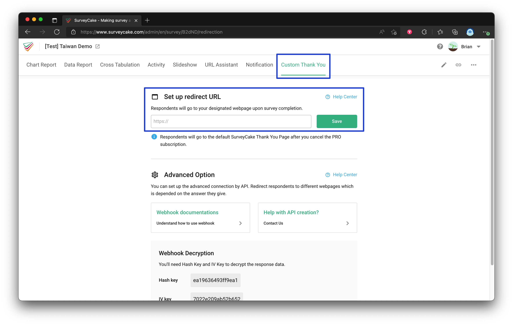



### Please check the following information first to ensure settings when you have some issues

* Make sure you click "Save" after setting "Set Webhook URL" in the SurveyCake platform.
* Make sure the alias setting is correct, especially for the LINE UID field.
* Make sure that both "Hidden" and "Required" can't be set in one field. For example, if the LINE UID field is set to "Hide", do not check "Required".
* Your SurveyCake platform plan must be Professional, Team, or Enterprise Edition.



#### ▶︎ List and Performance

* Data update: Currently data is updated once every 1 hour.
* Clicks: How many users click on the survey (does not represent the actual number of survey returns).
* Number of replies: The actual number of surveys returned.
* Number of Responses: The number of non-repeated users who completed the survey (e.g., 3 users completed 5 surveys → number of responses = 3).
* Response rate:
  * If repeats are allowed: response rate = number of responses (actual number of questionnaires returned) / Clicks.
  * If limited to one completion per person: response rate = number of responses / number of non-repeated clicks.
* Created surveys can only be closed and cannot be deleted.
* Copy the survey Liff URL; it can be directly put into editors of broadcast, auto-reply, rich menu, etc.

Related articles

* [Tutorials｜Rapid Referral](https://crescendolab.zendesk.com/hc/en-us/related/click?data=BAh7CjobZGVzdGluYXRpb25fYXJ0aWNsZV9pZGwrCBkzBMgDBDoYcmVmZXJyZXJfYXJ0aWNsZV9pZGwrCJkr5rYDBDoLbG9jYWxlSSIKZW4tdXMGOgZFVDoIdXJsSSI%2BL2hjL2VuLXVzL2FydGljbGVzLzQ0MTQyODcxMzE0MTctVHV0b3JpYWxzLVJhcGlkLVJlZmVycmFsBjsIVDoJcmFua2kG--8b2983dff673cf958422e03bb3fafef8a7cfcf1a)
* [Tutorials｜Webhook](https://crescendolab.zendesk.com/hc/en-us/related/click?data=BAh7CjobZGVzdGluYXRpb25fYXJ0aWNsZV9pZGwrCJnyT08EBDoYcmVmZXJyZXJfYXJ0aWNsZV9pZGwrCJkr5rYDBDoLbG9jYWxlSSIKZW4tdXMGOgZFVDoIdXJsSSI3L2hjL2VuLXVzL2FydGljbGVzLzQ0MTY1NTcwMTk4MDEtVHV0b3JpYWxzLVdlYmhvb2sGOwhUOglyYW5raQc%3D--c06dba75f518967c5be3c6784c693e8211b4b0d5)
* [How to share LINE OA platform, LINE Developers, GA(UA) / GA4 access to Crescendo Lab?](https://crescendolab.zendesk.com/hc/en-us/related/click?data=BAh7CjobZGVzdGluYXRpb25fYXJ0aWNsZV9pZGwrCJmp1FFgBzoYcmVmZXJyZXJfYXJ0aWNsZV9pZGwrCJkr5rYDBDoLbG9jYWxlSSIKZW4tdXMGOgZFVDoIdXJsSSJ1L2hjL2VuLXVzL2FydGljbGVzLzgxMTAyNzExNDYzOTMtSG93LXRvLXNoYXJlLUxJTkUtT0EtcGxhdGZvcm0tTElORS1EZXZlbG9wZXJzLUdBLVVBLUdBNC1hY2Nlc3MtdG8tQ3Jlc2NlbmRvLUxhYgY7CFQ6CXJhbmtpCA%3D%3D--94fe3705efeca92e97f8802c048d0b3731bcb1f5)
* [Tutorials｜CAAC Users](https://crescendolab.zendesk.com/hc/en-us/related/click?data=BAh7CjobZGVzdGluYXRpb25fYXJ0aWNsZV9pZGwrCJnaVfz6BjoYcmVmZXJyZXJfYXJ0aWNsZV9pZGwrCJkr5rYDBDoLbG9jYWxlSSIKZW4tdXMGOgZFVDoIdXJsSSI6L2hjL2VuLXVzL2FydGljbGVzLzc2NzUwNDUwNzU2MDktVHV0b3JpYWxzLUNBQUMtVXNlcnMGOwhUOglyYW5raQk%3D--ba43c1e3cec0ac00d3c0068d29660b934f23965c)
* [Tutorials｜My Coupons](https://crescendolab.zendesk.com/hc/en-us/related/click?data=BAh7CjobZGVzdGluYXRpb25fYXJ0aWNsZV9pZGwrCBnzGdsDBDoYcmVmZXJyZXJfYXJ0aWNsZV9pZGwrCJkr5rYDBDoLbG9jYWxlSSIKZW4tdXMGOgZFVDoIdXJsSSI6L2hjL2VuLXVzL2FydGljbGVzLzQ0MTQ2MDczMjM5MjktVHV0b3JpYWxzLU15LUNvdXBvbnMGOwhUOglyYW5raQo%3D--0f425fdab39766d2b27d376081cb855c52ccb654)
