# Tutorials｜Rapid Referral – Crescendo Lab Help Center

**💁🏻‍♀️ Advantage**

* You can set your own LIFF visual page, it’s more flexible in visual design.
* It can be used in combination with coupons, line points, game tix, and vouchers for diverse campaigns.
* Both inviter and invitee messages can be broadcasted with customized messages.
* Create opportunities for your friends to interact with their friends, so that the number of friends grows quickly.
* Only Invite the brand new friends can be calculated, not including unfollowers who already have data in MAAC.

#### ➤ Plan Availability

This is an advanced feature in APP marketing, needs purchase in addition, and is not included in the Basic or EC plan. If you're interested, please contact your CSM and we're happy to assist you!

#### 🚨 Important Note

* In order to ensure the normal operation of Rapid Referral function, please confirm that the **Add friend option** in **LIFF > MAAC COMMON COMPACT** in the Login Channel of LINE Developers is **off**.

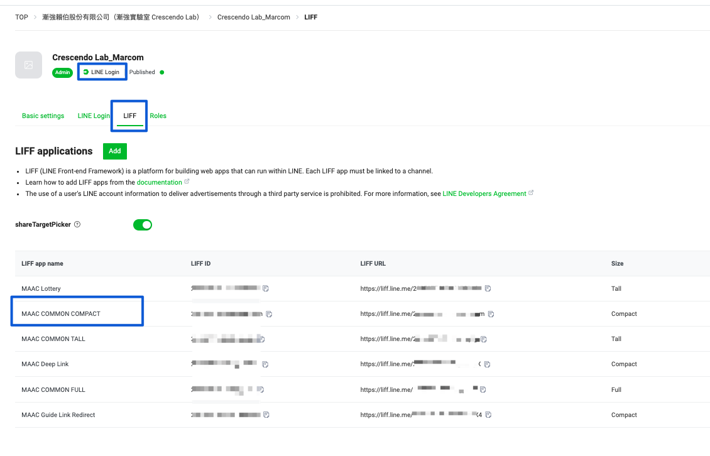 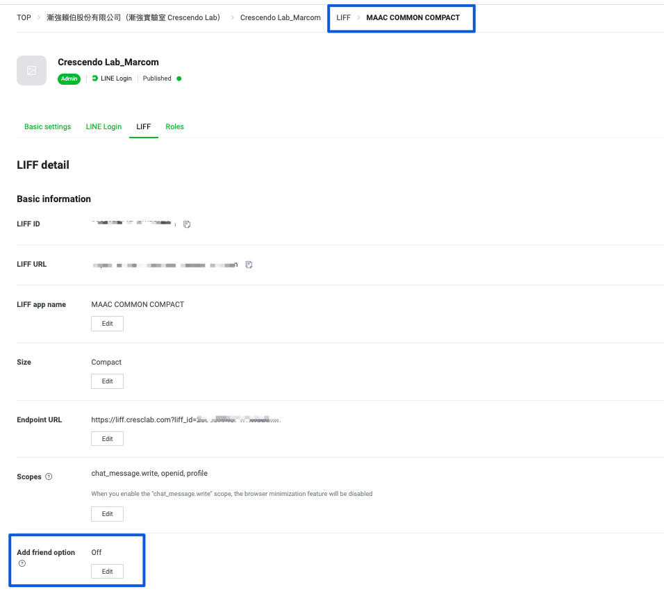

#### ▶︎ Setting



### Create and open the Rapid Referral editor

* At the top of the APP marketing > Game interaction area, you will see the "Rapid Referral" button.
* After you click the "Edit" button, you can enter the rapid referral page, and click "Create" on the top and right corner.




### Event name, activity period, and tags

* Set the "Event Name", the rapid referral campaign name.
* Set the "Activity period", the start and end time of this campaign.
* Set tags:
  * Inviter tag: When the friends participate in rapid referral, they will become inviters, and they will be tagged in this setting.
  * Invitee tag: When the new friends are successfully invited by the inviter and join LINE OA.

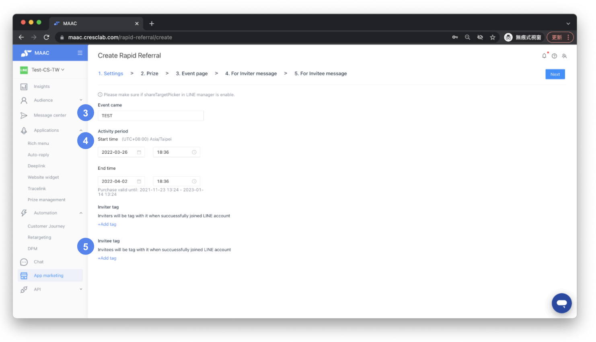



### Prize configuration

You can set the prize redemption criteria and the number of rewards.

* Prize Setting: You can set different prizes for different achievement goals, up to five prize rules. (For example, invite 3 people to receive Award A; invite 5 people to receive Prize B.)
* Redemption settings: set the number of people to be invited to provide exclusive awards. (Reference: synchronized with the use of Prize management: https://crescendolab.zendesk.com/hc/en-us/articles/4412897068313-Tutorials-Prize-Management)
* The total number of prizes: set the total number of prizes; ensure the number of prizes is sufficient.
* The maximum number of redemptions per person: e.g., if set to 2 redemptions per person and you must invite 3 people to redeem a prize, inviting 10 people still only allows 2 redemptions due to the per-person limit.

An example to illustrate prize rules and redemption:

* Example of using context setting:
  * Award A: win by inviting 1 friend or more, redemption limit 2 times
  * Award B: win by inviting 2 friends, redemption limit 2 times
  * Award C: win by inviting 4 friends, redemption limit 1 time
* User Redemption Status:
  * When friends invite 2 people, they can choose to redeem two of Prize A or one of Prize B.
  * When friends invite more than 4 people, possible redemption combinations include: two of Prize A + one of Prize B / two of Prize B / one of Prize C.
  * When friends invite 10 people, all coupons can be redeemed: two of Prize A + two of Prize B + one of Prize C.

Notes:

* If the prize is set to the game module, it should be used with game tix.
* It is recommended to align the number of prizes in Rapid Referral with prize management. Use separate versions for official/tested Rapid Referral to avoid inconsistencies.
* Avoid using game coupons with the game mechanism “draws daily” (it may cause loss of previously gained games). MAAC does not provide a list of failed attempts.

Guidance for scaling prizes:

* Do not set all five prize rules at the beginning.
* Keep unused prize rules and add them when additional prizes are added so the system can track prizes, redemption limits, and cumulative participation.

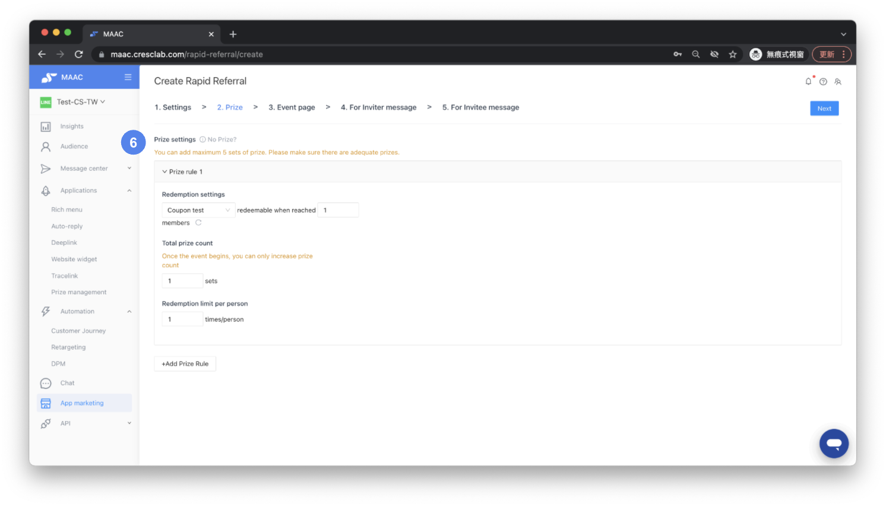



### Event page visuals and assets

You can set your own LIFF visual page.

* Event main picture
  * Specifications: Width 1000 px
  * Recommended height: unlimited (might vary by phone model)
  * Format: png, max 1 MB
* Background picture
  * Specifications: Width 1000 px
  * Recommended height: 1500 px (may vary by phone model)
  * Format: png, max 1 MB
* Prize list image
  * Specifications: Width 1000 px
  * Recommended height: 1500 px (may vary by phone model)
  * Format: png, max 1 MB

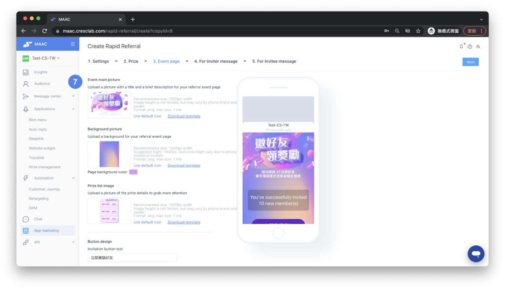

* Button and text settings: Invitation button text, Redemption Button Text, Previous Redemption Button Text, Previous Invites Button Text, etc.

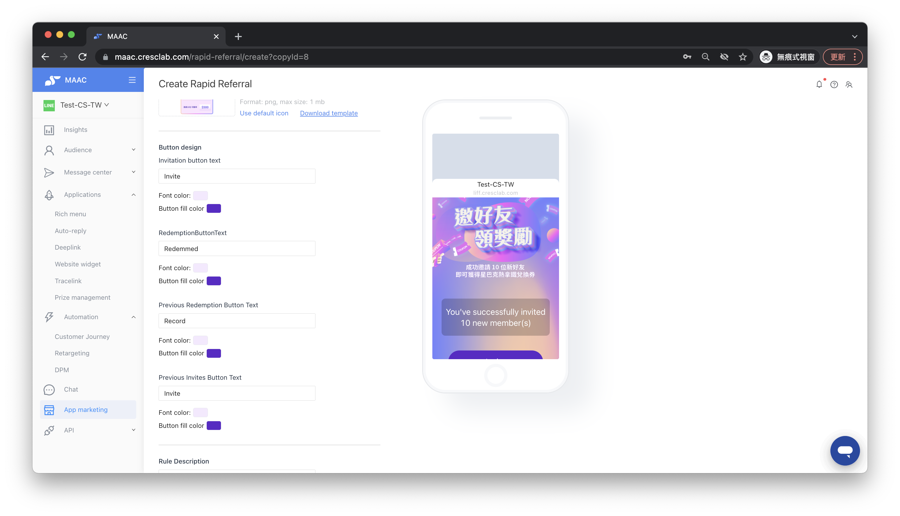



### Messages to inviter and invitee

* Message to the inviter: Notification messages can be sent to inviters including:
  * Notification that the invitee has successfully joined as a friend
  * Notification that the invitee is already a member
  * Notification for reaching redemption conditions
  * If you actively promote a message to an "inviter", you will be charged for the message.
  * Review: What is a notification message (no English translation of the article yet)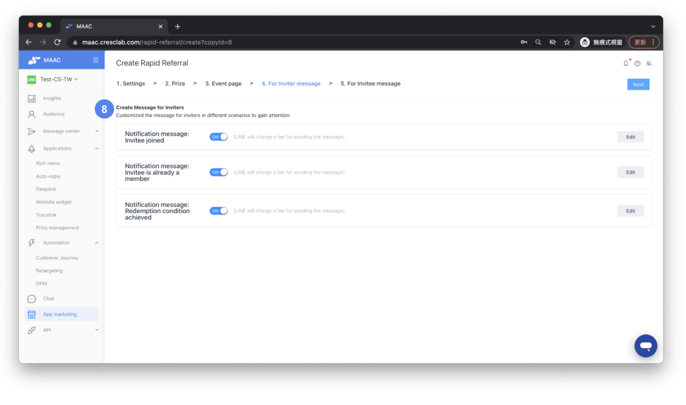
* Message to invitees: Notification messages can be sent to invitees including:
  * The invitee was successfully added as a friend.
  * The invitee is already a friend.
  * If the invitee is already a friend, a message fee will be charged.

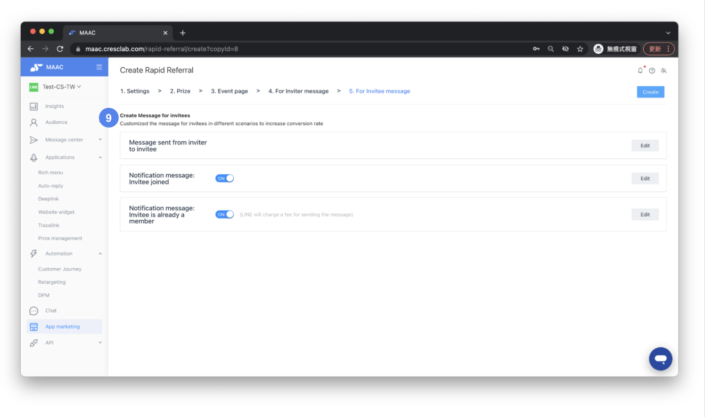

Attention:

* Do not use Card, Carousel, Imagemap, Image carousel, or Video message modules in messages from inviter to invitee; otherwise the message will not be sent successfully.
* Do not change or delete the green field "Event Invitation Link" in the message sent by the inviter to the invitee. The link is exclusive to each inviter and any change will directly affect execution and data tracking.

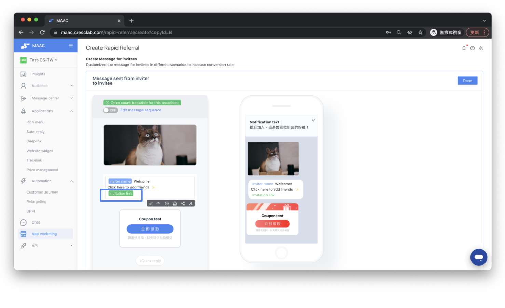



#### ▶︎ List and Performance

* The time range of available modules is displayed on the top right of the screen, and the activation time of each file is displayed below each Rapid Referral for your easy reference.
* To the right of the name, the event status ICON will be displayed to check if the event is “Not started", “Ongoing" or “Ended".
* Each campaign will show the number of clicks on the campaign page, the number of inviters, and the total number of gained members count (i.e. how many new friends you have gained).
* Click the "Report" icon to go to the detailed results data of the project, and click the "Export" button to view detailed results.
* Tap the "..." icon to edit, create a copy, copy a link, and delete.
* Click "Rapid Referral" at the top right of the screen to create a Rapid Referral campaign.

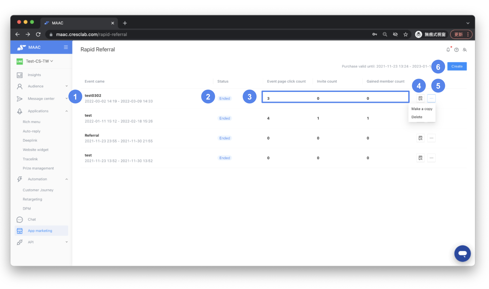

#### ▶︎ Notes on operation

🚨 Attention: Crescendo Lab provides system platform services and guarantees its system stability. Because Rapid Referral cannot determine invalid accounts or block improper prize collection tools, if you expect to release a high amount of LINE points or a high-value award, you need to evaluate carefully.

After Rapid Referral is opened, Crescendo Labs ensures the normal operation of the system; valuable award distribution is not covered by this service.

Reminder: "New Friends" are new friends in the MAAC system. This does not include people who blocked and then unblocked the official account.

* If a friend has information in MAAC and has blocked the brand's official account, inviting the friend to participate in the campaign will not accumulate reward counts.
* If the friend had already blocked the official account before the brand was connected to MAAC, or if the friend blocked the account and has no data in MAAC, it is able to accumulate the number of rewards.

Reminder: Prize display description

1. When the total number of prizes has been redeemed, the "All Redeemed" stamp will be displayed.
2. When the award has reached the personal redemption limit, the "Redeemed" stamp is shown.
3. When the prize has expired, the "Expired" stamp is displayed.

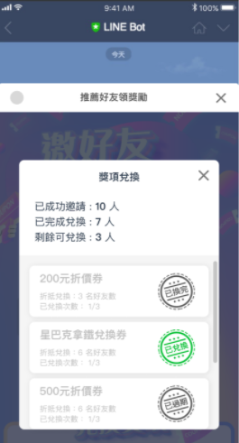

Related articles

* Tutorials｜ Prize Management：Coupon、LINE Points、Vouchers、Game tixs、Brand Coupons
  * https://crescendolab.zendesk.com/hc/en-us/related/click?data=BAh7CjobZGVzdGluYXRpb25fYXJ0aWNsZV9pZGwrCBmFKXUDBDoYcmVmZXJyZXJfYXJ0aWNsZV9pZGwrCBkzBMgDBDoLbG9jYWxlSSIKZW4tdXMGOgZFVDoIdXJsSSJ0L2hjL2VuLXVzL2FydGljbGVzLzQ0MTI4OTcwNjgzMTMtVHV0b3JpYWxzLVByaXplLU1hbmFnZW1lbnQtQ291cG9uLUxJTkUtUG9pbnRzLVZvdWNoZXJzLUdhbWUtdGl4cy1CcmFuZC1Db3Vwb25zBjsIVDoJcmFua2kG--d0649710d64e3ee11ae7b3b741ed5499c8a9da7b
* Tutorials｜Game Interaction
  * https://crescendolab.zendesk.com/hc/en-us/related/click?data=BAh7CjobZGVzdGluYXRpb25fYXJ0aWNsZV9pZGwrCBlM0QcdBDoYcmVmZXJyZXJfYXJ0aWNsZV9pZGwrCBkzBMgDBDoLbG9jYWxlSSIKZW4tdXMGOgZFVDoIdXJsSSJAL2hjL2VuLXVzL2FydGljbGVzLzQ1MjI3MzE3MTk3MDUtVHV0b3JpYWxzLUdhbWUtSW50ZXJhY3Rpb24GOwhUOglyYW5raQc%3D--4a373184a8837a97ba255f55bc84ef01053e7c6f
* Tutorials｜ MAAC x SurveyCake Form
  * https://crescendolab.zendesk.com/hc/en-us/related/click?data=BAh7CjobZGVzdGluYXRpb25fYXJ0aWNsZV9pZGwrCJkr5rYDBDoYcmVmZXJyZXJfYXJ0aWNsZV9pZGwrCBkzBMgDBDoLbG9jYWxlSSIKZW4tdXMGOgZFVDoIdXJsSSJGL2hjL2VuLXVzL2FydGljbGVzLzQ0MTM5OTk5NTA3NDUtVHV0b3JpYWxzLU1BQUMteC1TdXJ2ZXlDYWtlLUZvcm0GOwhUOglyYW5raQg%3D--69f369ffaa0a718e15f26c4bfa4e591cec719bc3
* Tutorials｜MAAC Message Module & Template Library
  * https://crescendolab.zendesk.com/hc/en-us/related/click?data=BAh7CjobZGVzdGluYXRpb25fYXJ0aWNsZV9pZGwrCBkb49oDBDoYcmVmZXJyZXJfYXJ0aWNsZV9pZGwrCBkzBMgDBDoLbG9jYWxlSSIKZW4tdXMGOgZFVDoIdXJsSSJUL2hjL2VuLXVzL2FydGljbGVzLzQ0MTQ2MDM3Mjk2ODktVHV0b3JpYWxzLU1BQUMtTWVzc2FnZS1Nb2R1bGUtVGVtcGxhdGUtTGlicmFyeQY7CFQ6CXJhbmtpCQ%3D%3D--53f284f2d3d0d29c013657ad16ef66cdea7c5f5f
* Tutorials｜Editor/Broadcast-Share button
  * https://crescendolab.zendesk.com/hc/en-us/related/click?data=BAh7CjobZGVzdGluYXRpb25fYXJ0aWNsZV9pZGwrCBlZTUSSEDoYcmVmZXJyZXJfYXJ0aWNsZV9pZGwrCBkzBMgDBDoLbG9jYWxlSSIKZW4tdXMGOgZFVDoIdXJsSSJOL2hjL2VuLXVzL2FydGljbGVzLzE4MjIwMzk3MTg5NDAxLVR1dG9yaWFscy1FZGl0b3ItQnJvYWRjYXN0LVNoYXJlLWJ1dHRvbgY7CFQ6CXJhbmtpCg%3D%3D--b08af51c3b701a251432869f89e0c0854a20f277)
