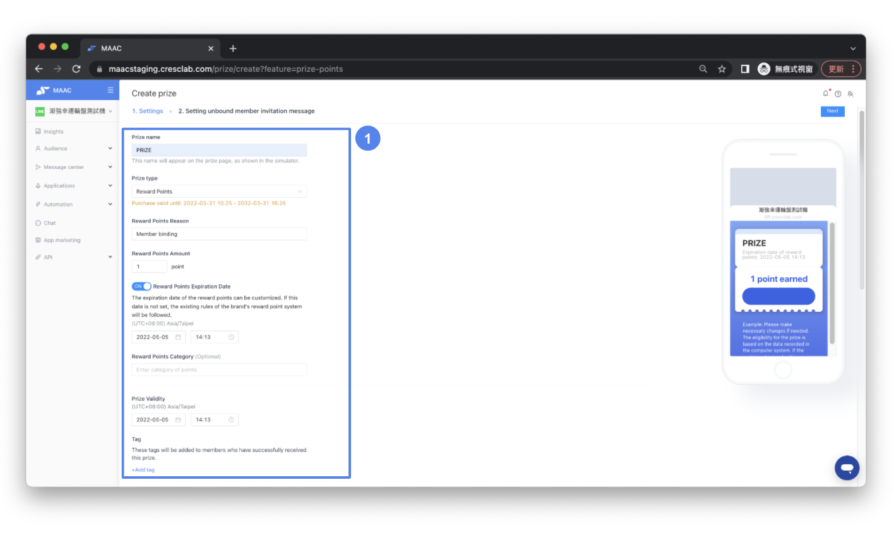
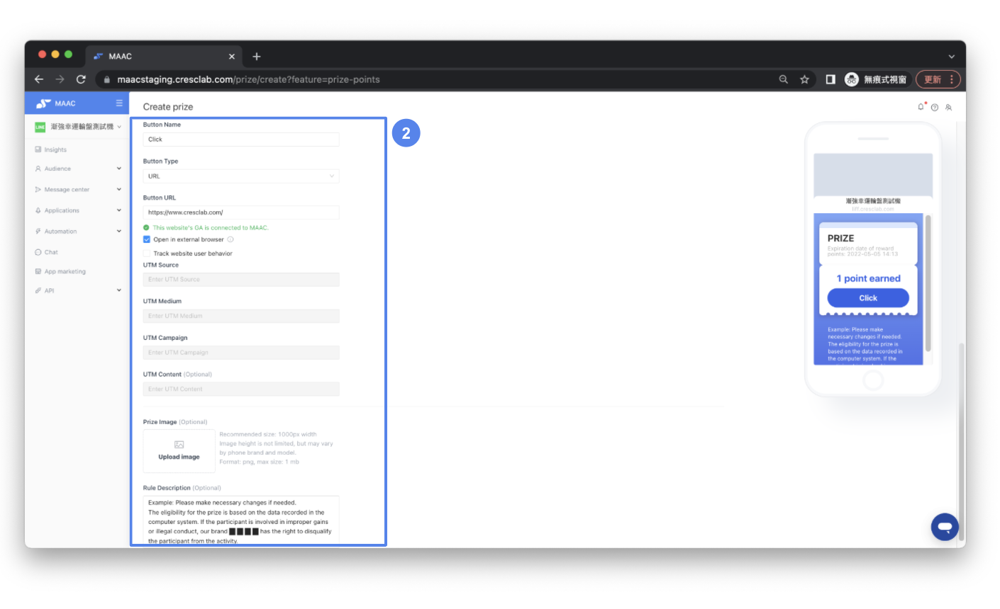
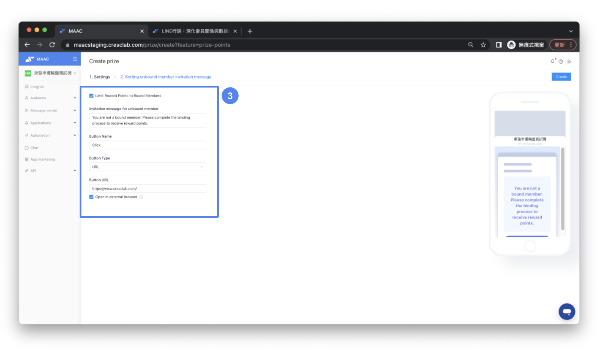
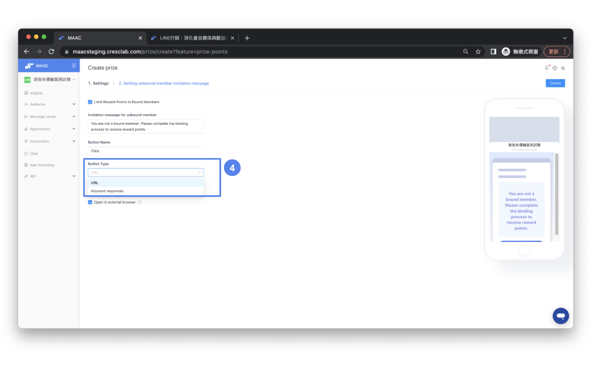
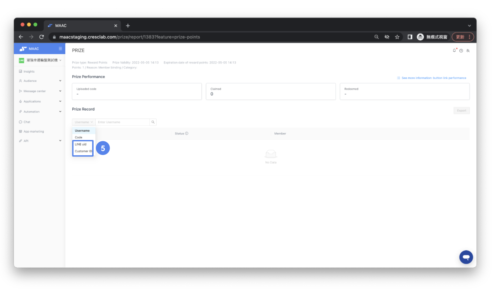

# Tutorials｜ Reward Points – Crescendo Lab Help Center

#### 💁🏻‍♀️ Advantage

* Integrate with member system, points will be directly logged into member data and can be seen and used in member page.
* Mix and match with broadcast, deeplink, survey, referral or game modules.

( Reward Points will be launch on 2022/05/10 )

#### ➤ Plan Availability

* Brands that buy Webhook & Reward Points at the same time.


Reminder： Reward Points are only available for distribution, the brand needs to have its own point service system.


* The brand’s point service system needs to be connected with MAAC. There are two ways to connect MAAC to the brand’s point service system:
  * The brand's engineers refer to the MAAC [Open API technical documentation](https://cresclaben.docs.apiary.io) for system connecting.
  * Use a member system provider that is connected to MAAC. The system providers currently connecting with MAAC are: Migo's Litloyal, Wishmobile
* Based on the way the brand connects LINE friends and official website members, it will determine whether the brand needs to complete "binding" before distributing points. Here are the two scenarios as follows:
  * The membership system is built within LINE and the identification or connected way is "LINE uid". In this way, you can send it without completing the binding.
  * The membership system is built externally and the identification or connected way is "Customer id". In this way, you have to bind in order to perform data matching and complete point sending.


Reminder：The partner membership system/point vendor usually provides LINE data binding related services. If the brand wants to use MAAC service binding, then it can use notification messages or Open API.


#### ▶︎ Setting



### Go to the Reward Points page

Fill in the basic fields: Prize name, Reasons for reward points, Points count, and other information.




### Configure the trigger button

Fill in the settings for the button: Button Name, Button triggered content (choose Keyword, Website, or LIFF), Prize Image (Optional), and Rule (Optional).




### Enter information for unbound friends

Provide necessary information for friends who are not yet bound.




### Encourage binding

You can use Keyword, Website, or LIFF to encourage friends to sign up and complete membership binding.




### Check redemption records

Friends' redemption records can be searched in the Prize Record. You can filter by user name and code, as well as by customer id and line\_uid to check the status of Reward Points.




### Related articles

* [Tutorials｜Webhook](https://crescendolab.zendesk.com/hc/en-us/related/click?data=BAh7CjobZGVzdGluYXRpb25fYXJ0aWNsZV9pZGwrCJnyT08EBDoYcmVmZXJyZXJfYXJ0aWNsZV9pZGwrCBk8iZSxBToLbG9jYWxlSSIKZW4tdXMGOgZFVDoIdXJsSSI3L2hjL2VuLXVzL2FydGljbGVzLzQ0MTY1NTcwMTk4MDEtVHV0b3JpYWxzLVdlYmhvb2sGOwhUOglyYW5raQY%3D--20074c3b3f8c2f0702a2d4ec65eb9c6378e5da77)
* [Tutorials｜Game Interaction](https://crescendolab.zendesk.com/hc/en-us/related/click?data=BAh7CjobZGVzdGluYXRpb25fYXJ0aWNsZV9pZGwrCBlM0QcdBDoYcmVmZXJyZXJfYXJ0aWNsZV9pZGwrCBk8iZSxBToLbG9jYWxlSSIKZW4tdXMGOgZFVDoIdXJsSSJAL2hjL2VuLXVzL2FydGljbGVzLzQ1MjI3MzE3MTk3MDUtVHV0b3JpYWxzLUdhbWUtSW50ZXJhY3Rpb24GOwhUOglyYW5raQc%3D--1801a8883dbf3e0a2e2f4497eb888458b3058566)
* [Tutorials｜MAAC Prize Management - Card message type](https://crescendolab.zendesk.com/hc/en-us/related/click?data=BAh7CjobZGVzdGluYXRpb25fYXJ0aWNsZV9pZGwrCJn9bZXtKToYcmVmZXJyZXJfYXJ0aWNsZV9pZGwrCBk8iZSxBToLbG9jYWxlSSIKZW4tdXMGOgZFVDoIdXJsSSJYL2hjL2VuLXVzL2FydGljbGVzLzQ2MTAwMzkxMDAxNDk3LVR1dG9yaWFscy1NQUFDLVByaXplLU1hbmFnZW1lbnQtQ2FyZC1tZXNzYWdlLXR5cGUGOwhUOglyYW5raQg%3D--1a85b2f0fa84f9459f05cdd66d9b1bbfc372f504)
* [Tutorials｜My Coupons](https://crescendolab.zendesk.com/hc/en-us/related/click?data=BAh7CjobZGVzdGluYXRpb25fYXJ0aWNsZV9pZGwrCBnzGdsDBDoYcmVmZXJyZXJfYXJ0aWNsZV9pZGwrCBk8iZSxBToLbG9jYWxlSSIKZW4tdXMGOgZFVDoIdXJsSSI6L2hjL2VuLXVzL2FydGljbGVzLzQ0MTQ2MDczMjM5MjktVHV0b3JpYWxzLU15LUNvdXBvbnMGOwhUOglyYW5raQk%3D--9e2619f5f75906528c576c357049541ff679edf0)
* [Tutorials｜Insights](https://crescendolab.zendesk.com/hc/en-us/related/click?data=BAh7CjobZGVzdGluYXRpb25fYXJ0aWNsZV9pZGwrCJmh8YcDBDoYcmVmZXJyZXJfYXJ0aWNsZV9pZGwrCBk8iZSxBToLbG9jYWxlSSIKZW4tdXMGOgZFVDoIdXJsSSI4L2hjL2VuLXVzL2FydGljbGVzLzQ0MTMyMTIxNzI2OTctVHV0b3JpYWxzLUluc2lnaHRzBjsIVDoJcmFua2kK--f940481bbdb0de0bbd3286d11bfe359fcc1dc0d5)
