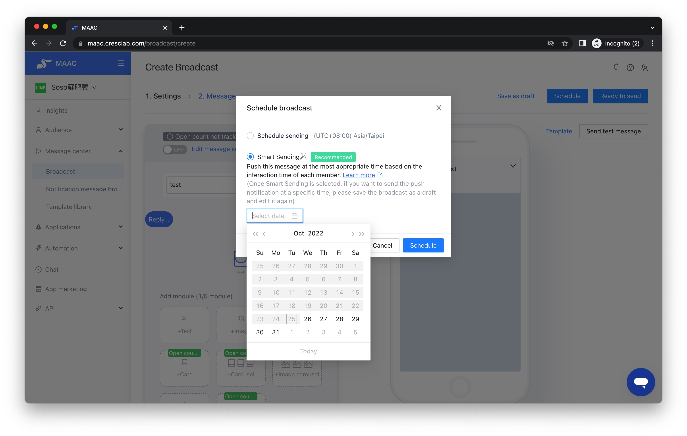

# Tutorials｜Smart Sending – Crescendo Lab Help Center

#### What are the advantages of Smart Sending?

With the different industry attributes of LINE official accounts, the active time of users also varies. For example, the active time of users related to mother and child, babies, and childcare falls on weekends and after work, while the active time of users related to catering falls during meal hours.

Therefore, MAAC can find out the timing for each user to use LINE, optimize the sending time precisely, and effectively catch users on LINE, your message will be sent with a higher chance of exposure and views. Smart Sending helps the brand's click-through rate (CTR) grow 1.15 times on average.

#### Smart Sending v.s. General Scheduling

Smart Sending is based on the active time of each user, calculating the time that is most suitable for each push broadcast, and then sending it. Therefore, when using Smart Sending, the time each friend receives the message is (For example, in the same broadcast, Sam received the message at 10 am; Amy received the message at 8 pm), thereby improving the chances of friends seeing the messages and interacting.

The general scheduling is pushing this broadcast and arranging it to be sent out at a specified time (For example, at 6 pm). Following the above example, Sam and Amy will both receive the message at 6 pm.

#### Advantages

* According to the active time of each user, automatically push the broadcast at the best time that suits everyone
* Improve the chances of user seeing and interacting with tweets

#### Setting



### After editing the content of the message through Broadcast

Complete your broadcast content editing before scheduling Smart Sending.



### Select Smart Sending when scheduling

Click "Schedule" in the upper right corner, and select "Smart Sending". You only need to select a "Date" — note that you cannot select the same day; it must start from the next day of the schedule (the system requires computing time).




### Sending on the selected day

On the day of Smart Sending, messages will be sent to friends hour by hour. When the sending is completed, the status of the push broadcast will be changed to "Sent".



### Notification when completed

When the sending is completed, you will be notified by the small bell in the background.




Attention:

* Smart Sending in sending status cannot be paused or deleted. Please confirm the scheduling time so that more people can see your message.
* If you need to change the sending method of Smart Sending in the schedule, please save the push as a draft and then edit it again.
* The time range of Smart Sending is between 09:00 - 22:00.


#### Push Recommendations

* Smart Sending is not suitable for "special holidays" that are not general weekends. At present, Smart Sending does not support manual adjustment or judgment of "holidays" or not. If it is used on "special holidays", Smart Sending will use the data accumulated on "weekdays" on holidays instead of "weekends".
* Smart Sending is not suitable for time-limited marketing content. Since Smart Sending will be gradually sent within one day, there may be disputes over "snap purchase" and "time-limited discount codes", so it is not recommended to use Smart Sending in this type of activity.
* Smart Sending is not available for customers who have just enabled MAAC. In view of the fact that Smart Sending needs to collect enough data to judge the sending time, it is recommended to accumulate valid data for at least 30 days, which is more effective for sending.
* Smart Sending can be more accurate with increasing usage. If the original LINE account pushes messages at a fixed time for a long time, it will be easily affected by the fixed sending time. The data collected at the beginning may have a bias. After the smart push is sent in different time periods, the new sending time is used as a control variable to check and sum up and correct the user's active time.
* If more than one Broadcast is scheduled on the same day, they will be sent with Smart Sending but if the segment has duplicate users, then they will all receive multiple push broadcasts at the same time ( Smart Sending Calculation Time ).
* You can use A/B Test to check on the performance of Smart Sending.

Related articles

* [Tutorials｜MAAC Message Module & Template Library](https://crescendolab.zendesk.com/hc/en-us/related/click?data=BAh7CjobZGVzdGluYXRpb25fYXJ0aWNsZV9pZGwrCBkb49oDBDoYcmVmZXJyZXJfYXJ0aWNsZV9pZGwrCJmDF4kDBDoLbG9jYWxlSSIKZW4tdXMGOgZFVDoIdXJsSSJUL2hjL2VuLXVzL2FydGljbGVzLzQ0MTQ2MDM3Mjk2ODktVHV0b3JpYWxzLU1BQUMtTWVzc2FnZS1Nb2R1bGUtVGVtcGxhdGUtTGlicmFyeQY7CFQ6CXJhbmtpBg%3D%3D--42e669615534e5651e4b5e399f6aefadb11f242d)
* [Tutorials｜ MAAC x SurveyCake Form](https://crescendolab.zendesk.com/hc/en-us/related/click?data=BAh7CjobZGVzdGluYXRpb25fYXJ0aWNsZV9pZGwrCJkr5rYDBDoYcmVmZXJyZXJfYXJ0aWNsZV9pZGwrCJmDF4kDBDoLbG9jYWxlSSIKZW4tdXMGOgZFVDoIdXJsSSJGL2hjL2VuLXVzL2FydGljbGVzLzQ0MTM5OTk5NTA3NDUtVHV0b3JpYWxzLU1BQUMteC1TdXJ2ZXlDYWtlLUZvcm0GOwhUOglyYW5raQc%3D--438d61d29c4e631ff99a1783eb90dcca6ea256ef)
* [Tutorials｜Game Interaction](https://crescendolab.zendesk.com/hc/en-us/related/click?data=BAh7CjobZGVzdGluYXRpb25fYXJ0aWNsZV9pZGwrCBlM0QcdBDoYcmVmZXJyZXJfYXJ0aWNsZV9pZGwrCJmDF4kDBDoLbG9jYWxlSSIKZW4tdXMGOgZFVDoIdXJsSSJAL2hjL2VuLXVzL2FydGljbGVzLzQ1MjI3MzE3MTk3MDUtVHV0b3JpYWxzLUdhbWUtSW50ZXJhY3Rpb24GOwhUOglyYW5raQg%3D--28fa070ba46f47c128217d5f31a97a17ad064cac)
* [Tutorials｜New Tag System : Tag Intensity and Timespans](https://crescendolab.zendesk.com/hc/en-us/related/click?data=BAh7CjobZGVzdGluYXRpb25fYXJ0aWNsZV9pZGwrCBk01%2F8FBDoYcmVmZXJyZXJfYXJ0aWNsZV9pZGwrCJmDF4kDBDoLbG9jYWxlSSIKZW4tdXMGOgZFVDoIdXJsSSJaL2hjL2VuLXVzL2FydGljbGVzLzQ0MjM4MTM2NDEyNDEtVHV0b3JpYWxzLU5ldy1UYWctU3lzdGVtLVRhZy1JbnRlbnNpdHktYW5kLVRpbWVzcGFucwY7CFQ6CXJhbmtpCQ%3D%3D--407cf2512d08d9e8612db44fea717cebff692876)
* [Tutorial | MAAC Prize Management - Prize Unique URL](https://crescendolab.zendesk.com/hc/en-us/related/click?data=BAh7CjobZGVzdGluYXRpb25fYXJ0aWNsZV9pZGwrCBkWBOoAGDoYcmVmZXJyZXJfYXJ0aWNsZV9pZGwrCJmDF4kDBDoLbG9jYWxlSSIKZW4tdXMGOgZFVDoIdXJsSSJWL2hjL2VuLXVzL2FydGljbGVzLzI2MzkyMjA1MjAyOTY5LVR1dG9yaWFsLU1BQUMtUHJpemUtTWFuYWdlbWVudC1Qcml6ZS1VbmlxdWUtVVJMBjsIVDoJcmFua2kK--bd6d736d21f6251989179c216b60f2dad3c248ce)
