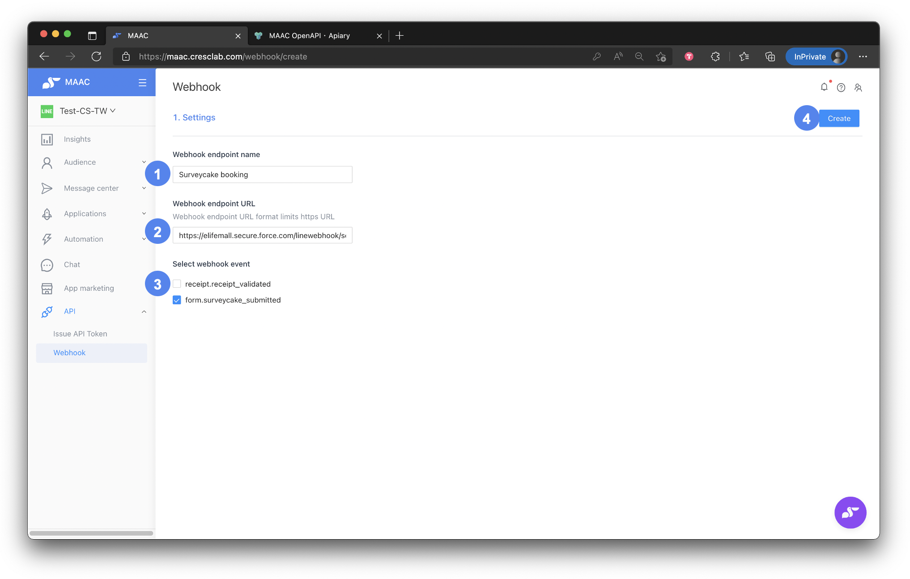
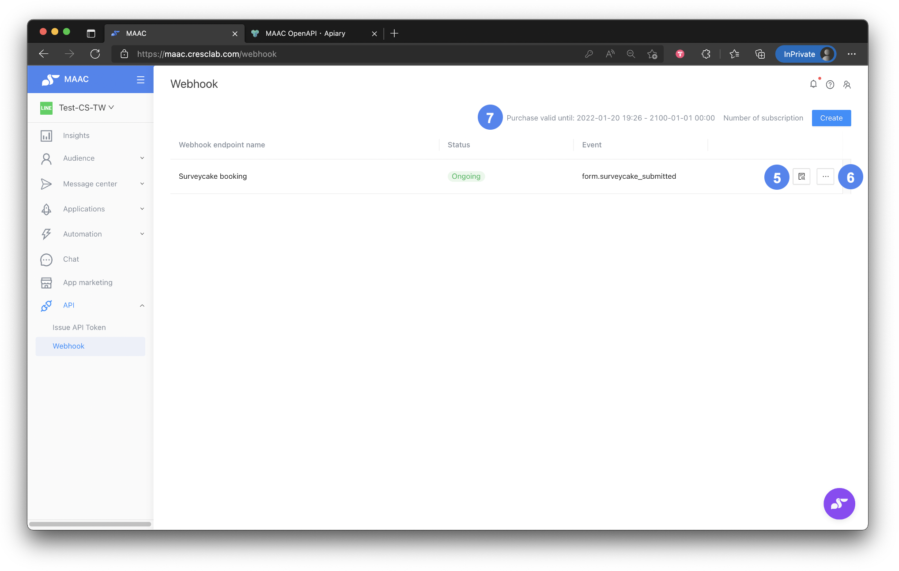
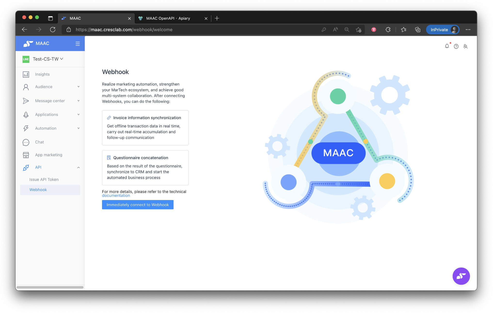
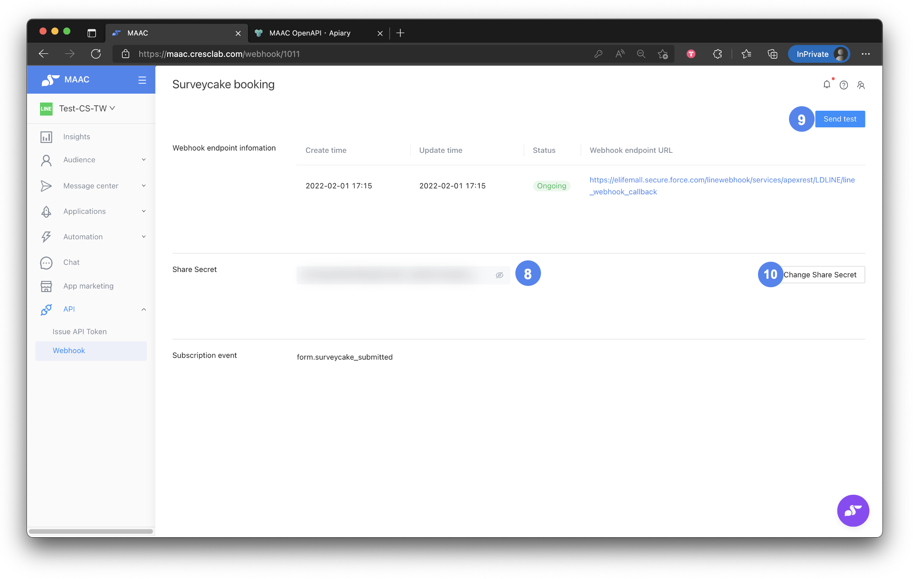
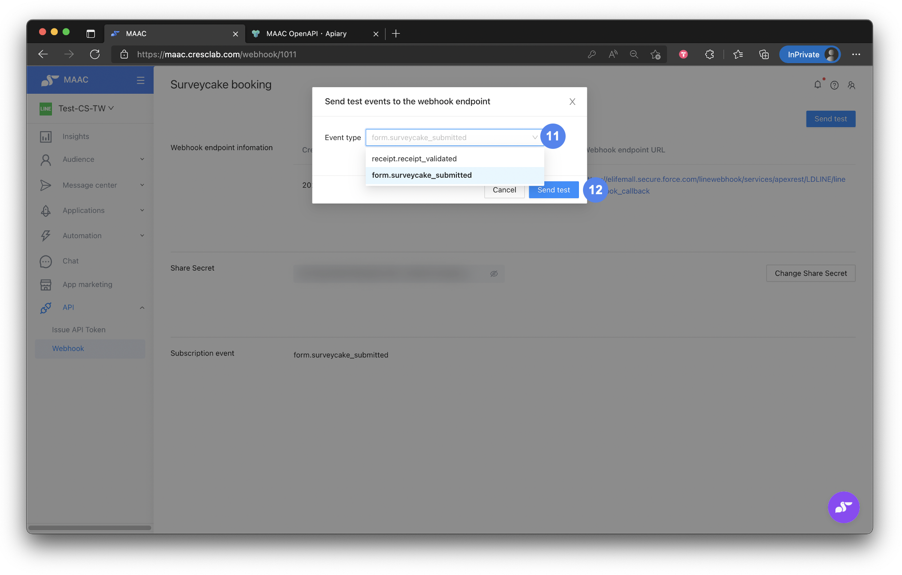
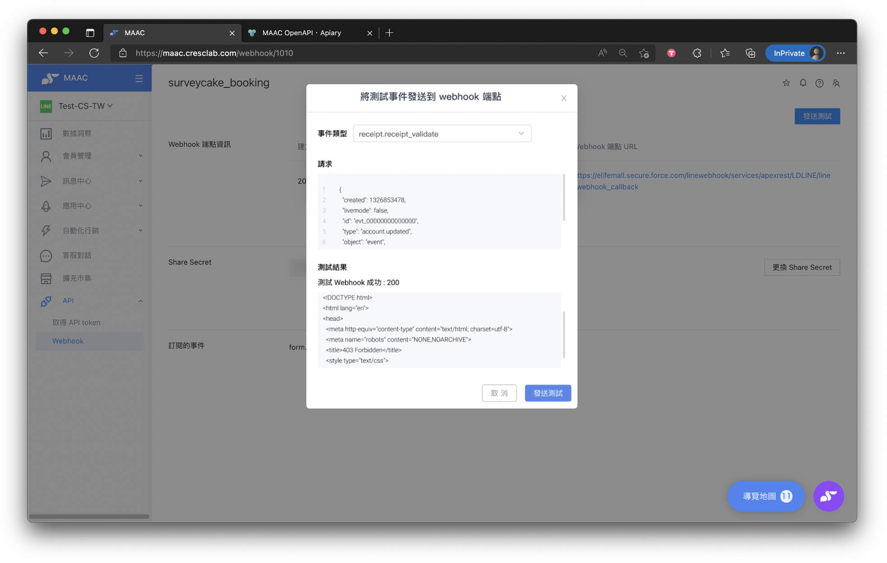

# Tutorials｜Webhook – Crescendo Lab Help Center

#### 💁🏻‍♀️ Advantage

* Realize marketing automation, strengthen your MarTech ecosystem, and achieve good multi-system collaboration.
* The types of webhook events include SurveyCake form, receipt register, and so on.
* In addition to the MAAC module, if you use notification messages, Webhook allows you to obtain information from notification messages in real-time — e.g., automating complete data binding, connecting to your own SMS system, extending notification messages to notify only important information, and transforming it into a personalized and automated marketing experience (get information from notification messages in real-time, then push marketing messages or tag friends to trigger a customer journey).

**➤ Plan Availability**

This is an advanced feature in APP marketing, requires purchase and related MAAC modules, and is not included in the Basic or EC plan. Currently we have 2 zones of Webhook, and it charges by zone. If you're interested, please contact your CSM and we're happy to assist you!

* Webhook zone 1
  * Receipt Validated
  * SurveyCake Submitted
  * LINE Notification Message Status Updated
  * LINE Notification Message Profile Updated
  * Prize Points Added
* Webhook zone 2
  * Message First Open

#### ▶︎ Setting Steps


Reminders:

* To complete the setting, you need to work with an Engineer to get the required webhook URL and provide the MAAC webhook secret to the Engineer so MAAC and your system can integrate.
* Go to API > Webhook in the features menu. If you haven't created a webhook, you will see the image below. On that page there is a technical document — you can also share the link below with the Engineer to set the webhook URL used later.

Reference: [MAAC OpenAPI - Webhook](https://cresclaben.docs.apiary.io/#reference/webhook/webhook)




### Create webhook

* Name the webhook.
* Type in the webhook URL (provided by the Engineer).
* Choose webhook type (e.g., receipt is related to receipt.register, form.surveycake is related to SurveyCake form).
* Click "Create".




### Access webhook details

* After creation, MAAC brings you to the list page. Click the report icon to enter the webhook details settings.
* You can stop or delete the webhook.
* "Purchase valid until" shows the period the webhook can work. The working webhook number of each MAAC platform is three; contact the CS team if you need more.




### Share secret with Engineer

* Uncover the "Share Secret" and provide it to the Engineer to complete the integration.




### Verify integration

* After the Engineer completes the setting, you can click "Send test" to send a test event and verify your system receives the data.
* To ensure data security, click "Change Share Secret" to invalidate the previous secret when switching systems.




### Send test event

* Before sending a test event, choose the type of webhook.
* Click "Send test".




### Check results

* From the result, you can check whether the webhook integration is working successfully.





Attentions

* receipt.receipt\_validated: MAAC webhook currently only sends the match conditions data.
* form.surveycake\_submitted: To distinguish different questions' data, Marketing needs to set "Alias and Default" in the SurveyCake platform and provide it to the Engineer.
* message.first\_open: If you use Open API - Push (Zone 3) instead of MAAC background, you must add event\_id to receive this webhook event.


#### Tips

Currently, MAAC provides two ways to automatically sync open-count data; choose according to your needs:

* Webhook - Message First Open: Receive the timestamp of each friend's open count and save each LINE friend's behavior to trigger marketing automation.
  * Reference: https://cresclaben.docs.apiary.io/#reference/webhook/webhook/message-first-open
* Open API - Get Performance Report: Receive the total open count for each broadcast or push to automatically track performance and optimize future strategy.
  * Reference: https://cresclaben.docs.apiary.io/#reference/message/message-performance/get-message-performance-report

### Related articles

<table data-view="cards"><thead><tr><th>Title</th><th data-card-target data-type="content-ref">Target</th></tr></thead><tbody><tr><td>Tutorials｜ MAAC x SurveyCake Form</td><td><a href="https://crescendolab.zendesk.com/hc/en-us/related/click?data=BAh7CjobZGVzdGluYXRpb25fYXJ0aWNsZV9pZGwrCJkr5rYDBDoYcmVmZXJyZXJfYXJ0aWNsZV9pZGwrCJnyT08EBDoLbG9jYWxlSSIKZW4tdXMGOgZFVDoIdXJsSSJGL2hjL2VuLXVzL2FydGljbGVzLzQ0MTM5OTk5NTA3NDUtVHV0b3JpYWxzLU1BQUMteC1TdXJ2ZXlDYWtlLUZvcm0GOwhUOglyYW5raQY%3D--671360f2a5362c35dd51a02e634c57c358306c35">https://crescendolab.zendesk.com/hc/en-us/related/click?data=BAh7CjobZGVzdGluYXRpb25fYXJ0aWNsZV9pZGwrCJkr5rYDBDoYcmVmZXJyZXJfYXJ0aWNsZV9pZGwrCJnyT08EBDoLbG9jYWxlSSIKZW4tdXMGOgZFVDoIdXJsSSJGL2hjL2VuLXVzL2FydGljbGVzLzQ0MTM5OTk5NTA3NDUtVHV0b3JpYWxzLU1BQUMteC1TdXJ2ZXlDYWtlLUZvcm0GOwhUOglyYW5raQY%3D--671360f2a5362c35dd51a02e634c57c358306c35</a></td></tr><tr><td>How to share LINE OA platform, LINE Developers, GA(UA) / GA4 access to Crescendo Lab?</td><td><a href="https://crescendolab.zendesk.com/hc/en-us/related/click?data=BAh7CjobZGVzdGluYXRpb25fYXJ0aWNsZV9pZGwrCJmp1FFgBzoYcmVmZXJyZXJfYXJ0aWNsZV9pZGwrCJnyT08EBDoLbG9jYWxlSSIKZW4tdXMGOgZFVDoIdXJsSSJ1L2hjL2VuLXVzL2FydGljbGVzLzgxMTAyNzExNDYzOTMtSG93LXRvLXNoYXJlLUxJTkUtT0EtcGxhdGZvcm0tTElORS1EZXZlbG9wZXJzLUdBLVVBLUdBNC1hY2Nlc3MtdG8tQ3Jlc2NlbmRvLUxhYgY7CFQ6CXJhbmtpBw%3D%3D--3e387cf6179bd8f4c3fb492bc1d412212513b6ee">https://crescendolab.zendesk.com/hc/en-us/related/click?data=BAh7CjobZGVzdGluYXRpb25fYXJ0aWNsZV9pZGwrCJmp1FFgBzoYcmVmZXJyZXJfYXJ0aWNsZV9pZGwrCJnyT08EBDoLbG9jYWxlSSIKZW4tdXMGOgZFVDoIdXJsSSJ1L2hjL2VuLXVzL2FydGljbGVzLzgxMTAyNzExNDYzOTMtSG93LXRvLXNoYXJlLUxJTkUtT0EtcGxhdGZvcm0tTElORS1EZXZlbG9wZXJzLUdBLVVBLUdBNC1hY2Nlc3MtdG8tQ3Jlc2NlbmRvLUxhYgY7CFQ6CXJhbmtpBw%3D%3D--3e387cf6179bd8f4c3fb492bc1d412212513b6ee</a></td></tr><tr><td>Tutorials｜MAAC Message Module &#x26; Template Library</td><td><a href="https://crescendolab.zendesk.com/hc/en-us/related/click?data=BAh7CjobZGVzdGluYXRpb25fYXJ0aWNsZV9pZGwrCBkb49oDBDoYcmVmZXJyZXJfYXJ0aWNsZV9pZGwrCJnyT08EBDoLbG9jYWxlSSIKZW4tdXMGOgZFVDoIdXJsSSJUL2hjL2VuLXVzL2FydGljbGVzLzQ0MTQ2MDM3Mjk2ODktVHV0b3JpYWxzLU1BQUMtTWVzc2FnZS1Nb2R1bGUtVGVtcGxhdGUtTGlicmFyeQY7CFQ6CXJhbmtpCA%3D%3D--83f63591c4e21ede0008cdba0821e00cae9b33fa">https://crescendolab.zendesk.com/hc/en-us/related/click?data=BAh7CjobZGVzdGluYXRpb25fYXJ0aWNsZV9pZGwrCBkb49oDBDoYcmVmZXJyZXJfYXJ0aWNsZV9pZGwrCJnyT08EBDoLbG9jYWxlSSIKZW4tdXMGOgZFVDoIdXJsSSJUL2hjL2VuLXVzL2FydGljbGVzLzQ0MTQ2MDM3Mjk2ODktVHV0b3JpYWxzLU1BQUMtTWVzc2FnZS1Nb2R1bGUtVGVtcGxhdGUtTGlicmFyeQY7CFQ6CXJhbmtpCA%3D%3D--83f63591c4e21ede0008cdba0821e00cae9b33fa</a></td></tr><tr><td>Tutorials｜ Reward Points</td><td><a href="https://crescendolab.zendesk.com/hc/en-us/related/click?data=BAh7CjobZGVzdGluYXRpb25fYXJ0aWNsZV9pZGwrCBk8iZSxBToYcmVmZXJyZXJfYXJ0aWNsZV9pZGwrCJnyT08EBDoLbG9jYWxlSSIKZW4tdXMGOgZFVDoIdXJsSSI9L2hjL2VuLXVzL2FydGljbGVzLzYyNjAyNTkzNzIwNTctVHV0b3JpYWxzLVJld2FyZC1Qb2ludHMGOwhUOglyYW5raQk%3D--c38b9e3f289484ff8b7f27aed158d945a270c418">https://crescendolab.zendesk.com/hc/en-us/related/click?data=BAh7CjobZGVzdGluYXRpb25fYXJ0aWNsZV9pZGwrCBk8iZSxBToYcmVmZXJyZXJfYXJ0aWNsZV9pZGwrCJnyT08EBDoLbG9jYWxlSSIKZW4tdXMGOgZFVDoIdXJsSSI9L2hjL2VuLXVzL2FydGljbGVzLzYyNjAyNTkzNzIwNTctVHV0b3JpYWxzLVJld2FyZC1Qb2ludHMGOwhUOglyYW5raQk%3D--c38b9e3f289484ff8b7f27aed158d945a270c418</a></td></tr><tr><td>Tutorials｜Rapid Referral</td><td><a href="https://crescendolab.zendesk.com/hc/en-us/related/click?data=BAh7CjobZGVzdGluYXRpb25fYXJ0aWNsZV9pZGwrCBkzBMgDBDoYcmVmZXJyZXJfYXJ0aWNsZV9pZGwrCJnyT08EBDoLbG9jYWxlSSIKZW4tdXMGOgZFVDoIdXJsSSI%2BL2hjL2VuLXVzL2FydGljbGVzLzQ0MTQyODcxMzE0MTctVHV0b3JpYWxzLVJhcGlkLVJlZmVycmFsBjsIVDoJcmFua2kK--0e8a1333619839a658a956b83a1595554084b818">https://crescendolab.zendesk.com/hc/en-us/related/click?data=BAh7CjobZGVzdGluYXRpb25fYXJ0aWNsZV9pZGwrCBkzBMgDBDoYcmVmZXJyZXJfYXJ0aWNsZV9pZGwrCJnyT08EBDoLbG9jYWxlSSIKZW4tdXMGOgZFVDoIdXJsSSI%2BL2hjL2VuLXVzL2FydGljbGVzLzQ0MTQyODcxMzE0MTctVHV0b3JpYWxzLVJhcGlkLVJlZmVycmFsBjsIVDoJcmFua2kK--0e8a1333619839a658a956b83a1595554084b818</a></td></tr></tbody></table>
