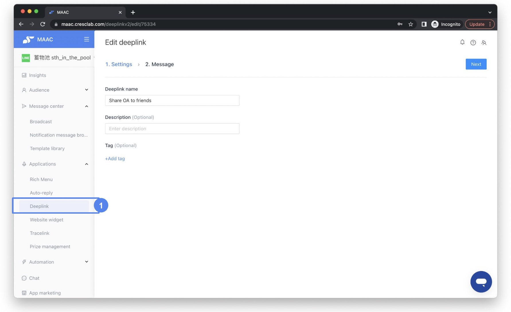
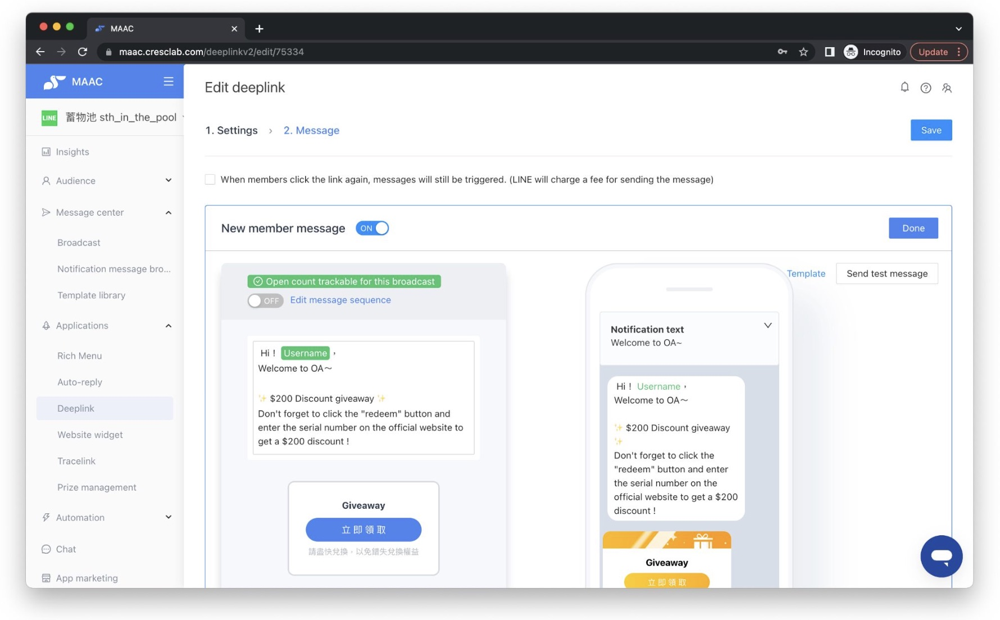
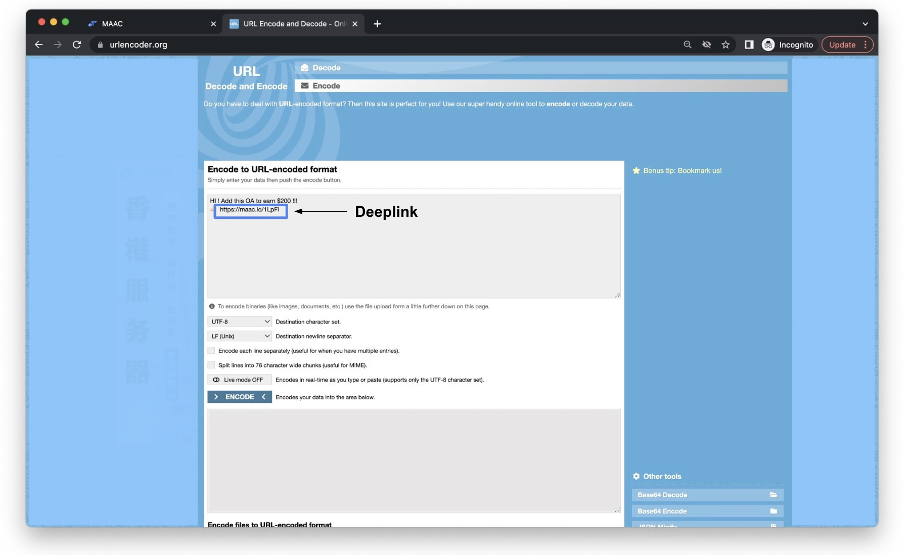
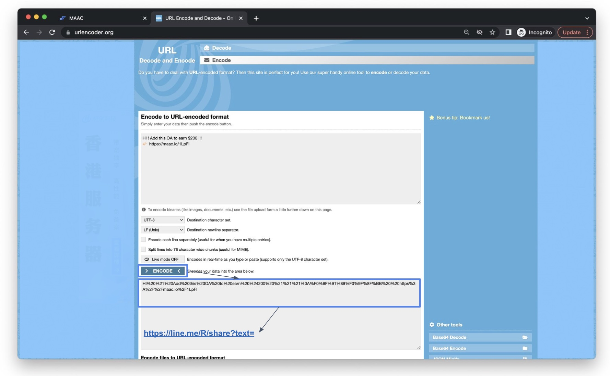
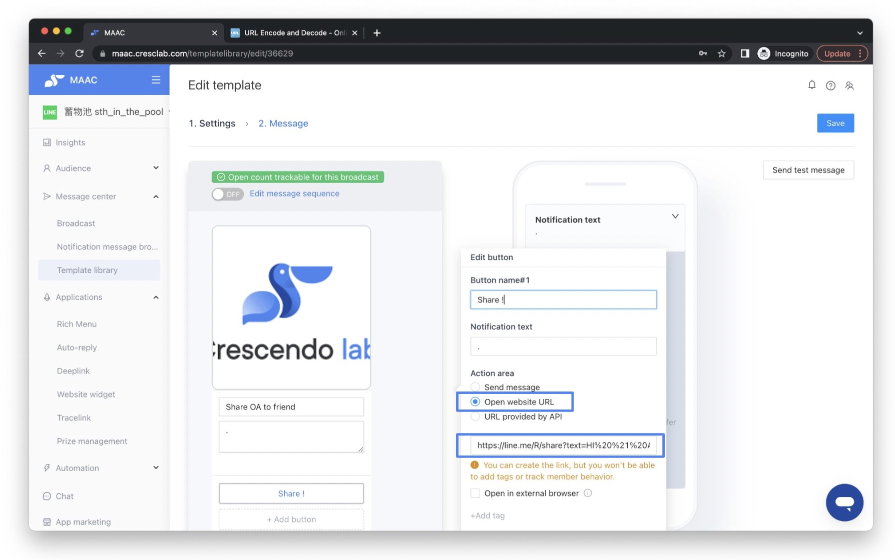

# Tutorials｜How to let friend share LINE OA to other friends ? – Crescendo Lab Help Center

#### 💁🏻‍♀️ Advantages

This article shows how to use MAAC's built-in feature with an online text encoding tool to let your LINE OA's existing friends share your LINE OA with their friends in one click.

#### ▶︎ Setting



### Create a deeplink in MAAC and edit the "New member message"

Copy the deeplink's link — you will need it in the next step.




### Design the invite content and encode it

Design the content that you wish invited friends to see. After designing it, you must encode the content before putting it into MAAC. Go to https://www.urlencoder.org/ and paste the content.


The content must include the deeplink from the previous step.



The content can only include text and emoji. Do not include "@" or the encoding will fail.





### Encode and build the final share link

Click the "ENCODE" button — you will get a generated code below. Copy that code and paste it at the end of this link:

https://line.me/R/share?text=

(Keep the deeplink-encoded text appended to that URL.)




### Put the final encoded link into MAAC and test

Paste the final encoded link into MAAC and finish.


You can send a test message to yourself first to confirm the function is working.





#### 💁🏻‍♀️ Demo result : OA's existing friend share LINE OA to other friend

#### 💁🏻‍♀️ Demo result : Friend receive invite message from OA's existing friend

### Related articles

* [Tutorials｜Editor/Broadcast-Share button](https://crescendolab.zendesk.com/hc/en-us/related/click?data=BAh7CjobZGVzdGluYXRpb25fYXJ0aWNsZV9pZGwrCBlZTUSSEDoYcmVmZXJyZXJfYXJ0aWNsZV9pZGwrCJl9O9erBjoLbG9jYWxlSSIKZW4tdXMGOgZFVDoIdXJsSSJOL2hjL2VuLXVzL2FydGljbGVzLzE4MjIwMzk3MTg5NDAxLVR1dG9yaWFscy1FZGl0b3ItQnJvYWRjYXN0LVNoYXJlLWJ1dHRvbgY7CFQ6CXJhbmtpBg%3D%3D--32005ac160df517ba33a7f99ff51cbf1f272768e)
* [Tutorials | Deeplink](https://crescendolab.zendesk.com/hc/en-us/related/click?data=BAh7CjobZGVzdGluYXRpb25fYXJ0aWNsZV9pZGwrCJnloYgDBDoYcmVmZXJyZXJfYXJ0aWNsZV9pZGwrCJl9O9erBjoLbG9jYWxlSSIKZW4tdXMGOgZFVDoIdXJsSSI4L2hjL2VuLXVzL2FydGljbGVzLzQ0MTMyMjM3MjQ0NDEtVHV0b3JpYWxzLURlZXBsaW5rBjsIVDoJcmFua2kH--3e3f61d03d930bbce31c3c6a0c1c51e66d0dfc57)
* [How to share LINE OA platform, LINE Developers, GA(UA) / GA4 access to Crescendo Lab?](https://crescendolab.zendesk.com/hc/en-us/related/click?data=BAh7CjobZGVzdGluYXRpb25fYXJ0aWNsZV9pZGwrCJmp1FFgBzoYcmVmZXJyZXJfYXJ0aWNsZV9pZGwrCJl9O9erBjoLbG9jYWxlSSIKZW4tdXMGOgZFVDoIdXJsSSJ1L2hjL2VuLXVzL2FydGljbGVzLzgxMTAyNzExNDYzOTMtSG93LXRvLXNoYXJlLUxJTkUtT0EtcGxhdGZvcm0tTElORS1EZXZlbG9wZXJzLUdBLVVBLUdBNC1hY2Nlc3MtdG8tQ3Jlc2NlbmRvLUxhYgY7CFQ6CXJhbmtpCA%3D%3D--bff084ad37e4cf84bc5ce95a05a07373e0ac3078)
* [Tutorials｜Game Interaction](https://crescendolab.zendesk.com/hc/en-us/related/click?data=BAh7CjobZGVzdGluYXRpb25fYXJ0aWNsZV9pZGwrCBlM0QcdBDoYcmVmZXJyZXJfYXJ0aWNsZV9pZGwrCJl9O9erBjoLbG9jYWxlSSIKZW4tdXMGOgZFVDoIdXJsSSJAL2hjL2VuLXVzL2FydGljbGVzLzQ1MjI3MzE3MTk3MDUtVHV0b3JpYWxzLUdhbWUtSW50ZXJhY3Rpb24GOwhUOglyYW5raQk%3D--5f57eb0f423984409bc55fca4f55df07656254d7)
* [CAAC | Interface Optimization](https://crescendolab.zendesk.com/hc/en-us/related/click?data=BAh7CjobZGVzdGluYXRpb25fYXJ0aWNsZV9pZGwrCBkQADgvHToYcmVmZXJyZXJfYXJ0aWNsZV9pZGwrCJl9O9erBjoLbG9jYWxlSSIKZW4tdXMGOgZFVDoIdXJsSSJCL2hjL2VuLXVzL2FydGljbGVzLzMyMDg4NjQwMTk2NjMzLUNBQUMtSW50ZXJmYWNlLU9wdGltaXphdGlvbgY7CFQ6CXJhbmtpCg%3D%3D--4814c91f5b7d98086e72be1b44dc1190d32535ed)
